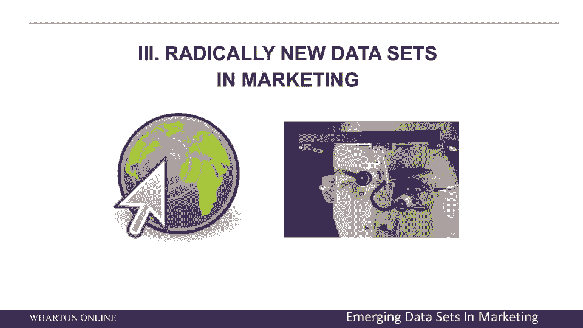
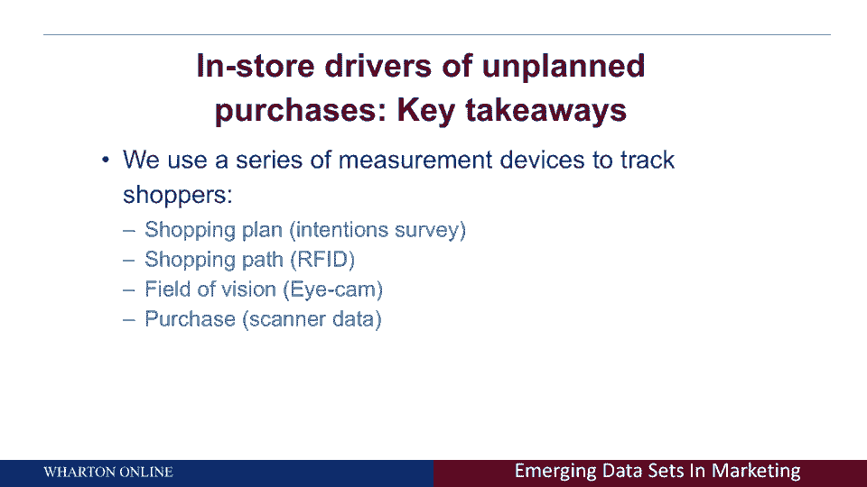
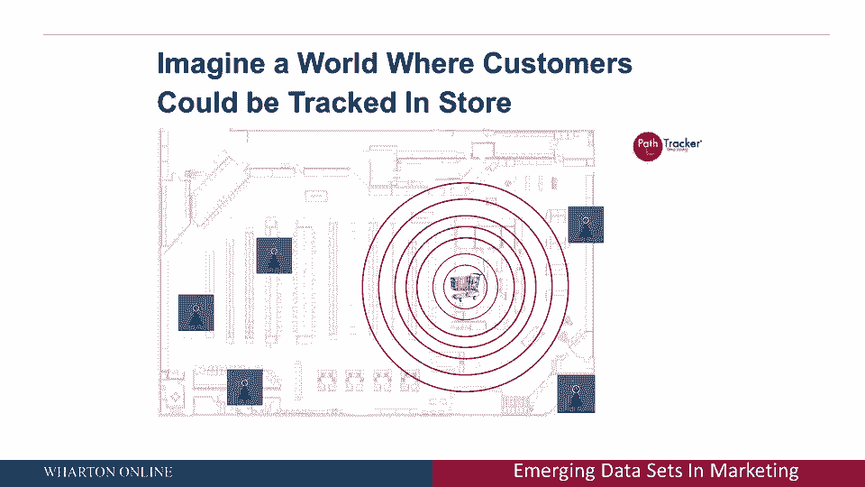
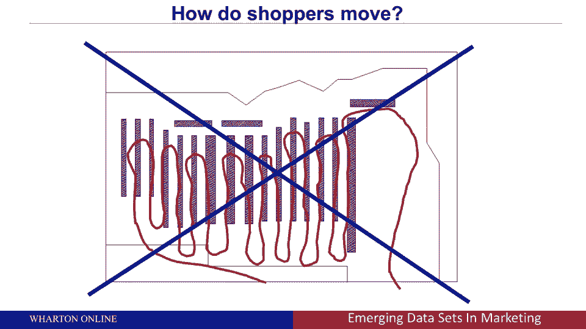
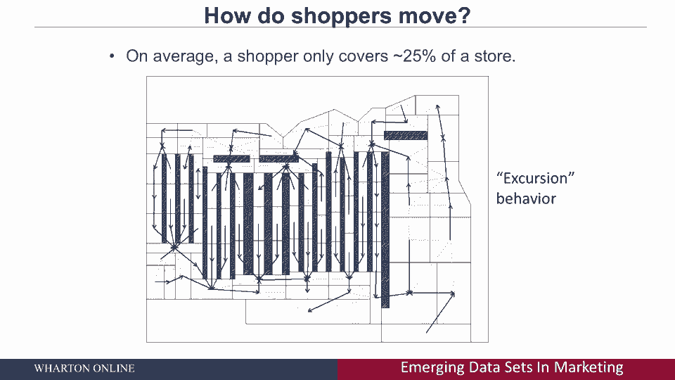

# 【沃顿商学院】商业分析 全套课程（客户、运营、人力资源、会计） - P31：[P031]05_radically-new-data-sets-in-marketing - 知识旅行家 - BV1o54y1N7pm

让我在接下来的五到十分钟左右，告诉你一些全新的数据集和营销，我第一次和你谈的是，你知道20到30分钟左右这里有一些传统的电视数据，在线数据，等，让我和你谈谈一些全新的数据集和营销。

让我鼓励每一个听这个的人，思考如何使用这些数据集。

为了更好的决策，所以我最喜欢的研究之一，我已经谈过了，我以后会再谈的，想象一下你可以跟踪下面的数据，想象一下你可以获取数据，想象一下，让我们把超市放在商店里，想象一下你可以收集人们意图的数据。

在进商店之前他们打算买什么，现在，你为什么想知道这个，然后你可以比较他们打算买的东西和他们实际买的东西，然后你可以看到有多少计划外购买发生，想象一下，你可以收集购物者路径数据和射频识别数据，换句话说。

你可以跟踪商店里的顾客，现在，那真的很有价值，因为再一次，让我回到我之前举的例子，让我们假设你是一个儿童麦片的制造商，你们销售额低的原因，不是因为你的产品不喜欢，而是因为没有人去商店。

你的产品是商店的一部分，您的产品所在的位置，嗯，你可以通过购买不同的货架空间来改变这个问题，在整个商店里移动你的产品，视野；视野，想象一下你真的可以有眼球追踪数据，你可以测量人们在看什么产品。

因为想象一下，例如，你是苏打水，你做苏打水，你的苏打水坐在架子上，但没人看好它，如果他们不看，他们买不到，最后是购买数据，所以今天关于分析的令人兴奋的部分又是，想象一下。

在单个客户级别上拥有所有这些数据集，并在它们之间进行链接，让我给你们举一个我五年前参与的项目的例子。

和我的同事一起，皮特·法德和我们的前博士生，萨姆·韦，这是一个名为路径跟踪器的数据集，我们实际上跟踪人们在商店里移动，你可以看到一个小超市推车坐在那里，你可以看到这些红色的同心圆从那里向外移动。

意思是代表无声的ping，你听不到，但那是无声的响声，它被发送到商店周围的不同扫描仪，可以让你在一英尺内对整个商店里的人进行三角定位，所以这就是今天在应用中可用的数据集，五年前，当我们做这个项目的时候。

这是通过在超市手推车底部安装小设备来完成的，那是最好的技术，那是2009年市场营销的黄金时代，现在是两千零一万，五年后，我们大多数人，如果不是我们所有人，口袋里有手机，你应该知道。

你的手机公司在任何时间点都知道你的地理空间位置，他们可以将地理空间的价值货币化，所以让我们假设你有一个数据集，你现在不仅知道人们在收银台买什么，记得回顾几张幻灯片吗，那是二十世纪八十年代的数据。

扫描仪数据，但现在想象一下，我可以知道你在商店里的实际位置，顺便说一句，这不仅仅是存储中的物理数据，这可以应用于网站数据，我不仅知道你去了什么网站，但你去那些网站的时候，你在那些网站上花了多长时间。

把它看作是空间数据，想象一下一个顾客可以在商店里被跟踪的世界，所以你现在看到的这条实线，代表客户的路径，一个顾客在整个商店的路径，你看到的黑色小方块每五秒钟代表一次它们的物理位置。

红色方块代表他们在商店不同地点购买的产品，像大多数商店一样注意到，你拿起右边的牌，你顺时针逆时针转，然后你结账，通常在商店底部中心的末端，所以这将是商店里一个人的典型路径，购物者如何在整个商店移动。

可能是你有兴趣回答的一个问题，嗯，我记得，小时候，这是在我出生之前，但是有一个著名的节目《把它留给海狸》，它讲述了一个发生在20世纪50年代的节目，注定是一个全美国家庭，他们总是会展示上上下下的人。

超市的过道，上下上下上下上下，事实证明，实际上，只有通过分析，我们今天知道这个吗，事实证明，这实际上不是人们在商店里移动的方式，人们不会在过道上走来走去，事实上，如果你从过道的一边走，从另一边走。

那叫导线，如果你走在过道的一边，从另一边出来，回到端盖周围，那叫锯齿形，你下去的地方，让我们说，绕着五号通道走，然后上六号通道，这叫之字形，事实证明，大多数客户只遍历一次，意思是他们只走过道，一次。

事实证明，大多数人都做所谓的远足，他们走进过道，然后从同一边出来，他们进来了，大多数人不会在过道上走来走去，我们现在知道这一点是因为客户层面的分析。

所以这不是人们移动的方式，嗯，我现在给你看的是，是一个商店符号图，你可以看到，大多数人在过道中央移动和注意到的地方，你可以在这里看到中心，从来没有人走到过道的中央，大多数时候人们只去大约三分之一的路。

然后他们现在又回到了同一边，为什么那口井很值钱，让我回急诊室，医生的例子嗯，我是专业人士，我是一个产品的制造商，我在超市里卖，我的销售也不是我希望的那样，现在我开始怀疑，嗯哼，我想知道。

为什么我想知道这是不是因为人们不喜欢我的产品，或者我想知道是不是因为当他们去商店的时候，他们从来没有很好地参观过我的产品，客户分析现在允许您这样做，所以你从这家店看到的。

水平布局是人们只是不去中间的过道，他们通常只在，所谓的赛马场或商店的外环，他们几乎从不在内部过道上做，基本的想法是货架空间不好，所以你不应该为顾客不去的货架空间付费，事实上，你可以证明。

我们分析了成千上万家不同商店的数据，这可能会让你在实体店感到惊讶，超市，服装店，体育用品商店，等，大多数客户在任何一次访问中只覆盖大约两个，商店的5%，这很了不起，所以75%的顾客都不会去。

这是一个机会，知道我现在给你看的东西是很有价值的。

这是所谓的商店热图，红色是热的，绿色没有那么热，但还是很热，黄色不那么热，然后蓝色是冷的，通知，那里真的真的很冷，过道中间很冷，商店的外圈热，赛马场，这就是为什么你会看到公司为商店的外环花了很多钱。

他们想在端盖上，他们想成为最后的过道，顺便说一句，你知道这一点的唯一方法，现在，你真的能让人类坐在商店里吗，观察人们去哪里并记录下来，你可以，不能缩放，用很大的误差测量，你能在店里放摄像头吗。

已经做了很多年了，你可以，但它很引人注目，现在，突然间有些人知道他们被监视了，也许他们的行为不同，另外，你必须把视频数据，你必须，你得让它可以量化，完成客户级分析，就是，我现在可以一个接一个地跟踪客户。

他们去我的实体店，我可以把这和他们的购买数据联系起来。