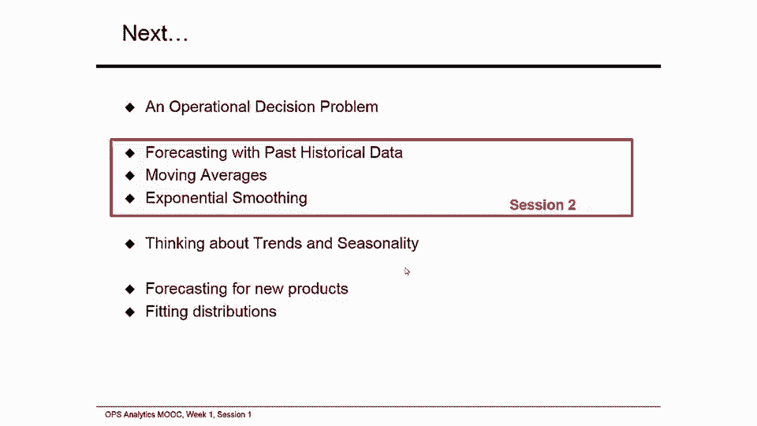
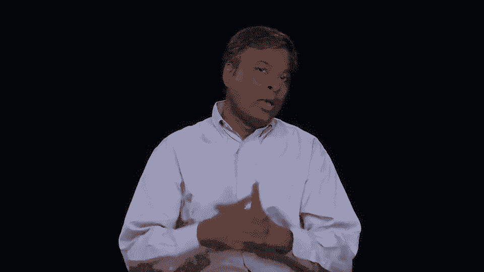
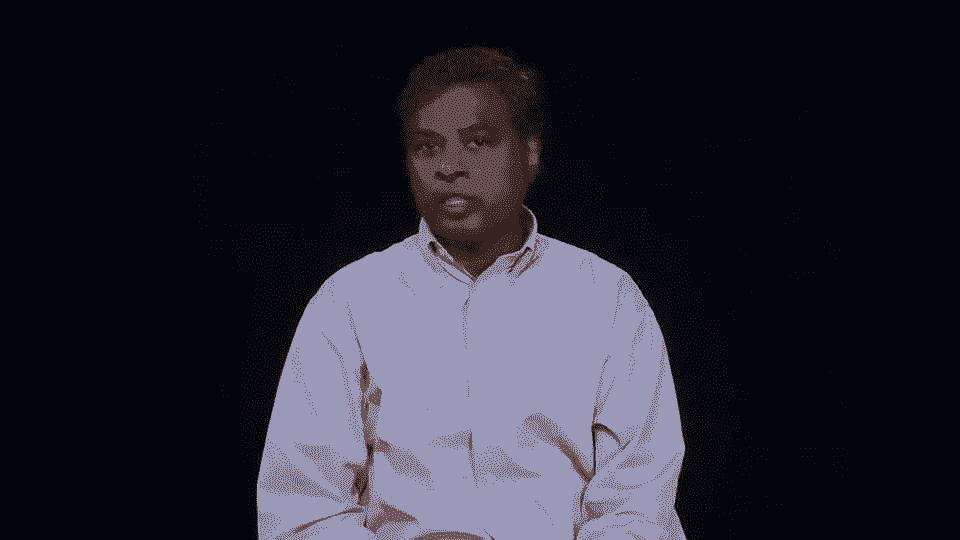

# 【沃顿商学院】商业分析 全套课程（客户、运营、人力资源、会计） - P36：[P036]02_the-newsvendor-problem - 知识旅行家 - BV1o54y1N7pm

大家好，欢迎来到运营分析，我很高兴你能来上这门课，我是萨娜·拉万，我是运营系的副教授，沃顿商学院的信息和决策，我将在第一周向你们介绍操作分析课程，你要专注于描述性分析。

对未来事件的不确定性是我们生活的世界的一个关键特征，不确定性在许多商业决策中起着很大的作用，操作通常是在这种不确定的环境中做出好的决定，首先，我要向你们介绍操作中最核心的问题之一。

在不确定的环境中需求与供给的匹配问题，称为新闻供应商问题，我们需要能够描述数据中的不确定性，以便做出更好的决定，因此，我们将研究预测未来结果的方法，我们将学习如何在有，或季节变化。

我们将在本周讨论的描述性分析，你会看到，将提供一个强大的，预测性和规定性分析的概念基础，在接下来的三周里，您将学习如何使用分析工具包，评估不同的行动方针，再次优化并选择最佳的行动，你能来我非常高兴。

你好，欢迎来到运营分析，这是运营分析的第一周，我们将在那里讨论描述性分析，在描述性分析中，我将报道四个疗程，下面是我们要如何分裂材料，我们将在第一节课的第一周分四节课进行讨论，我将讨论一个操作决策问题。

称为新闻供应商问题，在我介绍了新的挥金如土的问题后，我要谈谈随机变量，我将讨论需求分布，这就导致了我们在第二次会议中的第二次会议，我要讲的是利用过去的历史数据进行预测，然后我会谈谈移动平均线。

我将在第三部分讨论先进材料中的指数平滑，我要说的是预测当数据显示，趋势或季节性，最后在第四场会议上，我要讲的是对新产品的预测，以及拟合需求分布，这是我们课程第一周要讲的四节课。

第一周将再次关注描述性分析，让我们直接进入第一阶段，我将在这里讨论一个有趣的操作决策问题，在我们深入研究分析数据之前，让我们来看看公司面临的一个根本问题，生产多少是个操作问题，来回答这个问题。

我们需要知道或估计产品的成本，产品的价格和一些关于产品需求的数据，让我们探索一个问题开始，这里有一个操作中的基本问题，我给你举个例子，假设您正在为零售商做出运营决策，谁从供应商订购产品并将其出售给客户。

订购的产品被接收并放置在商店货架上，假设有大量的客户，人口中的每个顾客都可以选择购买或不购买该产品，如果顾客选择购买，他到商店去买产品，只要货架上有货，他就买，然而，在你看到顾客的需求之前。

你必须先订购产品，因为你必须在架子上有可用的物品，假设你只有一次点菜的机会，也就是说，在你做出决定后，你不能真正改变你的采购订单，让我们来看看我们运营问题中的成本，你以一定的成本从供应商那里订购产品。

每件三个裁缝，裁缝只是我们要使用的一些货币单位，对于本例，在您的订单收到并上架后，出现了一些需求，货架上的产品售价12个裁缝一件，季末所有未售出的商品，或者在一天结束时被打捞上来，你从打捞中得不到钱。

那就是，残值为每件裁缝零，如果你买了又不卖，你就失去了所有的钱，现在让我们看一个事件的时间线来更好地理解这个问题，这是事件的时间表，这是每个时期都会发生的事情，你向你的供应商提交订单。

购买一件衣服的费用是三个裁缝，您收到所有订购的项目，所以无论你点什么，你都会收到，你几乎立即收到这些物品，在你收到它们之前，非常小的时间窗口过去了，你储存它们，你马上推他们，一旦你推他们。

有一些不确定的需求，顾客选择来店里，当他们来的时候，他们看到架子上的物品，只要有货，他们就买，例如：一件衣服的售价是十二个裁缝，这里的关键因素是需求不确定，所以你真的不知道。

到底有多少顾客会出现在商店里购买你的商品，如果你把你买的所有东西都卖了，但有时如果你有未售出的剩菜，它们必须被打捞上来，在本例中，我们假设残值为零，裁剪一件物品，所以剩下的都送人了，你失去了所有的钱。

就是这样，问题结束了，然后在下一个时期，你得下订单，满足下一个时期的需求等等，等等，让我们集中讨论一个重要的问题，我之前提到的需求是不确定的，那就是需求可以是任何东西，可能会很高，低等等。

假设你买了十件东西，让我们看看一个高需求的场景，让我们假设需求是一百，你会把所有十件商品都卖掉，尽管需求是一百，你只能卖十个，因为你只有这些，你把十件东西都卖了，并在这十项上获利，十乘十二减三。

你三点买，十二点卖，所以10乘以12减3等于90个裁缝，那是你的利润，即使你的要求是一百，你只卖了十个，这就是你赚的利润，也有一个低需求的情况，假设没有需求的需求场景，在这种情况下，你买了十件商品。

需求是零，所以你什么都不卖，你在买那些东西时损失了所有的钱，因为你在零售商那里买了十件，因此，你失去了三十个尾巴，这是因为剩下的物品没有残值，记住这个时间表，5。让我们根据以往的情况看看问题的症结所在。

让我们把问题概述一下，不知道需求会是什么，你必须决定从供应商那里订购的数量，在看到客户需求之前，在这种情况下，什么能帮上忙，过去的需求数据可能会有所帮助，幸运的是，我们有过去一百个时期的需求数据。

这是过去的需求信息，在你看到的图表中，你可以看到在过去的一百个时期观察到的需求，你可以注意到，需求变化很大，在第一阶段的观察中你可以看到需求是29，在上一期的观察中你可以看到需求是41。

让我们了解需求模式，更多，这里有一些关于过去需求数据的更多信息，从过去一百个这样的时期的观察来看，我们看到观察到的最大需求是81，观察到的最低需求是十五，你甚至可以计算出平均值。

那一百次观测的算术平均值，那是5。28，根据数据，我要请你做一个练习，在你做决定之前决定点多少的练习，让我们先通过以下几点，答错了没有惩罚，或，反过来说，正确答案没有额外的课程学分，这是基于荣誉的。

但你有一次做出决定的尝试，练习的目的不是测试你或给你打分，而是设定一个初始基线，当我们开始课程时，思考如何思考这些问题，所以我问你以下问题，把你的答案写在纸上或柱子上，它注意到。

并在整个课程中保持工作表或节点，我们将在课程中看到最好的答案，然后你就有机会比较你的答案，1。您想订多少？这就是问题所在，假设你是经理，考虑供应商总共提供了多少项目的问题，选择要订购的数量队列。

一旦选择队列，市场将从需求的分布中产生50个随机的需求实例，与图形相似，我给你看了，每个随机需求实例将对应于您在即将到来的销售季节可能面临的需求值，您的目标是选择队列以最大化您将获得的总利润。

当面对这五十个随机需求值时，现在花点时间把你的答案写在一张纸或一张柱子上，它注意到，一旦你返回了答案，我们现在准备进入下一张幻灯片，您刚才看到的问题称为用户呈现问题，它的特点是，你有一个目标。

通常利润最大化，最小化成本，或提高市场份额，等，你得做一个决定，通常买多少或计划多少，这发生在你看到未来的需求之前，然后需求就发生了，实现利润和成本，这被称为新闻供应商问题，因为它类似于卖报纸的小贩。

你买得太多，你可能会剩下卖不出去的报纸，或者你买的太少，你将放弃收入机会，在本课程中，我们将向你展示如何思考这个问题，以及现在如何分析这个问题，我将向你们展示《时代》杂志新消费问题的一个应用。

他们有以下问题，商店要么卖光了库存，这意味着他们的库存太少了，或者他们只卖出了分配的一小部分，这意味着他们有太多的库存，所以这是一个新的渲染问题，以下内容，国家印刷订单，即印刷和出货的总份数。

到批发分配结构，这就是这些副本是如何分配给不同的批发商的，商店分布，这是杂志最终分发到商店的说明，大约三个决定是在每周发行的实际需求实现之前做出的，因此他们需要分析过去的数据。

他们必须能够预测未来的需求，事实上，据《时代》杂志报道，每年节省约350万美元，从解决报摊问题，这个故事被收录在Koshin界面杂志今年的白皮书中，两千零三卷三，除了《时代》杂志的报贩问题之外。

还有三个，让我们来看看新闻供应商问题的一些广泛应用，以下是其中的一些，每年，各国政府在流感季节开始前订购流感疫苗，他们在流感毒株的范围或性质被知道之前就做出了这个决定，一个问题是要订购多少疫苗。

这是一个报摊问题，因为你必须知道如何在需求被知道之前做出决定，智能手机用户在知道他们未来的实际研究之前就通过移动数据计划，在这种情况下，什么计划对你合适？这又是一个报摊的问题。

因为你必须在知道未来的需求之前做出决定，消费者购买健康保险计划，在他们再次知道他们的实际医疗支出之前，如何考虑正确的计划，这也是一个报摊问题，对于上面所有的例子。

我们看到一些对未来需求的预测是必不可少的，让我们想想怎么做，预测未来的需求是至关重要的，所以让我们了解什么是预测，预测，预测的主要功能是预测未来，为什么我们对预测未来感兴趣。

因为它决定了我们今天所做的决定，我们对未来有所了解，我们今天可以做出更好的决定，谁在工作中使用预测，很多工作都使用预测，一般来说，我们预测对产品的需求，我们预测服务需求，我们预测库存需求，我们预测容量。

每天都需要，等等，等等，但是什么是好的预测，首次预报应及时，它应该是可靠的，它应该尽可能准确，它应该是有意义的单位，预测方法应在实践中易于使用和理解，让我们来看看预测点的特征预测通常是错误的，事实上。

这是预测为什么的第一条规则，让我给你们举几个例子，我预测在2015年12月，会有三七厘米的雪，我预测，下周下雨时，我们将卖出314把雨伞。这些预测很可能会被证明是错误的，比如说，你可以有三十个，七点。

十二月五厘米的雪，或者你可以在下周下雨的时候卖出317把伞，或者你可能会偏离得更多，发生这种情况是因为需求可能是一个随机变量，它可能会偏离你的预测，因此，一个好的预测应该不仅仅是一个数字。

通常我们提供均值和标准差，你也可以提供一个高和低的范围，比如说，比如说，电视，天气预报说明天气温高，明天气温低，这是一种提供不止一个数字的方式，通常我们可以通过概率分布来模拟未来，让我们进一步考虑一下。

我们经常不控制购买行为，结果，我们不能肯定地预测未来的需求，我们可以试着决定未来可能的需求情况，并对每种情况估计其实现的可能性，那么场景从何而来，它们可能来自你过去的数据，也可以来自专家的估计。

让我们看一个未来需求模型的例子，让我们从查看少量场景开始，假设有三种情况，让我们称之为高需求场景，普通需求情景和低需求情景，假设高需求场景对应于，普通需求情况下的价值为50，低需求情况下的价值为20。

对于每个场景，必须估计其发生的可能性，在我们的未来需求模型示例中，我们必须估计每种情况的可能性，可能性的估计从何而来，它们来自对过去数据的统计分析，假设在分析了过去的数据并使用一些主观输入后。

我们估计这些场景有以下可能实现，在下一个销售季节，高需求的可能性是20%，正常或普通需求的可能性为70%，低需求的可能性是10%，在我们的场景分析中，2。我们假定需求不等于某一个数，且该数的绝对值为1。

而是可以用相应的概率取三个值中的任何一个，本质上，我们刚刚为未来的需求创建了一个概率分布，需求可能是八十，概率p一个点，两个需求可能是50，概率p到点7，需求可能是二十，概率为三点一。

像我刚才描述的概率分布是由许多不同的场景描述的，每个都有附加的概率，这样的概率分布称为离散概率分布，最后请注意，概率都大于零点两点，七点一以此类推它们加起来等于一，就是第二点加第七点，加分，1等于1。

在这张幻灯片中，我向你展示概率分布是什么样子的，场景显示在这里，二、五、八，并显示了相应的概率，对于任何概率分布，概率分布通常用均值和标准差来描述，即使是一个简单的，反映三种需求情景，我们刚刚看到的。

两个有用的描述性量通常是平均计算出来的，也称为期望值和标准差，让我们试着用离散概率分布来描述它们，平均值只是定义为场景值的乘积之和，需求分布的概率，d巴表示的平均值将是p的1倍，需求，一加p，两次。

需求二加三，需求三或点，加分的两倍，七五十，加一点乘以二十，总共有53个，我们如何解释五十三，平均值5 3反映了我们在销售季节平均得到的需求值，如果你在无限多的销售季节中不断观察需求的实现，换句话说。

如果你不断地观察无限的销售季节，平均值或你的期望应该是53，我之前在图表上给你们看过分布，让我给你看看，红线，红色垂直线表示分布的平均值或期望值，现在我们来看看标准差，标准差描述，粗略地说。

实际随机变量值与平均值的距离，换句话说，在口语意义上，它描述了你的分布是如何围绕它的平均值展开的，如何计算标准差，标准差定义为下列各项之和的平方根，情景概率乘积，用情景值与平均值之差的平方，我再说一遍。

你把场景值和平均值，取差价，差值乘以情景概率的平方，对每个场景都这样做，然后把它们加起来，然后取平方根，比如说，对于三种场景的需求概率，我们认为标准差计算如下，采取需求场景之间的差异。

和平均平方乘以概率，对每一种情况都这样做，采取场景需求，它与平均平方的差异，乘以相应的概率，并对每一个场景都这样做，你得2点乘以20减53，平方点7乘以50减53，平方点1乘以80减53。

整个事情都平方了，你得到161。16是标准差，我之前给你看过绿色的概率分布图，我也向你展示了卑鄙，由垂直红线表示，五三的平均值，现在我大致向你们展示标准差是什么样子的，标准差是衡量你的概率分布有多分散。

平均值，均值知识，和标准，偏差值，帮助我们支持关于随机变量性质的一般直觉，如果我们有三种以上的情况怎么办，这样做有点简单，所以让我们考虑下面的场景，有概率p的需求1，用概率p2求2。

求三有概率p3以此类推，按需和概率p n，现在所有这些概率都是正的，它们加起来就是一个，也就是p一加，p二加，p3+以此类推，以此类推，直到pn等于1，现在，我们如何计算这个需求分布的均值和标准差。

有n个场景，这又是三个场景案例的直接扩展，我们认为是卑鄙的，或期望值d巴，我们计算p 1乘以d 1加p 2乘以d 2，加p 3乘以d 3以此类推，标准差可达p n乘以dn。

我们计算场景与平均D一减D巴之间的差值，将其平方并乘以相应的概率p 1，为P2做这个，p 2乘以d 2减去d的平方，以此类推，以此类推，直到最后一个场景，平方是dn减去平均值，整个事情都平方了。

乘以pn，一旦你有了所有这些项的总和，取整个和的平方根，这就给了你标准差，到目前为止，我们已经研究了一个离散的概率分布，有许多未来的场景，每种情况都有一定的附加概率，但是离散概率图会发生什么。

当被建模的随机变量有大量的场景时，在任意小的值区间上，任何一个场景实现的概率都很小，想想股票价格或一个地区的降雨量等例子，比如说，有很多种可能性也有很多种情况降雨量在30到30之间，七厘米到三九厘米。

降雨正好在一种情况下的概率，比如说37。1厘米真的很低，在这种情况下，使用一组场景来描述这样的概率分布是有意义的，而不是专注于每一个单独的场景，像这样的分布称为连续分布，在下面的图片中。

我给你看一个随机变量x的分布，x的值或x轴上的值，相应的概率密度在y轴上，像这样的分布称为连续分布，在连续分布的情况下，我们将研究一组场景，而不是单个场景，再次，浅绿色区域显示了概率。

随机变量x取最小值x 1到最大值x 2之间的值，整个曲线下的面积等于1，如果我问你，概率有多大，随机变量x可以取可能的最低点和可能的最高点之间的任何值，概率必须等于1，因此整个曲线下的面积等于1。

连续概率分布最流行的例子之一是正态分布，正态分布允许随机变量x取任意值，从负无穷大到正无穷大，正如你在图表中看到的，正态分布的好处是它完全由两个参数表征，均值亩与标准差，西格玛。

正态分布看起来像钟形曲线，可能是最常见的分布，在Excel中也实现了统计公式，可以计算概率，具有给定均值和给定标准差的正随机变量，将在此区间内产生x最小值和x最大值之间的值。

这可以在正态分布以外的L上计算，存在大量其他流行的连续，具有易于计算的均值和标准差或方差，这些分布中的每一个通常用于描述特定的不确定设置或数量，比如说，正态分布常用来描述股票价值未来变化的分布。

指数分布可以用来表征顾客连续到达之间的时间，在服务系统中，例如呼叫中心，让我们回到预测的特征，点预测通常是错误的，为什么这是因为需求可能是一个随机变量，在过去的几张幻灯片中。

我们一直在研究如何描述需求分布和如何表征随机变量，利用这些信息，一个好的预报应该不止，一个单一的数字预测应该包括一些分布信息，通常是均值和标准差，同样值得记住的是，综合预测通常更准确。

随着我们走得越来越远，预测的准确性也在下降，因此，长期预测不如短期预测准确，最后，在你的预测过程中不要排除已知的信息，除非你有充分的理由这样做，让我们来研究一些主观预测方法，首先，复合材料。

合成是一种聚合来自不同位置的预测的方式，或者不同的人或不同的地理位置，比如说，有Salesforce复合材料，指南针的销售是由销售人员聚集而成的，需求估计数，有选举投票合成。

有一些网站聚合投票数据并将它们放在一起，有客服客户提供不同服务或需求的主观评价，这就是由行政意见组成的陪审团，行政意见评审团是从行政人员那里收集数据并将其放在一起，最后是德尔菲法。

其中汇编和重新审议个人意见，您编译、重新考虑并重复这个过程，直到有希望达成集团共识，将在第一周结束时回归主观预测方法，在我们上次会议期间，我们如何利用过去的数据进行客观预测。

我们可以利用过去的数据来做出预测，和两种用于预测的主要方法，我们的因果模型和时间序列模型，因果模型是通过因果分析来解释的模型，让我们看看这意味着什么，让D是你需要预测的需求或未来结果。

我假设有n个变量或n个根本原因会影响需求，因果模型是一个需求，d是这些n个根本原因的函数，你可以想象，因果模型通常是错综复杂的，因此需要先进的工具，除了本课程的领域专家之外。

我们将主要关注基于时间序列的模型，什么是时间序列法，时间序列只是被预测的变量过去值的集合，事实上，它可以被认为是一种天真的方法，目标是隔离过去数据中的模式，对未来做出好的预测，使用过去的数据。

过去的数据可能有趋势等特征，数据中的季节性或周期，或者只是数据中的随机性，我们使用这些模式来得出描述性统计数据，都是很有用的，然后做出预测或预测，这就是我们在接下来的几次会议上要做的，继续以同样的方式。

我们要做预测，利用过去的历史数据，特别是，我将研究两种方法，一次移动平均法与指数平滑，我会在高级灯光下覆盖。

在本届会议上，我们看到了操作中的一个基本问题，叫做新闻供应商问题，我给你们看了一个新的细长问题的例子，你必须在不确定的情况下做出操作决定，我们还在一家著名的杂志公司看到了新细长问题的应用。

我已经强调了在不确定的情况下做出正确决定的重要性，在本课程中，我们希望引导您做出更好的决定，先做出更好的决定，我们需要能够描述我们收集的数据中的不确定性，我们还需要利用这些数据来预测未来的事件。

