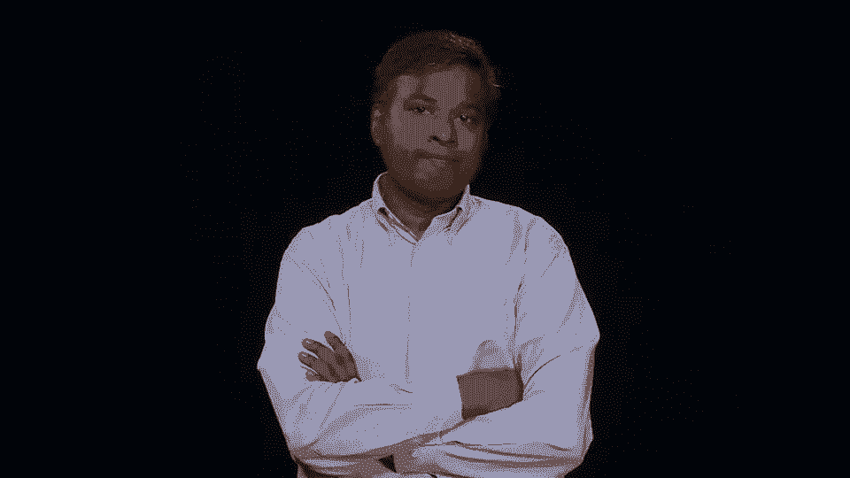

# 【沃顿商学院】商业分析 全套课程（客户、运营、人力资源、会计） - P39：[P039]05_week-1-wrap-up-apparel-industry - 知识旅行家 - BV1o54y1N7pm

大家好，我是萨娜·维拉·雷恩，欢迎来到第一周的最后一节，在过去的会议中，我们了解了各种环境下的预测技术，预测方法是基于过去几次观测的数据来总结的，我要谈谈一个特定的环境，基于这种背景下的服装行业。

我们使用相同的预测工具来构建描述性分布，基于几个产品的数据。

你好，欢迎回到本周描述性分析的第一周第四场，第四节，我们将预测新产品，我们将研究如何拟合分布，我们将研究一个新产品的问题，在市场上出现新产品和新设计的情况下预测新产品，需求数据非常有限。

你如何在这样的设置下预测，经常使用主观技术，让我们来看看一些主观技术，主观预测方法，一些主观预测方法，我们对我们的贯穿复合材料感兴趣，比如说，你可以看看Salesforce复合材料。

这是销售人员收集需求数据，估计和汇总所有的需求数据，这种销售的聚合，个人估计，制作你的复合材料，收集数据或预测需求的另一种方法是使用客户服务，或者你可以使用一个由行政意见组成的陪审团。

那里有一个由预测者组成的委员会，他们提出预测，并利用他们的集体知识，一种常用的方法叫做德尔菲法，Delphi方法所做的是汇编以下个人意见，然后你一遍又一遍地重新考虑它们，直到达成集体共识。

所有的主观方法最终都是基于直觉，感觉检查，让我们来看看一个预测应用程序，我们在找一家叫安迪的户外用品公司，作为一种新产品，一种新的男士登山鞋设计，他的锌卖了这个特殊的设计，只叫了一个季节的流浪者。

在过去的一个赛季，他们预报了一千二百个单位，他们做了一千二百多个，Q=一千五百个单位，其中他们卖出了1397台，正如你所看到的，现在没有太多的需求数据可用，安迪怎么能想到漂流者的描述性统计。

这是我们将要研究的一个问题，我们将学习如何通过跟踪错误来拟合分布，如果安迪的过去需求数据有限，比如说，对于新产品，我们从主观预测开始，然而，我们可以用更多的数据做得更好，如果你仔细想想。

通常会有来自其他产品的额外需求数据，这些数据是你过去预测过的，这些数据是如何预测你的公司的信息，偏离了真实的需求，我们将使用一种方法来拟合正态分布到这些可用的数据。

我们可以对其他发行版使用其他类似的方法，但我们要看正态分布，我们有安迪墨水的数据，他们乐队所有的鞋子，这张表格向你展示了他们上一季生产的所有产品。它们是在第二栏预测的，第三列的生产量。

第四栏所列产品的销售额，以及他们在上一篇专栏文章中看到的对所有这些产品的需求，比如说，如果你看看产品欧米茄，天气预报是两千四百，他们做了三千双鞋，他们卖了两百九十七，实际需求也是267，他们现在都卖了。

下一季漂流者的主观预测是千对，安迪应该对漂流者使用什么需求模型，如果你看看我给你看的前一张桌子，你会注意到销售和需求之间是有区别的，什么是销售，比如说，如果你的需求是一千台，你的架子上只有八百台。

销量将达到八百台，你不能满足所有的需求，有几个发生这种情况的例子，比如说，流行音乐播放器，游戏机经常售罄，因为大多数操作问题的库存有限，例如报摊问题，我们需要真实的需求分布。

我们有兴趣收集真实的需求分布，为了做到这一点，我们要迈出的一步，将你的预测与表中的实际需求进行比较，这里有一张图表显示了预测，和图表上的实际需求，在x轴上是预测在y轴上是实际需求，比如说。

这是一种实际需求非常接近预测的产品，一般来说，你会注意到有些需求比预测的要高，在图表中的上三角形上，对某些产品的需求低于预期，比如说，看看这个产品，需求大约是一千，预测是三千多，五百。

这个图表告诉你真实的需求通常与你的预测有多大的偏差，如果你的需求和你的预测完全相等，你将在图表中的对角线上，使用我们在上一张幻灯片中看到的图表，我们现在可以测量预测性能，为了衡量预测性能。

我要生成另一个列，这就是所谓的AF比，AF比列什么都不是，但实际需求除以你的预测，在第一个例子中，我们有796除以800，几乎等于一点零，所以我们测量预测和实际需求，通过计算实际需求与预测的比率。

这就是所谓的AF比，我们有兴趣生成我们预测精度的经验分布函数，记住，比率在发展或理解我们的预测准确性方面是有用的，A比率只是实际需求与预测的比率，我们评估实际需求与预测的比率，或者所有过去观测的f比。

如果比率衡量实际需求与预测的偏差有多大，如果你的A比是8点，这意味着你的实际需求是预测的80%，这些比率有助于我们确定当前预测的不确定性，我们将学习如何选择一个正态分布的需求。

并将其与我们的数据进行拟合，我们从最初的预测开始，这来自一种主观的方法，让我们说，预感，猜测，委员会预测，等，我们使用最初的预测，让我们假设最初的预测是一千个单位，然后我们计算历史数据中的比率。

召回比率只是实际需求与预测的比率，他预测的所有产品，现在我们如何适应mu和sigma，也就是正态分布的均值和标准差，我们将正态分布的平均值设置为以下值，我们计算预期的A F比，并将其乘以预测。

这就是正态分布的平均值，对于正态分布的标准差，我们计算比率的标准差，乘以预报，让我们看一个例子，在我们的示例中，我们预测有数千人，我们计算了比率，比率的平均值是1点0 1，实际a比的标准差是三点一。

所以当我们把这些乘以预测，我们得到的平均需求是一万，实际需求的标准差是310，所以对于我们的描述性数据，我们可以拟合一个均值为1010，标准差为1010的正态分布，代表我们的要求。

如果您想出于预测目的预测需求，我们需要更新需求分布，我们可以如下更新正态分布，意思是我们可以保持不变，也就是十，标准差将在此数据中得到校正，从三百一十到三百九十，如果你想看看标准差是如何校正的。

用于预测目的，我们可以回到第二部分，看看我纠正的视频，使用我们的移动平均线方法，我们只是为我们的数据计算了描述性统计数据，我们有正常的需求模型，这是漂移器数据的正态分布，我们使用均值为一万的正态分布。

标准差310，这是因为我们知道我们的预测，我们知道我们的预测有多好，这有助于我们衡量您的预测将如何偏离真实的需求，这有助于我们计算标准差，这是一个很好的需求分配模型，尽管我们对一种新产品的数据非常有限。

我们过去用我们的预测过程，提出一些需求分布，帮助我们理解未来的不确定性，看来我们的技术应用非常广泛，比如说，它们可用于了解本地生产总值预测，一个国家或一个经济体的国内生产总值，我们比较预测和实际观测。

并对我们的预测过程充满信心，有关更多详情，你可以看看自然是关于信号和噪音的书，尤其是第六章关于在三英尺深的水中溺水，我将简短地提到的另一个例子是一家名为Sport over Meyer的公司。

泥潭运动中使用的预测过程也测量误差，你可以在费舍尔和拉面的一篇论文中找到更多关于这一点的信息，本文是关于降低需求不确定性的成本，通过对早期销售的准确响应，到目前为止，我们研究了如何生成需求分布。

当数据有限时，帮助我们的技术是如何测量预测误差，跟踪预测误差，告诉我们我们的预测有多好和可靠，反过来，此信息有助于描述需求不确定性，你的需求在未来如何分配，弄清楚什么是随意的，什么是相关的。

是一件很难做的事，我介绍的工具，利用过去的数据为未来的需求提出一个预测模型，这就是描述性分析，让我们回顾一下，我们从报摊问题开始，我们引入随机变量，我们研究了需求分布，我们学会了如何预测需求。

我们学会了如何用过去的历史数据进行预测，我们研究了预测中的预测误差和偏差，我们看了两种技术，移动平均线和指数平滑，我们学会了如何生成描述性统计数据，特别是均值和标准差。

我们学会了如何使它们适应未来的预测目的，我们研究了季节性的趋势，最后，我们学会了如何预测新产品和如何适应需求分布，描述性分析到此为止，我们将在未来几周内介绍更多的工具，在那几周里。

我们将继续进行规定性和预测性分析。

这是激动人心的一周，我们看到了一个基本的操作问题，叫做新闻供应商问题，处理不确定环境下的供需匹配，我们学会了如何在这样的设置中描述我们的数据，我们学会了如何在静止的环境中预测。

我们学会了如何描述趋势和季节性，以及如何使用Excel示例在此类设置中进行预测，我们探索了如何实现这些工具包和技术，我们所学到的描述性分析形式，你将来在本课程中学习的基础。

我们有一些先进材料和示例模板的回顾材料幻灯片。

