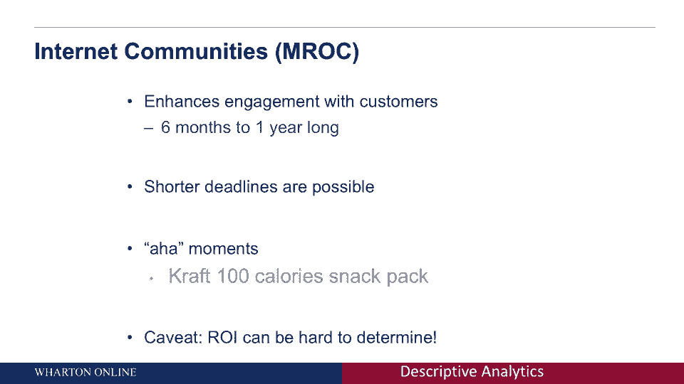

# 【沃顿商学院】商业分析 全套课程（客户、运营、人力资源、会计） - P3：[P003]01_what-is-descriptive-analytics - 知识旅行家 - BV1o54y1N7pm

欢迎来到客户分析，我是拉古·阿亚尔教授，我是沃顿商学院市场部的营销学教授，我在这里大约有十年了，在这段时间里，我教授了市场研究和其他与客户分析相关的课程，今天我们将讨论描述性分析，我希望你和我一样兴奋。

谈谈描述性分析，所以这些天，大量大数据的收集和分析外包给第三方公司，专门做这些事情的人，在这个模块中，我会向你介绍在不同行业从事这类工作的公司，例如扫描仪数据，作为杂货店或媒体公司衡量观众参与度的指标。

但即使你不参与这些行业，或者你想在较小的范围内从事描述性数据分析，了解这些公司是很重要的，他们收集这些数据的方式，以及数据试图探索的问题，为什么会这样，这是因为这是一种思考这类问题的方式。

通过了解这些公司，你将在思考和形成关于描述性数据的问题时带走可操作的技术，你可以使用的技术，在您试图分析的任何描述性数据环境中，那么什么是描述性分析呢，描述性分析可以用多种方式定义，所以一个是。

描述性分析是一种通过决策将市场与企业联系起来的方法，描述性分析的另一种思考方式，这是做出可操作的决定所需要的信息，另一种方法是系统收集和解释数据的原则，这里的公共线程，一个常见的线程正在获取良好的数据。

但我还想说的是，这是数据和管理者必须做出的决策之间的协同作用，这有助于很好的分析，那么经理们可能要做出哪些不同的决定，一套决定可能纯粹是探索性的，所以想想品牌经理，他们在看他们的品牌销售。

突然他们开始下降，问题是他们为什么要下降，是因为顾客的喜好变了吗，是因为顾客喜欢竞争对手吗，可能会有各种各样的事情发生，所以从这个意义上说，在这个阶段，它纯粹是探索性的。

我们在试图理解为什么事情没有解决，我们期待他们的方式，另一组问题可以纯粹是描述性的，再举个例子，回到品牌经理那里，我想知道，我的顾客是什么，钱包份额，他们花了多少钱，我的竞争对手有多少钱。

谁是我们的客户，我们的分割是什么样的，所以这类问题需要确凿的数据来了解客户有多少，比如说，购买我们的产品或其他竞争对手的产品，另一组问题可能是纯粹的因果关系，这里的想法是，比如说。

如果我改变了我网站的登陆页面，它会如何变化，消费行为，它会改变吗，它会增加点击率吗，它会把它打倒吗，等等，所以这些问题，右边那个，最极端的，因果问题需要系统的数据收集。

在如何收集数据方面进行了仔细的思考，所以我们在这里看到的是从左向右，需要收集的数据类型，需要收集数据的条件类型也在不断变化，所以我们今天在这个模块中继续，我们将讨论经理们需要回答的不同类型的问题。

什么类型的数据最适合回答这些问题，所以让我们从探索性类型的数据收集开始，所以说，探索性的数据收集通常是为了发展最初的预感，或者是洞察力，我们回忆起一个例子，我们从品牌经理开始，思考为什么销售额下降。

可能有各种不同的原因，通常这种类型的数据收集是第一步，这是一个非常重要的步骤，可以广泛地理解潜在的问题可能是什么，它提供了广泛的指导方针，说明你应该更严格地寻找什么，我想到的典型技术是什么。

当您开始考虑探索性数据收集时，这是焦点小组，焦点小组已经在那里很长时间了，什么是焦点小组，一个房间里大概有八到十个顾客，通常你会有一个版主来设计焦点小组的整体流程，你想让这些人来谈论这个品牌。

他们对品牌的看法可能会相互影响，换句话说，你可以观察动态，它是合理的无结构的，这是畅所欲言的谈话，作为一个品牌经理，你想做什么，深入了解当今消费者的痛点，和数据年龄。

分析和大数据焦点小组在某种意义上发生了变化，到许多不同的方式，市场调查，在线社区或互联网社区基本上是焦点小组和类固醇，你可以考虑各种不同的公司提供这项服务，例如。

焦点焦点所做的基本上不是看着十到二十个人，你开始考虑100到200到500人在一个小组里，你监视他们不是一次，但在六个月到一年的时间里，这里有什么想法，这里的想法是随着时间的推移与你的消费者建立关系。

这一百到两百人开始互相建立关系，他们变得越来越舒服地谈论真实的感受和真实的见解，联络点，当然啦，不是唯一一家做这件事的公司，有很多，许多其他公司，例如，C空间就是其中之一，还有许多其他竞争对手。

互联网社区有很多优点，一个是提高与客户的参与度，所以这些顾客在一起互相交谈，和品牌谈了大约六个月到一年，所以很明显，在相互交谈方面，这种密切的集中，与品牌的沟通，这真的提高了他们的参与度。

第二个更短的截止日期是可能的与焦点小组，在试图让这些人进入一个房间方面有后勤问题，得到一个版主等等，因为你要观察这些客户大约六个月到一年，你实际上可以有更短的最后期限，有啊哈的时刻出来了。

最著名的例子是克拉夫特的百卡路里包，他们做了什么，他们基本上有一个社区，他们合作过的，c空间，他们有一个社区，开始看着，人们想在零食里吃什么，洞察力是什么，并不是人们想停止吃零食。

他们真正想要的是低卡路里的零食，纳贝斯科的100卡路里包装取得了惊人的成功，但也有警告。

有什么大的警告，罗伊可能很难确定为什么，因为当你很早就开始接触互联网社区时，可能很难预测，卡夫会有什么样的见解，这太棒了，但并不是每一个可能的例子都是这样，所以仔细想想，当你可能想要互联网社区的时候。

仔细思考，值得六个月到一年的投资吗，非常重要的是要确定。

