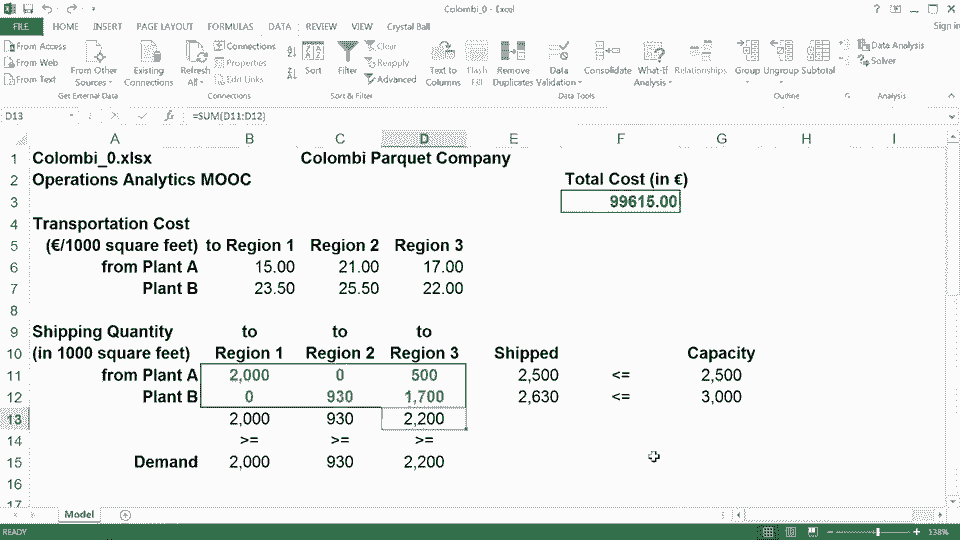

# 【沃顿商学院】商业分析 全套课程（客户、运营、人力资源、会计） - P43：[P043]04_optional-week-2-review - 知识旅行家 - BV1o54y1N7pm

欢迎参加运营分析课程第二周的复习会议，这个复习会话完全是可选的，如果您对优化工具包的知识有信心，看看我们为你准备的练习题，如果你觉得准备好了，接受本周的两个家庭作业问题，另一方面。

如果您觉得可以从查看资源位置的其他示例中受益，和网络优化模型，然后再转向实践问题，在这篇评论中，这节课是为你准备的。

我们将讨论优化问题的另外两个例子，资源分配和网络管理，下面是资源分配的上下文，一个联合国机构正计划为最近一次自然灾害的灾民建造住房，四种类型的住房单元被认为是a b，c和d。

每种类型的住房单元需要四种基本资源，砖头，铁皮，木杆和劳动时间，比如说，每一个b型单元需要六百块砖，十张铁皮，三根两根木杆和两百个劳动小时，不同类型的住房单元为不同数量的人提供住所，比如说。

每个类型的B单元将容纳六个人，每个资源都有有限的可用性，比如说，只有一点，这个项目可使用500万块砖，该机构正试图决定每种类型要建造多少个单元，容纳尽可能多的人，在不超过资源可用性的情况下。

所以我们对这个问题有一个口头描述，下一步是把这个口头描述转换成代数公式，我们必须识别决策变量并为目标函数写公式，和制约因素，让我们从决策变量开始，我们需要决定每种类型要建造多少个单元。

所以我们让n a指定要构建的A型单元的数量，和b要建造的b类单元数，和c n和d要建造的c和d类单元数，分别是，我们有四个决策变量，好的，该机构希望最大限度地增加接受庇护的总人数。

如果它建造了一个A型单位，在这些单位避难的总人数将是，以同样的方式，如果它建立了NB、C、N和D单位，这些决定对目标函数的贡献将是NB的六倍，在c中加5乘以7乘以n d，为所有单位类型添加此贡献。

我们得到目标函数的表达式，让我们首先讨论资源可用性的约束，所需砖块的数量不能超过砖块的可用性，如果我们建造一个A型单元，他们需要400倍N块砖，如果我们建造B型单元的NB，我们需要600倍的nb砖等等。

数控C型机组用四百三百倍和砖，然后D型单位的D，所需的砖块总数将是n的四百倍，加600乘以n b加400乘以n c加300乘以nd，不应超过一分，该机构有500万块砖头，铁皮怎么样。

铁片上的约束看起来是一样的，所需铁片的数量不能超过现有铁片的数量，所以我们增加了四种单元类型的铁板的所有要求，20乘n a加10乘n b加2，5乘以n c+18乘以n d，这不应该超过10万张铁皮。

该机构现有的铁皮，以类似的方式，所需的木杆数量不能超过木杆的可用性，所需的杆数为三根，5乘n a加3，两次和b，加两个，六倍nc加三十倍n d，这个总数不能超过一百二十，该机构现有的5000根木杆。

终于，劳动小时数必须满足类似的要求，可用的总劳动小时数是150万，这不能超过对劳动小时数的总要求，300乘a加200乘b，在d中加两百次c加四百次，所以让我们把所有的资源可用性约束放在一起，我们有四个。

一个是做砖头的，一个是铁皮的，一个是木杆，一个是劳动时间，最后，我们需要确保住房单元的数量是整数和非负数，所以这是我们的完整模型，我们需要确定要建造的每种类型的住房单元的号码。

最大限度地增加受庇护者的总数，在资源有限的情况下，下面是模板住房救济下划线零，我们已经帮你贴好了，你可能会发现打开它并按照我的步骤操作是有用的，所以我们这里有问题数据，为了完成我们的模型。

我们需要定义决策变量，该问题的目标函数与约束第一决策变量，我们需要确定四种类型中每种类型的房屋数量，b，c和d，所以我们需要四个决策变量，和a和b和c和d，我们将用单元格C5到F5来表示这四个变量。

让我们在单元格中放入一些试用值，每一个都说千分之一，让我们使用我们的惯例，通过使这些单元格粗体来将它们与其他单元格区分开来，和蓝色，接下来是这个问题的目标函数。

联合国机构正试图最大限度地增加受庇护者的总数，单元格H 5将用于存储此目标的值，配方是某种产品，我们的决策变量C5F5和单元格C6F6，因为这些牢房反映了每种类型的住房单元中庇护的人数，这就是公式。

我们可以看到，当前决策变量集的目标函数值再次等于2。5万，按照我们的惯例，让我们将目标函数单元格中的字体更改为粗体和红色，最后，我们需要为我们的问题指定约束，试图最大化其主观。

该机构受到四种资源数量的限制，砖头，木杆，铁皮和劳动时间，因此，对于工程处计划建造的任何一组住房单元，它必须计算相应的资源需求，并确保所需资源不超过现有资源，让我们先写下计算所需砖块数的公式。

与单元格C5到F5中的决策变量集相关联，我们将把这个公式放入细胞G10，所以为了计算所需的砖块数量，我们写下决策变量C5的公式和乘积，f五和每种住房单元各自的砖要求，它们位于细胞中。

由此产生的需求是700万块砖，这比机构拥有的砖头数量还要多，但是我们稍后会让求解器解决这个问题，以便计算剩余资源所需的数额，我们可以去10号牢房，使用决策变量单元格的绝对单元格引用。

然后将这个公式复制粘贴到g 11到g 13的单元格中，只是为了确保我们复制的一切都正确，让我们去G13细胞看看公式，我们使用快捷方式F2来显示公式，好的，看起来是正确的，好的。

现在我们准备调用求解器数据求解器，现在，我们需要为求解器的目标函数指定决策模型的三个组件，目标函数的决策变量和约束，我们指向H5细胞，我们想最大化这个目标，这是庇护的总人数。

决策变量是要构建的每种类型的单元数，所以这是C5到F5，约束很好，这里的主要限制是我们资源的可用性，所以我们指出G10到G13细胞是我们的资源需求，这些不应超过我们现有的资源，储存在我十到我十三。

我们还需要告诉求解器我们的决策变量，住房单元数必须为整数，所以我们点击添加，我们选择我们的决策变量，我们选择i t整数作为选项，这里我们点击确定，我们看到我们的约束被添加到这里。

我们想确保我们建造的住房单元数量不是负数，我们留下溶剂法，因为它是GRG非线性的，在我们取消选中的选项中，忽略整数约束，以确保我们对住房单元数量的要求不是整数，忽略，我们点击确定，我们点击解决。

我们看到电子表格上显示的解决方案，这是优化的电子表格的图片，把公式放进去，大家可以看到，住房单位的最佳组合以d型和b型单位为主，只建议建造两个c型单元，A型单位，七个人，每一个都像d型的单位一样。

但它们显然需要太多的资源来构建，并且不包括在最佳解决方案中，在第二个例子中，在这次审查会议上，我们在研究网络优化问题，特别是，我们正在考虑一家哥伦比亚拼花地板公司，该公司生产硬木地板。

这家公司在德国的不同地区有两家工厂。下个季度的计划a和计划b，每个工厂只能生产一定量的硬木地板，比如说，A厂的季度生产能力为20吨，50万平方英尺的硬木地板，该公司的硬木地板在三个地区销售。

每个地区都有一个最低要求的硬木地板数量，它必须在下个季度收到，哥伦比亚可能会决定向每个地区运送超过这些最低值的货物，但在工厂和销售区域之间的运输楼层时，它不能减少运输，公司承担了成本的下降，比如说。

如果它把一千平方英尺从工厂B运到第二区，它将产生2。5欧元的费用，所以哥伦比亚需要明白它应该运送多少，从每个工厂到该地区的每个市场，以实现尽可能低的运输成本，同时确保工厂现有产能满足所有需求。

为了把这个问题的口头描述转化为代数描述，我们必须指定决策变量，目标功能和制约因素，所以让我们先从决策变量开始，两个变量，计算运往区域一的金额，从A厂和B计划，现在让我们设定运往第二区的数量。

从A厂和B计划，以及运往第三区域的金额，总而言之，我们在这个网络中有六个决策变量，这个问题的目标是运费总额。它有六个组成部分，每个决策变量一个，在约束侧，我们有两种约束类型，第一个是供应的限制。

工厂A不能生产和运输超过其能力的产品，所以说，所有来自A厂的货物加起来不能超过两千，五百，以类似的方式，B计划的总出货量不能超过三千，需求约束是区域一的第二种约束类型。

总装运量必须至少满足2000个地区的最低需求量。第2名必须在第3区获得至少930分，最低要求是二千二百元，最后，我们不能运送负量，因为可以运送数千平方英尺的硬木地板。

我们没有强制要求我们的决策变量必须是整数，这是哥伦布问题的完全代数公式，我们现在可以使用Excel模板哥伦比亚下划线零，我们已经准备好建立电子表格模型并对其进行优化，像往常一样使用求解器。

我们从Excel文件的零版本开始哥伦比亚下划线零，第一个任务是在电子表格中定义决策变量单元格，这个问题中的决策变量是以千平方英尺为单位表示的量，从每个工厂运往每个销售区域。

我们将把这些决策变量的值放在单元格B11到D12中，例如，B 11号牢房，我们将保留数千平方英尺的硬木地板的价值，从A厂运到第一区，让我们把一些试验值放入决策变量单元格中，说每个细胞一千，和以前一样。

我们使用蓝色和粗体字体来区分决策变量单元格和其他单元格，现在Columbia示例中的目标函数，目标函数是总运输成本，这是公司希望最小化的目标功能，我们将把这个目标函数的公式放入F3单元格中。

我们从等号开始，放入我们决策变量单元格的一些乘积，d十二和相应的运输费，F3单元格中的结果是根据Excel 120，四千欧元，所以我们有目标功能细胞，让我们把单元格中的字体改为粗体和红色，让它脱颖而出。

现在，在哥伦比亚的例子中，它的约束是严厉的，在容量方面，从每个工厂装运的总量，在一个单元里不能超过那个工厂的生产能力，让我们计算一下从a厂装运的总量，所以我们写一些，b十一，c十一和d十一。

我们得到了决策变量三千的试验值的结果，这个数额超过了计划的能力，因此求解器必须调整决策变量的值，以确保我们有一个可行的装运计划，现在，我们可以将细胞E11中的公式复制并粘贴到细胞E12中。

计算从b厂装运的数量，现在三千，我们将在单元格中编写当前运往区域一的总金额的公式，b十三，所以公式是和，b十一和b十二，以类似的方式，我们得到了运往第二和第三地区的数量。

通过将B13细胞的公式复制粘贴到C细胞中，十三和十三，如果我们调查牢房，十三，我们看到公式是d11和d12的和，这是A厂和B厂运往第三区的数量之和，我们已经指定了决策变量，目标函数与约束条件。

现在我们可以使用求解器来找到最优解，所以我们去数据，单击求解器并从目标函数开始，目标功能细胞为F三，我们正在最小化这个目标，因为这是运费总额，决策变量在单元格B11到D12中，有两种类型的约束，首先。

类型，就是确保从每个工厂运来的数量，不超过每个工厂的容量，单击确定，第二类约束是确保每个区域接收的任何东西，B 13到D 13至少是这个地区所要求的，现在我们不需要这里的整数约束，因为我们可以运送少量。

但我们需要说明我们的装运数量是非负数，我们把求解方法留给GG非线性，我们点击解决，最优解显示在电子表格上。

