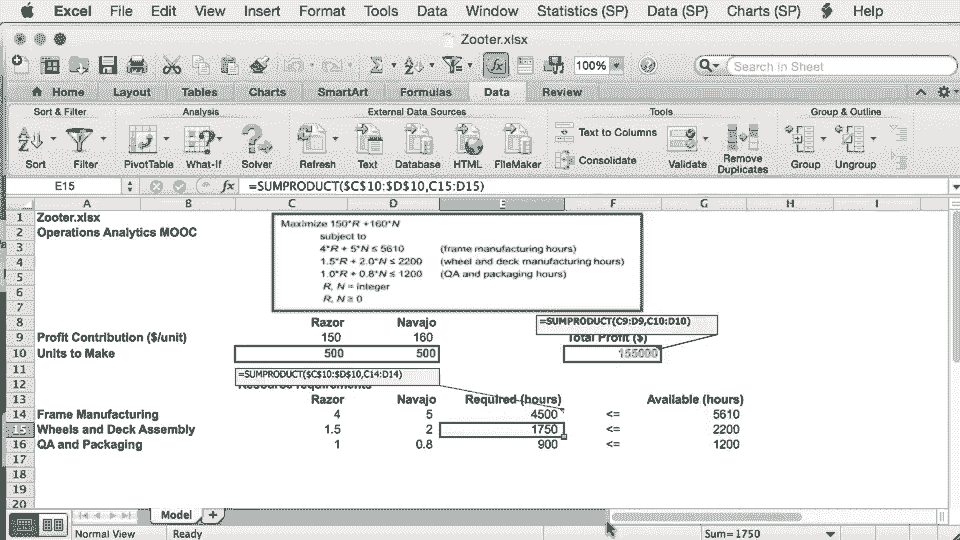

# 【沃顿商学院】商业分析 全套课程（客户、运营、人力资源、会计） - P44：[P044]05_optional-solver-on-mac - 知识旅行家 - BV1o54y1N7pm

在我们第二次会议的主视频中，我们已经研究了如何设置和解决一个优化问题，在Windows平台上的Excel 213中，在看这个之前，请确保你看了主视频，在这个视频里，我们将讨论方法上的差异。

Excel和求解器是在Mac和Windows上设置的，这里有一个缩放问题的电子表格，在电子表格上加载到Excel for Mac 211，我们已经进入了一个试验解决方案，五百五百。

以及目标函数和所用资源数额的所有公式，让我们找到求解器在哪里，求解器是Excel外接程序，为了定位它，你必须去工具，添加ins并确保在此处检查了求解器，之后呢，求解器要么出现在这里的工具上。

或者您可以直接在数据选项卡下找到求解器，会有一个按钮求解器就在那里，在我们查看求解器之前，让我们来看看Windows上使用的快捷方式的几个不同之处，对Mac。

让我们首先看看如何在特定单元格中显示和编辑公式，在Windows平台上，为此，我们使用了快捷方式F2，在Mac上，我们使用快捷方式控件u代替，比如说，如果我去利润公式所在的F10细胞。

我可以按Ctrl u显示和编辑此公式，我们想指出的第二个区别是，在Windows平台上引入绝对单元格引用的方式，这个快捷方式是Mac上的F4，它是命令T，比如说，如果我进入单元格E14。

用控制U显示公式，我可以突出显示决策变量单元格C10和D10，然后我可以在绝对和相对之间更改单元格的地址，通过反复按命令T，好的，让我们调用求解器，我将从数据选项卡进行，大家可以看到。

求解器对话框看起来与求解器对话框几乎相同，对于窗口，我们指定约束、目标函数和决策变量，就像我们在约束变量上单击make为负一样，我们选择同样的解法，我们点击选项以确保，比如说，忽略整数约束未选中。

现在我们已经准备好点击解决按钮了。

