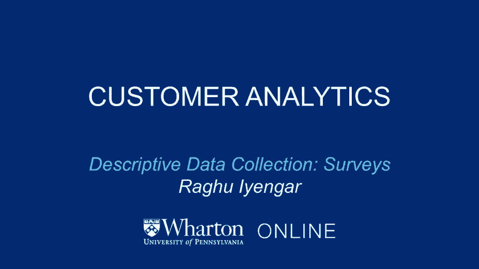
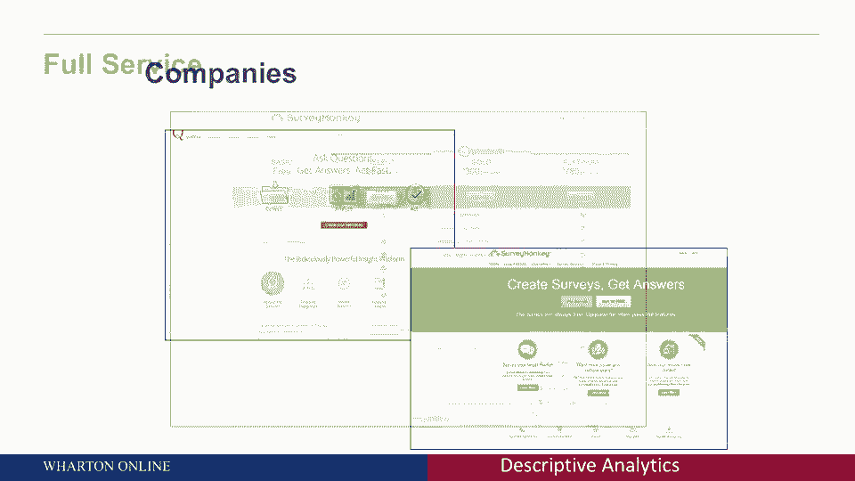
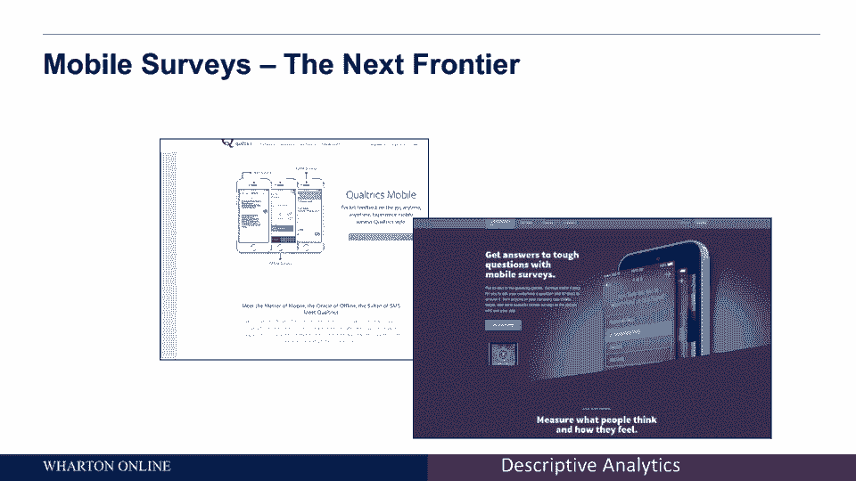
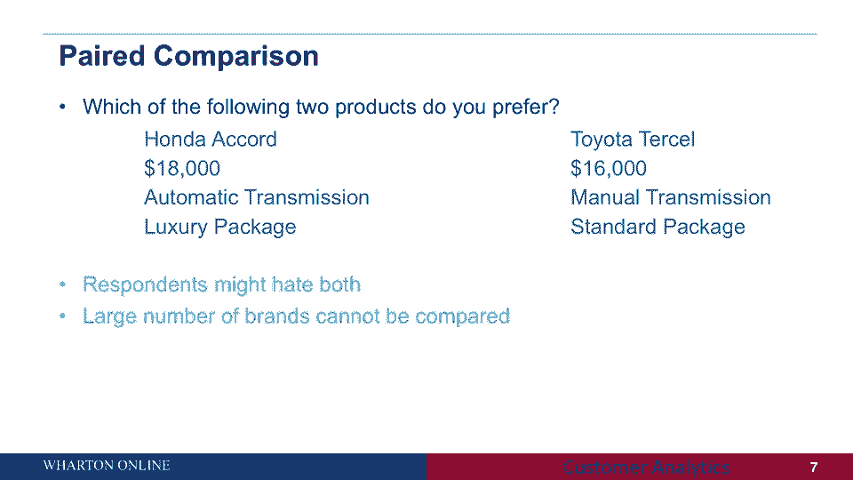
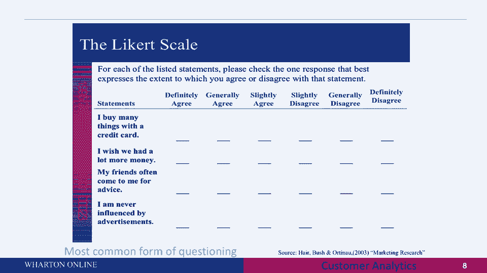
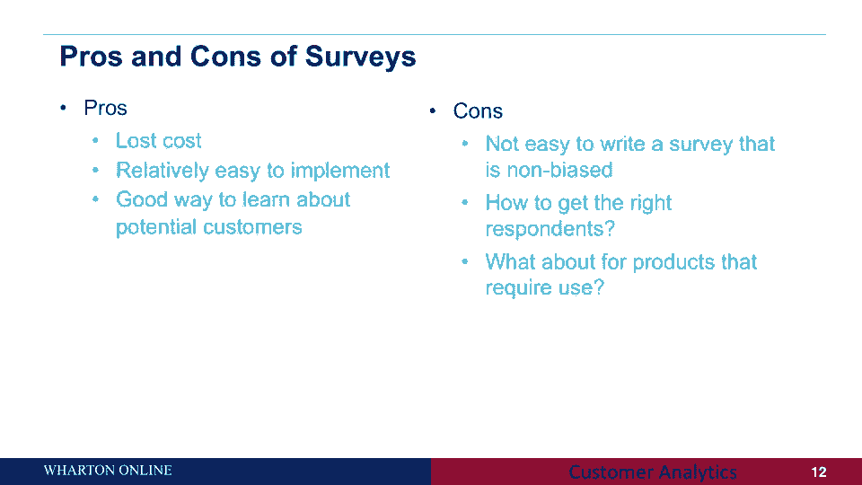

# 【沃顿商学院】商业分析 全套课程（客户、运营、人力资源、会计） - P4：[P004]02_descriptive-data-collection-survey-overview - 知识旅行家 - BV1o54y1N7pm

所以在这一部分中，我们将开始讨论描述性数据收集，所以描述性数据收集，正如你所记得的，基本上是试图理解，例如，你知道谁是我们的顾客，钱包的份额是多少，以及所有那些你必须有硬数字的问题，那你怎么能这么做呢。

这可能有两种方法，一个是主动数据收集，一个是不引人注目的数据收集，在活动数据收集中，你可以重新开始思考，关于数据收集的两种广义思维方式，一个是调查，这是许多公司市场研究的支柱。

另一个是来自客户的自我报告，我们会谈论他们两个，所以让我们从调查开始，几乎所有财富都使用的调查，500家公司定期用于收集客户态度，你可以考虑情绪，你可以考虑购买习惯。

通过调查和数据积极收集的许多不同的东西，当然可以帮助细分客户，开始思考我们的客户是谁，开始思考，他们从所有这些问题中购买谁，你需要了解来制定你的营销策略，现在有很多很多公司可以帮助你做这些调查。

我给你们举几个例子，Qutrex是一家非常著名的公司，帮助您进行免费调查，有时另一个例子是调查猴，现在这两家公司不仅帮助你做有时免费的调查，但他们也可以是全面服务公司。

例如，如果你看看其中一家公司的定价计划，他们允许你，他们给你的价格不同，基于你是否希望他们找到你的客户，你想让他们进行调查，分析数据并给你数据，所以从这个意义上说，当你开始考虑做调查时。

已经有公司可以帮助你接触客户，收集数据并分析数据，但当然调查并不是你从客户那里获得信息的唯一途径，你可以直接要求客户自我报告其中的一些调查，所以如果你看看，比如说，移动调查是下一个前沿。

这些基本上是公司再次在移动设备上进行这些调查，一些常见的例子Qualtrics是一家同时做这两件事的公司，它在你的桌面上做调查，它还对移动设备进行调查，另一家公司，例如，再次是混合面板，这里有什么想法。

这里的想法是你想在顾客购买的那一刻向他们提供服务。

有时移动调查允许你做什么，它们允许你在C2中捕捉客户的反应，而不是回顾性的，比如说，您实际上可以将调查发送到客户的移动设备，在他们做出购买决定的时候，而不是一个月后，如此清晰。

那种情绪顾客在购买时可能有的感觉，可能更好地捕捉而不是让他们考虑购买，一个月后，问卷可以根据地点和背景进行定制，所以再一次，查看移动设备在哪里，换句话说，它告诉你客户在哪里，如果顾客在商场里。

你可以问他们在商场里做什么，如果顾客在餐馆，你可以据此提出量身定制的问题，所以可以做非常量身定制的调查，但有什么警告你不想做得太多，营销人员应该非常小心，而不是再次利用这种杠杆进行量身定制的调查。

你确实想一次又一次地向同一个客户发送调查，你会经常看到大量的调查疲劳开始，所以再次利用移动调查的力量是很重要的，但在一定限度内，现在我们已经讨论了进行调查的不同方法，移动调查等等，让我们深入一点。

你可以用调查问哪些类型的问题，什么是该做的，什么是不该做的，在进行调查前，有两个大问题出现了，有哪些不同类型的问题，如何验证调查，换句话说，你收集的东西值得收集吗，让我们从第一期开始。

现在有哪些不同类型的问题，从某种意义上说，这是一系列不同类型的问题，当然有很多问题，但这些是重要的，在接下来的几张幻灯片中，我要做的是，就是复习每种类型的问题，看看积极和消极的世界，从某种意义上说。

利弊，然后谈论最佳实践，所以让我们从第一个分项类别开始，这里有一个例子，你对你的健康保险计划有多满意，可能是不同的桶，在这种情况下，你有五个桶，从非常激动到非常不满意，注意，类别描述的范围相当清楚。

并且有一个有利和不利的类别的平衡，那是什么意思，有一个中间点，既不满意也不满意，另一方面，你有两个类别超过了这个相当满意和非常满意，低于这两个类别非常不满意和非常不满意，所以在它的表面。

我认为这是一个很好的提问方式，但这有什么坏处，嗯，一个大CN比什么，当然啦，如果回答这个问题的人没有健康保险，很明显，这个问题与本案无关。有可能这个问题是由一个人回答的，他在想他以前的保险。

如果那是参考点，你可能得到的答案在不同的人之间可能会有很大的不同，换句话说，问题是你不知道人们把它和什么比较，所以这是分项类别的一个问题，让我们看看另一个试图解决这个问题的，你所说的比较问题，你直接问。

与该地区的私人诊所相比，私人执业的医生提供高质量的医疗护理，从非常低劣到非常优越，那么我们在这里做了什么，我们已经试图用前一组问题来解决这个问题，也就是说，我们明确地告诉人们要与什么进行比较。

但这里有什么问题，什么是信息的大损失，信息的巨大损失是两种选择可能都没有那么大，你在比较两个选择，可能都在酒吧以下，但一个比另一个好，那么我们在这里看到了什么，取决于你可以问的问题类型。

可能会有一些信息丢失，这总是发生，所以我想再做一次，在接下来的几张幻灯片中，将向你展示不同的方法，你可以问问题，它试图进入该省的中心，这里还有一个，这叫排名问题，这方面的一个例子如下。

请对以下特征进行排名，让我们说，手机服务，就其重要性而言，一到八，有八类，这里给一个是最重要的，它是最不重要的，通常当你问这些问题时，不允许打领带，这意味着这些事情中只有一件可能是最重要的。

其中只有一个是最不重要的，以此类推，那么我们在这里看到了什么，首先，类别的类型是相当明确的，但它也涉及到很多比较，换句话说，人们必须做很多比较，当他们穿越这一切的时候，所以如果你看第一个，为了第一等级。

你在八个不同的类别中进行比较，并将其中一个类别作为最高等级，让我们说接收清晰度对你来说是最重要的，所以你给它第一名，当你经历给排名第二的时候，你又要做七次比较，有很多不同的比较。

这意味着通常这种类型的数据可能对收集不太有利，如果你有很多类别，你想让人们比较，最终可能会发生的是人们给排名1 2和3，也许想了很多，在那之后，人们可能会做太多的比较，所以典型的经验法则。

或者这里最好的做法是不要给出太多的类别，也许它实际上可能是相当多的，所以也许六到八个可能是一个很好的类别，如果你付出更多，您可能只获得前一两个的高质量数据，在那之后，可能不会有很多有区别的数据。

另一个例子叫做配对比较，事实上，如果你仔细想想，我们稍后会讨论，在这些会议上，叫做联合的东西，如果你仔细想想，您将看到这种类型的比较数据正在到来，实际上来自联合类型的调查，这是以下两个产品。

你喜欢左边的吗，你有价值1。8万美元的本田雅阁自动变速器和豪华套件，在右手边，你有丰田卖一万六千美元手动变速器标准包，我们在这里想做什么，我们在这里试图做的是强迫人们在这两个物体之间进行比较。

通过看他们选择什么和不选择什么，你试着理解人们关心的是什么，当他们在这两种产品中选择时，这看起来是了解人们喜欢什么的好方法，为什么，因为这实际上模仿了人们在现实世界中可能做的事情。

想象你想要一台笔记本电脑，你通常做什么，你下去，比如说去百思买或其他商店，或者在亚马逊上，您首选的供应商在哪里，你开始比较不同的笔记本电脑，你选择不同的东西，你想比较的东西，所以说，比如说。

为了一台笔记本电脑，可能是屏幕大小，可能是它有多重，什么是CPU等等，所以这真的模仿了人们在现实生活中的真实行为，但是这个问题有什么问题呢，如果你有，让我们在这里做两个比较，本田雅阁丰田将销售两款产品。

人们可能更喜欢本田A Court出售，但实际上可能两者都讨厌，假设你有另一个选择，在这两种情况中，本田雅阁可能是更好的，但就他们喜欢的东西而言，这仍然低于标准，另一个问题是，当然啦。

是众多品牌无法比拟的，想象一下你在六七个不同的品牌中进行比较，有很多不同的特征，你很难做出那个决定，为什么又因为，会有很多比较，这里最好的做法是什么，通常你有两到三个品牌，这样的话。

你可以得到很好的数据，关于人们如何比较不同的品牌，你也不想要太多的功能，或者这些品牌属性太多，通常大约六是一个很好的数字，在本例中，我们有四个，这是品牌名称，价格，是什么样的传播，是什么样的包裹。

所以每个品牌大约有四到六个特色，和大约两到三个品牌比较，任何比这更多的东西，我认为受访者将很难清楚地理解差异是什么。

好的，给你好的，可靠数据，下一个是最常见的形式，这里有什么故事，这里的想法是你有很多陈述，通常在水平上，就是你看到的这里，第一个可能是，我用信用卡买很多东西等等，在每一行你回答。

不管你同意还是不同意这类说法，所以这让你有能力收集很多关于人们喜欢什么的数据，人们不喜欢什么，这叫做利克特量表，这是最常见的提问形式，当你想让人们思考许多不同的陈述时，它经常被使用。

在这种情况下关于信用卡和相关的想法。

这里有另一个例子，一种叫做连续尺度的东西，这里的想法是，如果你有，比如说，一些你想给人们看的东西，你想要C2中所说的两个首选项，这意味着你想要偏好，当他们在思考或看着一个特定的。

比如说视频或电影片段等等，人们会做什么，通常是酒吧，从某种意义上说，它可以很容易地在互联网上完成，很受电脑调解调查的欢迎，所以你可以有一个酒吧，鼠标点击等等，人们在看视频，或者当他们在看广告的时候等等。

他们可以在，他们喜欢这个吗，还是他们不喜欢这样，所以这个很受欢迎，尤其是在以计算机为中介的调查中，当你想要人们如何看待你的产品的信息时，以及当他们经历不同的产品时，这种偏好是如何变化的。

所以如果他们在看一个特定的视频，假设你是一个广告提供商，你想看看人们对广告的偏好是如何变化的，当他们在看广告的时候，所以当他们看这个的时候，你可以一直换那个计数器。

我们中的许多人可能会在最近的选举投票中看到这一点，所以在选举期间发生的事情是当他们进行辩论等等的时候，他们通常有一个观众，他们有这个节拍，可以来来回回，所以当他们在争吵时。

你可以看到人们是如何倾向于一个或另一个候选人的，所以这就是所谓的连续尺度，现在我想在这里做的基本上是给你一个大致的概述，不同种类的问题，请注意，这些不是详尽的集合，还有很多其他类型的问题。

但我想让你从这一切中带走的是，你问的每一个问题，不管是评分表，它是一个比较规模像规模，这些问题中的每一个都有一些利弊，所以仔细想想该问什么样的问题，取决于最终目标是什么，这让我想到了第二个问题。

这里的最终目标是什么，最终目标可以有两种形式，一个叫有效性，一个叫可靠性，换句话说，就是你正在收集的东西，会有任何价值，所以让我们把这个问题的有效性，基本上，这个想法是预测有效性的，例如。

假设你在问一个网络推广者得分，这是我将在下一张幻灯片中讨论的内容，净推广者得分通常是衡量客户满意度的得分，你想知道人们是否会把你的产品推荐给其他人，现在你希望的是网络推广者得分通常预测，比如说。

客户利润，公司利润，或者其他类型的因变量，你可能会感兴趣，如果有的话，那么你会说那个特定的调查，净启动子评分具有较好的预测效度，这种可预测性意味着收集调查数据是值得的，因为它预测了一种特定类型的因变量。

作为一家公司感兴趣的，可能是利润，股票价格，其他种类的行为，另一种观察调查有多好的方法是使用可靠性，一种特定形式的可靠性称为测试重测可靠性，意思很简单，它基本上说明了你收集的东西有多稳定。

如果你重新测量，比如说，客户满意度等，变化很大吗，如果是这样，从你一次测量到下一次，它告诉你的是，也许这不是一个非常稳定的措施，有很大的波动性，理想情况下，你想做的是有一个度量或刻度。

或者一种测量事物的方法，这些事物是合理稳定的，让你得到安慰，事实上，一旦你测量它，它不会改变很不稳定，所以这是你可以衡量一项调查有多好的两种方法，有效性和可靠性，所以在接下来的几张幻灯片中。

我们要举一个调查的具体例子，净启动子得分，看看勘测设计的注意事项，但在我这么做之前，我只想总结一下调查的利弊，让我们先看看专业人士，低成本，相对容易实现，了解潜在客户的好方法，写一份调查不是很容易。

那是没有偏见的，我们会提出来的，我们将讨论最佳实践，第二个大问题是，你如何找到合适的受访者，谁应该再次回答这个调查，我会提出来的，当我们谈论该做的和不该做的。

需要一些使用的产品呢，所以他们的调查可能不是最好的方法，因为这些产品实际上需要客户使用，所以在这种情况下，人们会做什么，通常你可能会做，比如说，一个焦点小组，你要求人们首先看原型，触摸产品，感受产品。

使用产品，然后也许在那之后做一个调查，所以这些是调查的主要利弊，当你考虑实施一些调查时。

