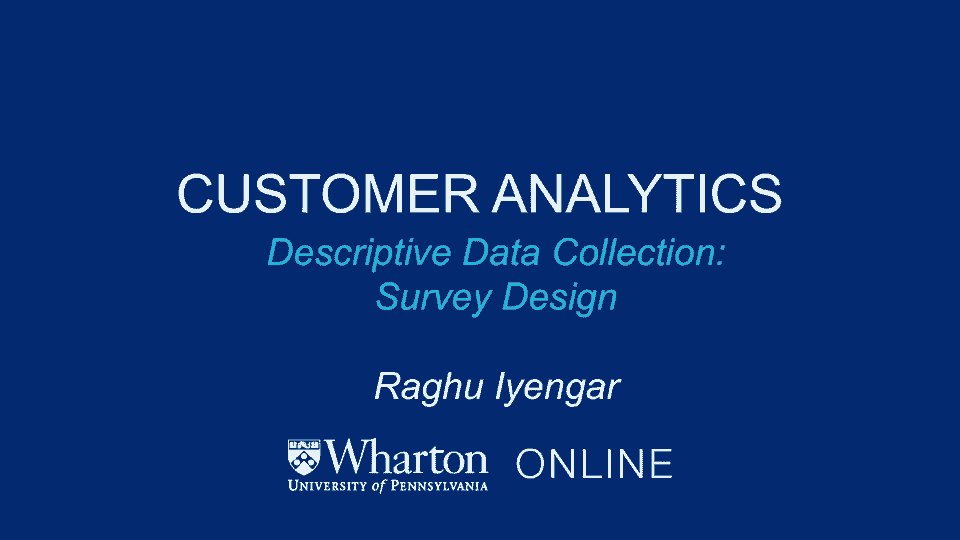
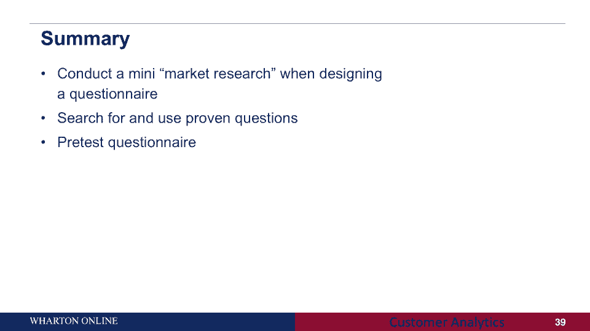

# 【沃顿商学院】商业分析 全套课程（客户、运营、人力资源、会计） - P6：[P006]04_descriptive-data-collection-survey-design - 知识旅行家 - BV1o54y1N7pm

现在我想做的是总结一下这部分的调查设计，谈谈调查设计的一些步骤，一些应该做的和不应该做的以及最佳实践，所以让我把它放在那里，有哪些典型的步骤，我们将更详细地介绍这些步骤中的每一个，我想零步。

这可能是最重要的一个，以确保您的结果可推广到适当的人群，那是什么意思，这意味着通常当你在做一项调查时，大概有一千人，两千人，三千人，不管数字是多少，你显然对他们说的话感兴趣，但你更感兴趣的是。

你在那里捕捉到的东西是如何，比如说，它这个，这是顾客满意，它如何推广到您的整个客户群，这就是我所说的零步，我们将讨论如何完成第一步，制定您想要捕获的内容的详细列表，捕捉所有这些东西，写出问题的草稿。

设计布局中的流程，适当地，中试重稿，这是一个，这是一个循环过程，从你首先设置它的意义上说，你做一些试点测试，回到画板上，清理一些关于再次测试的问题，以此类推，直到您愿意继续进行并实施该调查。

从实现的角度来看，第六步可能非常重要，也就是说，如果你在你的公司工作，或者如果你是顾问，为另一家公司工作，得到各方的认可，极其重要，当然啦，如果您必须对客户进行调查，最后你继续前进，再做一次测试。

以确定调查是否好，查看最终副本并实施调查，所以让我更详细地介绍这些步骤中的每一个，正如我所说，步骤零，也许是最重要的一个，它确保您从调查中收集的数据将是有用的，你得先考虑几件事，人口已被正确定义。

样本代表人口，例如，假设你是一家以，假设25到30岁的男性，你要确保的是你已经正确地定义了人口，那确实是你们的目标市场。然后你说，如果那是你的目标市场，你看样品，为什么因为，然后呢，你可以更自信。

你从调查中收集的数据，确实代表了你的目标市场可能发生的事情，那么当然要确保被选中接受采访的受访者，他们明白这个问题，有适当的知识来回答问题，而你，当然，用一些激励措施来激励他们通过调查提供信息。

这里的大问题是，当然是回复率，你可能不会感到惊讶，或者你可能是典型的服务回复率约为5%，这意味着在你发送调查的100人中，他们中只有五个会如此明确地回应，它非常，不过，要想出适当的方法来激励受访者。

事实上回应你的调查，思考这个问题的几个方法是，你如何处理这种无反应，首先，你想尽可能多地收集没有回应的人的数据，为什么，因为你想确保回应的人和不回应的人，彼此之间没有系统性的差异，如果他们是。

那可能不会，是将样本结果推广到人群的一个很好的方法，让我给你举个例子，如果你对捕捉人们的反应感兴趣，到价格，你对你的产品收费，让我们说，有反应的人和没有反应的人之间有系统的区别，就他们的收入而言。

这显然不是很好，因为这样你所描述的就不是真正的目标市场的代表，为什么收入是一个重要的指标，因为你感兴趣的是他们对价格的反应，你付出得如此清楚，收入将是一个非常重要的指标，表明人们对价格有多敏感。

如果回答的人和不回答的人的收入水平有差异，这清楚地表明你的样本中有偏见，就其对人口的代表性而言，一个人能做好什么，一个人可以跟踪非回应者，试图将他们转化为回应，通常情况下，你会给他们发送提醒。

或者在支持的方面，你会得到回应的人，什么事？电话可能是，如果他们只是在反复请求后给你糟糕的数据，所以通常所做的，你通常会比较每一波受访者，以确保他们相似，所以说，例如，你可能会有第一波。

这些是最初的应答者，假设大约50%的人回应，你收集了第一波，然后一周左右或两周后，你会给人们发送提醒，这些人没有回应，假设他们中有20%到30%的人回应，而不仅仅是聚合或整理数据，你会想确保。

在第一周回答的50%的人没有系统性的不同，在第三周有30%的人做出了回应，如果是这样的话，您可以将所有数据一起转换，如果不是这样，我建议你单独看一下数据，现在让我们回到其他步骤，第一步，收集哪些信息。

我想这里，你要确保的是，你翻译任何研究目标，你有信息需求，一种思考方法是从问题相关性的角度来思考，你对答案做了什么，如果你知道，所以我可以倒着工作吗，所以想想你知道答案的理想情况。

然后想想你的管理决策会有什么不同，一旦你把这个观点放在心上，它变得容易理解，你应该怎么问这些问题，那么问题是，你如何设置这些问题的格式，有两种大的思考方式，一个是所谓的开放式回答问题。

你为什么在Genaris购物，比如说，另一个是近距离回答问题，你多久在Genardis购物一次，很多时候根本没有，所以你在这里注意到的，开放式回答问题，基本上要求受访者提出他们的答案。

他们本身并没有得到任何反馈，另一方面，在近距离回答问题中，你通常在脑海中有一个特定的问题，你有一个秤，比如说，从经常到根本不，在这个问题中，让我们来谈谈，开放式和封闭式问题的优点和缺点是什么。

在优势方面，有相当多的开放式问题，首先回答问题的人可以对问题做出一般的反应，比如为什么你认为X品牌更好，回应是用他们自己的话给出的，用他们自己的语言，人们变得更容易做出反应，它还可以帮助解释关闭和数据。

比如说，如果人们在想一种特定的颜色，你可以跟进说，为什么那种颜色对你很重要，它也可能暗示还有什么其他问题可以问很多好处，但同时，也有一些缺点，首先呢，这对自我管理的调查不是很好，为什么。

因为有时调查疲劳可能会出现，所以如果你想想受访者，他们正在经历很多问题，过了一会儿，你一直问他们开放式的问题，他们可能会有些疲劳，他们可能没有那么清晰，当然还有。

你得到的所有答案都取决于一个人的口齿伶俐程度，如果他们能理解他们在想什么，他们口齿伶俐，开放式问题很棒，为什么是因为他们用自己的语言回应，在他们自己的废话中，如果他们不那么口齿伶俐，你得不到很多信息。

最后，在分析数据方面，邮政编码可能相当繁琐，因为它是开放式的，这是一句老话，可能很难理解一个人必须编码的所有不同的东西，现在让我们回过头来谈谈封闭式问题，关闭和问题，就像我之前说的。

如果你回想一下这个例子，你多久在genaris购物一次？向响应者提供预定的描述，并选择其中一个或多个，这里有什么好处，相当清楚，它很容易使用，对被告的威胁较小，编码很简单，另一方面，管理起来要便宜得多。

它需要大量的前期测试，你想确保你问的问题，你给人们打勾或选择的类别是明确的，他们明白这意味着什么，事实上，它假设响应列表是完整的，更多的努力，但我认为在编码方面，它变得容易得多，所以再一次。

当你考虑你想问什么类型的问题时，我认为你必须牢记最终目标，最终目标是更多地考虑，消费者对开放式的看法，可能会很棒，另一方面，如果最终目标是，你有一套很好的问题，你想问他们。

对你看到的回应有一个很好的了解，或者你想看的，封闭式可能更好，在最佳做法方面，你经常用开放式问题做探索性研究，并将其用于封闭式定量调查中的代码，所以这给了你一个如何设计调查的感觉，通常从开放式开始。

了解出现的所有不同问题，你能感觉到顾客在想什么，然后你设计结尾和问题，现在让我们进入第三步，我认为在这里使用简单的传统语言是非常非常重要的，我将在下一张幻灯片中给你们举一个例子，避免歧义，尽可能具体。

不要有冗长的问题，从宽泛开始，然后缩小范围，请记住，当受访者回答调查时，他们通常没有很多时间，所以如果你把它做得很长，你问得很长，这是非常模棱两可的，你可能会看到很多辍学的人，开始调查然后辍学的人。

因为回答这些问题变得非常非常乏味，这里有一个例子，考虑你的目标样本并使用熟悉的语言，你在购买时注意到任何故障吗，你注意到它有什么问题吗，你买的时候，你马上看到了什么，后一个问题对普通观众来说更容易理解。

第一个问题你注意到什么故障了吗，使用特定的语言，普通应答者可能难以再次回答的具体措辞，记住你的答辩人，了解他们对什么感到舒服，并在这个意义上设计问题，最后考虑测序，考虑布局指南，以下是一些最佳实践。

用一个简单的、不具威胁性的问题开始调查，你想让人们轻松地进入调查，例如，如果你想知道他们的收入或住在哪里，这些可能不是很好的问题，一开始，这些问题，事实上，问了很多个人细节，如果你真的想问这些问题。

最好以后再问他们，当他们放松地进入调查时，它应该有一个平滑和逻辑的流程，从非常笼统到具体，可能会有很多顺序偏差，我在下一张幻灯片里给你们举个例子，我的意思是，一个典型的普遍偏见是为疲劳服务，现在。

有什么办法，这种偏见，尽可能地随机排序你的问题，让我举一个顺序偏差的例子，这里有四个例子，我在这里想看的是什么，就是，受访者中表示，他们对购买新产品非常感兴趣。这就是你在第一行右栏看到的。

在问那个问题之前没有问任何问题，两点，百分之八的人对购买这种产品感兴趣，当你只问人们产品的优点时，你看到的是这个数字跃升到16点，百分之七，当然啦，如果你只问产品的缺点，没人愿意买，最后。

当你问人们优点和缺点时，这个数字在百分之二到百分之十六之间，大约是百分之五，我们在这里看到了什么，我们如何排序问题，它在整体调查中被问到哪里是极其重要的，所以通常的经验法则是。

如果你想一个对你很重要的问题，一定要把它的顺序随机化，有时候有些人一开始就会得到它，有些人可能会在最后得到它，有些人可能会在中间得到它，你想看到并确保没有顺序偏差，不管他们从哪里得到的。

你得到了类似的答案，所以让我以第五步和第七步结束，再次进行预测试，纠正问题，记住第六步，如果你还记得的话，确保所有有兴趣做这项调查的人，你和他们有买断协议，所以这与调查设计本身没有什么关系。

但要确保每个人都对调查感兴趣，话虽如此，让我们回到第五步和第七步，这个想法是为了确保在你用你的最终目标样本进行调查之前，把调查清理干净，确保你所有的问题都是有意义的，有兴趣回答这些调查的人。

他们明白问题是什么，你在设计问题时考虑到了回答人，这意味着你要确保你使用的是废话或语言，与应答者将熟悉，你问的问题从更笼统到更具体，总是以没有威胁性的问题开始。

以便正在回答调查的消费者或受访者可以很容易地进入调查，一次，所有这些都有希望完成，你得到的最终结果是一个很容易理解的调查，易于实施，受访者很乐意回答，你会从调查中得到很好的数据。

所以让我以我们在整个会议上所做的关于调查设计的事情来结束，一个是你仔细考虑并仔细观察一项调查，作为一项迷你市场调查，这意味着你仔细考虑每一个问题，你思考如何设计这些问题，最好问什么问题。

应该是开放式的还是封闭式的，嗯，这取决于你的目标是什么，应该再用什么样的语言，这取决于目标市场是什么，所以要仔细考虑，当你在设计调查时，每个问题都很重要，以及这些问题是如何排列在一起的--更重要的是。

通常你想做的是，如果你问一些特定的问题，例如，关于客户满意度，在这方面已经有很多研究，回答这个问题和提出这个问题的最好方法是什么，我的意思是寻找并使用经过验证的问题，这样你就不用做重活了。

别人已经替你做了重活，最后，在你继续实施问卷之前，总是预先测试，它可能从20到30人的样本开始。

以确保他们理解每个问题，以确保你得到的答案是有意义的，在你继续用更大的样本进行调查之前，所以希望在调查设计的这一部分，你对勘测设计的注意事项有很好的了解，你应该跟踪的事情是什么，现在。

你对某一特定类型的问题也有很好的理解，在市场上非常受欢迎的网络推广者得分，我所说的理解力是指你知道专业人士，但你也知道缺点，所以我想让你从，所有这些都是当你开始设计问卷或调查时。

总是把每一个问题都记在心里，思考最终目标，向后努力。

