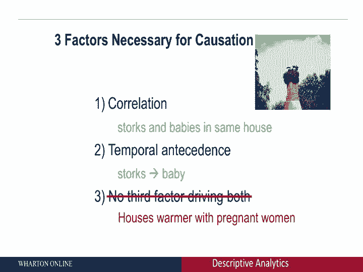
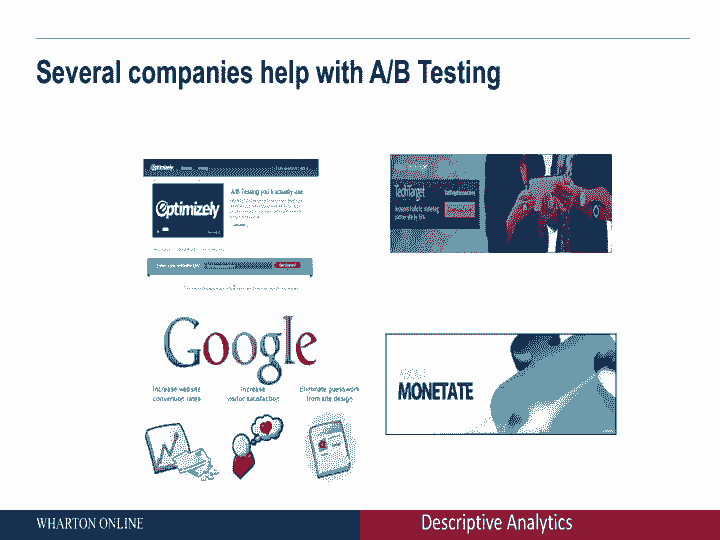
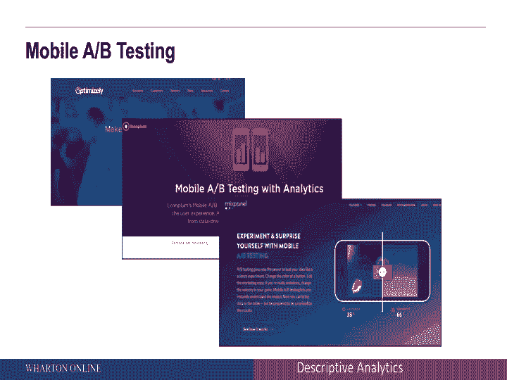
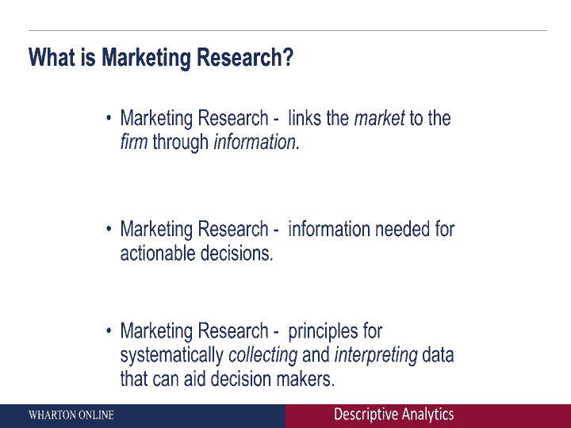

# 【沃顿商学院】商业分析 全套课程（客户、运营、人力资源、会计） - P9：[P009]07_causal-data-collection-and-summary - 知识旅行家 - BV1o54y1N7pm

到目前为止，我们已经讨论了探索性数据收集，我们谈到了描述性数据收集，接下来，我们要继续进行因果数据收集，因为你会注意到这种类型的数据收集更严格，让我给你举个例子，很多时候，当我们考虑我们公司的网站时。

会考虑登陆页面，考虑的是登陆页A，比登陆页B好，我们如何确定那是你可能想做实地实验的地方，一些客户看到登陆页A，另一组客户见登陆页B，我们看点击率然后决定哪个登陆页面更好，换句话说。

我们试图在更改登陆页面之间建立因果关系，查看点击率，这就是因果关系的全部，这就是现场实验的全部，所以有很多公司允许你做这种类型的A B测试，比如说，当你开始考虑A B测试时。

你需要开始区分相关性和因果关系，相关性是两个变量之间的关系，所以让我们把价格和销售看作是销售和价格相关的，如果价格下降，可能会是这样，销量可能也会下降，因果关系是一个变量对另一个变量产生影响。

相关性和因果关系不是一回事，让我们举几个具体的例子，试图理解相关性和因果关系之间的区别，第一相关性与因果关系，如果你开始思考因果推理，有三个要求，首先，这是否有相关性，这基本上是x和y之间联系的证据。

假设x是价格y销售额它们之间有关系吗，但这还不足以证明因果关系，还有另外两个要求，一个是时间前因，x必须发生在y之前，所以如果你想说价格变化推动销售，我们需要能够说价格变化发生在销售变化之前，最后。

没有第三个因素驱动他们两个，换句话说，你需要控制其他可能的因素，所以让我们举一个例子来尝试理解两者之间的关系，这两者有什么区别呢？所以有一个明显的故事，比如说，带孩子，它通常始于较冷的国家。

在那里他们过去看到，例如，一堆股票经过，突然落在一所房子上，几个月后我看到房子里有个婴儿，股票真的能很好地生儿育女吗，让我们试着理解每一个不同的元素，看看是否有因果关系，如果你开始考虑相关性。

现在可能有某种相关性，你看到房子上面坐着谈话，你在那所房子里看到婴儿，他们有血缘关系吗，他们是有血缘关系的，但因果关系是关键问题吗，一方面，有相关性，茎和婴儿在同一个房子里。

是否有一个时间上的先行词也是正确的，白鹳飞来，宝宝们晚一点进来，但有没有第三个司机，那就是，比如说，因果关系和相关性是不同的，关键问题是什么，通常，当你开始思考，为什么鹳坐在一个特定的房子里。

通常答案可能是，这是在较冷的国家，通常答案可能是因为那些房子更暖和，然后你开始思考为什么那些房子更暖和，通常这些房子可能会更暖和，因为他们有孕妇在里面，换句话说，还有第三个因素，房屋相当温暖。

让股票进来，坐在房子的顶部，你看到几个月后在那所房子里有一个孩子出生了，所以这是关于相关性的，但绝对不是因果关系，所以当你开始考虑相关性和因果关系时，这是关键的区别。

当你开始思考整个故事时，你也会开始考虑许多其他公司，这些公司可以帮助你区分这两者，区分这两者的关键想法是开始做现场实验，换句话说，你开始系统地操纵价格，你开始系统地操纵登陆页面。

看看它们如何产生因果影响，所以有很多公司会帮助你做这个A B测试，所以一个简单的例子可能是，如果你开始考虑两个登陆页面，登陆页A与登陆页B，你如何区分哪一页更好，以下是理想情况下你想做的。

一组客户来到你的网站，将看到登陆页a，随机选择的另一组客户，将看到另一个登陆页登陆页B，然后随着时间的推移，你会看到点击率，你看到的购买可以帮助你确定哪个登陆页面更好，这正是许多公司帮助你做的，比如说。

Optimizely是一家公司，会帮助你做这个AB测试，它会帮助你了解哪个登陆页更好，换句话说，将整个登陆页面货币化，并找出你应该向客户展示的页面，还有很多其他的公司，总体上做同样的事情。

当你看着这个特定的空间，许多公司开始在登陆页面设计方面帮助其他公司，在网页的整体优化方面。

等等，等等，所以有很多公司帮助你做移动AB测试，这里有什么想法，基本上在你的移动端，你还想回答什么登陆页更好，应该显示哪个图标等等，所以像Optimizely这样的公司会帮助你做到这一点。

它也有许多其他公司可能会做同样的事情，比如说，limpum是另一家帮助做同样事情的公司，还有很多其他的竞争对手。

所以总的来说，当你开始考虑这些不同公司的定价计划时，启动计划通常是免费的，所以你可以自己做很多A B测试，如果你开始考虑你的整体登陆页面，你开始考虑购买的整体漏斗，那是你开始付大笔钱的时候。

也就是企业包，有哪些问题可以帮助你回答，使用这种类型的数据，第一个是网站优化，什么样的网站，什么登陆页面，应该显示什么图标等等--应该如何优化，第二次，你可以开始思考手机应用程序设计。

许多公司都推出了手机应用程序，它们应该如何最好地设计，当然你可以把它发挥到极致，你可以开始思考你应该如何设计应用程序，但你也可以开始考虑应该向不同的客户展示什么版本，极端的情况是一对一的营销，非常广泛。

所有这些公司都通过做实地实验来帮助你收集数据，换句话说，你在系统地操纵登陆页面，您可能正在操作结帐页面等等，试图理解系统的变化是如何引起客户行为的变化的，那么到目前为止我们做了什么，在这个模块中。

我们研究了三种不同的数据收集，这与三种不同类型的营销决策齐头并进，首先，我们从探索性数据收集开始，我们在那里谈到了焦点小组，我们谈到了互联网社区，然后我们进入描述性的数据收集类型，我们在那里谈到了调查。

我们谈到了销售点数据，我们谈到了与媒体策划等相关的数据，然后我们最后讨论了因果关系，换句话说，我们谈到了田间实验和其他帮助你进行田间实验的公司，所以当你开始思考这个模块的整体总结时，是关于数据的。

但更重要的是，这是你需要回答的问题类型之间的协同作用，以及最适合回答这个问题的数据类型，考虑协同作用是非常非常重要的，当您开始考虑您希望获得的数据类型时，如果你想回答的问题更具有探索性的话。

你可以做焦点小组，你可以做互联网社区，如果您想回答的问题类型更具描述性，换句话说，你想知道钱包份额的具体数字，在话语权份额方面，然后呢，您需要收集的数据类型大不相同，从探索性类型的数据，最后。

如果你需要回答的问题本质上更有因果关系。

例如，如果我改变我的登陆页面会发生什么，那么你需要收集的数据类型将更多地沿着现场实验的路线，所以说，保持管理目标是非常重要的。以及所考虑的数据收集类型，因为它们具有很高的协同性。

