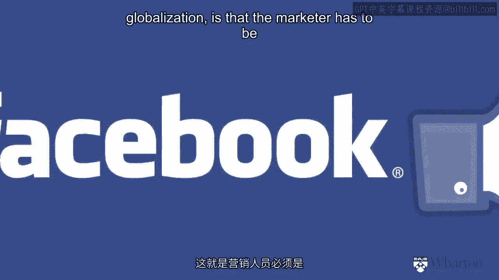

# 沃顿商学院《商务基础》｜Business Foundations Specialization｜（中英字幕） - P1：0_营销101建立强大品牌(一).zh_en - GPT中英字幕课程资源 - BV1R34y1c74c

[MUSIC]。

Hello， I'm Barbara Kahn， and I'm a professor of marketing at the Wharton School。

And I'm here to talk to you about marketing。 So this segment is the marketing 101， the basics。

principles of marketing。 And my focus is going to be on building strong brands。 Because of course。

the essence of marketing is to have a very strong brand。 So let's start off with the first question。

a very basic question， but， maybe not as obvious as you might think， which is what is marketing？

And I'm going to argue that marketing is the study of a market。

So what's a market？ A market is an exchange between two partners， frequently a buyer and。

a seller， but marketing also applies to nonprofit or。

things where there isn't necessarily money being transacted。

But what you need for marketing to exist or for。

a market to exist is to have an exchange。 And what I'm going to argue is that what marketing means is going to differ as。

a function of different aspects of those exchange。 So let's look at the basic exchange。

You have one buyer and one seller。 And I'm going to give a very simplified view to make a point。

No market's are ever quite this simple。 And I'm going to look at the two extremes just to make my point here。

And the real markets are somewhere in the middle。 But you'll see when I start defining this。

that it's very useful to use this， kind of simplification。

So if we think of an exchange between buyers and sellers， on one extreme we。

could have what's called a seller's market。

And then the seller's market， what that means is the seller has a product。

And if you want that product， you have to come to the seller。 So the seller has all the power。

The opposite of that would be a buyer's market， where there's lots of competition。

and a lot of products out there。 And the buyer has the power。 And what I would argue。

and I think would make sense to you too， if you think about it。

is marketing should not be the same in a seller's market as in a buyer's market。

So in a seller's market， what marketing tends to be is what we call product focus。

marketing。 You have the product， if the customers want it， they're going to come to you。

In that case， you should develop that product to the best of your ability。

You should innovate in that product。 You should try to reduce costs。

And you should really focus on the product。 Your business objective in a product focus market is to sell as much as you can。

And profitability from a product focus market is going to come from volume， selling as much。

as you can。 In the past when we've studied product focus markets， we've shown that profitability is。

tied to market share。 So market share becomes your business objective。

And why does market share increase profitability？ Because the bigger your market share。

the more your revenues。 And the bigger your market share and your volume。

the lower the product cost， and hence， profitability。 Higher revenues， lower costs， more profit。

That's really the goal of a product focus market。 And when your product focus。

where do you get growth？ Will you develop new products based on your product experience？

Or you go to new markets？ That's product focus marketing。 So what's customer focus marketing？

Is it the opposite？ And the answer is going to be no， not exactly。 In fact。

it's quite a different type of marketing。 Let's think about it。

Customer focus marketing means that I need to focus on the customer to get that customer。

to buy from me rather than the competition。 Well， what's the best way to get the customer to buy from you rather than from the competition？

The best way to do it is to look at what that customer wants and deliver a product that。

meets the needs of that customer。 So where is the product focus market on the expert？

And I create the very best product I can based on my expertise in a customer based market。

What I'm going to do is look at what the customer wants and try to create product to。

meet that customer's need。 That's a very different point of view。

Some people call it inside out is product focused and outside in is customer focus。 Okay。

so now we're going to look at what the customer wants to deliver value to that， customer。

But think about it。 What does the customer want？ Well， the first question is， well， which customer？

You can't give every customer what they want and we know customers are going to want all。

different things。 So the reason why a buyer's market or customer focused marketing is so different than product。

focus is that every customer out there wants something different。

If we try to give everybody what they want， we'll go out of business。 That's too hard to do。

So the intuition of customer focus marketing is to pick and choose customers， deliver value。

to some customers， say yes to some customers and no to other customers。

That's the process of segmentation。 I'm going to talk about that in the next section。

But the idea here is that I go after some customers and I say no to other customers。

Well then how do I become profitable in that？ Understand that in a product focused marketing what we did is sell as much as we can。

We sold that product to anybody who wanted that product。

In a customer focused market we're saying no to some customers and yes to others。

So how do we make that profitable？ And the answer is you pick and choose the customers you want to deliver。

You deliver value to that customer， give them exactly what they want and that they're willing。

to pay for。 And where the profitability comes from is not from volume but it's from creating value。

How can value based marketing be profitable？

Well the first thing is if I give you exactly what you want many times you'd be willing。

to pay a premium price。 Then the profitability comes in not from reduced costs which we saw in the seller's market。

side but from increased price premium。

If you give me exactly what I want I'll be willing to pay a higher price for it。 So that's one way。

The other way customer based marketing is profitable is by giving the customer what they。

want time after time after time。 I don't think about just one transaction。

I think about building customer loyalty and delivering value to that customer over time。

That concept is called customer share rather than market share where I try to get a little。

bit from everybody。

The idea of customer share or share of wallet is that I go out through a more narrow market。

and try to get more from each of those customers' wallets。

And it turns out that loyalty is very， if you do it right can be very profitable。

And why is loyalty more profitable？ Because it's the cost of delivering value to the customer。

When I'm doing a customer based marketing it's actually quite expensive to give the。

customer exactly what they want。 Once I figure out what that customer wants and I deliver it to them the first time it's。

cheaper to deliver it to them time after time after time。

So it's more difficult and more expensive to acquire new customers but it's cheaper to。

retain those customers over time and that's where the profitability comes from。

It comes from loyalty。 The other thing if you're thinking about building share of wallet in the customer focus market。

is that I not only sell one product to you I think that other things that you might need。

and I try to cross sell around it。

Let me give you an example of this notion of cross selling。

If you've ever got into a gap or some gene store and you go to cash register and you buy。

a pair of jeans， the cashier or the person behind the counter might say oh these are very。

nice jeans。 Do you think you'll need a belt with that？ Do you think you'll need socks？

That's the notion of cross selling。 So I'm selling other things to you besides that one specific product。

All of these are the idea of increasing customer share and that's a very important part of。

customer focus marketing。 Give the customer exactly what they want。

They'll be willing to pay a premium price for it。 Give them what they want and keep delivering value over time。

They will stay loyal to you and they'll buy over time and that's more profitability and。

if you understand their needs you can not only sell them one product but you can cross。

sell other products that may also meet their needs。

So in a customer base market where profitability comes from is premium price， loyalty and cross。

selling。 The difference between sellers market says you focus on the product on what the customer。

does well and you push that out and in a customer base market you focus on the customer。

what the customer wants and you deliver value to the customer better than the competition。

So that's the basic difference between product base marketing and customer focus market。

Now in today's world the market place has changed even more。

What's changed？ Well now not only do you have an exchange between buyers and sellers but because of globalization。

and because of the internet and technology and social media and things like that it's。

not a one-to-one conversation anymore。 Customers can talk to other customers。 That's good and bad。

If you're doing a really good job in meeting the needs of the customers the fact that they'll。

buzz to their other customers and tell their other friends about what a terrific service。

your company is doing well that's really good news。

On the other hand if something goes wrong and they tell their friends something bad well。

that's not such good news and so you have to be really careful in every transaction with。

the customer now that you deliver not only value but that you deliver a top-notch customer。

experience。 Because although what I've been talking about in the sellers market and in the buyers market。

has focused on transactions in the sellers market I talked about a single transaction。

In the buyers market I talk about transactions over time or customer loyalty but in the connected。

community if your message is being transmitted by customers to other customers they talk about。

the customer experience。 What do I mean by customer experience？ Let me give you an example。

It starts way before the transaction and it goes way after the transaction。

So for example if a customer told another customer about their experience at a restaurant。

they might say well I was driving to that restaurant and I hit a lot of traffic then I。

got to the parking lot and I couldn't find a parking space。

Only when I got into the restaurant I finally got a table the meal was really good but then。

at the end of the meal when I was leaving I tripped and fell。

That may be the way they describe the experience at the restaurant。

And if that's the way your message about your product is going to be transmitted from customer。

to customer then you as a marketer need to focus on the entire customer experience。

So one of the things and we'll talk about this later that's changed in marketing in this。

world of social media and internet and globalization is that the marketer has to be completely transparent。

has to be authentic and has to focus on the entire customer experience。

One thing else to mention we're seemingly coming out of a recession now but there was。

a global recession and in the last few years probably starting about 2008 we had some real。

strong economic uncertainty。 There was a lot of scandals going on people became a skeptical of marketing marketing。

had some bad names that the financial services industry people lost trust and so with all。

those changes in the economic environment there's been a focus again in marketing and。

marketing now has to focus on authentic genuine customer value。

In order to be profitable you not only have to deliver customer value over time and in。

an experiential way but now because of the tightness of the economy and the uncertainty。

there you really have to cut costs and figure out a way to deliver value in a very disciplined。

manner and be very flexible to changes in the marketplace。

So let me just summarize what I've just said the different types of marketing orientation。

there's the product orientation where you focus on the product and you persuade the。

customer to want what the firm has。 There's the marketing orientation where you persuade the firm to offer what the customer。

wants that the customer focus approach。 The experience orientation says that you not only think about the transaction and think。

about the transactions over time but you try to manage the customer's entire experience。

with the firm and when times get tough or customers stop trusting markets then you need。

to remember to build that relationship based on authenticity， on trust and on discipline。

And what's the difference in these different types of markets in terms of what you offer？

In a production orientation you're focusing on product innovation but also reducing costs。

so you tend to see generic products and standardization。

When you're focusing on customer value you see differentiated products and we'll talk。

about that when we talk about brands also how you position your product to meet the needs。

of the customers better。 In an experience orientation you look at experiential value and when you're going to that tight。

discipline mind frame or mindset you look at genuine value。

And what's the competitive sustainable competitive advantage in each of these markets？

In a product orientation the bigger companies win because they tend to have larger market。

share and lower cost and lower cost is a big strategic advantage。

In a marketing orientation when you're focusing on the customers the companies that do the。

best are companies that really know their customers that can deliver quality and that。

have a lot of customer data and know how to use that data to deliver better value。

In an experiential market you look at transformation the customer becomes a co-creator of the value。

and it's really making the customer and the product one kind of overall experience。

And in a trust orientation the sustainable competitive advantage are the companies that。

you trust and that means you've had a long history with them they're transparent and。

you trust them over time。 And what are the measurements of profitability？

In production orientation as I mentioned market share is tied to profitability。

In marketing orientation it's share of wallet or customer share， customer loyalty。

In experience market when you're looking at customers talking to other customers we start。

measuring social networks and buzz and word of mouth and referrals。

And in a trust orientation we really focus on reduced costs。

[Music]。

[BLANK_AUDIO]。

