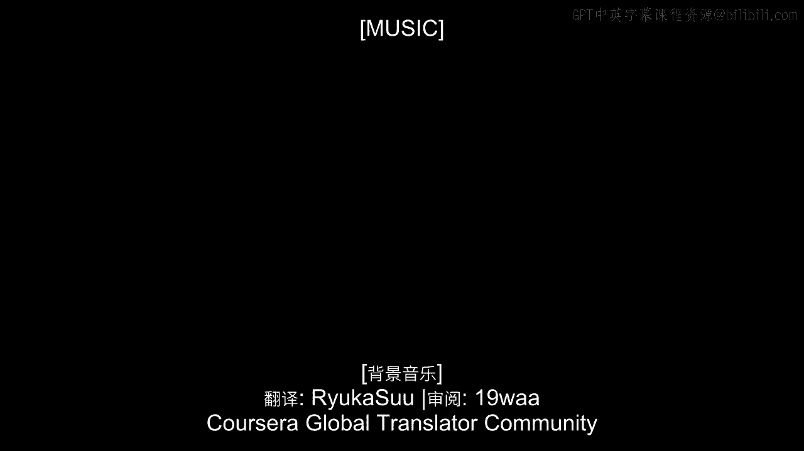
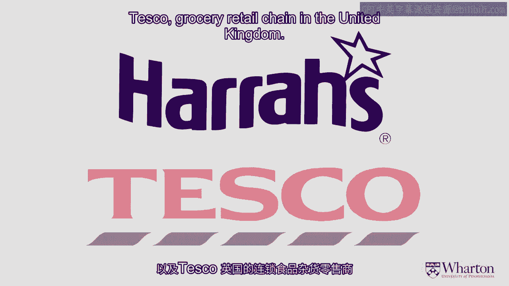

# 沃顿商学院《商务基础》｜Business Foundations Specialization｜（中英字幕） - P10：9_数据驱动的商业模式.zh_en - GPT中英字幕课程资源 - BV1R34y1c74c

So I want to talk about a couple of examples about companies that have used information。

technology and specifically the data about their customers to come up with business models。

that are quite distinct from product centricity。 And so two examples I want to share with you very briefly would be Harrah's。

the casino， chain here in the US and Tesco， the grocery retail chain in the United Kingdom。

In many ways the stories are quite similar despite the fact that they're very different。

companies operating different businesses and different geographies。

In both cases these are companies that were getting beaten up in their businesses。

They weren't nearly as large as some of their competitors， they didn't have the resources。

to compete head to head in a traditional product centric manner and so they turned to the data。

they turned to a deep understanding about their customers to draw insight and to let。

them change their business models in a way that actually let them rise to the top of their。

industries。 So let's talk first about Harrah's， casino chain here in the US。

They're having a hard time competing against other chains that just had deeper pockets。

greater resources。 It was hard for them to develop products and services to compete on a head-to-head basis。

So Harrah's instead turned to its data and in particular developed an amazing loyalty， program。

Now many companies developed loyalty programs but few of them were able to draw the actionable。

insights that Harrah's was to truly understand at a granular level what each customer is。

doing not only what games they're playing but what meals they're eating， what room preferences。

they have， what entertainment options they seek and to understand when that customer is。

likely to change his behavior， when he's likely to walk away from the table and what kinds。

of things that Harrah's itself could do to change their behavior for the better。

What kinds of messages and offers to provide at the right time and through the right channel。

in order to create and extract more value from that customer。

So Harrah's was just brilliant in drawing those insights and understanding for instance what。

someone's threshold was， if this customer goes down about say on a $150 it's time to， intervene。

it's time to offer them a meal or some kind of other activity which is going。

to make them feel great but equally importantly it's going to reset their mental account and。

so when they sit back down again the threshold is back towards zero。

So Harrah's was very smart about understanding that kind of messaging and it's a very similar。

story for Tesco， again competing very very tough with other big grocery chains in the， UK。

Sainsbury， Morrisons and so on， they turned to the data， they developed a loyalty program。

they really understood their customers in some very clever ways。

They would understand which households were buying a lot of their meals and other products。

from Tesco and which ones weren't and specifically which kinds of products were the light households。

not buying from Tesco。 So Tesco knew which kinds of coupons to send to which kinds of households at which time。

in order to get them to buy more and this helped them not only grow the business with。

those customers but also it helped them to compete more effectively。

So when Walmart bought a small chain and entered the UK Tesco knew which customers were most。

vulnerable to switch to Walmart and which products they'd likely buy from Walmart。

So Tesco knew again which coupons to send to which households at which time in order to。

really hold onto those customers and bolster their business。

So by understanding its customers Tesco was able to do a great job defending itself against。

Walmart and staying at the top of the grocery business in the UK。

So those are only two examples of companies that have turned to the data in addition to。

developing fine products and services but really leaning heavily on the data and a rich deep。

understanding of their customers in order to pivot their business model in a way that they。

could never achieve through products and services alone。 [MUSIC]。

