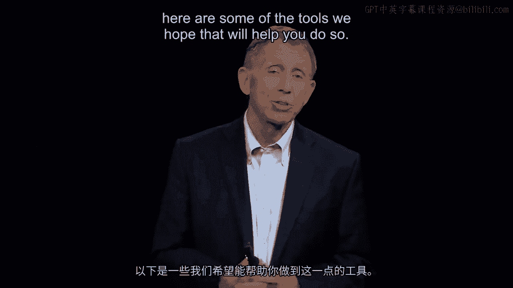

# 沃顿商学院《商务基础》｜Business Foundations Specialization｜（中英字幕） - P101：24_管理人员模板的人力资本和社会资本.zh_en - GPT中英字幕课程资源 - BV1R34y1c74c

And by way of summary， briefly just to put words in what you see there， going back to。

John Chambers' "Sisco" or a topic was making good and timely decisions， finding people。

around you to whom you can turn for offline trusted feedback。

You do need to think about where you want to go， let people below you well-picked， well-trained。

job design appropriately paid to work out the execution。

Breathing down their neck is going to undercut that， so convey intent with no micromanage。

But number three， think about that firefighting team that went into that fire setting in Montana。

They had never worked with each other before。 And there's an argument， I think it's right。

had they known each other， had they trusted， each other before they got there。

The number two person， named Robert Sally， would have more likely followed the huge management。

decision by the incident commander Wagner Dodge when he created a life-saving fire， what's。

called an escape fire now， but he couldn't manage people to get into that because they。

barely knew Wagner Dodge the bus。 And the fourth and final piece on making good and timely decisions。

which is think about， Charles Ilodgig and Ann Livermore。

more broadly big companies creating just a mindset of learning， to make good decisions。

making a first time mistake， making decisions good enough， but。

not making them necessarily perfect to use Ann Livermore's commentary there。

As we turn to architecture， the design， it's an independent force。

Good to think about how we reward people， good to think about how we promote， good to think。

about designs that animate or discourage people。 Separately， the way we put people together。

do we put them together in a division standalone， do we have people reporting。

call that a profit and loss design， or within a given division。

do we have all the functional specialists like the marketing people reporting up to the。

central VP for marketing， as by the way was largely the case there back at Howser Foods。

That might be the word that really captures this point。 To be a manager。

to be a general manager means we got to grab all these pieces。

That's the essence of this section of the course。 And they need to work together。

If they're pulling in different directions， we saw that actually at Howser Foods， we've。

got a problem。 With that problem of that kind solved though。

inequity is a kind of a haunting fact of the， human condition。 It's just there。

And as a way of saying， people， if it's pay， promotion， or anything else for performance。

if it looks like they're getting， somebody's getting promoted or paid or somehow treated。

better with a better office for performance， if they feel unfair and unfairness has been。

committed by you， the manager， got a problem here。 We need to solve it。 First point。

got to be aware of it， and then we got to be obviously very good at ensuring。

a very close tie between what we actually reward and what we want from people。 Finally。

we need to build a bigger scaffolding。 We've got a lot of people， more than 10 or 15 in many cases。

thousands， some companies， take Walmart 2。2 million。

We have to find ways of putting people together， organizing teams so that they work with other。

teams。 Having done that， critical to get that right， a whole scaffolding for doing that well， we。

then face just a lifelong problem of needing to change， to restructure from time to time。

how the design does work。 And for that， we've ended with the basic notion when you take a design as a manager that maybe。

you've been given， maybe you even helped create， to get people to go with you， a burning platform。

and going for their head and their heart， probably pretty important for your future。

So may you all manage and here are some of the tools。

We hope that will help you do so。 [BLANK_AUDIO]。

