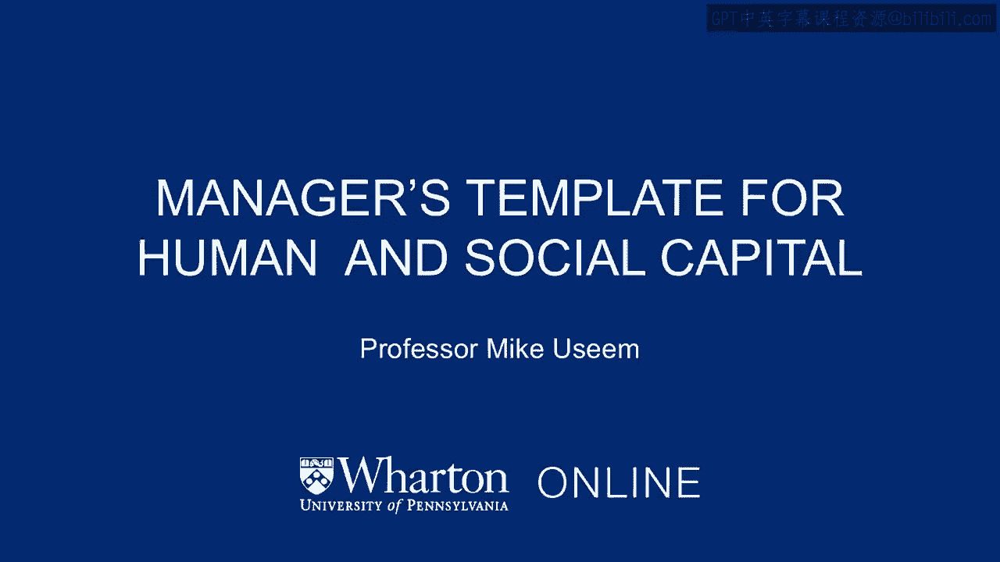
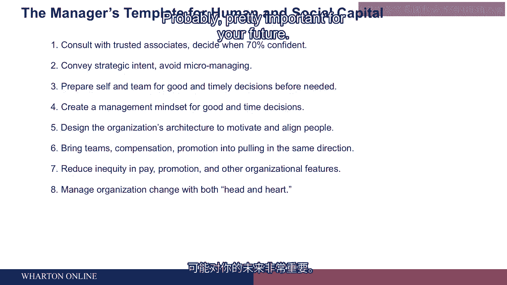
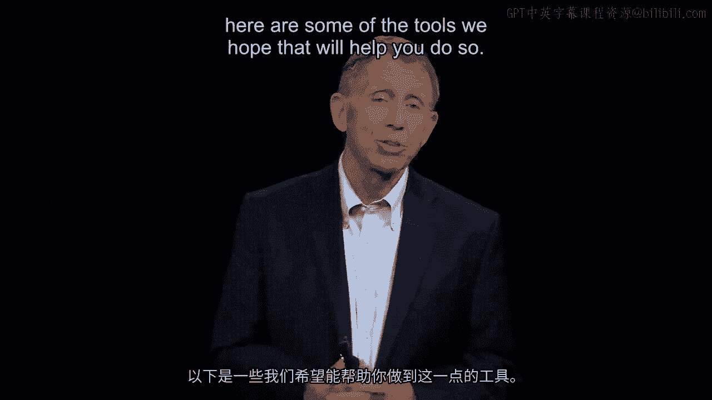
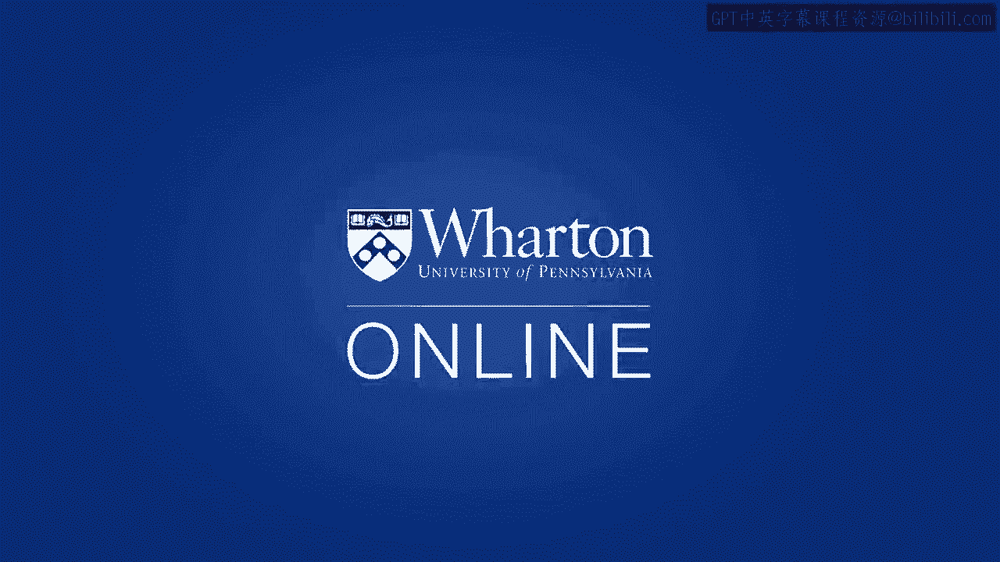

# 沃顿商学院《商务基础》课程 P101：管理人员模板的人力资本与社会资本 👨‍💼👥

在本节课中，我们将学习如何作为一名管理者，有效地整合人力资本与社会资本，以构建高效的组织架构并推动决策执行。我们将回顾核心的管理原则，并探讨如何通过设计组织架构、确保公平以及构建协作框架来应对管理挑战。

---

## 课程内容回顾与总结 📝

上一节我们探讨了管理中的关键要素，本节中我们将对这些要点进行总结，并整合成一套连贯的管理行动框架。

以下是核心管理要点的总结：

1.  **做出良好且及时的决策**：管理者需要具备决策能力，并寻找可以信赖的同事提供线下反馈。
2.  **明确方向并赋能团队**：你需要思考团队的目标，精心挑选、培训下属，设计合理的岗位与薪酬，让他们去执行。事无巨细的微观管理会破坏这一点，因此要传达意图而非过度干预。
3.  **建立事前信任**：以蒙大拿州灭火队为例，如果队员们在执行任务前就彼此认识并信任，副手罗伯特·萨利就更可能遵循指挥官瓦格纳·道奇那个拯救生命的“逃生火”决策。缺乏事先的了解和信任会阻碍关键指令的执行。
4.  **培养学习型决策心态**：参考查尔斯·伊洛迪吉和安·利弗莫尔的理念，大公司应营造一种学习氛围，鼓励做出足够好的决策，允许初次犯错，而不必强求每一次决策都完美无缺。

---

## 组织架构：一个独立的设计力量 🏗️

在明确了决策与团队管理原则后，我们需要一个载体来落实这些理念，这就是组织架构。好的架构设计本身就是一个强大的推动力。

我们需要思考以下几个方面：

*   **如何奖励与晋升员工**：激励体系的设计至关重要。
*   **如何设计能激发或抑制员工积极性的结构**：组织形态直接影响员工行为。
*   **如何组合人员**：是将他们置于独立的部门，还是采用损益单元的设计？在特定部门内，是让所有职能专家（如市场人员）向中央的职能副总裁汇报（正如豪瑟食品公司早期的主要情况），还是采用其他模式？

“整合”这个词或许最能概括本部分的精髓。成为一名管理者，尤其是一名总经理，意味着必须掌握并协调所有这些模块。这是本课程章节的核心。这些模块必须协同工作；如果它们各自为政，我们之前在豪瑟食品公司看到的问题就会重现。

---

## 应对公平性挑战 ⚖️

然而，即便解决了上述协作问题，不公平性仍是人类社会中一个挥之不去的现实。它始终存在。

这意味着，无论是在薪酬、晋升还是其他基于绩效的待遇方面，如果员工感觉有人因绩效而获得了更好的晋升、薪酬或待遇（如更好的办公室），并且他们认为这种不公平是由你——管理者——造成的，那么你就遇到了一个必须解决的问题。

解决这个问题需要三步：

1.  **必须意识到它的存在**：保持对公平问题的敏感度。
2.  **确保紧密关联**：必须非常擅长确保我们实际奖励的内容与我们对员工的期望高度一致。
3.  **构建更广泛的协作框架**：在拥有大量员工（许多情况下超过10-15人，有些公司如沃尔玛甚至达到220万人）时，我们必须找到方法将人们组织起来，组建团队，并让团队之间能够协同工作。

---

## 构建框架与拥抱变革 🔄

在成功构建了确保团队协作的良好框架之后，我们又将面临一个伴随终生的挑战：需要不时地进行变革与重组，调整组织设计以适应新情况。

为此，我们课程以一个基本观念作为结尾：当你作为一名管理者接手一个既定的架构，甚至是你参与创建的架构，并希望带领人们跟随你进行变革时，创造一个“燃烧的平台”（即紧迫的变革理由），并同时争取他们的理性认同与情感共鸣，对你的未来成功至关重要。

---

## 总结与寄语 ✨

本节课中，我们一起学习了如何整合人力资本与社会资本来进行有效管理。我们回顾了决策、信任和学习的核心，探讨了组织架构作为实施工具的重要性，并强调了解决公平问题和构建协作框架的必要性。最后，我们认识到变革是管理的常态，而成功的变革需要同时诉诸于理性和情感。

祝愿大家都能成为卓越的管理者。希望以上提供的这些工具能对你们有所帮助。