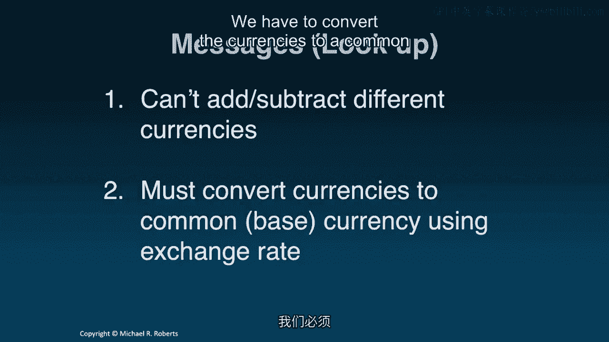

# 沃顿商学院《商务基础》｜第102课：直觉与贴现 💰

在本节课中，我们将学习公司金融的核心概念之一：货币的时间价值。我们将从直觉理解开始，介绍相关工具，并应用这些工具来解决金融问题。

---

## 直觉理解：货币的时间单位

上一节我们介绍了课程主题，本节中我们来看看如何直观理解货币的时间价值。

想象你拥有100欧元和100美元。问题是：“你拥有多少钱？”我们无法直接回答，因为不能将欧元与美元相加。我们需要将欧元兑换成美元，或将美元兑换成欧元，这需要使用汇率。即使涉及三种货币，也需要将其中两种兑换成一种基准货币，才能进行加总。

核心信息是：**不能直接对不同货币进行加减运算**。必须使用汇率将它们转换为统一的基准货币。

那么，这与货币的时间价值有何关系？

货币的时间价值指的是：**在不同时间点收到或支付的货币，就像不同的货币一样，不能直接相加**。货币具有时间单位。为了汇总不同时间点的货币，必须将它们转换到一个共同的时间基准单位，这就需要一种“时间汇率”。

---

## 核心工具：时间线与贴现因子

理解了基本概念后，我们需要一些工具来应用它。以下是两个核心工具。

### 时间线

时间线是一种视觉工具，用于标示不同的时间点。时间点0通常代表“今天”或“现在”。在时间线下，我们标出现金流（用 **CF** 表示），下标代表其发生的时间点。这能清晰展示资金流入或流出的时间。

养成在时间线上标注现金流的习惯非常重要。**永远不要将不同时间点的货币直接相加**。我反复强调这一点，因为即使是金融从业者也常犯这个错误，但这绝不是一个好习惯。

### 贴现因子

为了将货币转换到统一的时间单位，我们需要“时间汇率”，即贴现因子。

贴现因子的公式是：
`(1 + r)^t`

其中：
*   **t** 代表时间期数。如果 t > 0，表示未来；如果 t < 0，表示过去。
*   **r** 是一个关键参数，它代表“资本市场上具有同等风险的投资所能提供的回报率”。它也被称为贴现率、门槛率或资本机会成本。理解 **r** 的关键是：**评估你将要贴现的现金流的风险程度，并思考这与资本市场上的何种投资风险相匹配**。

风险与回报的关系是：**风险越高的投资，通常要求或提供的回报率也越高**。

---

## 应用工具：贴现计算

掌握了工具后，我们来看看如何应用。首先，我们学习如何将未来的现金流“带回”到现在，这个过程称为**贴现**。

假设我们有一条时间线，上面有未来多个时间点的现金流。为了将它们全部转换到“今天”（时间点0）的单位，我们需要对每一笔现金流应用贴现因子。

要将第1期的现金流移回第0期，我们将其乘以 `(1 + r)^(-1)`。同理，对第2、3、4期的现金流，分别乘以 `(1 + r)^(-2)`、`(1 + r)^(-3)`、`(1 + r)^(-4)`。注意指数均为负数，因为我们是向过去移动。

完成贴现后，所有这些数值都处于相同的时间单位（即第0期），此时我们就可以将它们相加了。

这些未来现金流在今天的价值，被称为**现值**。现值表示的是未来现金流在某个更早时间点（这里是第0期）的价值。

---

## 实例演练

让我们通过一个例子来巩固所学知识。

**问题**：如果你想在未来四年每年年末提取100美元，且你的投资年回报率为5%，那么今天你需要存入多少钱？

**第一步**：将现金流标注在时间线上。
*   时间点0：需要求出的初始存款额（记为 **PV**）。
*   时间点1、2、3、4：每年年末提取的100美元。

**第二步**：认识到不能直接将4个100美元相加（共400美元），因为它们处于不同的时间点。

**第三步**：使用贴现因子（r = 5%）将每笔100美元的现金流贴现到今天（第0期）。

计算过程如下：
*   第1年100美元的现值：`100 / (1 + 0.05)^1 ≈ 95.24`
*   第2年100美元的现值：`100 / (1 + 0.05)^2 ≈ 90.70`
*   第3年100美元的现值：`100 / (1 + 0.05)^3 ≈ 86.38`
*   第4年100美元的现值：`100 / (1 + 0.05)^4 ≈ 82.27`

**第四步**：将四个现值相加，因为它们现在都处于“今天”的单位。
`95.24 + 90.70 + 86.38 + 82.27 ≈ 354.60`

**结论**：今天需要在账户中存入 **$354.60**，并以每年5%的利率增长，才能在未来四年每年年末提取100美元。

这个问题还有另外两种等价表述，有助于理解现值的含义：
1.  在5%的贴现率下，未来四年每年年末收到100美元的**现值**是354.60美元。
2.  一份承诺在未来四年每年年末支付100美元的合约，在5%的贴现率下，其**今天的价格**是354.60美元。

> **注意**：本例中我们假设贴现率 **r** 在各期保持不变（均为5%）。这是一个常用假设，但本身也是一个假设。我们将在后续讨论利率期限结构和收益率曲线时再深入探讨。

---

## 动态过程解读

为了更直观地理解，我们看看这354.60美元在账户中是如何动态变化的：
*   **第0年**：存入354.60美元。
*   **第1年末**：获得5%的利息（17.73美元），账户余额变为372.33美元。此时提取100美元，剩余272.33美元。
*   **第2年末**：272.33美元再获5%利息（13.62美元），余额变为285.95美元。提取100美元，剩余185.95美元。
*   **第3、4年末**：重复此过程。到第4年末提取最后一笔100美元后，账户余额恰好为0。

这个过程验证了我们的计算：初始的354.60美元现值，正好足以支撑未来的提款计划。

---

## 课程总结 📝

本节课中我们一起学习了货币时间价值的基础：

1.  **核心原则**：永远不要直接对不同时间点的现金流进行加减运算。货币具有时间单位。
2.  **解决方法**：使用“时间汇率”——**贴现因子** `(1 + r)^t`，将不同时间点的货币转换到统一的基准时间单位。
3.  **实用工具**：养成使用**时间线**来直观展示现金流时序的习惯。
4.  **关键概念**：**现值**代表了未来现金流在更早时间点的价值，也可以理解为获得这些未来现金流的权利在今天的价格。

在下一讲中，我们将学习相反的过程：将现金流向前推移，即**复利**计算。

感谢聆听，我们下节课再见。