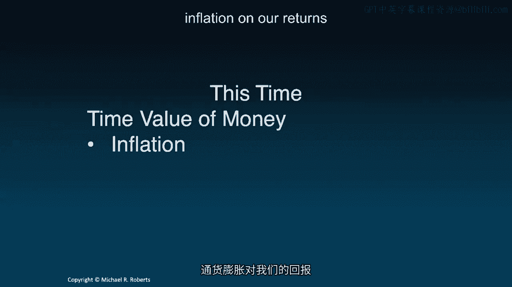
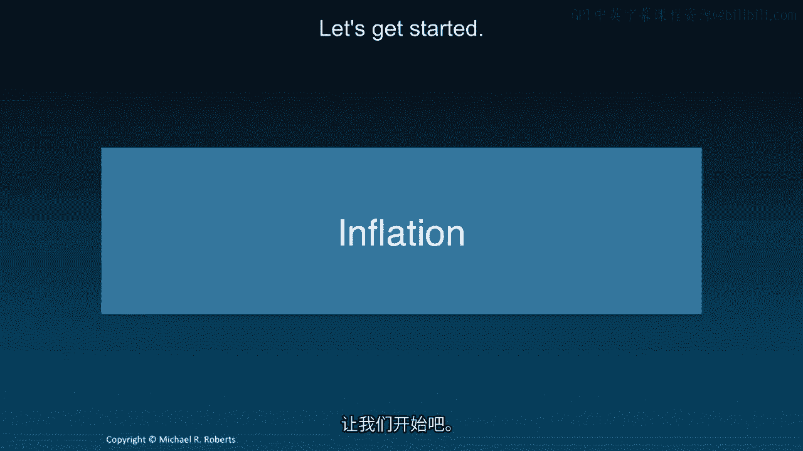
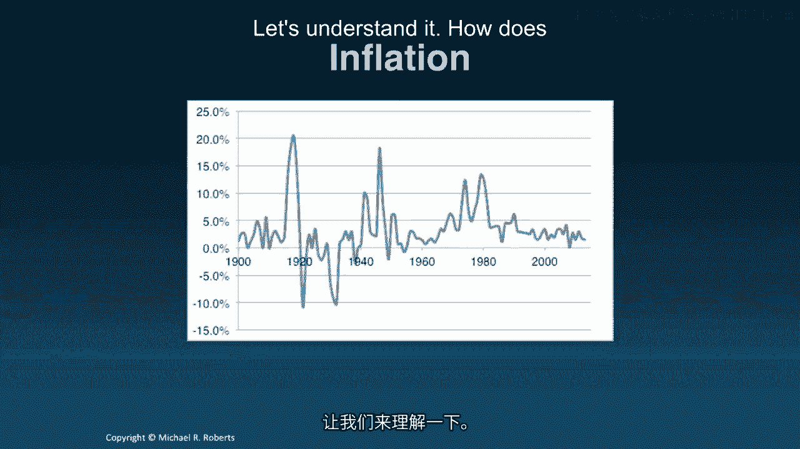
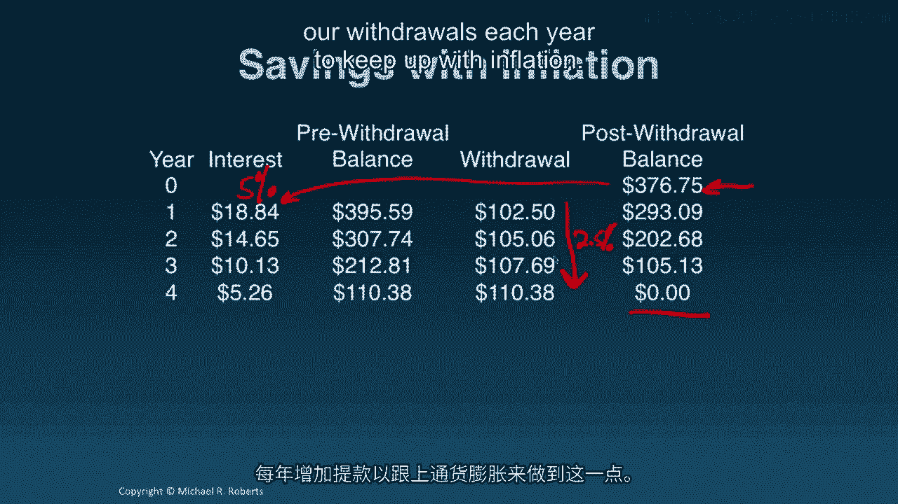
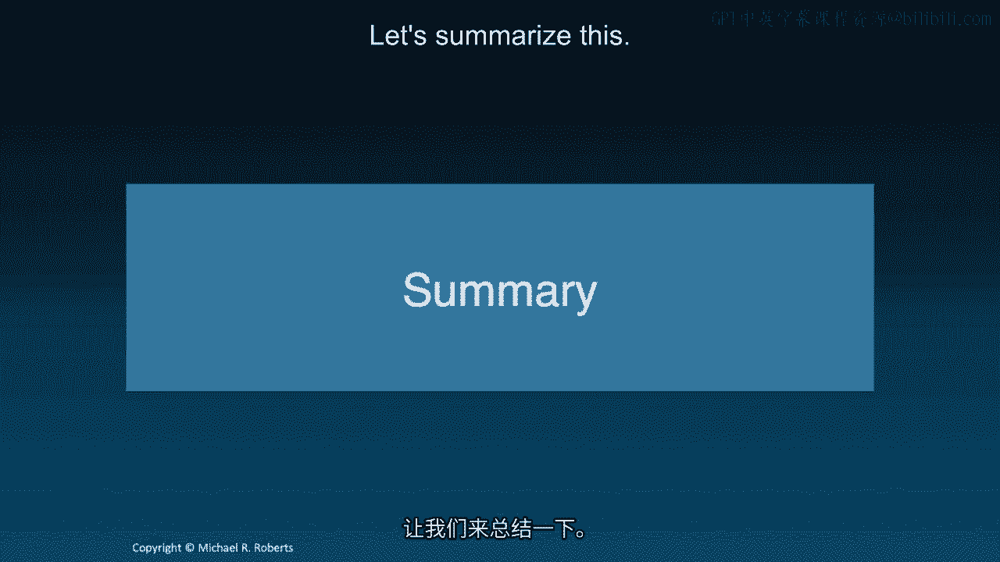

# 沃顿商学院《商务基础》｜Business Foundations Specialization｜（中英字幕） - P106：4_通货膨胀.zh_en - GPT中英字幕课程资源 - BV1R34y1c74c

Welcome back to Corporate Finance。 Last time we talked about taxes and their。

impact on our dollar returns。 This time I want to talk about inflation and its。

impact on our real returns or consumption。 Let's get started。 Hey。

everybody welcome back to Corporate Finance。 So last time we introduced taxes。

and we explored the impact of taxes on our cost of capital or discount rate。

and our dollar investment returns。 What I want to do today is I want to think。

about the impact of inflation on our returns and ultimately on our decision。

making。 So let's get started。 And I want to start with a picture as I did with。

taxes to illustrate the importance of inflation。 This picture shows over the。

last approximately 110 years inflation in the United States。 And what you can see。

is a couple things。 First of all over the recent period inflation has been， relatively low。

But if you go back beyond say the last 30 years you can see。

periods of really high inflation including deflation。 And so what I want。

to emphasize is that while inflation doesn't seem particularly important， these days it can be。

And if we move outside of the US and some Western。

European countries inflation becomes incredibly important。 So let's understand， it。

How does inflation impact our returns in particular？ All right so let's。

revisit the example we've done over the last few lectures。 This example just to。

refresh your memory was you know how much do we have to deposit or save。

today in an account earning 5% if we want to withdraw $100 every year over the， next four years。

And the answer to that question was $354。60。 We deposit $354。60。 That earns interest at 5%。

That increases our balance。 We withdraw the money。 That。

reduces our balance and we continue over the next three years。 Until we drive the。

account balance down to zero。 Exactly。 Now the first lesson is inflation is not。

going to affect the money we earn。 It doesn't affect the interest over here。

We're still going to earn 5% every year a nominal rate of return。 What。

inflation is going to do is it's going to affect what we can buy with the money， we're pulling out。

It's going to affect the value of that money。 And so we'd like a。

way to quantify and understand the impact of inflation on that value。 So I'm。

going to introduce the concept of a real discount rate。 I'm going to denote it by， R。R。

And one plus the real discount rate equals one plus the nominal， discount rate。 Plus， I'm sorry。

divided by one plus the expected rate of， inflation which I've denoted by pi。

And a commonly used approximation that you'll， see though I'll emphasize this is an approximation is that the real rate。

equals the nominal rate minus the expected rate of inflation。 So in our， example we might have。

our discount rate was 5% and if expected， inflation is 2。

5% which is approximately what it's been over the recent history， in the US。

We get a real rate of return on our investment of 2。44%， substantially lower。

Now that's important because even though the， inflation is not impacting our account balance。

how much money any dollars we， have， it is impact， it is impacting what we can do with that money。

what we can， buy with it。 And that's ultimately what we care about it。 So let's try discounting。

our cash flows now by the real rate of return R。R which we just showed was， equal to 2。44% right。

And the discounting proceeds mechanically in the exact same， way as it was before。

Only now I'm using the real rate instead of the nominal， rate。

And if we do a little bit of arithmetic， we get the present values。

of all of these future cash flows。 We add them up and we get a value of， 376。75。

That's the present value of the sum of all these cash flows。 Now。

taxes affect dollars but inflation does not affect dollars， it affects consumption。

So each nom or the we earn a nominal return but we can't buy as much with it。

Let me illustrate this。 So let's insert here into our savings account the， 376。

75 that we just computed using the real discount rate。 And see what happens。

when we're withdrawing $100 every year？ Well that money is going to earn interest， at 5% every year。

We pull out $100 and what's going to happen is we're going to be， left with this surplus。

But that makes sense right because inflation doesn't， affect the dollars。

it affects what we can do with these things that we pull out。

See we have extra money here so what we really want to do to address inflation is we want to。

increase how much we pull out every year。 I don't want to pull out just $100 each year because prices。

are going up so that $100 say here in year two can't buy as much food or housing or clothes or。

whatever we need to buy。 So let's think about what kind of cash flow stream we might want。

to address inflation。 And one way to do that is to simply solve for the cash flows that we want to withdraw each year。

given a nominal discount rate are of 5%。 What is CF？ Well we can solve this。

This is just elementary algebra right？ And we want to use the nominal rate here since that's reflecting the dollars that we're earning。

So solving this for CF or cash flow we get 106。25 which is greater than the 100。 That makes sense。

We're putting in more money at the beginning right？ Remember originally I think we were putting in。

354。60 if I remember correctly。 So that we put in more which means we can take out more than we。

used to take out。 And let's see what happens now。 So we put in the 376。75 now we're going to。

withdraw 106。25 each year and we see that we're going to drive the account balance exactly to zero。

with nothing left over。 But ideally we want our withdrawals to increase each year to accommodate。

inflation right？ I want these withdrawals to go up every year to account for the increase in prices。

of the goods that I'm going to purchase， goods and services that I'm going to purchase with that money。

So let's think about this。 Well if prices are going up at 2。5% per year that means what I could buy。

with a hundred dollars today I'm going to need a hundred and two dollars and fifty cents next year。

because prices went up by 2。5%。 They're going to go up by 2。5% again so I'll need a little bit more。

and a little bit more and a little bit more each year。 See what this sequence of withdrawals。

maintains our purchasing power。 We'll be able to buy the same amount of food， the same amount of。

housing， go on the same vacations assuming the prices are all going up by 2。5% the expected rate of。

inflation。 Now these are all nominal。 These are all nominal values corresponding to the real。

one hundred dollars of purchasing power。 And so if we take the present value of these nominal。

dollars at the nominal discount rate we get the 376。75。

We discount nominal cash flows by the nominal， rate。

Keep that in mind it's important to emphasize that。 The present value of nominal cash flows。

at the nominal discount rate that's going to equal the present value of the real cash flows。

at the real rate。 Remember that when we were withdrawing a hundred dollars each year but we。

discounted these at the real rate of return which I think was 2。44% we got 376。75。

And all that's going， on is that the inflation term and the numerator and denominator of the real computation is they're。

canceling one another。 Okay so let's go back to our savings account。 We insert the 376。75。

We're now going to withdraw money that's growing at a rate of 2。

5% per year to keep up with inflation。 But our money in the account is earning the nominal rate of return of 5%。

And what happens is we， exactly exhaust our funds at the end of four years。

And we've been able to do so by increase our， withdrawals each year to keep up with inflation。

So let's summarize this。 Inflation does not affect。

dollar returns。 It's not affecting the money in the bank account or the rate at which it's growing。

What it's affecting is the purchasing power of that money。

So when I pull it out and go buy something， I can buy less of that good or that service with that same dollar year after year after year when。

we face inflation。 So we introduce the idea of a real rate of return that takes into account the。

effects of inflation。 Next time we're going to turn to a new topic interest rates。

And we're going to， build on what we've already learned to understand how to discount and value cash flow streams that。

don't happen every year that are irregular in their timing。 And how to deal with different。

compounding periods as opposed to annual compounding which is what we've implicitly been doing all。

along thus far。 So I look forward to seeing you next time。 Thanks。
