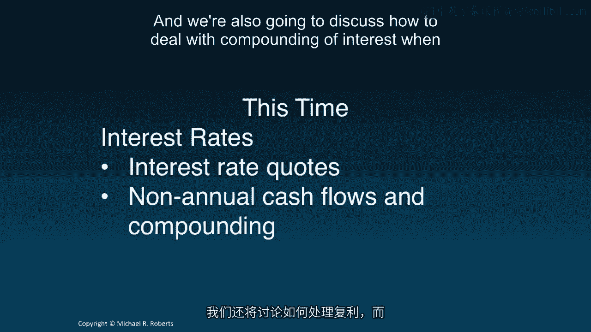
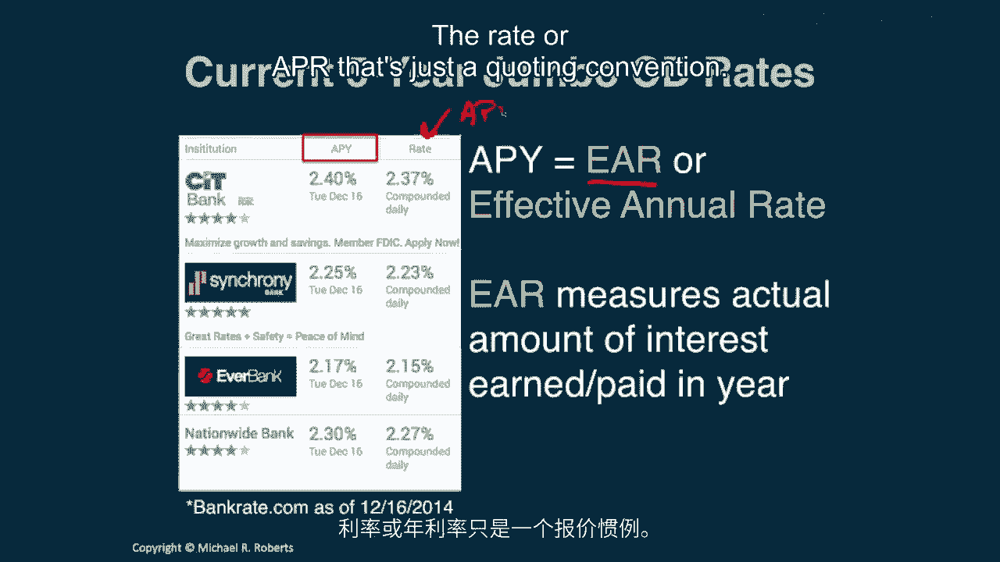
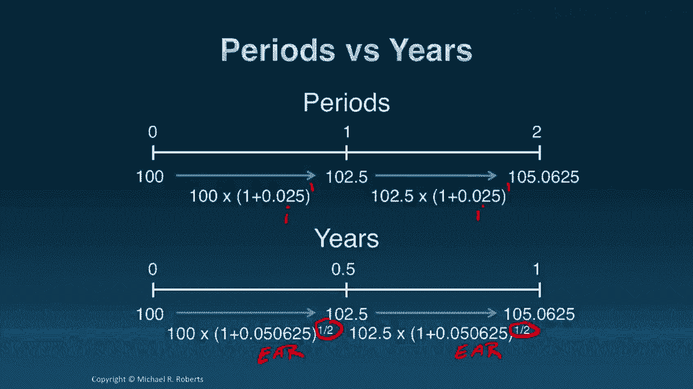
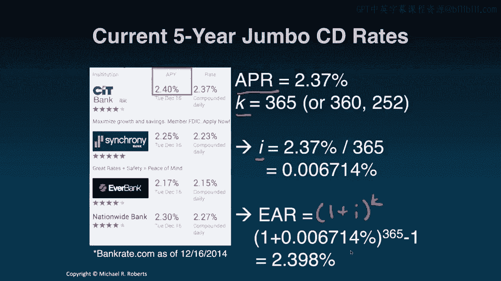
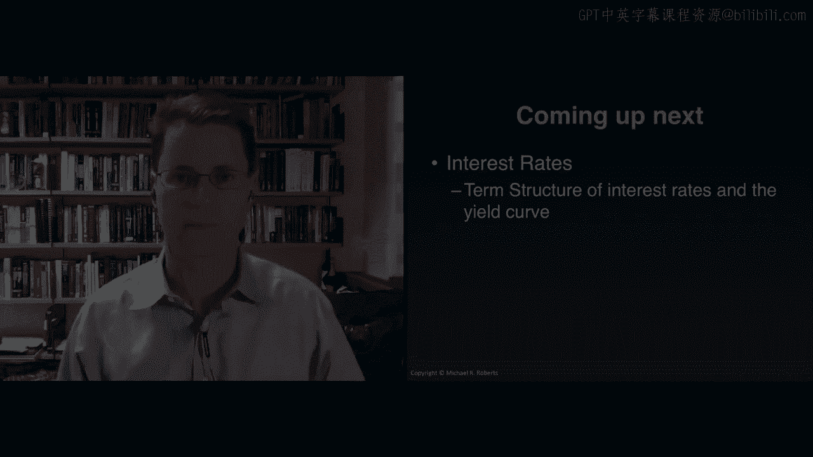

# 沃顿商学院《商务基础》｜Business Foundations Specialization｜（中英字幕） - P107：5_APR 和 EAR.zh_en - GPT中英字幕课程资源 - BV1R34y1c74c

Welcome back to Corporate Finance。 Today we're going to turn to a new topic。

interest rates， but before doing so， I want to briefly review our last topic。

the time value of money。 As you'll recall， we started off with some intuition， then。

we introduced the tools associated with the time value of money， namely the。

discount factor and the timeline。 Then we applied those tools to move money。

back in time via discounting and forward in time via compounding。 We。

discussed some useful shortcuts to compute the present value in the future。

value of cash flow streams that we commonly come across in practice， streams。

like an annuity and a perpetuity。 And then we closed out the topic by talking。

about taxes and inflation and their impact on our dollar returns and our。

ability to consume goods and services。 In this topic， interest rates， I want to。

start off by talking about interest rate quoting conventions and I want to talk。

about how to compute the present value and future value of streams of cash。

flows when they arrive at irregular times， non-annual， and when the compounding is。

non-annual as well。 So let's get started。 Hi everyone， welcome back to Corporate， Finance。

Today we're going to be turning to a new topic， interest rates， but before， doing so。

I want to briefly review our first topic， time value of money。 So we。

started off that topic by introducing the concept with some intuition。 What we did。

is we showed that cash or money received or paid at different points in time， has。

a different time unit and as such can't be added， much like different currencies， can't be added。

Then we introduced the tools associated with the time value of， money。

namely a timeline which is just a visual representation of when money is。

coming or going and a discount factor which is our exchange rate for time。 It's。

what we used to move cash flows forward and backward in time。 And we use those。

tools to discount cash flows that has moved them back in time and compound cash。

flows or move them forward in time。 We introduced some useful shortcuts， namely。

the present value of an annuity formula and the present value of a perpetuity， formula。

as well as formulas for the present value of a growing annuity and a， growing perpetuity。

Then we closed off the topic with a discussion of taxes and。

inflation and investigated how those those two concepts would impact both。

our dollar return and the purchasing power of those dollars。 Now I want to turn。

to interest rates in this lecture and this isn't so much a new topic as much as it。

is really an extension of the time value of money to incorporate institutional。

details and make things a little bit more realistic。 So we're going to talk about。

interest rate quotes and we're going to learn how to deal with cash flows that。

don't arrive once a year but may maybe arrive monthly or semiannually。 And we're。

also going to discuss how to deal with compounding of interest when it's not。

just annual。 So let's get started。 So here's a snapshot from December of 2014 of。

rates on five-year Jumbo CDs where CD is just stands for certificate of deposit。

It's a savings vehicle that most banks offer and here's one， two， three， four， banks。

Now the Jumbo that just refers to I think a minimum deposit of a hundred， thousand dollars。

So these are big deposits。 And one of the things you notice when。

looking at these rates is when you're when you're looking at these savings。

vehicles is that each one has two different rates。 It has a rate and an APY， and these numbers 2。37。

2。4， they're different。 So that begs the question is， why are they different？ How are they related？

And most importantly which one， is going to tell me how much money I'm going to make when I invest in this。

product。 Well let's go through this starting with the rate。 The rate refers to。

the APR the annual percentage rate。 That measures the amount of simple interest， earned in a year。

Simple interest is just the interest earned without， compounding， ignoring compounding。

And if you're wondering what compounding is， we're going to talk about it but just as a preview notice underneath the rate。

we have compounded daily。 Simple interest ignores that compounding frequency。 Now。

many banks quote interest rates in terms of an APR。 The problem is the APR is。

typically not what we're going to earn or what we're going to pay。 For that we。

have to turn to the APY or the annual percentage yield which is really just。

another way of saying EAR or effective annual rate。 See the EAR that measures。

the actual amount of interest earned or paid in a year。 That's what we care， about。

The EAR that's the number we care about。 The rate or the rate or the APR。

that's just a quoting convention。 Now how are these different rates related？ Well。

before showing you the explicit mathematics which frankly are almost。

trivial let me emphasize the following。 The EAR is a discount rate。 The EAR is what。

matters for computing interest and discounting cash flows。 The APR is not a， discount rate。

It's a means to an end。 It's a quoting convention。 We're going to use。

APR in conjunction with compounding frequency information to get at an EAR。

or at a periodic discount rate which I'll introduce in just a moment。 So。

remember EAR equals discount rate。 APR equals quote。 Now how do we get from one， to the other？

How do we move from APR to EAR or vice versa？ Well here's that simple。

mathematical formula I referred to just a moment ago。 The EAR is related to the。

APR by this equality。 Well what's going on here？ K that's just the number of。

compounding periods per year。 So imagine we had monthly compounding。 That would， imply K of 12。

How about semi-annual？ That would imply K of 2。 And I'm going to。

introduce a little bit of notation here。 I is the periodic interest rate or the。

periodic discount rate and that equals APR over K。 Let's do an example。 So。

imagine we're investing $100 in a CD offering 5% APR with semi-annual， compounding。

How much money will we have in one year？ Well there's actually two。

ways to approach this problem and we're going to do each in term。 The first thing， we do。

first thing we always do is we draw a timeline and so today period zero。

we're going to invest $100 and the question is asking how much money are we。

going to have in one year？ Now I've left this as a question mark to emphasize the。

fact that there are two ways to go about this。 Let's go about this the first way。

Go about answering this problem。 The first is to work in periods。 With semi-annual。

compounding that means there are two periods per year since I'm interested in。

how much money I have after one year that's after two periods。 And these。

periods are every six months period one， period two。 So if I'm going to work in。

periods I better compute a periodic discount rate。 That's I which we know is。

APR over K in which in this case reduces to 2。5%。 In other words I'm going to earn。

two and a half percent over the first six months and I'm going to earn two and。

a half percent over the next six months。 So I take my initial $100。

investment I multiply it by my periodic discount rate and after one period I've， got $102。

50 then I repeat I take that $102。50 I multiply it by my periodic， discount rate to get $105。

00 and a little over 6 cents。 In other words the future。

value two periods hence of $100 in this setting is just 100 times 1 plus I， raised to the power 2。

We're working in periods so I is our discount rate and 2。

is the number of periods we're moving the money forward in time。 Now let's。

approach the problem from the perspective of years。 Now we're looking for how much。

money we have after one year but if we're going to work in years okay now we need。

to be consistent so after six months this isn't one period this is half a year and。

because we're working in years our discount rate isn't going to be the。

periodic interest rate I it's going to be the ER the equivalent or the。

effective annual rate excuse me which we know from earlier is just one plus the。

periodic rate raised to the number of compounding periods per year so one plus。

I to the K which in this setting comes out to 5。0625 percent。 In other words over。

this entire period I'm going to earn 5。0625 percent which turns out to equal， $105。

06 a little over 6 cents that is the future value one period one year。

excuse me one year from now of a hundred dollars is a hundred dollars times one。

plus the EAR raised to the power one we're working in years which gives me the。

exact same answer we got before the one hundred five dollars and six then a。

quarter cents so the lesson if you discount cash flows using the EAR then。

you better measure time in years if you discount cash flows using the periodic。

interest rate then you better measure time in periods and the equality between the。

two that we just showed with our simple example is much more general and given。

by this straightforward proof which I'm not going to discuss in detail but I'll。

show you there if you're interested in looking at it so just to summarize we can。

work in periods right one two with a periodic interest rate or we can work in。

years with our effective annual rate and notice I measure everything。

consistently periods versus years so let's go back to our original example。

excuse me we had an APR of 2。37 percent we have a compounding frequency daily。

which I'm going to assume 365 days though you should be aware it could be 360 days。

or it could be 252 business days it depends upon the convention used for that。

product by that institution so this these two pieces of information the APR and K。

allow me to compute the periodic rate I which is 0。006741 percent now that's a。

tiny number but we're computing interest every single day here which means the。

effective annual rate which equals 1 plus i to the K or which in this case is 1， plus 0。

006714 percent raised to 365th power gets me to just under 2。4 percent， so when we round the 2。

398 we get about 2。4 percent。

all right so let's summarize we learned that there are two discount rates depending。

on what units of time we want to work with if we want to think in terms of。

periods we want to use a periodic discount rate that's I if we want to。

work in years we want to use the ER the effective annual rate which relies on。

cash flows measured in years both of these are discount rates they'll both get。

us to the same goal or the same end result but we have to be consistent in。

terms of how we measure time with which discount rate we use APR that's a。

quoting convention that's a means to an end we use APR in conjunction with the。

compounding frequency to get our discount rate whether it's the ER or the。

periodic interest rate or the periodic discount rate high and we can move。

between the APR and I and the ER by a couple of very simple mathematical。

relations that we discussed now next are a bunch of great problems that I want you。

to dive into and then after you're done with those move on to the second part of。

interest rates in which we're going to investigate the term structure of。

interest rates and talk about the yield curve let you know what these things， mean thanks so much。

