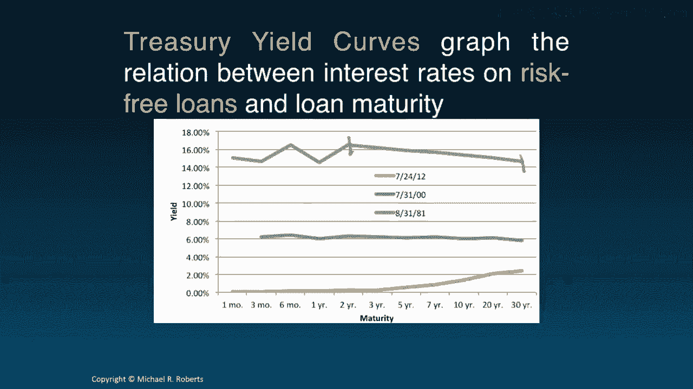
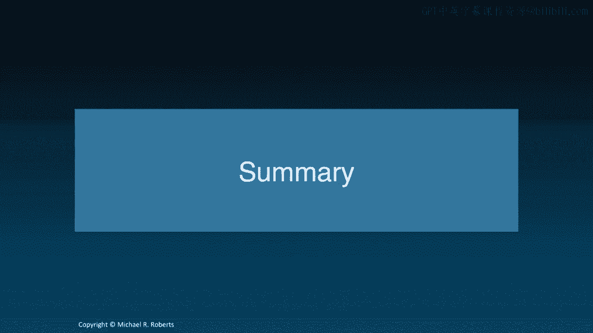

# 沃顿商学院《商务基础》｜Business Foundations Specialization｜（中英字幕） - P108：6_期限结构.zh_en - GPT中英字幕课程资源 - BV1R34y1c74c

Welcome back to Corporate Finance。 Last time we talked about interest rates。 In。

particular， we talked about how interest rates are quoted versus how。

interest rates are used to discount cash flows。 We also talked about how to。

deal with cash flow streams when the cash flows arrived more than once a year。

or less frequently than once a year and when the compounding frequency wasn't， annual。

This time I want to talk about how interest rates or discount rates。

can vary over time and how that relationship is captured via a term。

structure of interest rates and yield curve。 Let's get started。 Hi everybody。

welcome back to Corporate Finance and our second lecture on interest rates。 So。

last time we introduced the topic by talking about interest rate quotes versus。

discount rates and we talked about an APR annual percentage rate which was a。

means of quoting interest rates that financial institutions often use and。

that's often distinct from what we care about for discounting cash flows which is。

an EAR effective annual rate or a periodic discount rate and we talked about how。

to move between these concepts or these constructs and then we showed how to。

apply them to non-annual cash flows and in situations where we have non-annual， compounding。

Say monthly， semi-annual， whatever you might have。 Today I want to。

talk about the term structure of interest rates and the yield curve and this。

lecture is a little bit different in that it's not geared towards solving。

problems per se at least not directly because that's going to take us into a。

fixed income valuation which is beyond the scope of this course。 Rather what it's。

going to do is it's going to be important to understand what these concepts are。

because they're going to be used for corporate decision making later on。 So， let's get started。

All right， thus far we've assumed discount rates are constant。

through time they just don't change and what do I mean by that？ Well if I look at。

my present value formula right I take my cash flows and I discount them by one。

plus the discount rate but notice that's the same discount rate it's the same。

number for every cash flow regardless of when the cash flow arrives。 Now in reality。

it seems as if interest rates vary with the term of the investment。 Let me give you， some examples。

Here's a screenshot of home mortgage refinancing rates that I。

took not too long ago and you can see that as the term of the mortgage。

refinancing varies so too does the rate or APR and consequently so does the EAR。 The discount rate。

Likewise when I looked at fixed term CD rates where I remember。

CDs or just certificates of deposits their rates tend to vary with the term of。

the investment as well and there's a lot of numbers here so let me focus your， attention here。

Here we have the term of the investment and here we have the APR。

and the EAR and you can see that as the term increases or changes so too do the， interest rate。

Now what's the point here？ Well as the term of the investment。

changes quite often but not always quite often the interest rate will change and。

the term structure is nothing more than the relation between the investment。

term and the interest rate。 The yield curve is just a graph of that relation so。

let me show you a treasury yield curve from July 24th 2014 on the horizontal。

axis we have the maturity of the treasury security so the here here's a one month。

T-bill right here's a 30 year T bond here's a five year T note so these are just。

different treasury securities that vary by maturity across the horizontal axis and。

on the y-axis is the yield which for the time being and in this context you can。

think of loosely as the discount rate R and the point is is that as the maturity。

of the security varies so too does the discount rate right in other words when。

the when the government borrows for 30 years it's getting and or paying an。

interest rate just above 3% whereas when it's borrowing over a。

short horizon say 30 days it's paying basically zero now let me come back to。

this notion of a yield and what a yield is a yield y is the one discount rate。

that when applied to the promised cash flows of the security recovered the。

price of the security and that is a mouthful so let me actually show you a。

little formula that you're familiar with to hopefully clarify this see I take。

the price of the security on the last slide the price of the T-bill the price。

of the T bond and I lay out all of the promised cash flows to the security I。

discount them back and I ask what is the discount rate such that when I discount。

these cash flows I get the price that is the yield or yield to maturity so to。

build the yield curve that's just a matter of simply computing the yield for。

securities of different maturities and so without getting into the institutional。

details and the semi-annual compounding and quoting conventions associated with。

treasuries let me just let me just talk conceptually so if I want the one year。

the one year yield I would just take this say cash flow at year one divide by one。

plus y one set it equal to the current price and solve for y if I want the。

second healed I would take the second which the second security with maybe。

annual cash flows of one and you know CF one and CF two and I would solve for the。

one discount rate y two let's call it such that when I discount these cash flows。

CF one and CF two I get the price P2 and we do that for all different。

maturities and the why is that come out Y1 Y2 Y3 dot dot dot dot all the way down。

to Yt that represents the yield curve those are the points on the yield curve。

but that's the same as computing the discount rate for securities with。

different maturities hence the link between discount rates and yields now。

there is a difference between discount rates and yields having to do with。

promise versus expected cash flows but that's a little bit outside the scope of。

the course so let's leave that aside for now and in the context of treasuries yields。

and expected returns are relatively close now one thing I want to emphasize is。

that yield curves in other words interest rates they move around a lot or at least。

they can and so to illustrate that fact I've plotted three yield curves here the。

purple one is from 2012 the blue one is from 2000 and the red one is from 1981。

and you can see that the rate at which the government was borrowing has very。

dramatically over time right today for short-term loans they're not paying any。

interest the interest rates basically zero back in 1981 the interest rate was。

around 15 percent the other thing I want to point out is that the the。

relationship between the short end of the yield curve short-term interest rate and。

long end of the yield curve long-term interest rates that can vary over time。

as well here at least in 2012 we see that the curve is upward sloping so that。

interest rates short-term loans to the government are less costly than long-term。

loans whereas back in 1981 we see that long-term interest rates were actually。

below shorter-term interest rates at least over a stretch here so it was it was。

cheaper for the government to borrow at longer rates or over longer terms at least。

at a lower interest rate now this raises the question well what does this mean。

what does the what does the upward sloping curve in 2012 mean as opposed to the。

downward sloping curve in 1981 well there's a lot of academic debate about。

that but one popular opinion is that the slope reflects expectations of future。

interest rates so when the yield curve is upward sloping as it is in 2012 this。

suggests that future interest rates are likely to be higher whereas back in 1981。

this downward sloping portion also actually in 2000 it looks slightly。

downward sloping as well the downward sloping curve suggests that future。

interest rates are gonna be lower treasury yield curves what they're doing is。

they're graphing the relationship between interest rates on on risk-free loans and。

loan maturity so that they have a very special meaning when we talk about the。

risk-free rate we're really talking about the interest rate or the yield on。

treasuries but we can plot yield curves for a host of different securities and。

that's what I've done on this next slide is I've got three different yield curves。

the blue curve is the yield curve for high quality corporate debt so you can。

see that for what do I mean by high quality that's investment grade think。

triple B or higher so when high quality or highly credit rated firms were。

borrowing for say 29 years it's costing them about 5% per annum at least as of。

July 2014 whereas on the when they're borrowing short term say two years it's。

a little over a percent the green curve is the yield curve from。

municipal bonds triple a rated municipal bonds as of July 2014 and then the red。

curve is the treasury curve and what's sort of interesting to note is that the。

yields or the cost of borrowing was higher appears to be higher for the。

federal government over at least certain periods than it was for municipalities。

which is strange if you think that our federal government is is a much safer。

bet than a municipality even a triple a rated municipality but what's going on。

there is mostly a tax differential as well as some liquidity issues all right so。

what's the lesson here well look yields vary by maturity and risk so to。

illustrate that point I'm gonna look at corporate bond the yields on corporate。

bonds and you can see as the ratings credit rating improves from triple B to。

triple A which is the best rating the yield goes down and I know drawing the。

up arrow isn't helping but but the numbers are getting smaller and they're。

getting smaller within each maturity bucket one to two two to five five to ten。

ten plus and that's a result of decreasing or credit risk right these are。

these are safer bond these are safe these are less safe but still relatively safe。

the other thing to notice is that within a credit rating say triple A the。

yields or the interest rates are different now in this case they're。

increasing but as we showed a few slides ago right they don't always have to be。

increasing with maturity they could be decreasing the point is that they're。

different across the maturity spectrum now all of these interest rates that we've。

discussed as far referred to as spot rates what are spot rates they're the。

interest rate for a loan that's made today now typically there's a different。

spot rate for loans of different maturities and different risks that's what。

we showed right here these are spot rates they vary by credit risk and they vary。

by maturity now what's one of the big punchlines or takeaways from all of this。

aside from just general knowledge and information understanding interest。

rates well this present value formula that we've been working with is in many。

ways just an approximation because we know interest rates vary over time so。

it's really an approximation for this now it's not such a bad approximation when。

the yield curve is flat so when we have a yield curve here's maturity here's。

yield when the yield curve is flat r1 r2 r3 are the same so these two things。

would be equal the problem let's see if I can erase some stuff here the problem。

is when the yield curve is say upward sloping severely or even downward。

sloping now there's going to be a pretty big difference from using some sort of。

average discount rate r as a proxy for all of the different spot rates okay so。

let's wrap up here what did we talk about today we talked about the term。

structure of interest rate which captures the relation between interest。

rates and the investment term right loans or savings of different。

maturities different terms will often have different interest rates and that。

relation is captured by the term structure the yield curve simply graphs。

the term structure right it plots on the horizontal axis the maturity on the。

vertical axis the yield or the interest rate and that shows us the relationship。

between investment term and interest rate we also learned that in the interest。

rates will vary by the risk of the investment though we discussed that。

earlier on back in our I think our first lecture and we talked about spot rates。

which are the interest rates for a loan that's made today so what's up next we。

turn to a new topic discounted cash flow I look forward to seeing you then thanks， a lot。
