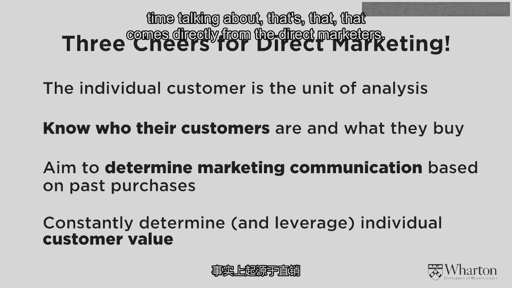
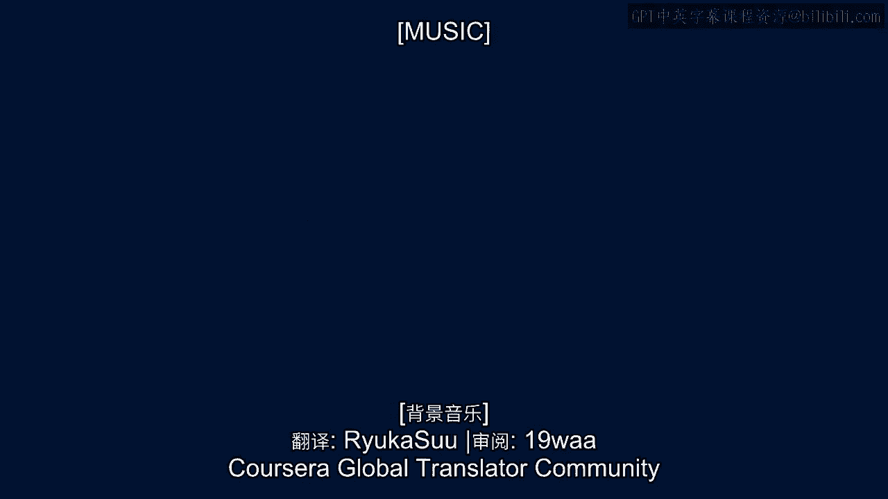

# 沃顿商学院《商务基础》｜Business Foundations Specialization｜（中英字幕） - P11：10_为直销喝彩.zh_en - GPT中英字幕课程资源 - BV1R34y1c74c

So while the Harris and Tesco stories are terrific， and we'll provide a point just to。

some books that summarize each of those stories quite well， I want to emphasize that they're。

not the only ones who have built a business around a deep understanding of their customers。

and by no means are they the first。 In fact， the first companies that actually built a business in this manner around their。

customers has happened many， many years ago， and it emerges from the sector of direct marketing。

When I say direct marketing， most people don't have a real positive association with it。

They think about low-end products， they think about infomercials and other not great marketing。

activities。 It's not the kind of industry that you aspire to be associated with or learn from。

But when you strip away what most customers see from direct marketers and look at the。

actual business practices below the surface， you realize that it's actually quite impressive。

If you look at what direct marketing is really all about， it is really building the business。

around the customer， but not just the customer in some generic sense， but around each and。

every customer。 It's about understanding the relationship with each different customer who has bought。

what from us， for how much， what kinds of products have they inquired about， what kinds。

of products have they returned， what interactions have they had with customer service。

That's what direct marketing is all about。 It's having that much richer relationship between the company and the customer。

What's interesting about it is that direct marketing is not a new concept。

It's been around since 1967 when Lester Wonderman looked at these emerging set of data-driven。

business practices and said， "You know what？ There's actually a lot we can do。

We can actually formalize some of these business practices and come up with some best practices。

associated with them。"， But even if you don't spend a lot of time thinking about direct marketing。

a lot of the， words and the concepts have already filtered their way into today's everyday marketing。

conversation。 So a lot of these segmentation concepts that Barbara discussed are often associated with。

direct marketing， but even other expressions like customer lifetime value， something that。

you've heard about before and that we're going to spend more time talking about， that comes。

directly from the direct marketers。

So the direct marketers were the first ones who said， "You know what？

We can collect all this data about our customers， about each and every one of them。

And we can actually build a business by understanding who the valuable customers are， who the less。

valuable ones are， which messages we should be sending to which customers at which time。

and importantly， what kinds of products we can develop and deliver in order to create。

more value for our most valuable customers and to try to attract more customers like， them。"。

So the Harris and Tesco stories are wonderful， but they're not unique。

And so I want to spend a lot of time celebrating some direct marketing practices。

And I want to emphasize that a lot of firms out there today might not aspire to be direct。

marketers， but they don't realize it， but they are。 Any company that's operating on the internet。

any company that has the capability to track， a particular customer over time has the capability to learn from direct marketing。

And I encourage all of you to read books on direct marketing， even if you don't think。

about yourself that way。 There's just so many concepts that you can learn and leverage。

especially as we enter， this world of big data。 [MUSIC]。

