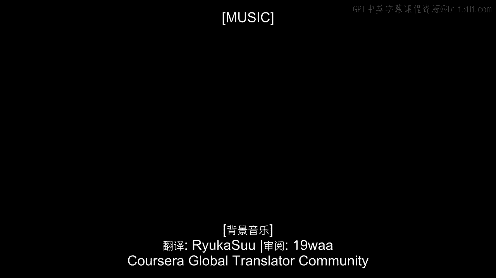

# 沃顿商学院《商务基础》课程 P11：为直销喝彩 🎉

在本节课中，我们将探讨直销这一商业模式的核心价值。虽然哈里斯互动和乐购的案例非常出色，但直销领域的企业才是最早围绕客户数据构建业务模式的先驱。我们将深入了解直销的本质，并学习其如何通过深入理解每一位客户来驱动商业成功。

---

虽然哈里斯互动和乐购的故事非常精彩，并且我们也会提供一些很好地总结这些案例的书籍，但需要强调的是，它们并非唯一围绕深度理解客户来构建业务的公司，也绝非最早这样做的。

事实上，最早以这种方式围绕客户构建业务的公司出现在许多年前，它起源于**直销**领域。

提到直销，大多数人对其没有真正积极的联想。人们会想到低端产品、电视购物广告以及其他不那么高端的营销活动。这通常不是一个你渴望与之关联或向其学习的行业。

然而，当你抛开大多数客户对直销商的表面看法，深入探究其背后的实际商业实践时，你会发现它其实相当令人印象深刻。

直销的核心本质，正是围绕客户构建业务，而且不仅仅是泛泛意义上的“客户”，而是围绕**每一位具体的客户**。它关乎理解与每一位不同客户的关系：他们购买了什么、花了多少钱、咨询过哪些产品、退回过哪些商品、与客服有过哪些互动。这就是直销的全部意义——建立公司与客户之间更为丰富的关系。

有趣的是，直销并非一个新概念。它自1967年就已存在，当时莱斯特·旺德曼审视了这些新兴的数据驱动商业实践，并指出：“我们可以做很多事情。我们可以将这些商业实践形式化，并总结出与之相关的最佳实践。”

即使你不花太多时间思考直销，其许多术语和概念早已渗透到当今日常的营销对话中。例如，芭芭拉讨论过的许多细分概念就常与直销相关。甚至像**客户终身价值**这样的表述——你之前听说过，我们也将花更多时间讨论——也直接来源于直销商。

因此，直销商是最早提出这一理念的群体：“我们可以收集关于客户的所有数据，每一位客户的数据。我们实际上可以通过了解哪些是有价值的客户、哪些价值较低、应该在何时向哪些客户发送哪些信息，以及重要的是，我们可以开发和提供哪些产品，来为我们最有价值的客户创造更多价值，并试图吸引更多类似的客户。”

所以，哈里斯和乐购的故事很棒，但它们并非独一无二。因此，我想花些时间来赞扬一些直销实践。并且我想强调，当今许多公司可能并不渴望成为直销商，但它们在不知不觉中已经是了。任何在互联网上运营的公司、任何有能力长期追踪特定客户的公司，都有能力从直销中学习。

我鼓励大家阅读关于直销的书籍，即使你不认为自己属于这个领域。尤其是在我们进入大数据时代的今天，有太多概念可供你学习和利用。

---

**本节课总结**

本节课我们一起学习了直销模式的起源与核心。我们了解到，直销的本质是围绕**每一位具体客户**的数据和理解来构建业务，它早在1967年就已系统化。关键概念如**客户细分**和**客户终身价值**都源于此领域。更重要的是，在当今大数据时代，任何能够追踪客户行为的公司（尤其是互联网公司）都在实践直销的理念。因此，学习直销的思维与方法，对现代商业实践具有重要的借鉴意义。