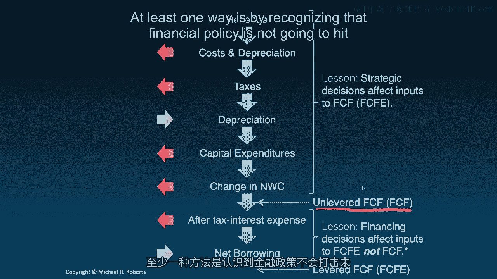
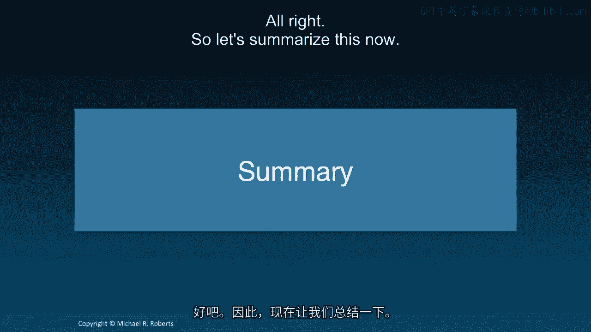

# 沃顿商学院《商务基础》｜Business Foundations Specialization｜（中英字幕） - P110：8_自由现金流 📊

## 课程概述

在本节课中，我们将学习企业金融中的一个核心概念——自由现金流。我们将探讨如何计算自由现金流，理解其组成部分，并区分无杠杆自由现金流与流向股权的自由现金流。这是实施任何贴现现金流分析决策规则的关键基础。

---

## 回顾与引入

上一节我们介绍了贴现现金流分析这一新主题，讨论了企业或个人应如何进行决策。我们重点讨论了三种决策标准：净现值规则、内部收益率规则和投资回收期。同时，我们也强调了在实践中应采取务实态度，综合运用这些规则中的相关信息。

本节中，我们将深入探讨自由现金流，这是实施上述任何决策规则的关键要素。让我们开始吧。

大家好，欢迎回到企业金融课程。今天我们将开始贴现现金流分析的第二讲。在开始之前，我们先简要回顾一下上一讲的内容。

我们通过讨论决策制定引入了贴现现金流分析这一主题。我们谈到了实践中使用的几种不同决策规则，首先是净现值规则，它不过是收益现值与成本现值之间的差额。虽然包括我在内的大多数学者认为这是你应该始终使用的最佳规则，但我持务实观点，认识到其他规则，如内部收益率和投资回收期，也包含了决策相关的信息。如果明智地使用并认识到其局限性，这些信息可以带来更好的决策。因此，这就是我们对贴现现金流分析的总体方法：我们将依赖净现值，但也会从其他决策规则中汲取有用的信息。

在本讲中，我想讨论任何贴现现金流分析和决策制定的基石或关键组成部分之一，那就是自由现金流。具体来说，它是什么？让我们开始吧。

---

## 净现值的两个组成部分

请记住，净现值有两个组成部分：自由现金流和贴现率。因为正如上一讲所回顾的，净现值本质上不过是一系列贴现后的现金流，在这里就是自由现金流。

净现值的正式定义如下：

`NPV = Σ [FCF_t / (1 + r)^t]`

我们认识到这其实并不新鲜，这是我们一直在做的事情。我在这里要关注的是分子——自由现金流。在企业环境中，无论是资本预算还是更广泛的估值，我们如何得到这些自由现金流？如何计算这些自由现金流？这正是本讲的核心内容。

---

## 如何计算自由现金流

让我们来看一下。自由现金流的计算始于收入或销售额。

1.  我们减去成本和费用。
2.  然后我们减去折旧（实际上是折旧和摊销，但主要是折旧）。

你可能会想，首先，什么是折旧？折旧只是一种会计上的方式，用于确认实物资产（如厂房和设备）的价值损失或贬值，但这是一种会计概念。它并不代表真正的现金流出。当厂房折旧时，并不意味着有资金离开公司。那么你可能会问，我们为什么要考虑它呢？

我们考虑它的原因是，我们将把这个括号里的项乘以 `(1 - T_c)`，其中 `T_c` 是边际税率。看，尽管折旧不代表任何资金流出公司或项目，它不是美元意义上的实际成本，但它确实减少了我们的应税收入，提供了税盾。因此，在计算自由现金流时，我们必须考虑到这一点，因为税收是实际流出公司或项目的资金。

现在，这个量有几个同义词：**无杠杆净收入**、**税后净营业利润** 或 **息前税后利润**。

一旦我们得到这个量，我们必须加回折旧。同样，这只是为了抵消这里减去的折旧。它不代表真正的现金流入，但它代表了税盾效应，所以我们加回折旧。

接下来，我们要减去资本性支出或任何我们必须进行的投资。

最后，我们要减去营运资本的变化。这一点有时会让人有点困惑。“减去营运资本的变化”是什么意思？

首先，什么是营运资本？营运资本等于流动资产减去流动负债。流动资产大致包括现金、应收账款和存货。流动负债我们主要关注应付账款。

有些人可能会问，短期债务或即将到期的长期债务呢？那是融资问题，暂且搁置，那是另一个问题，我们稍后会讨论。

因此，进入自由现金流计算的不是营运资本本身，而是其**变化**。因为这些都是经济学家所说的存量变量，而我们试图计算的是流量，所以我们要看营运资本在期间内的变化，并将其从自由现金流中减去。

---

## 自由现金流的直观理解

那么，自由现金流直观上是什么？它是在满足项目的所有要求并考虑了相关影响后剩余的现金流。它是可以分配给公司金融索取权人（债权人和股东）的现金流。这是另一种看待它的方式。它不同于现金流量表中的会计现金流，但我们可以通过几个步骤从现金流量表中推导出自由现金流。

我想在这里精确说明：我们在这里计算或定义的自由现金流是**无杠杆自由现金流**。我说“无杠杆”是为了将其与**流向股权的自由现金流**或**有杠杆自由现金流**区分开来，我们将在下一张幻灯片中讨论后者。

---

## 流向股权的自由现金流

流向股权的自由现金流始于我们刚刚定义的自由现金流（即无杠杆自由现金流），然后我们附加了两项：我们要减去税后利息成本，并加回任何净借款（即超过债务偿还部分的借款）。

另一种简洁的写法是：流向股权的自由现金流始于无杠杆自由现金流（即可供债权人和股东使用的自由现金流），然后我们减去税后利息费用，并加上净借款。

那么，什么是流向股权的自由现金流？它是在满足项目的所有要求、考虑了相关影响并且所有债务融资义务都已履行后剩余的现金流。这一点至关重要，因为我们优先满足了债权人的要求，因为他们是优先索取权人。流向股权的自由现金流是可以分配给项目或公司股东（权益持有人）的现金流。

流向股权的自由现金流更准确地说是**有杠杆自由现金流**，因为流向股权的自由现金流受到公司财务结构选择（即杠杆决策，计划承担多少债务）的影响。

---

## 决策层级示意图

让我用一张示意图来展示我们刚刚讨论的内容，这有点接近利润表的层级结构。

记住，自由现金流始于顶部的收入。我们将扣除折旧和成本，再扣除税收，这就得到了我们的无杠杆净收入（即税后净营业利润或息前税后利润）。

然后，我们加回折旧（因为它是一项非现金费用，同样，这里也可以是折旧和摊销）。

接着，我们减去资本性支出（我们的投资需求），再减去在营运资本上的投资（即营运资本的变化）。

这就得到了我们的**无杠杆自由现金流**。这些是可以流向债权人和股东的现金流。

然后，我们减去税后利息费用（我说“税后”是因为请记住，利息是可以在税前扣除的，它为我们提供了税盾）。

最后，我们加回净借款。如果公司借入的债务超过了其偿还的部分，那就是一笔现金流入，可供股东使用。

我们在最底层得到的就是**有杠杆自由现金流**或**流向股权的自由现金流**。

---

## 战略决策与融资决策

思考战略决策与融资决策的一个有用方式是：战略决策将影响自由现金流（以及流向股权的自由现金流）的输入项。它们在这里产生影响。战略决策将影响我们的市场份额和收入，影响我们的成本、投资决策（例如库存等运营决策）。所有这些战略决策都将影响我们的无杠杆自由现金流，并最终影响我们的有杠杆自由现金流。

融资决策则在这里（示意图下方）产生影响。它们将影响我们的杠杆选择、税后利息费用和净借款。因此，这就是为什么我们将这里的现金流称为“无杠杆”的——它们不受杠杆选择的影响。

严格来说，这并不总是正确的。在更高级的估值课程中，你可能会看到融资决策反过来影响无杠杆自由现金流的一些输入项，例如公司投资的能力或其收入增长。但一个有用且常见的基准是认识到：融资决策不影响无杠杆自由现金流。顺便说一下，这是在任何估值或贴现现金流练习中检查计算的好方法，至少一种方法是认识到财务政策不会影响无杠杆自由现金流。

---

## 课程总结

在本节课中，我们一起学习了企业金融的核心——自由现金流。我们了解到，净现值是一种决策规则，用于量化决策的价值影响，它有两个关键组成部分：自由现金流和贴现率。本节课的重点是如何具体计算自由现金流，如何为项目或更广泛意义上的公司推导出它。

我们看到，计算自由现金流有一个相对简单的公式。不要被其简单性所误导，它的应用非常广泛。我们总是可以使用这个定义。实践中的诀窍在于实际估计各个组成部分，并弄清楚什么影响无杠杆自由现金流，什么影响有杠杆自由现金流，什么与现金流相关，什么不相关。

本主题的剩余部分将致力于在具体实例的背景下回答这些问题。接下来，我们将开始学习预测驱动因素，试图理解如何将自由现金流的各个组成部分预测到未来。

非常感谢。