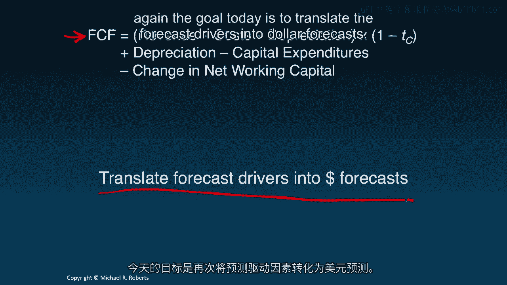
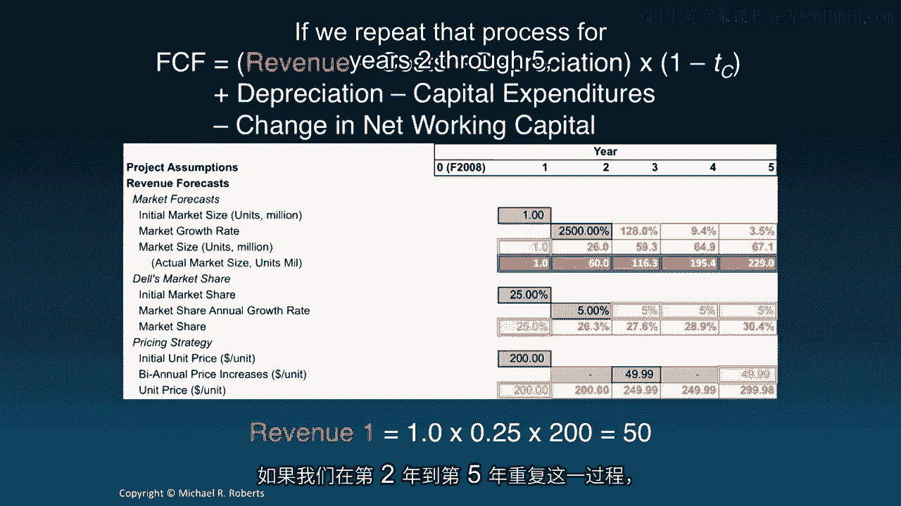
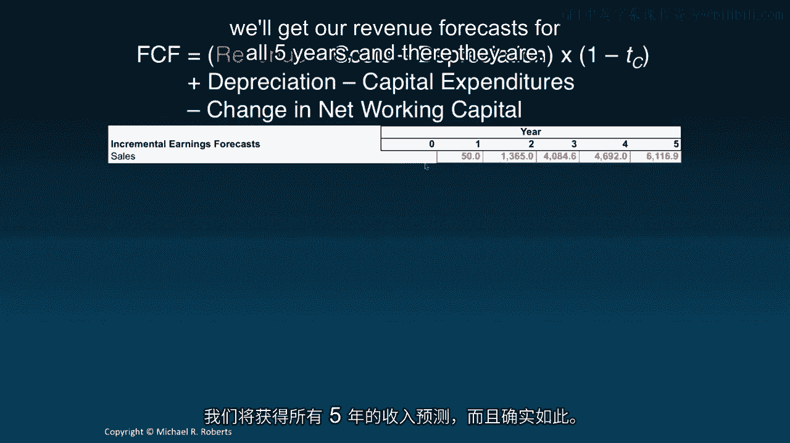
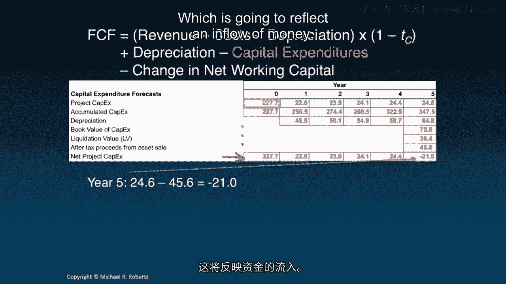
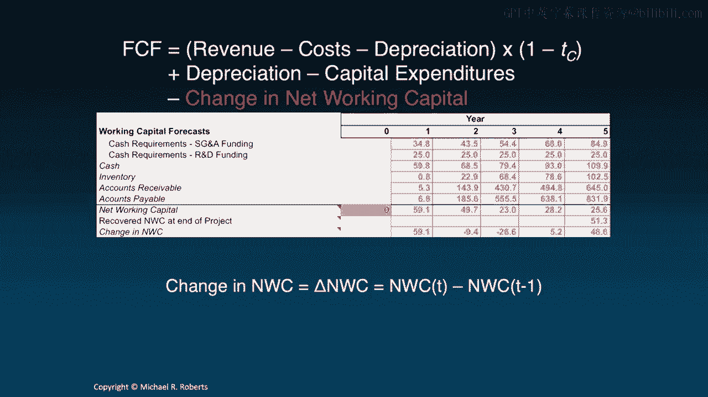
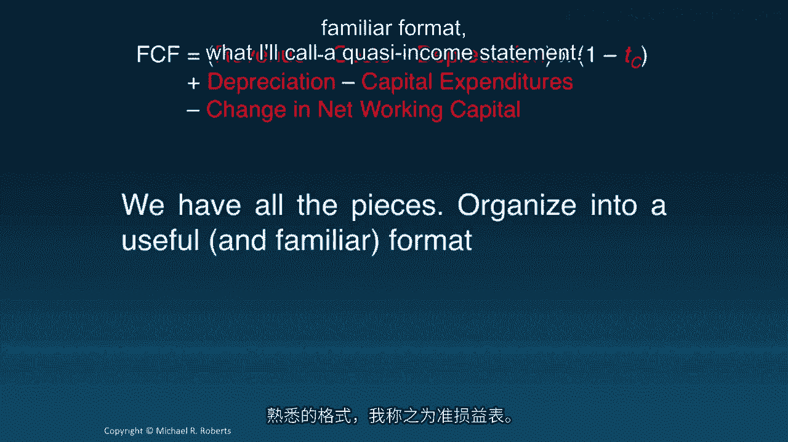
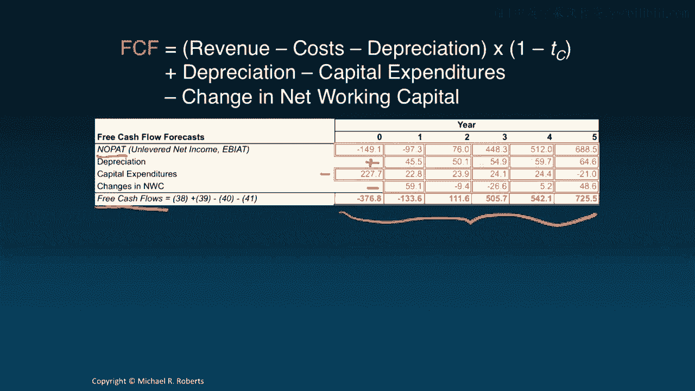
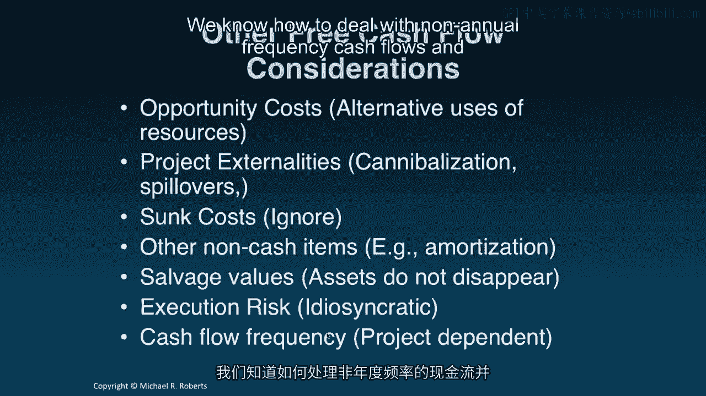

# 沃顿商学院《商务基础》｜Business Foundations Specialization｜（中英字幕） - P112：10_预测自由现金流.zh_en - GPT中英字幕课程资源 - BV1R34y1c74c

Welcome back to Corporate Finance。 Last time we talked about forecast drivers or the assumptions required to forecast free cash flows into the future。

Today， I want to apply the forecast drivers we discussed last time in the context of our tablet case and apply them to the free cash flow formula to forecast free cash flows into the future for the tablet project。

Let's get started。 Hey everyone， welcome back to Corporate Finance。

Today we're going to be talking about forecasting free cash flows， but before doing so。

let's start with our recap of the last lecture。 Last time we laid out our forecast drivers and those were the assumptions that are necessary to generate our free cash flow forecasts。

In particular， they're the assumptions about each of the components going into our free cash flow formula。

Today I want to apply those forecast drivers to actually forecast dollar cash flows。

dollar free cash flows over the five year horizon for our tablet project。 So let's get started。

So here's our free cash flow formula。 And again， the goal today is to translate the forecast drivers into dollar forecasts。

So as a brief reminder， here are our revenue forecast drivers。

We're going to start by forecasting the dollar revenues。

And we know that revenue equals market size times market share times price。 So for year one。

our revenue forecast is just going to be the year one initial market size， one million units。

times our share。 We're going to get 25% of that market。

And then we're going to multiply it by our per unit price of $200 for a revenue forecast in year one of $50 million。

If we repeat that process for years two through five。

we'll get our revenue forecasts for all five years。 And there they are。

Now let's move on to costs。 And we'll start with cogs， cost of goods sold。

You can see that our forecast drivers here are expressed as a percentage and in particular a percentage of sales。

So I'm going to repeat the sales forecast from the last slide here because we're going to need them to get at cogs forecast。

So if we look at year one， we can see that 80。66% of the sales are assumed to be cost of goods sold。

So we take our $50 million revenue forecast， multiply it times that 80。

66% and out pops an estimate or projection of cost of goods sold in the first year， $40。33 million。

If we repeat that process through years two through five。

we're going to get a full blown cogs forecast over the entire projection period。

Now let's move on to SG&A， still in the costs category。

Here we've assumed a first year SG&A expense of $69。59 million。

Now it's in dollars already so there's not really anything to do。

It was just an assumption I made based on 1% of the 2008 company wide SG&A expense。

a number I essentially made up just for illustrative purposes。

But going forward in years two through five， we're going to assume that SG&A expense grows at 25% per annum。

So to get year two， for example， we start with our $69。

59 million expense in year one and we compounded up by 25% to get an estimate of $87 million for our second year SG&A expense。

And if we continue with that 25% annual growth， we're going to get an actual SG&A series here。

Finally， moving on to R&D， there's really not much to do here because I've assumed $4。

00 both for the upfront R&D necessary to get the project off the ground。

as well as the subsequent R&D required for any versioning。 So here are our R&D dollar forecasts。

I'm going to take a step back and put this together into a somewhat familiar format。

and we're going to start with top line sales forecasts right here。

I'm going to subtract off my cogs to get at gross profit。

I'm then going to subtract off my SG&A expenses and my R&D expenses to get estimates of EBITDA。

And EBITDA is a mouthful once you say it。 It's earnings before interest， taxes， depreciation。

I'll abbreviate that and amortization。 Okay。 Now let's move on to capital expenditures。

So our upfront investment is going to be $227 million， well， a little over $227 million。

for the plants and the equipment。 Then we're going to invest in the first year of the project 10% of that amount。

followed by annual growth of 5%， 1%， 1%， and 1%。 So to get our dollar forecast。

there's nothing to do for year zero。 That's just the $227 million。 For year one。

we're going to take 10% of that $227 million to get $22。77 million。 And then for year。

let me clean that up a little bit。 For year two， we're going to grow that at an assumed 5%。

so we compound out up the $22。77 million at 5% to get an estimate or forecast of capital expenditures in year two of $23。

9 million。 And continuing that growth process for years three， four， and five at 1%。

we're ultimately going to arrive at our projected capital expenditure series。 There it is。 Now。

we're going to assume we're going to straight line depreciate this capital expenditures over five years。

What that means is one-fifth of the capital stock is going to depreciate each year。

So what I'm going to do to make things a little bit easier is I'm going to create a row of accumulated capital expenditures。

So that's nothing more than the current plus all previous capital expenditures。 So this $250。

5 is the $227 plus the $22。8。 The $274。4 is the $250。5 plus the $23。9 and on and on and on。

And the reason I'm doing that is to avoid keeping track of different vintages of capital stocks。

since they all face the same depreciation schedule， at least by assumption。

And what I can do to compute the depreciation is simply divide last year's accumulated depreciations。

sorry， accumulated capital expenditures by five。 So the 45。

5 in year one comes from $227 divided by five。 Year two fifty point one comes from the two fifty point five divided by five。

And again， what we're doing is what's really going on is this capital stock is depreciating by another five。

another twenty percent。 And then this depreciates by twenty percent。

So we add those two to get the fifty point one。 And we continue that on and on and we're left with we get our depreciation series。

Now， here's a question。 What happens to all of this physical capital at the end of the project。

at the end of the five years？ It certainly doesn't evaporate， right？ It doesn't disappear。

We can sell it or we can redeploy it for another purpose。 So we need to recognize that。 Otherwise。

we're going to underestimate cash flows。 So what I'm going to do is I'm going to take all of that capital expenditure。

that accumulated capital expenditure。 And I'm going to subtract from it the accumulated depreciation。

That is， I'm just going to sum up all of the depreciation to get this two seventy four point eight。

The difference between the accumulated cap X and the accumulated depreciation is the book value of the assets are seventy two point eight million dollars。

Now， I'm going to assume that I can't sell that on a dollar for dollar basis rather than have to sell it at a discount。

Fifty cents on the dollar。 And so the liquidation value， what I can actually。

the money I can actually get for it， which is different from the book value。

is assumed to be thirty six point four million dollars。 But remember we have to deal with taxes。

And so what we're really interested in are the after tax proceeds from selling this。

So we're going to get thirty six point four million dollars。

But we're going to experience a book loss because the value for which we can sell the assets by assumption。

I might add。 This isn't always the case。 Now， is less than the book value of the assets。

I multiply that times the tax rate so we get a little bit of a tax shield here from our loss。

And the result are after tax proceeds that are actually greater than the liquidation value。

We're going to get forty five point six million dollars。

And so the end result is that we have our projected capital expenditures here。

But once I factor in the after tax proceeds from the sale of these assets。

we're actually going to have a negative capital expenditure in that last year， that fifth year。

which is going to reflect an inflow of money。

So now let's turn to networking capital more precisely the change in networking capital。

but we'll start with networking capital， which is。

you remember is cash plus inventory plus accounts receivable minus accounts payable。

And here were all of our assumptions， all of our forecast drivers for the components of networking capital。

Let's start with the top， the cash requirements。 We're going to require 50% of SG&A in cash and 100% of our R&D expenditures。

So we're going to need our SG&A forecast and our R&D forecast to back out the cash requirements。

Notably for year one， we're going to need 50% of our SG&A expenditures or 34。

8 million dollars held in cash。 But we're also going to need 100% of our R&D expenditures 100% of the 25 million or 25 million dollars。

We're also going to need to hold that in cash。 So our cash requirements are the sum of these two and are given by this row。

And again， we're just going to repeat that， sorry， year by year for two， three and four。

Turning to inventory， our forecast drivers lay out the days， the inventory days。

but the inventory days are based on COG。 So I'm also going to need my COG series。

which I put here for convenience。 So to compute the first year inventory requirements。

I'm going to take my days in inventory 7。5A。 I'm going to multiply that by my COG's expenses。

And I'm going to divide that by 365 to get an estimate of first year COGs at $837，000。

If I keep doing that year after year， we'll get our inventory requirements。

Turning to accounts receivable， we've got days receivable assumptions。 Those are based on sales。

So here's my sales forecasted sales。 When I apply the days receivable to the sales。

say for year one， for example， I've got 38。49 days receivable times the $50 million sales forecast divided by 365 days gets me a forecasted or projected accounts receivable of $5。

2 million， a little over $5。2 million at the end of year one。

We continue that process for years two through five。

and there's our accounts receivables projections。 And finally， we turn to accounts payable。

I've got days payable assumptions of 61。54 days。 This is based on COG。

So here's my COG series for convenience。 I apply my days payable forecast to our forecasted COG series and out pops the accounts payable's forecast。

Repeating that process again， years two through five， we get our accounts payable， there's a typo。

accounts。 We get our projected accounts payable series。 We can put this all together。

Our cash inventory accounts receivable and accounts payable forecasts to compute networking capital for each year。

Remember， it's going to be cash plus inventory plus accounts receivable minus accounts payable。

That gets us our networking capital。 But here's a question。

What happens to all this working capital here at the end of the project？ Specifically。

what happens to all the cash that's sitting there or the inventory or the accounts receivable。

the customers from whom we're waiting to receive payment？ Or the accounts payable。

the suppliers who are awaiting our payment？ What happens to all that networking capital？ Well。

like physical assets， it doesn't just disappear。 In fact， most of it is going to be recovered。

Not all of it， and I'll explain why in just a second。 In particular， right。

we're going to be able to recover the cash。 We're going to be able to recover some money from the inventory。

but by assumption， back in our forecast drivers， we're assuming we're only getting 25 cents on the dollar for this inventory。

That is probably obsolete and either not worth much in terms of scrap or on some sort of secondary market。

We're going to have to pay， well， excuse me， well。

we're going to have to pay all of our accounts receivable， but we're also going to have to collect。

Sorry， we're going to have to get rid of that。 We're going to have to pay our accounts payable and we're going to have to collect our accounts receivable。

The upshot of this is we're going to recover $51。375 million in networking capital at the end of the project。

So our change in networking capital， remember， we're interested in the year on your change。

is given by this row。 Let's just briefly discuss it。 Get rid of that guy。 So the first change is 59。

1 minus zero， which is 59。1。 The second change is the 49。7 minus the 59。1 gets me minus 9。4。

And on and on and on。 And in the last year， we would have 25。6 minus the 28。2。

but then we have to add back in the 51。3 to get networking capital of 48。6。

which reflects recovering all that working capital at the end of the fifth year。 Now。

there is a bit of an assumption。 Well， there's a lot of assumptions。

but one of the assumptions here is that we're recovering all the working capital right at the end of period five。

In reality， you're probably going to collect that within or during year six。

So I could have extended this to a sixth year， but it's not going to make too big of a difference。

The discounting effect is going to be small。 So I just wrap it all up in this fifth year here。

We have all the pieces now。 And what I want to do first is organize them into a useful and familiar format。

What I'll call a quasi income statement。 And it's a quasi income statement because it's missing an important item and it's applying taxes slightly differently。

I'll explain that when I get there。 So we start top line with sales， subtract off cogs。

That gets us gross profit。 We're going to subtract off our SG&A， subtract off R&D。

That gets us our EBITDA。 And sorry， ignore these numbers here。 What they are。

their references to rows in the spreadsheet。 They're just a useful way to keep track of things。

We're going to pull off our depreciation。 That's going to get us our EBITDA。

We're going to apply our tax rate to our EBITDA to get our tax expense。

which we subtract from EBITDA to get our no-pad。 Now。

I call this a quasi income statement because what's missing here is interest。 No interest。

That's financing。 We're after unlevered cash flow。 So that's not relevant here。

It's also quasi because the taxes are applied to EBITDA as opposed to pre-tax income。

which comes after interest。 So this is our no-pad series。

Let's carry that no-pad forward up to here。 Add back in depreciation。

subtract off capital expenditures， and subtract off the change in networking capital to get what we're really after。

or ultimately after， which are free cash flows。 These are the free cash flows to the project。

Now， some other things to keep in mind when you're going after free cash flows。

First of all are opportunity costs。 Alternative uses of resources。 They're not free。 Second。

project externalities。 And this is a biggie。 In our context。

you can imagine that the tablet might cannibalize or take away sales from other product lines。

maybe desktops， for example。 But you also want to be cognizant of spillovers。

You could imagine that in the process of developing and selling this product， this tablet。

we might learn something about our production process that applies to other product lines。

Or it might lead us to the development of an entirely new product line。

We need to recognize these externalities that are associated with this project。 So。

what do we mean by "sunk cost"？ Well， imagine we commissioned a marketing study back in 2006。

two years before we were valuing this project or deciding on this project。

The costs associated with that marketing project as of 2008 are completely irrelevant。 They're sunk。

They're irrelevant for a decision-making。 All that matters are the costs going forward and benefits。

Other non-cash items， such as amortization， we have to take that into account。

Particularly because that generates a tax shield。 But also other non-cash items like stock-based compensation。

stock grants， restricted stock awards， options， employee stock options and the like。

Salveage values。 We touched on this in this lecture。

Assets don't just disappear and either do liabilities。

So we have to take into account any salveage values or liquidation values associated with our assets。

Execution risk。 Look， this is a risky project。 But the way we're going to capture execution risk that is risk unique to this project is not through the discount rate。

And I'll come back to talk about that more later on in the class when we get to estimating the discount rate。

But this is specific to the project。 So it's got to affect the free cash flows。

And the way it's going to affect that is we're going to look at expected free cash flows。

That's the way to think about the numerator and the NPV calculation。

And we can also capture this through sensitivity analysis by looking at different scenarios or different forecasts for free cash flows。

That's going to come up in a little bit when we talk about sensitivity analysis。

And one last point is， you know， I've assumed an annual frequency here。

but there's nothing special about that。 We could have done this on a quarterly frequency。

We could have done it on a monthly frequency， semi-annual。 Take your pick。

What determines the cash flow frequency is really the situation。

It's project dependent and it's sector dependent。 So don't think there's anything special about annual frequency。

We know how to deal with non-annual frequency cash flows and discounting them。

So it's not a problem at all。

All right， let's summarize this。 What we did in this lecture is we actually forecasted the dollar values of the free cash flows。

And the way we did it is we built it up from our forecast drivers of the components within free cash flows。

This is one of the two basic inputs into a DCF， the other being the discount rate。

And the question now is， what do we do with these free cash flows？ Well。

that's the topic of our next lecture where we take a look at decision criteria。

So thanks for listening。 And I look forward to seeing you in the next lecture。
