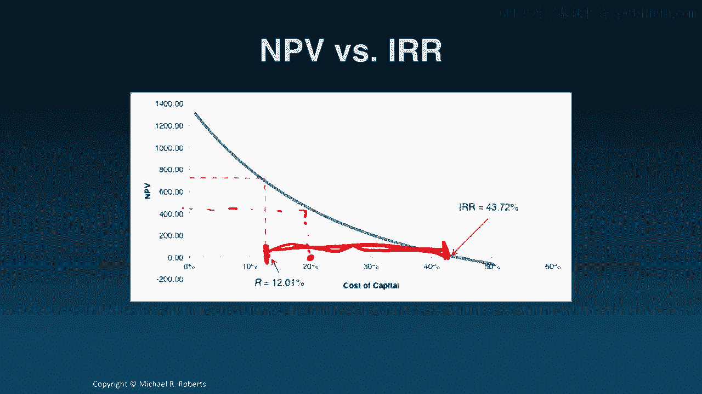
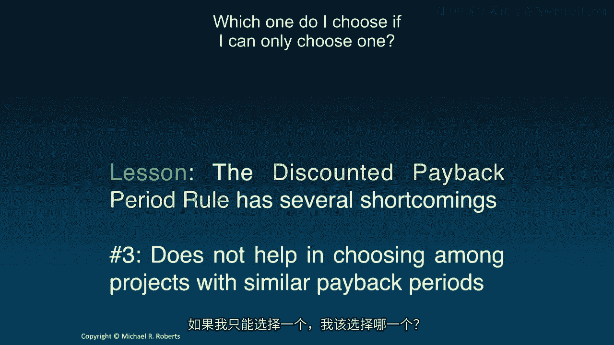

# 沃顿商学院《商务基础》｜Business Foundations Specialization｜（中英字幕） - P113：11_决策标准.zh_en - GPT中英字幕课程资源 - BV1R34y1c74c

Welcome back to Corporate Finance。 Last time we applied our forecast drivers to。

our free cash flow formula to forecast free cash flows for our tablet project。

Today I want to take those free cash flows and apply our different decision。

criteria to come up with decisions regarding our project。 Let's get started。

Hi everyone welcome back to Corporate Finance。 Today we're going to talk about。

decision criteria but before doing so let's recap our previous lecture in which。

we forecasted free cash flows。 Specifically we took our forecast drivers our。

assumptions about what would happen in the future and applied them to generate。

dollar forecasts of all of the components of the free cash flow formula which we。

then built up aggregated into free cash flow forecasts。 Today we're going to turn。

to what to do with those forecasts by looking at different decision criteria。 So let's get started。

So what do we do with our cash flows from last time？ One。

thing we can do is we can compute the NPV and I'm going to assume a discount。

rate of 12% that is r equals 12% and if we do that and apply it to our free。

cash flows that we computed in the last lecture what we're going to see is that。

this project this tablet project has an NPV of 708。42 million dollars。 Not bad。

What that means is that firm value debt plus equity is going to increase by 708。42。

million dollars in expectation if the project is undertaken。 So from a decision。

making standpoint undertake the project。 That's what the NPV rule tells us。 It says。

accept all projects with a positive NPV， reject all projects with a negative NPV。

and while this has boiled it down to one number I want to be careful especially。

when we start doing our sensitivity analysis to recognize that we don't want。

to pin all our hopes to that one number。 Now another thing we can do is we can。

compute the internal rate of return。 The internal rate of return of a project。

recall is the one discount rate such that the net present value of the。

project's free cash flow is equal zero。 We've actually already seen this when we。

were talking about yields。 Remember the yield is the one discount rate such that。

when you discount the cash flows by the yield you get the price but the NPV is。

nothing more than the price minus the present value of all the future cash， flows。

So IRR and yield are really one and the same。 So what's the IRR for this， project？

Well we write our NPV formula we set our NPV equal to zero and then we。

solve for the one discount rate such that when we discount all of our free cash。

flows we get an NPV of zero。 If we do that we find that the IRR on this project is， 43。7 percent。

Well is that good？ Is it bad？ Before getting there I just want to。

mention typically we're going to need to solve this numerically unless you have。

figured out some amazing way to solve higher order polynomials。 You can use。

the IRR function in Excel I think you can use goal seek in Excel you can try trial。

and error though that's really inefficient if you're using another software program。

or a financial calculator you can do this as well。 So what is what do we do with， this 43。

7 percent IRR？ Well we're going to compare it to our cost of capital our。

hurdle rate and what we're going to do is we're going to undertake the project。

because the IRR is greater than the hurdle rate。 Intuitively it makes sense。

and this is one of those cases where intuition actually works。 It costs us。

12% to raise money in the capital markets to fund our investments to create value。

If this project generates a return of 43。7 percent that's substantially larger。

than what it costs us to raise the funds。 That sounds good that makes sense and。

so what the IRR rule says is accept all projects whose IRR is greater than R。

and reject all projects whose IRR is less than R where R is our hurdle rate。

Hurdle rate cost of capital our discount rate。 Now I do want to mention the IRR rules informative it's also somewhat intuitive。

and appeals a lot to investors who tend to think in terms of returns but it's。

got a number of shortcomings that we're going to explore in greater detail and。

topic four return on investment。 Now one picture I'd like to show you is the。

following。 I've plotted the cost of capital on the horizontal axis and the。

project NPV on the vertical axis and what the blue line shows is it shows how the。

NPV of the project varies as I vary the cost of capital。 Two points are worth， noting。

First is this point right here which is the 12% cost of capital of the， project。

You'll notice that generates an NPV as we saw earlier of a little bit， over 700 million dollars。

The second point I want to point out is this point。 The， point where the graph crosses the x-axis。

That's the point at which the NPV is， zero which as we know from our definition earlier is just the IRR。

That's 43。7%。 Now I think this graph is let me clear this up a little bit。 This graph is useful。

because from a sensitivity analysis or a robustness perspective。 Look this R is。

an estimate and to be honest with you it's typically a noisy one。 What I see here。

is I see a really wide gap between my estimated cost of capital and the point。

at which this project just breaks even。 So even if we disagree on the cost of。

capital and you're taking a more conservative view and you think it's up。

or you know our real cost of capital is 20% that's okay。 This project is still。

NPV positive it's still value-accretive and so what this gap here shows is it。

shows that I've got a lot of room for error at least on the discount rate， dimension。

The third thing we can do with our cash flows our free cash flows is。

compute a payback period which is the duration or the time until the cumulative。

free cash flows turn positive。 So let's look at our project here are free cash， flows。

I'm going to accumulate them year over year so this 510 - 510。4 is just， the 376。

8 in year 0 plus the -133。16 year 1 and on and on for years 2 through 5。

And then I'm going to look at the cumulative free cash flows and ask when， do they turn positive？

Well they turn positive right here in year 3 so our， payback period is year 3。

We turn cash flow positive in year 3。 Some people might。

say it takes three years to recover your investment。 Is that good？ Is it bad？ How do。

we know if 3 is good？ How does that help us in our decision of whether or not to。

undertake the project？ Well what we do is we compare it to some threshold and so。

the payback period rule is says accept all projects with a payback period less。

than the threshold reject all projects with payback periods greater than that， threshold。

But it should be immediately clear that the payback rule or the payback。

period rule has several shortcomings the first of which is it's ignoring the。

time value of money and risk of cash flows the first sin that we learned way。

back at the start of the course。 But fortunately that's actually quite easy， to deal with。

We can compute the discounted payback period by discounting， the free cash flows right？

The discounted payback period of a project is just the。

duration until the cumulative discounted free cash flows turn positive。 And so on。

this slide I computed those discounted free cash flows using our cost of capital。

of 12% and then I accumulate them and wait or count until they turn positive。

which is right here in year four。 So our discounted payback period is four which。

is greater than our payback period of three。 But even using the discounted payback。

period this has this rule has a number of shortcomings。 For example it ignores。

cash flows after the cutoff and that's going to lead to myopic decision making。

Let me go back a slide。 What if this cash flow in year five was 20， billion dollars？

Well 20 billion 114 million dollars。 It'd be a shame you know。

to ignore that and the implication for that of that cash flow。 So by ignoring。

those cash flows you get myopic decision making。 Number two it's not。

telling us the value implications of our decision。 Right it's not helping us。

quantify the effects of any decision that we make。 It's also not helpful in。

choosing among projects with similar payback periods。 So I've got three。

projects they all have payback periods of four which one do I choose if I can。

only choose one。 Alright so let's bring this all back together。 Let's bring it。

into a full circle。 So there's several decision criteria NPV is unambiguously。

the best and should always be used。 But I want to emphasize that others such as。

the internal rate of return and payback period or it's discounted cousin that。

they're all informative and the key is to understand the shortcomings of these。

alternative decision criteria to avoid any mistakes that feed into the ultimate， decision。

So what I want to turn to in our next class is sensitivity analysis。

Which is an integral component of any DCF。 Thanks again and I look forward to， seeing you。
