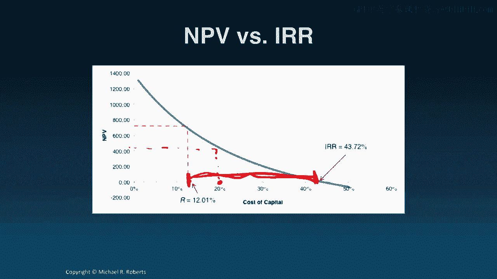

# 沃顿商学院《商务基础》｜P113：决策标准 📊

在本节课中，我们将学习如何运用不同的决策标准，对上一节中预测出的自由现金流进行分析，从而对项目做出投资决策。

上一节我们介绍了如何运用预测驱动因素来预测平板电脑项目的自由现金流。本节中，我们来看看如何利用这些现金流数据，通过计算净现值、内部收益率和投资回收期等指标来评估项目。

## 净现值

首先，我们可以计算项目的净现值。假设折现率 **r = 12%**，并将此折现率应用于上一讲计算出的自由现金流，我们会发现这个平板电脑项目的净现值为 **7.0842亿美元**。

这个结果意味着，如果实施该项目，公司价值（债务加权益）预期将增加7.0842亿美元。从决策角度看，净现值规则告诉我们：接受所有净现值为正的项目，拒绝所有净现值为负的项目。

虽然净现值将决策简化为一个数字，但我们需要谨慎对待，尤其是在进行敏感性分析时，不应将所有希望都寄托于这一个数字上。

## 内部收益率

接下来，我们可以计算项目的内部收益率。内部收益率是使项目自由现金流的净现值等于零的那个折现率。这与我们之前讨论债券时提到的“收益率”概念本质相同。

要计算该项目的内部收益率，我们写出净现值公式，设净现值为零，然后求解出能使所有自由现金流折现后净现值为零的折现率。计算得出，该项目的内部收益率为 **43.7%**。

那么，这个结果是好是坏？我们需要将其与资本成本（即门槛利率）进行比较。由于内部收益率（43.7%）高于资本成本（12%），根据内部收益率规则，我们应该接受该项目。直观上这很合理：如果项目产生的回报率远高于筹集资金的成本，那么项目就能创造价值。

内部收益率规则是：接受所有内部收益率大于 **r** 的项目，拒绝所有内部收益率小于 **r** 的项目，其中 **r** 是我们的门槛利率（资本成本）。

内部收益率虽然直观，但也存在一些缺陷，我们将在后续关于投资回报的章节中详细探讨。

为了更直观地理解净现值与折现率的关系，我们可以观察下图。图中横轴是资本成本，纵轴是项目净现值。蓝线显示了项目净现值随资本成本变化的情况。

图中值得注意的两个点是：
1.  在12%的资本成本处，对应的净现值略高于7亿美元，与我们之前的计算一致。
2.  图表与横轴的交点，即净现值为零的点，对应的折现率正是内部收益率（43.7%）。

这个图表对于敏感性分析很有用。它表明，即使我们对资本成本的估计存在误差（例如，实际成本可能高达20%），该项目仍然能保持净现值为正，这说明我们在折现率这个维度上有较大的容错空间。

## 投资回收期

第三种评估方法是计算投资回收期，即累计自由现金流转为正所需的时间。

以下是我们的自由现金流。我们将逐年累计这些现金流，然后观察累计现金流何时转为正值。

如图所示，累计现金流在**第3年**转为正，因此我们的投资回收期是3年。投资回收期规则是：接受所有回收期短于设定阈值的项目，拒绝所有回收期长于该阈值的项目。

然而，投资回收期规则有明显的缺点：它忽略了货币的时间价值和现金流风险。幸运的是，这个问题很容易解决，我们可以计算**折现投资回收期**。

折现投资回收期是指累计**折现**自由现金流转为正所需的时间。在本页幻灯片中，我使用12%的资本成本计算了折现自由现金流，然后进行累计，发现它们在**第4年**转为正。因此，折现投资回收期为4年，比普通回收期（3年）要长。

即便如此，折现投资回收期规则仍有不足。例如，它忽略了截止期之后的现金流，这可能导致短视的决策。同时，它无法告诉我们决策的价值影响，也无助于在回收期相近的项目中进行选择。

## 总结

本节课中我们一起学习了三种主要的投资决策标准。

让我们将所有内容整合起来，形成一个完整的决策框架。

在几种决策标准中，**净现值法无疑是最佳选择，应始终作为主要依据**。但需要强调的是，内部收益率、投资回收期及其折现版本等其他方法也都能提供有价值的信息。关键在于理解这些替代决策标准的局限性，以避免在最终决策中犯错。

在下一讲中，我们将转向敏感性分析，这是任何贴现现金流分析中不可或缺的组成部分。再次感谢，期待下次相见。