# 沃顿商学院《商务基础》｜Business Foundations Specialization｜（中英字幕） - P114：12_敏感性分析.zh_en - GPT中英字幕课程资源 - BV1R34y1c74c

Welcome back to Corporate Finance。

Last time， we applied our different decision criteria， to our forecasted free cash flows。

to come up with a decision as to what to do with our tablet project。 This time。

I want to push those assumptions around， the forecast drivers and other assumptions。

to see how robust our decision is in a process called sensitivity analysis。 Let's get started。

Hey everyone， welcome back to Corporate Finance。 Today we're going to be talking about decision criteria。

but as always， let's start with a recap of our last lecture。

So last time we talked about decision criteria。 In particular， we asked。

what do we do with our free cash flow？ And there were several things we could do。

We could compute an NPV， we could compute an IRR， or we could compute a payback period。

And we talked about how to implement those decision criteria， and what decision to make。

and we also alluded to some of the shortcomings， of those decision criteria。 Today。

I want to turn to sensitivity analysis。 In other words， having set up our DCF。

and having completed all the inputs， now let's push it around a little bit。

and just see how robust and sensitive our valuation is。

so we can make the most informed decision possible。 So let's get started。

And we're going to start with something called break even analysis。

Break even analysis finds the parameter value that sets the NPV， of the project equal to zero。

holding fixed all other parameters。 So let's look at our cost of capital and an initial investment forecast drivers。

And I've got base up here to represent a base case。

We're going to look at alternative cases in just a minute。

You can see our base case assumption for the cost of capital was 12， just a little over 12%。

And our initial investment was $227。7 million。 The corresponding NPVs for those assumptions were 708。

42。 It's the same， it's the base case。 That's what we computed in our previous lectures。

The break even values， in other words， the value for the cost of capital。

such that the NPV right here is zero， is 43。72。 But that should look familiar because the break even point。

for the cost of capital is nothing more than the IRR。

And as we discussed in the last lecture on decision criteria。

you can see there's a lot of room here before this project looks bad。

at least on the cost of capital dimension。 For the initial investment。

our initial investment would have to be closer to a billion dollars。

before this project started to turn negative。 Now how did I get these？ Well， I just used goal seek。

What I did is I set the NPV cell， for example this cell， to zero。

and I would change the input parameter。 And goal seek goes around by iterating it to find the zero value。

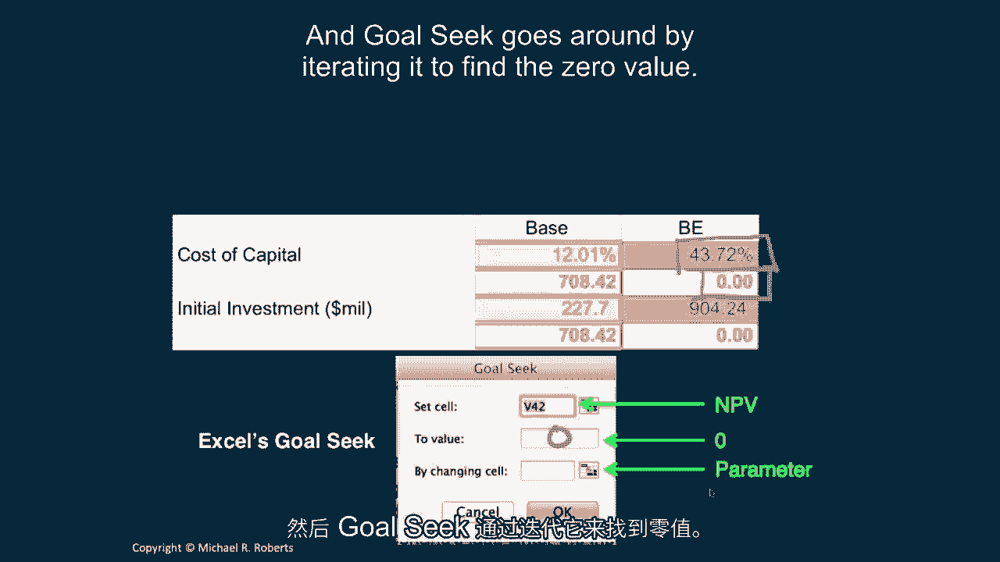

Now I did this for all of our inputs， and I can only show you a subset。

and otherwise things get ridiculously small。 It doesn't fit well on the screen。

But what I like to do when looking at the break even estimates is gauge， how much room I have。

at least in a partial equilibrium notion。 Because remember。

I'm only changing one parameter at a time， and I'm going to emphasize that again in a second。

I'm going to look at how much breathing room I have until the project turns south。

or becomes negative NPV。 And so you can see these purple arrows identify parameters。

for which there seems to be a fair amount of scope for error， a large margin for error。

So take a look at the PPE liquidation value here。 I'm assuming I'm getting 50 cents on the dollar when I liquidate all of my plant。

and equipment at the end of the five years。 It would take a loss of 2。

253 percent before this thing turned negative NPV。 I'd have to be dealing with some kind of。

maybe nuclear waste， right？ Something like that。 But that's not the case here。 Similarly。

the initial unit price， unless we're going to price this thing at $77， just over $77 per unit。

this thing is positive， this project is positive NPV。

This is in contrast to some of the parameters for which there doesn't seem to be。

quite as much margin for error。 So if I look at my initial market size。

I'm looking to the initial kind of trade， sorry， initial market size of a million units。

But if there's not a lot of enthusiasm， say only half a million， little over half a million。

this project becomes NPV negative， again， holding all other parameters constant。

So this break-even analysis， I think， is a useful tool for gauging how much room we have。

one dimension at a time， before the project becomes value destructive。

And I want to emphasize that this is a partial equilibrium analysis。

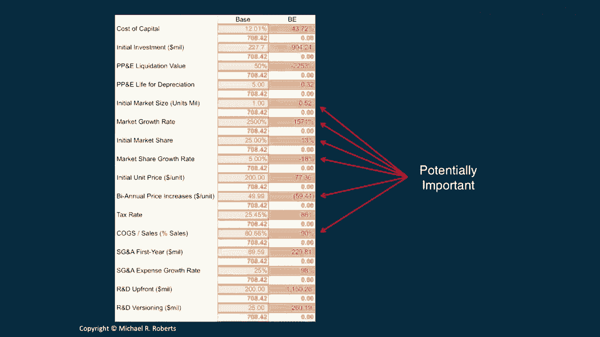

It assumes the parameters are independent， right？ I'm changing one parameter at a time。

and in some cases that's an unreasonable assumption。

It's not to say the break-even analysis is uninformative， it's just that we have to recognize。

the limitation of that analysis。 Now let's turn to some comparative statics。

And comparative statics are going to quantify the sensitivity of evaluation to variation in a。

parameter holding fixed all other parameters。 So what I'm going to do is I want to look at how does evaluation change parameter variation。

from what I'll call a worst case to a best case scenario for each parameter。 And again。

I'm going to focus on the cost of capital in the initial investment。

And by my estimates in discussion with Treasury， right， the sort of range of estimates for my。

cost of capital， very from a low of 9。61， which is a best case scenario， right。

very inexpensive cost of capital， to a high of 15。01%。 Likewise， my ops people tell me that this。

the initial investment is likely to be $227 million， but it could go as high as $284。

It could go as low as 185， depending upon short-term variation in materials and labor， et cetera。

Okay。 What I see underneath each parameter estimate is the corresponding NPV。

So when I change the cost of capital of 15。01%， the NPV of the project is $594 million。

When I increase the cost of the initial investment from $227 to $284， right， the NPV moves from。

$708， our base case to $649。47。 So I actually like to look at this table。

One is to get some sense of the sensitivity of the valuation to specific， to changes in。

specific parameters。 But I also like to use it as a gut check， a reality check。

to make sure that the， valuation varies sensibly with variation in the parameters。

If I had found that as I increased the cost of capital that the valuation here， the numbers。

actually went up， I've got an error somewhere in my model。 Okay。 So how did I get this？

I just used an Excel data table。 So these are inputs right here。

So all you do is highlight the matrix。 The NPV of the project is here in the bottom left。

The parameters are in the top row。 And you choose a row input cell and enter the parameter cell。

That's it。 Nothing more than a data table。

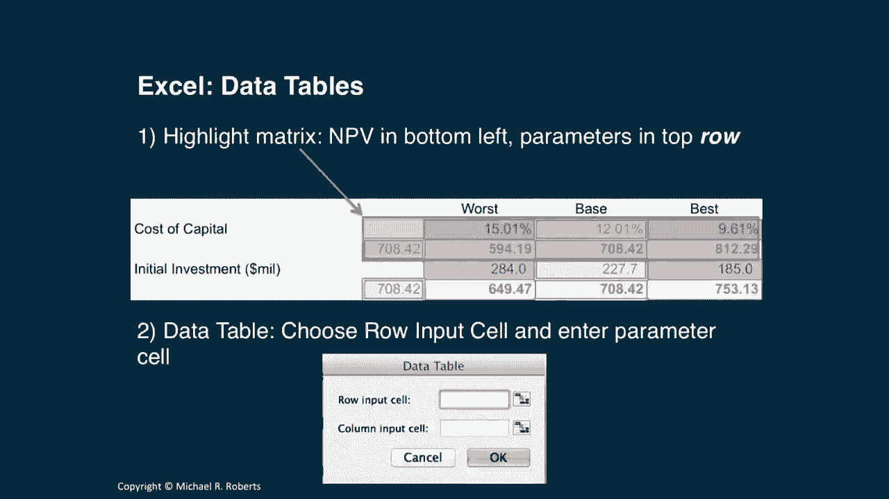

And I did this for all of the parameters， though I don't show you all the parameters， here。

and it's just useful to move through them to make sure things make sense。

So if I look at initial market share， for example， right here， what I see is a worst case scenario。

of 15% or penetrations only 15% versus an initial penetration of 35% -- sorry， an initial。

penetration of 35% in a best case scenario。 And you can see that the valuations increase with our penetration。

which makes sense。 We're selling more units。 And notice they actually increased by a lot。

We're going to see that that's an important value driver。

So what is the elasticity of the valuation with respect to each parameter？

So it's similar to what we did， but it puts a little bit more structure on the changes in the parameter。

so we can compare the sensitivity of the valuation to different parameters a little bit more sensibly。

So what is the elasticity？ Well， it's just defined as the percentage change in the NPV divided by the percentage change in the parameter。

Or delta -- remember this is nothing more than change -- the change in the NPV divided by the change in the parameter。

times the ratio of the parameter to the NPV。 Let's look at an example。 Here's my cost of capital。

What I've done is I've gone computed a cost of capital that is 1% higher and 1% lower。

And I've computed the corresponding NPVs。 So to estimate the elasticity of the NPV with respect to the cost of capital。

I've simply looked at the delta NP -- sorry， yellow。 Get rid of that guy。

Delta NPV over delta parameter -- delta in the cost of capital。 So I've taken the 7 -- this guy。

703。53， minus the 713。34。 And I've divided that by the difference of 12。13 minus 11。89。

And I multiply that times the average of the two numbers。

So this is really just the average of the parameter values。 This is the average of the NPVs。

And obviously these halves cancel one another， but I wanted to put them there to emphasize that I'm just taking the average of these two points。

And the reason I'm doing this is because the elasticity will vary depending upon which direction -- the direction in which we calculate it。

Not by much， but by a little。 So this is just a useful -- this is one possibility or one approach for computing it。

And the elasticity I get is minus 。69。 So a 1% increase in this -- in the cost of capital。

a 1% relative increase I should add， in the cost of capital， is associated with a 。

69% decrease in the NPV of the project。

And I can do that for all of the parameters。 Again， I'm just showing you a few。

but you can see a couple parameters start popping out very quickly， such as the initial market size。

our assumption on the market growth rate， right？ Our initial market share。

our assumption on cost of goods sold。 These， again。

are going to correspond pretty closely to what we saw with our breakeven analysis。

and they're really identifying the key value drivers。

The things we should really be focused on when discussing this project。

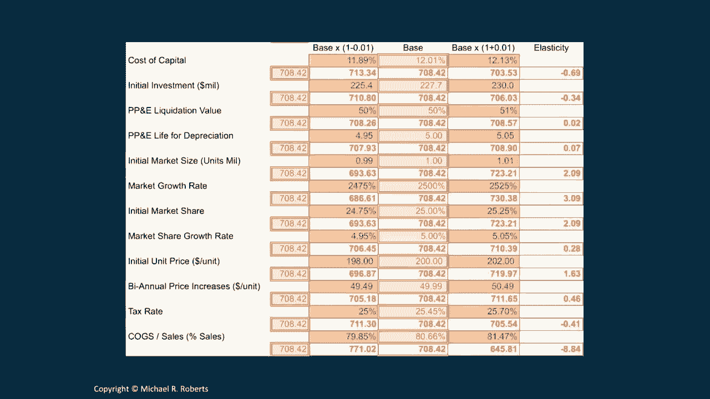

But， again， like our previous analysis breakeven and our little scenario analyses -- well。

not scenario， sorry -- our comparative statics。 Comparative statics implicitly assume parameters are independent of one another。

We're varying one parameter at a time， and sometimes that just doesn't make sense。

So that's going to lead us to scenario analysis。 What scenario analysis is going to do is it's going to quantify the sensitivity of the valuation to variation along multiple dimensions。

We can vary multiple parameters。 So what I've done here。

going back to that best and worst case scenario， is I said。

what's the worst case scenario for all the parameters here？

And the best case scenario for all the parameters。 Now。

that's not necessarily the optimal thing to do， but it's illustrative。 You might want to say。

what's sort of the worst case scenario if the economy goes south？ Right？

How's that going to affect each parameter？ It may not be the worst case for each parameter individually。

but jointly it might correspond to some sort of bad economic state of the world。 Having said that。

I've computed what I've set up each of these scenarios -- worst， best， base， and best。

And I've just done a little scenario analysis。 And what I find is that in the worst case scenario。

this project is over half a billion dollars negative NPV。

The best case scenario is 33 billion positive NPV relative to our base scenario。 Now。

I wouldn't read too much into those numbers。 Again。

because I've taken the worst case scenario for each parameter independently。

and that doesn't make a lot of sense。 Again， what you want to do when you're constructing these best and worst case scenarios is think。

okay， let's think about a bad economic state of the world。

where maybe not everything goes horrible in the project， but where some things go bad。

and maybe other things are good。 So if it's a bad state of the world， maybe labor costs go down。

right？ And it becomes cheaper to build the plant。 You want to think about these things and how parameters are related and what really represents a plausible best and worst case scenario。

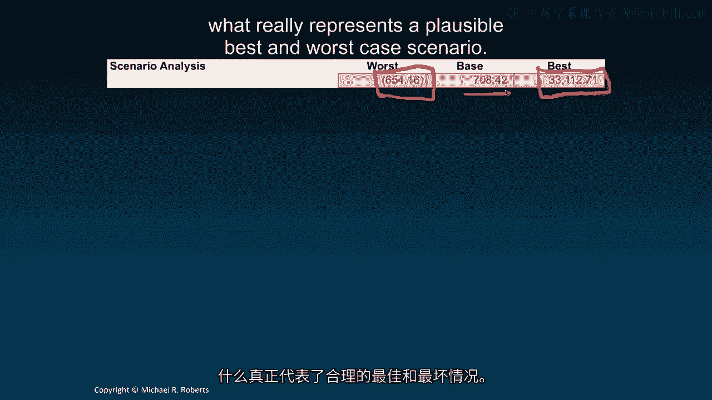

Now， how did I do this？ I just used scenarios in Excel。 That's one way to do it。

That's how I initially did it。 But that's actually really inefficient。

A much better way is to set up a lookup table and a toggle that you can just switch all the parameters between。

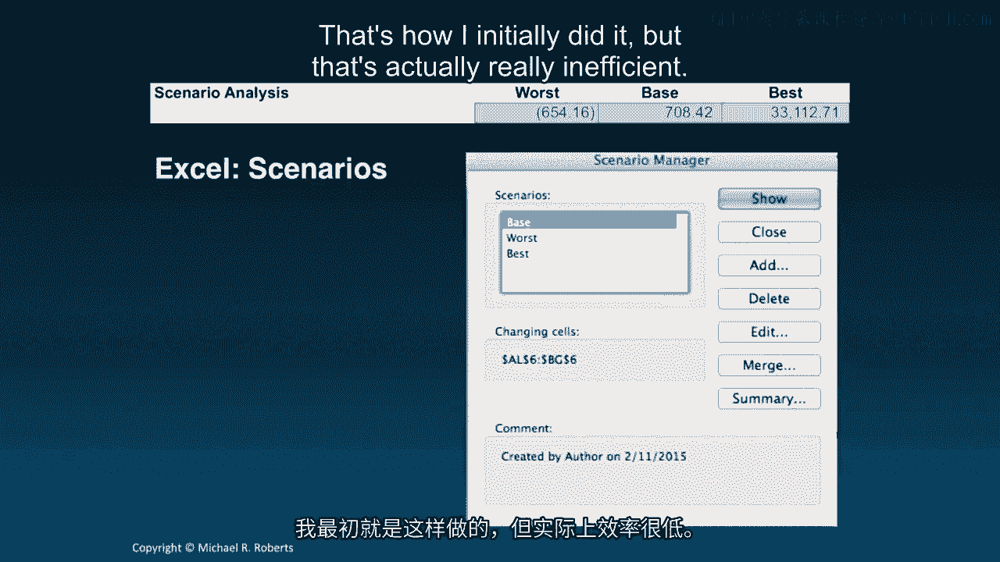

Much more efficient。 So here's a question。 What else can we do with sensitivity analysis？

We can answer some important questions that are going to come up in discussions。 Here's one。

for example。 Imagine strategy wants to reduce the price by $30 in order to increase the initial market penetration from 25% to 30% by their estimates。

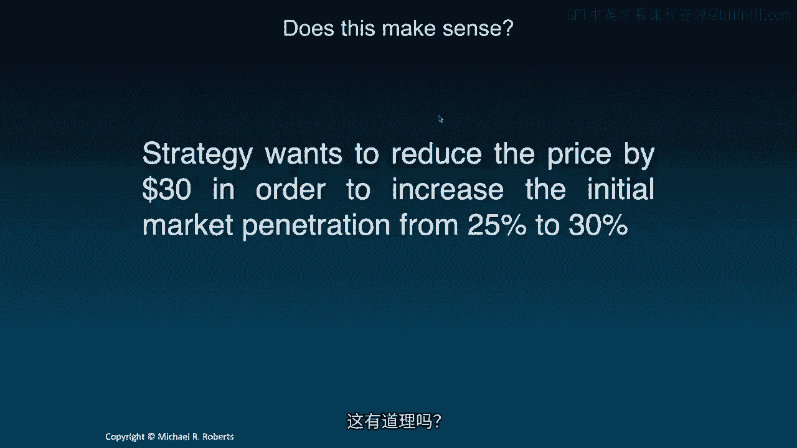

Does this make sense？ Well， we can answer that question。 In this table。

what I've done is I've set up a little two-way table。 I've got quantity。

our initial market share right here， initial penetration and price here。

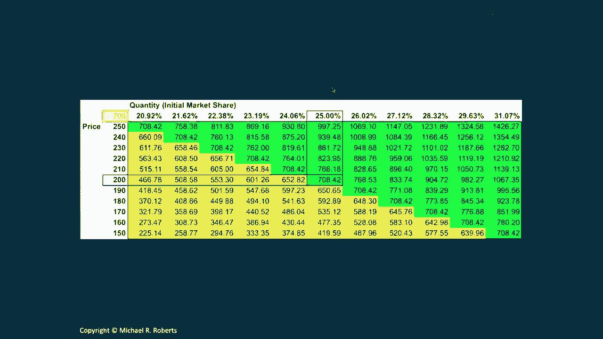

So these are all prices。 Here are all my market shares。

Here's our base case scenario in which we're assuming 25% initial market share at a unit price of $200。

And marketing is asking， what's going to happen if we change these？ Well， in particular。

they want to lower the price by $30 from $200 to $170。

And they argue that's going to increase our market share upwards of， say， 30%。 Well。

what does that mean from a valuation perspective？ Well， if we look in this box right here。

we see that the NPV is going to be somewhere between $776，851 million。

So what's the answer to the original question？ It's a good thing。

NPV is going to go up relative to our base。 Here was our base。 Marketing says， drop the price。

That increases penetration。 And sure enough， valuations go up。

So it sounds like a sensible thing to do。 Marketing， on the other hand。

is concerned about uncertainty surrounding the market for tablets and wants to understand if we can shed any light on that。

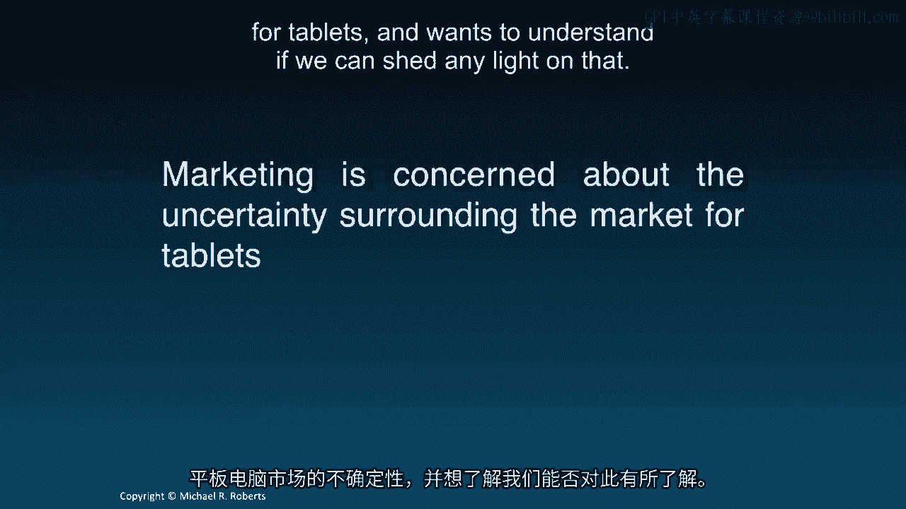

Can we provide some information？ So here's another two-way table。 I've got market growth rates here。

Market growth rates there。 I've got market size assumptions here， initial market size。

Here's our base case indicated by the black outline boxes。

So the initial market size was going to be a million units， and we were assuming 2。

500% growth in that next year。 But what this picture shows is it shows that as that growth varies and as that market size vary。

what happens to the valuation？ The cells inside are NPVs。

And I've color-coded them so that green is at or better than our baseline。

You can see our baseline is all along。 I've held the baseline constant along the diagonal here。

All 70842。 Yellow is positive NPV， but worse or below the base case NPV。 And red is negative NPV。

And so this provides some picture of how much slack we have。

at least along the initial market size and market growth rate assumptions。

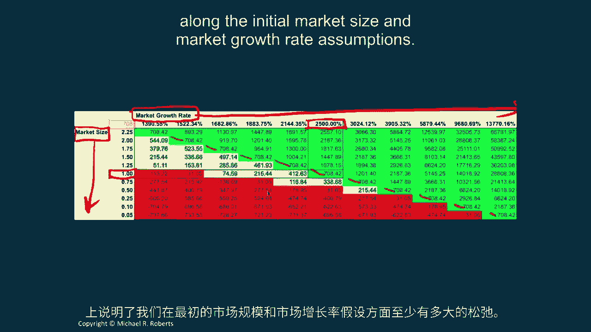

Finally， I want to talk about simulation analysis。 Simulation analysis。

we're going to perform the valuation for a large number of scenarios。

A whole bunch of different parameter values。

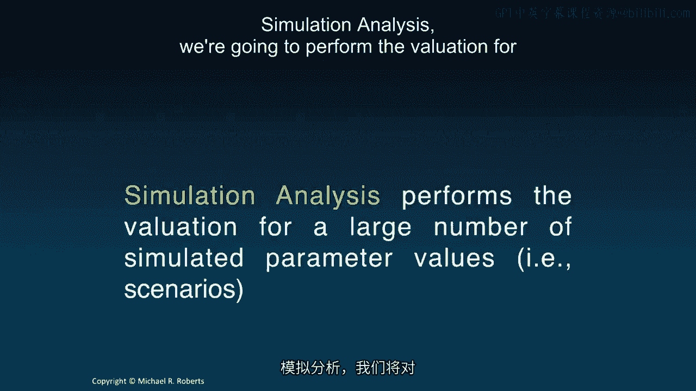

And what I did is I selected 500 different scenarios。

What I did is I just randomly drew parameter values from a distribution constrained by the best and worst case scenario for each parameter。

And I did that 500 times。 And I computed the NPV for all 500 draws。

And I plotted them here in a histogram。 So I have here the NPV on the horizontal axis。

And the y-axis is the fraction of the 500 simulated scenarios corresponding to each NPV。

And this red dashed line is the zero NPV value。 And what you can see up here is 77。

78% of the simulations are positive NPV。 22。2% are negative NPV。

And so the takeaway is it looks like a pretty good bet。 This project looks like a pretty good bet。

Conditional on all of the assumptions that we've made to get there。

We've been able to push it around through a host of different scenarios。

And this thing tends to be a positive NPV project， value-accretive。 That said。

I want to emphasize that the parameters were drawn independently of one another。

And that's not ideal。 It's going to lead to some implausible outcomes。

And it's not a particularly reasonable assumption。

especially when it comes to certain parameter pairs， such as price and quantity。 That's just one。

Ideally you want to draw from some large， multi-variant distribution。

But now we're moving way outside the scope of this course into evaluation exercise。

What I want to do is instead emphasize the importance of simulation analysis。

even small-scale simulation analysis。 So you just laid out by hand 10， 15 different scenarios。

Computing powers cheap。 Compute the NPV and just look at how those NPVs look across the different scenarios。

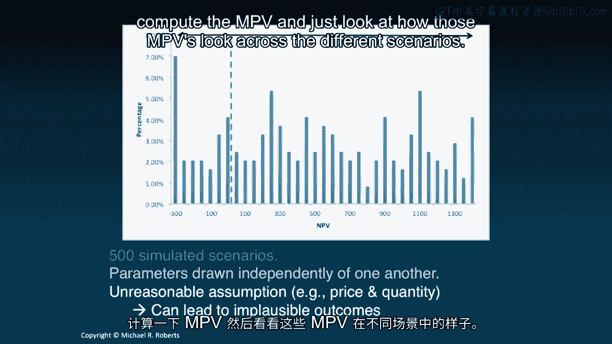

Alright， so let's summarize this and bring it all back together。

I really want to emphasize that no DCF is complete without a sensitivity analysis。

It's really an integral component of any valuation。

Any sort of capital budgeting or broader valuation， I should say。

It's going to help us identify where value is created or destroyed。

It's going to identify the key value drivers where we should really focus our time and effort in terms of our discussions for making the decision。

It's also going to help us quantify and assess our risk exposure。 How much can we lose？

How frequently can we lose it？ And it's going to help us understand the robustness of the profitability of the project。

So next time we're going to turn to a new topic， return on investment。

which is actually closely related to our decision criteria。

We're really going to hone in on IRR and look at some of its strengths and weaknesses。

So thanks again for listening and I look forward to seeing you in the next lecture。
