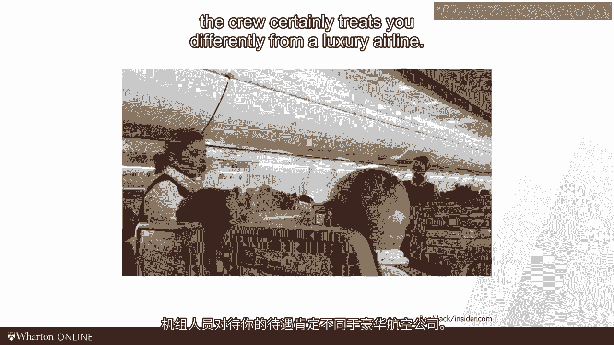

# 沃顿商学院《商务基础》｜Business Foundations Specialization｜（中英字幕） - P117：1_在运营中权衡利弊.zh_en - GPT中英字幕课程资源 - BV1R34y1c74c

In the last video， we talked about what it takes to delight the customer。

We talked about inconvenience， which is driven by waiting times in undesirable locations。

And we talked about consumption utility driven by the sub dimensions of fit with personal。

preferences and another sub dimension related to various elements of quality。

Let me again start today's video with a personal story。

Last year I worked with a client in the Middle East。

It was my first trip to the Middle East and it was a very short trip。 It was only three days long。

Given this time pressure， I tried to combine my work during the day with at least a little。

bit of sightseeing in the evenings。 Add to this a time difference and you will understand that I was totally exhausted when。

I entered the plane taking me back from Dua to New York。

Now I was fortunate that my client was generous enough paying for a business class ticket on。

Qatar Airways。 I had a wonderful breakfast， slept for 10 hours straight and something almost as comfortable。

as my bed at home， had another meal， checked my email and landed in New York。

What an amazing experience。 For those of us with being on an easy jet or a Ryan Air flight。

we know that experience， there is very different from this。 You're squeezed into a cabin。

there's no space for your luggage and the crew certainly。

treats you differently from a luxury airline。

But I tell you， flights from England to Spain are cheaper than a dinner in a good Philly。

restaurant。 From an operational perspective， which airline is better。

the high willingness to pay airline， like Qatar or the cheap service from Ryan Air。 On this slide。

I've compiled some data from big global airlines。 Airlines in the United States are regulated and so you can get access to pretty cool operational。

data。 For simplicity here， I focus only on two variables per airline。

The yield of the airline is determined by the revenues of the airline， divided by the。

total passenger miles the airline has provided。 Please forget the term "year after this slide。"。

It has a very different meaning in the context of operations management not to mention yields。

in finance。 What matters here is that really yield captures how much a customer is willing to pay for a。

mile of travel。 I also report the operating expense of the airline。

Here I simply look at all the operating expenses related to the passenger travel and again。

divide them by the total passenger miles。 What I want you to do is to pause the video for a minute and ask yourself which of these。

airlines fit with each of these data points？ Who is who？ Okay， stop me now。 All right， welcome back。

Here are the results of your exam that you get it right。

We'll get back to the airline data in a moment。 For now， let's just observe the following。

An airline can provide great services and can compete on quality aiming for a high willingness。

to pay。 If they do this， well， they can get away with somewhat higher costs。

But an airline can also focus on efficiency。 If the airline manages its costs well。

it can be profitable even if it offers super competitive， and low prices。

If you take a course on strategy or marketing， you will learn a number of tools to help you。

in the trade of between cost and quality。 In this course。

I want to take a slightly different perspective。 Every individual firm faces a trade of between costs and willingness to pay。

It's called as a cost-quality trade-off。 Consider the following exam。

The German railway system is going through some operational transformation。 And trust me。

they need it。 One of the areas they're working on is their cost center operations。

If you think about willingness to pay in a cost center， waiting time is an important， sub-dimension。

Who likes to wait listing to beat off music？ Imagine their current's performance is here。

This is their waiting time， and this is their full improvement cost measured in dollars or。

euros per call。 Now it is really easy to run a call center with short waiting times。

You just hire an extra hundred customer service representatives and the waiting time is going。

to come down。 Unfortunately， while your waiting times go down， your fulfillment costs。

your cost per， call are going up。 Note here that I've reversed the access。

Short waiting times means more responsive， which means further up on the y-axis。

Lower fulfillment costs means more efficiency， which means further to the right on the x-axis。

But as far as that， it is really easy to cut costs in a call center and just reduce a。

head count and have fewer agents in the seat that will reduce a cost per call。

But it will obviously lead to a worse service as customers will have to wait longer。 Again。

that's a trade-off。 One way to think of operations management is as a strategy implementation tool。

You tell me what position you want to be on on this curve， and I will build you an operation。

that gets this done。 But here's another way of thinking about operations management。

Imagine you and I would do some benchmarking。 We would go through the industry and for each of the call centers。

we collect information， about the efficiency and their waiting times。 Our own position is here。

We start our benchmarking with call center A。 Call center A has a shorter response time， than we do。

which we understand when we look at the cost efficiency， which is worse than， ours。 Cool。

These guys have made their cost quality trade-off differently from what we did and they hired。

a bunch of extra agents。 Then we move to call center B。 These folks have a longer wait time。

a lower response， list， which gets them down here。 Now， they're not incompetent。 Instead。

they have squeezed their costs and are running a more efficient operation。 Good for that。 Third。

we look at competitor C。 And this is where we get puzzled。

This call center is providing a better service than we are and they're more efficient as， well。

Maybe they do not have a short of a response time as competitor A and are not as cheap。

as competitor B， but compared to us， they are faster and more efficient。

The academic term for this is that competitor C parietal dominates us。

Now to stay with academic terms for a moment， we define the line of all call centers of， all firms。

of all operations that are not paraded or dominated by somebody else as the， efficiency frontier。

Yes， they exist a trade-off between cost and quality， but this is the elite set of firms。

that has nobody providing better service at lower costs。 Sadly。

our own call center is not on the efficient frontier。

We can visualize our inefficiency as a distance between us and the frontier。

Inefficiency has two consequences for us。 First， the good news。

We have reasons to believe that we can improve our quality while also cutting our costs。

We can become a better operation and a better cost center。 This will be win-win。 Second。

to move to the upper right， we have to overcome some or all of our inefficiencies。

This will require us to do some work。 We have to up our game。 We have to get better in what we do。

Okay， let's get back to our airline data。 Here's some data from the largest US carriers。

I also sprinkled in data from some of the global carriers。

Please note that this is not a careful scientific study。 It is just an illustrative example。

How do you think about this graph？ If you wanted to apply for a job。

if you wanted to make an equity investment， if you， were a management consultant。

what goes through your head as you look at this graph？ You see。

the efficiency frontiers are very useful to think about an industry。

All right， that's it for now。 In this video， we moved beyond just pleasing the customer。 Yes。

we would love to increase the willingness to pay。 But we have to do this with also achieving reasonable fulfillment costs。

And for that， we have to get rid of the inefficiencies in our operation。 In the next video。

we'll discuss how such inefficiencies look like。 The purpose of this entire course then is to fight these inefficiencies。

As I said before， we want to make things better， which means higher willingness to pay at lower。

costs of fulfillment。 See you soon。 [BLANK_AUDIO]。
