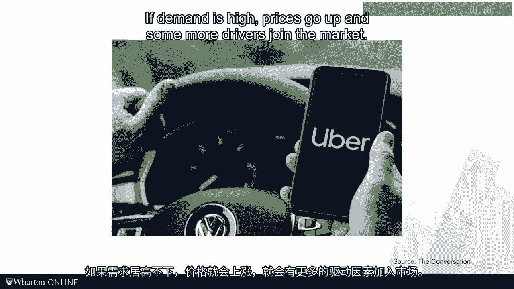

# 沃顿商学院《商务基础》｜Business Foundations Specialization｜（中英字幕） - P118：2_系统抑制因素.zh_en - GPT中英字幕课程资源 - BV1R34y1c74c

In the last video， I introduced the concept of the efficiency frontier， parade to dominance。

and inefficiencies。 I have to confess that my definition of inefficiencies being the gap between the firm's current。

precision and the efficiency frontier is rather academic and abstract。 In today's video。

I want to get more concrete。 Specifically， I will define inefficiencies in the form of three system inhibitors that。

I will label waste， variability， and inflexibility。

These three system inhibitors will make inefficiencies more concrete， more tangible。

It is like coming down from the 30，000 foot level view of strategy and economics to the。

specificity of real operations。 As a business owner or management consultant。

it is important to know where you stand relative， to the efficiency frontier。

But in order to make an improvement， you have to be more specific。

You have to roll up your sleeves and tackle the inefficiencies directly。 And for that。

you need to know how these inefficiencies look like。

Let's define the three system inhibitors one by one。 Let's start with waste。

Waste corresponds to all the consumption of inputs and resources that do not add value。

to the customers。 Since waste consumes inputs and resources， waste is costly。

But since it does not add value to the customer， the customer is not willing to pay for this。

We have extensive discussion of waste later on in this course， but let's start with a。

specific example。 Did you know that most of the helicopters of the German military don't fly？

Germany has 75 helicopters of type NH90。 Take a guess what percentage of them is flying right now。

Well， from the 75， only 44 are available， the others are with a manufacturer for repair。

or maintenance。 From these 44 that are with the military， the German Bundeswehr。

only 9 actually are certified， to fly right now。 And since helicopters only fly a couple of hours a day。

chances are that right now， not， a single one of them is in the air。

As these helicopters cost 70 million per unit， that is a waste of resources。

And wasting the time and availability of resources， we oftentimes see waste of input。

The FDA estimates that some 30 to 40 percent of American food supplies get wasted in the。

supply chain。 That corresponds to $160 billion， not to mention those who don't have access to healthy food。

Even worse， it is estimated that well over half of the energy used in this country is wasted。

You see this in the school visualization of researchers here at the Lawrence Livermore。

National Laboratory。 Again， we're talking about a waste that is worth hundreds of billions of dollars and。

massive impacts on the environment。 Just because of waste， as we will see in this course。

just measuring and quantifying this， waste is already a first step towards reducing it。 For now。

keep in mind that waste is a consumption of inputs and resources that do not add value。

to the customers。

Waste that's so good， variability。 Variability corresponds to changes in either demand or supply over time。

Consider variability associated with customer demand first。

Here you see the demand for air travel in the United States starting in the spring of 2019。

Given the COVID pandemic， demand for air travel plummeted。 Even short of pandemics。

consumer demand changes rapidly。 Fashion trends， new technologies， consumer confidence。

or even the weather demand for， products or services goes up and down all the time。

As an example close to home here in Philadelphia， consider the frequencies of shootings in our。

city。 Sadly， this translates into demands for our emergency rooms and trauma centers。

You see here the variation on a monthly basis。 There's also an effect of whether my friends working in Penn's ER have a very cynical view。

to this。 When the weather turns nice， people are out in the street and more people get shot。

Back to this is the extra demand coming from motorcycle accidents and you know that when。

the trauma base are filling up， if the weather is nice。

Variability also plays out on the supply side。 Take a look at this graph here of ER physicians。

All of them work in the same ER and all of them are dealing with very similar type of， patients。

However， as my colleague， I'm a song showed in this study， the way these doctors dealt with。

these patients was very different from each other。 In this study。

how many looked at how long patients were kept in the emergency room， a。

number that is known as a length of state。 You see here that some doctors kept their patients dramatically longer than others。

I'm not judging their behavior。 I'm just observing that there exists variability across providers。

Add to this that doctors or any resource might get fatigued， machines might break down， and。

you have more variability from the supply side than you like。

So variability comes from demand and from supply。 Either way， variability is mostly a bad thing。

As we saw with variability， demand can move quickly。 Unfortunately， supply does not。

Supply that means factories， lawyers， buildings， MRI machines and other resources， those resources。

cannot quickly be added only then to be taken away later。

That gets me to my third system inhibitor and that is inflexibility。

One of the reasons why the mobility company Uber has been so successful is the ability。

to adjust their driving capacity to the change in customer demand。 If demand is high。

prices go up and some more drivers join the market。

Uber calls a search pricing。 If demand is low， prices come down。 Unlike caps。

Uber drivers don't pay pricey medallions and so they can just do something else。

rather than having to compete for the same few customers in the market。

You see the results here in this graph。 Uber and the other right-hailing companies are able to flex the number of rides they provide。

Demand for rides very predictably over the course of the week。

So sooner you can predict this extra demand for rides， the better you can drum up the。

drivers that you need to respond to this。 More drivers are needed on a rainy Saturday night than on a Sunday Tuesday at noon。

And you might like Uber and Lyft or not， they do a decent job with a virtual fleet to provide。

that capacity just when just needed。 This is referred to as volume flexibility。

Another form of flexibility relates to having operations be able to serve different types。

of customers with the same process。 As you will see over the duration of this course。

I have an interest in electric cars。 Tesla's are of course made in factories that only produce electric cars。

But how about car companies that sell both combustion engine cars as well as electric， cars？

Volkswagen for example has to decided to have the factories focus on one engine type。

The German Sveka plant is entirely focused on electric mobility。 In contrast。

most of the vaults were plants are focused on combustion engines。 As to Mercedes。

Mercedes has for the better for the worse initially decided to mix the electric production with。

their combustion engine cars。 The same assembly line on the same day even at the same time as a mix of electric and non-electric。

cars。 Being able to use machines or workers for different purposes offers a second form of。

flexibility。 I call this mixed flexibility。 So in flexibility prevents our operation to effectively respond to variability and hence。

we call it our third system inhibitor。 So these are the three system inhibitors。 Waste。

variability and inflexibility。 The costs of these forces are beyond what you and I can imagine。

In large global industries we're talking about billions of dollars。 But you know what？ Personally。

I couldn't care less about that money。 The real costs for society are much bigger than that。

The financial numbers typically reported don't include the anxiety of a patient who。

does not have access to care。 The misopportunities that a child has because it doesn't get high quality education。

Or the damage that we do to our planet because of wasting resources in our food and energy。

supply chains。 At the risk of becoming a bit evangelical here， let me say this。

The promise of operations management is this。 We can improve the way people work by fighting the evil effects of waste。

variability and， inflexibility。 And that is always a good thing。 Now before I let you go。

for every module I want to get into the habit of defining the， learning objectives。

So you can test at the end of the module whether you accomplished what I wanted you to get。

done in the module。 So in this module we talked about the drivers of willingness to pay。

We talked about the efficiency frontier and the three system inhibitors。

A couple of key definitions but no equations yet。 But don't get used to that。 That will soon change。

See you in the next module。 [BLANK_AUDIO]。
