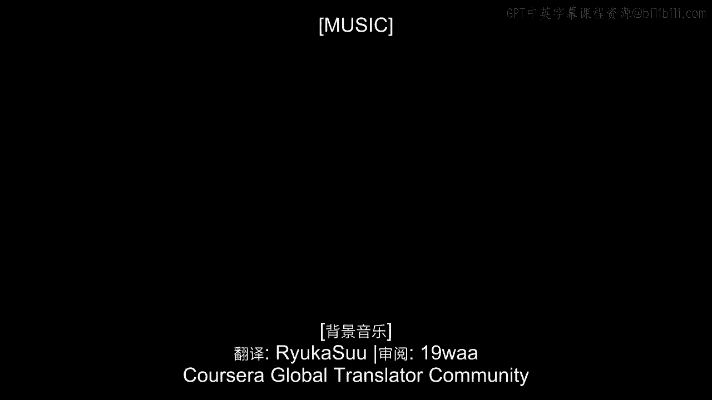
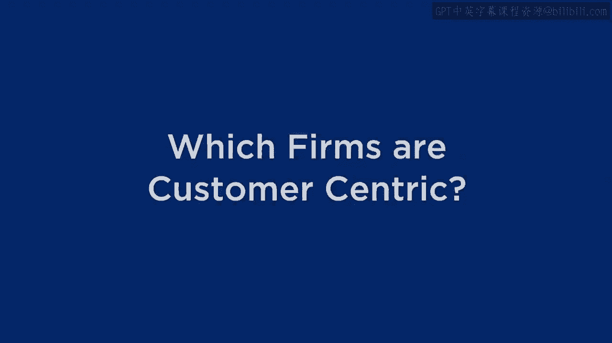
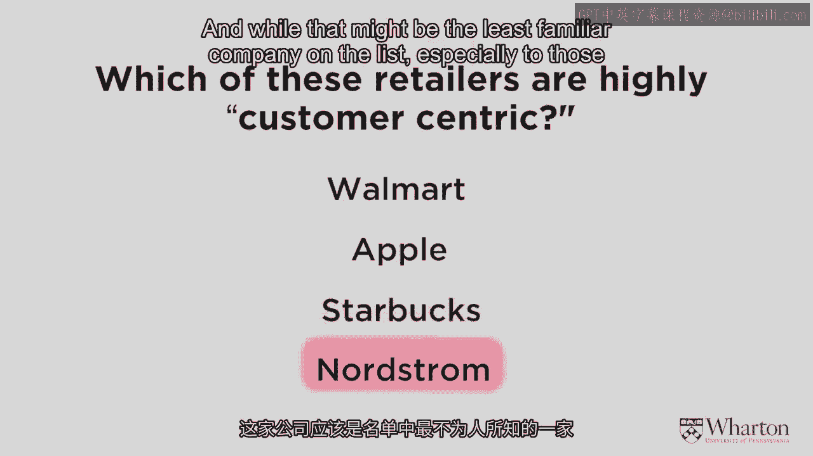
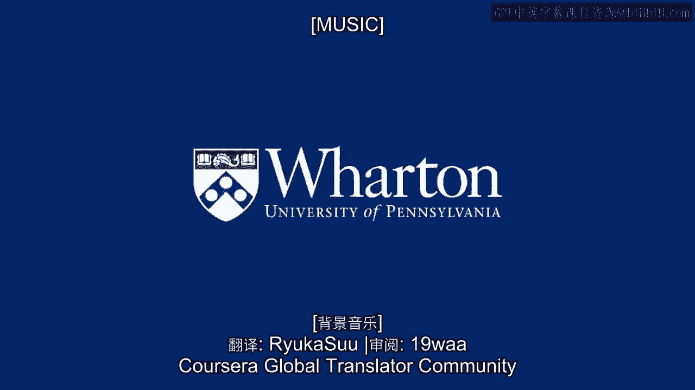
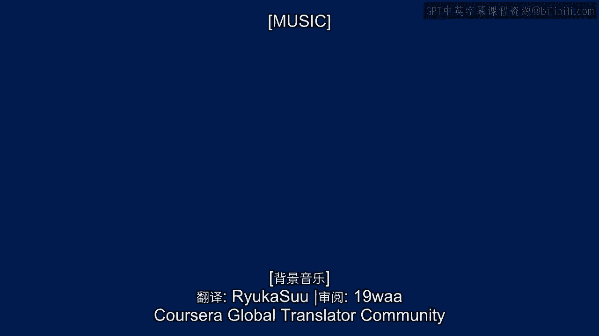

# 沃顿商学院《商务基础》｜Business Foundations Specialization｜（中英字幕） - P12：11_哪些公司以客户为中心.zh_en - GPT中英字幕课程资源 - BV1R34y1c74c

Now that we understand what product centricity is all about， and we've discussed some of。

the cracks in product centricity and even some of the opportunities for companies to。

escape from and maybe do better than a product centric approach， I want to start moving our。

way towards customer centricity。 But before I give you a definition and talk it through。

I'd like you to think about what customer centricity means based on your experience as。

well as what I've discussed so far。 And so in order to do that， I want to work with a。

series of examples here。 In fact on this slide you'll see the names of four very famous retailers。

Three of them operate on a global level， so Walmart， Apple， Starbucks， and sure most of。

you are familiar with them and Nordstrom's， a high end， very high touch department store。

chain here in the US。 If you're not familiar with them， not a big deal， I think you'll appreciate。

the story anyway。 What I'd like you to do is take a moment and from your experience。

with your perceptions of these firms， decide which of them would be highly customer centric。

So I want you to think about what customer centricity means in light of our discussion。

so far and decide which of these could be one， could be all， could be none， up to you would。

be above the bar in terms of customer centricity。 Think about what customer centricity means。

and which of these firms qualify in that regard。 Think about that for a second and then I want。

to talk through all four of them。 In my book， none of these firms are truly customer centric。

Now I want to be careful about this。 I have great admiration for all these firms。 I'm。

a big customer of all of them。 I really like what they do。 But all of them for different。

reasons fail to be truly customer centric， nearly as much as perhaps some of you thought。

when deciding which of these firms are， aren't customer centric。 So let me just take a few。

moments to talk through each one of them and then finally we'll bring up our definitions。

of customer centricity。 First there's Walmart。 Now again， Walmart is a terrific firm but。

Walmart knows surprisingly little about any one of its customers。 Unlike Harrah's， unlike， Tesco。

unlike so many other retailers out there， Walmart does not have a loyalty program。

Walmart has made very little effort to date to try to figure out exactly what each customer。

is doing and how they can influence each customer's behavior。 So while Walmart might not make。

a lot of efforts to understand what any one customer is going to buy， they make great。

efforts to understand the customers as a whole。 They understand regional differences。 They。

understand when certain kinds of events occur， for instance， when a hurricane is about to。

hit the southeastern US， they need to fill the stores with water and batteries and so on。

So they understand the customer in a generic way but they make very little effort to understand。

the customers in a very specific， granular way as a direct marketer would suggest。 And。

you know what？ That doesn't bother me because Walmart isn't intending to be a direct marketer。

If you think about the Walmart business model， it's about selling in great volumes。 It's about。

bringing the cost way down。 So in many ways， Walmart is a prototypical and a wonderfully。

successful product centric firm。 Let's come up with products that we can sell a whole。

lot of that's going to let us bring our costs down。 And let's figure out ways to extend our。

product goodness and all the aspects that I mentioned for product centricity apply to， Walmart。

So in many ways， I excuse them。 I allow them to focus on product centricity。

because they're so good at it。 There are very few firms in the world that can operate in。

an operationally excellent manner as well as Walmart can。 It's a similar but different。

story for Apple because Apple， again， is the classic performance superiority firm。 They。

don't spend a whole lot of time doing market research to figure out exactly what the customer。

wants。 They don't spend a whole lot of time focusing on segmentation and real granular。

analyses to try to predict what any one customer is going to do over time。 What Apple focuses。

on is leveraging its product expertise， is taking the kinds of products that they've。

already developed and figuring out what are the next ones that they should develop。 So， again。

a classic example of product centricity and they do it better than most other companies。

on the planet and they can get away with it。 Now， while Walmart and Apple， for the most。

part of focusing on doing product centric things， operational excellence for Walmart。

performance superiority for Apple， they are doing some smart things at the margin to。

understand their customers better。 For instance， Walmart is spending a little bit more time。

developing technology that's not only going to help them learn about their customers， but。

even more operationally efficient than they were before。 So for instance here in the， US。

they have a new program they call Scan and Go， a mobile app that lets people scan products。

as they move around the store so as they check out， the whole scanning process happens much， faster。

It's a brilliant idea that lets them be more operationally excellent but also lets。

them start tagging individual customers and tracking them over time。 So they're starting。

to take on some more customer centric initiatives without sacrificing the operational excellence。

And Apple is also starting to do a number of things。 Again， small initiatives not driving。

the business that are letting them understand their customers a little bit better。 Whether。

it's tracking people's music preferences through iTunes or some of the activities that they。

do in the Apple retail stores， slowly but surely they're starting to develop a better。

understanding of their customers at a more granular level。 And who knows， one day， if。

and when competition catches up and Apple can no longer be the product leader that they， are。

they could probably turn around and start to be a great customer centric firm as well。

But today it's not quite as mission critical as it is for other firms。

The third company on our list， Starbucks， is a very interesting contradiction。 At a local， level。

Starbucks or any coffee retailer is very， very customer centric。 The barista。

the person on the other side of the counter， the person who makes your coffee knows a lot。

about you if you're a regular customer。 Not only does he or she understand your coffee。

preferences and what other items you might buy in that store but just through the casual。

conversations you have with them， they might know what movies you like， what kind of clothing。

you like to buy， something about your job， your family and they'll often make recommendations。

to you that are going to make your life better even if Starbucks itself isn't making a penny。

off of those recommendations。 That is customer centricity。 Being a trusted advisor to the really。

good customers， finding ways to lock that customer in and so on。 So the paradox is while。

Starbucks is very customer centric at a local level， they're not that customer centric at。

a national level。 You take your Starbucks loyalty card and you bring it to a Starbucks。

in another city or another country and show it to them and say， "I'd like the usual please。"。

They have no idea who you are。 It's not only can they not meet your immediate needs but。

it's hard for them to be a trusted advisor and to make other recommendations to you when。

they have no idea about anything about your history。 So to me that's a really key point。

It's not enough for a company to be customer centric some of the time when they know who。

you are but a truly customer centric company will identify you and will be able to value。

you and make recommendations no matter what kinds of interactions you have with them。 Whether。

you go from store to store， whether you go online or offline， that's what customer centricity。

is all about。 Now Starbucks to their credit recognizes this and they're coming up with。

all kinds of interesting technologies that are going to let them collect and integrate。

your data across stores and across other touch points you have with them。 They recognize。

that the opportunities and the necessity for customer centricity is at least as important。

as it is to come up with the next great coffee flavor。 So again it's that balance between。

focusing on the product and focusing on the customer that so many companies are now struggling。

with。 And finally there's Nordstrom's。 Now while that might be the least familiar company。

on the list especially to those of you outside the US it might be the most interesting example。

to help us understand what customer centricity really is and isn't。 But whether you've shopped。

it in Nordstrom store or not you might be familiar with the story that makes Nordstrom。

so supposedly customer centric or not。 And here's the way it goes。 Nordstrom's a high。

end department store they sell clothing shoes and so on。 One thing they don't sell is tires。

Yet one day someone walked into a Nordstrom store supposedly in Fairbanks， Alaska and。

wanted to return a set of tires that obviously they could not have bought at Nordstrom's。 Perhaps。

there was a tire store at that location before Nordstrom's open shop。 And Nordstrom's being。

so incredibly customer centric gave them the money back for tires that they didn't buy。

at Nordstrom's。 Now is that customer centricity or what？ I like to say or what？ If you think。

about it for a minute is that really customer centric or is it actually kind of stupid？ Does。

it make sense to give someone money back for a product that they couldn't possibly have。

bought from you？ For me I say most of the time it's probably a bad idea to do that。 And the。

question is under what circumstances would it be a good idea to do that？ Think about。

that for a second。 When would it make sense to give someone money back for a product that。

they couldn't have possibly bought from you？ When would it make sense？ And here's the answer。

If that customer is incredibly valuable to you and I'm talking about future value， I'm。

talking about the fact that we expect this customer to be buying so much from us in the。

future that if we don't give them money back for the tires that they thought they bought， from us。

if we don't give them money back today we're going to lose that value。 If that's。

the case we'll happily give you the money back for the tires that you didn't buy。 Maybe we'll。

double the money back。 Who knows？ So it all depends on the value of the customer， the， future value。

the lifetime value of the customer。 If that's sufficiently high then we'll have。

a roll out the red carpet for you。 And if it's not and for most customers it wouldn't be。

then we would politely decline。 We might still be nice to you of course but we're not going。

to give you money back if we don't see the value in it。 And that's the problem with Nordstroms。

Nordstroms offer such wonderful service。 They treat everybody so incredibly well regardless。

of the value of that customer。 And that's the problem with Nordstroms is that because。

they fail to focus on figuring out the future value of each and every customer they're just。

going to treat everybody really well。 And there's a lot to be said for that。 It's a wonderful。

company。 I like knowing that when I go in there I'm going to be treated really well。

But I think that they're missing some opportunities by picking and choosing a little bit more。

In the old days it was impossible to do that。 But today Nordstroms like every other retailer。

has the capability to collect the data and use technology to do a little bit more targeting。

and a little bit more selection to figure out who is worth the extra special treatment。

and who doesn't necessarily deserve it。 So to me the Nordstrom example is a great example。

of where product and customer centricity collide。 And what I want to do now is to start focusing。

more on what customer centricity really means。 And that's what we're going to do next。 [Music]。

(buzzing)。
