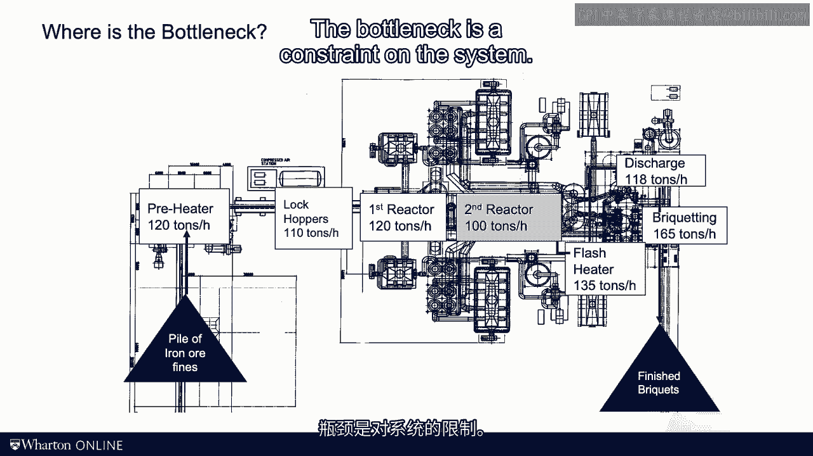

# 沃顿商学院《商务基础》课程笔记｜P120：4_绘制过程流程图 📊

在本节课中，我们将学习如何绘制和分析过程流程图。这是一种将复杂操作可视化的强大工具，能帮助我们识别流程中的瓶颈，从而理解整个系统的产能。

---

上一节我们介绍了过程分析的基本框架。本节中，我们来看看如何将这个框架应用于一个具体的案例——一个铁矿石加工厂，并绘制其过程流程图。

这个工厂位于明尼苏达州，它将铁矿石粉作为输入，生产出铁矿石砖作为输出。整个工厂规模庞大，结构复杂。

为了理解其运作，我们不采用工程图纸的视角，而是使用过程流程图的视角。在过程流程图中，我们使用三种基本元素：
*   **方框**：代表**资源**，即那些为流动单元增加价值、推动其前进的环节（如机器）。
*   **箭头**：代表**流动方向**，指示流程的顺序。
*   **三角形**：代表**库存**或**缓冲区**，是流动单元等待处理的地方。

以下是该铁矿石加工厂的过程流程图，它与工厂的工程图纸叠加在一起，以便更直观地理解：

图中左侧的矿石粉堆是输入，右侧的砖块堆是输出。中间的主流程包含七个处理步骤（七个方框）：预热器、锁斗、第一反应器、第二反应器、闪蒸器、卸料机和最后的制砖机。三角形则代表了流程中各环节之间的库存。

---

理解了流程图的构成后，我们的核心目标是找出流程的瓶颈。瓶颈决定了整个系统的最大产能。

要找到瓶颈，我们必须关注**资源**及其**产能**。库存（三角形）不参与产能竞争，因此不是瓶颈的候选。我们需要找出产能最低的那个资源。

以下是该工厂各环节的产能数据：
*   预热器：105 吨/小时
*   锁斗：140 吨/小时
*   第一反应器：110 吨/小时
*   **第二反应器：100 吨/小时**
*   闪蒸器：180 吨/小时
*   卸料机：170 吨/小时
*   制砖机：120 吨/小时

通过比较可以看出，**第二反应器**的产能最低，为 **100 吨/小时**。因此，它就是整个流程的**瓶颈**。

根据“链条的强度取决于其最薄弱一环”的原理，该流程的**流程产能**就等于瓶颈的产能，即 **100 吨/小时**。

---

在确定了流程产能后，我们可以计算实际产出，即**流动率**。流动率由需求和产能中较小的那个决定。

**流动率 = min(需求， 流程产能)**

假设有足够的铁矿石原料和市场需求，那么该工厂的流动率就等于其流程产能，即 **100 吨/小时**。

理解并改进一个运营系统，即使像铁矿石厂这样复杂，也并不一定需要工程学位。许多技术细节（如各种反应器、热交换器的工作原理）固然重要，但**对于大多数商业计算而言，最关键的数字就是瓶颈处的产能**。这个数字是系统的约束，也是本课程最核心的概念。

---

本节课中我们一起学习了如何绘制过程流程图，并通过识别资源产能找到了系统的瓶颈。请记住，当您分析任何运营操作时，首要问题始终是：**瓶颈在哪里？**

我们下节课再见。

[空白音频]