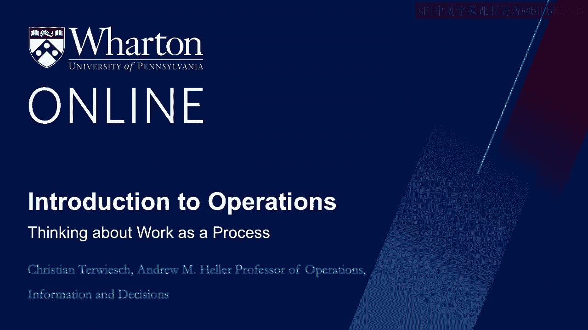
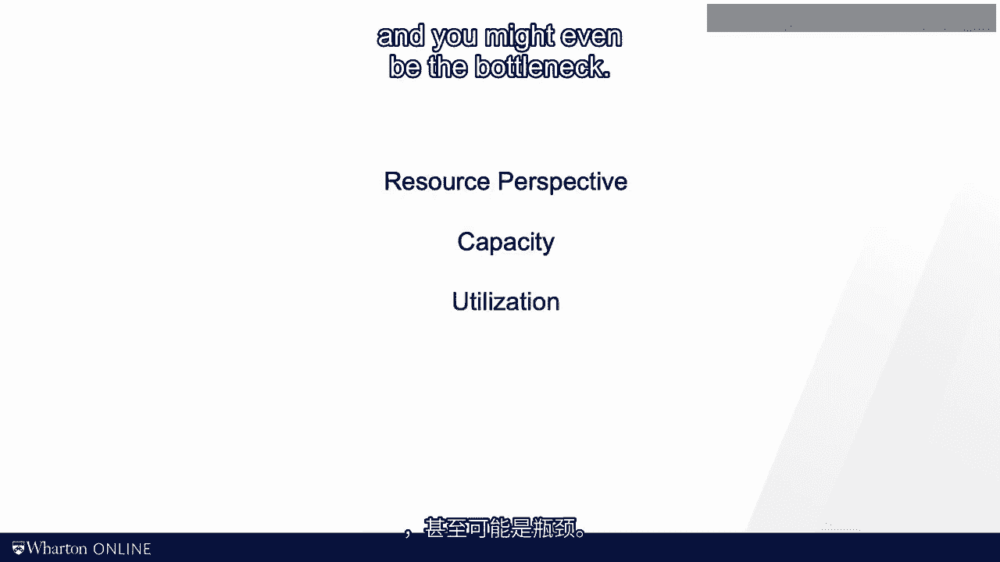
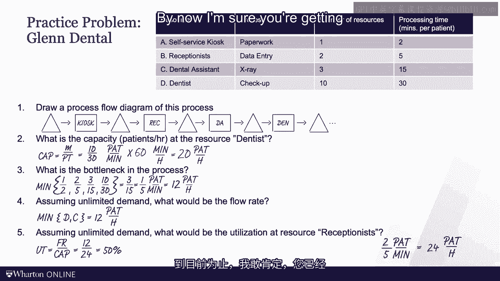

# 沃顿商学院《商务基础》｜Business Foundations Specialization｜（中英字幕） - P121：5_把工作看作是一个过程.zh_en - GPT中英字幕课程资源 - BV1R34y1c74c

## 📊 课程概述：整合流程分析的双重视角

在本节课中，我们将学习如何通过流程分析，将运营中的两个核心视角——**流动单元**的视角和**资源**的视角——统一起来。我们将通过一个实践问题来巩固之前介绍的所有定义，包括流程时间、产能、瓶颈以及三个关键指标：流动率、流动时间和库存。

---

## 🔄 资源的视角

上一节我们介绍了流程分析的基本概念，本节中我们来看看流程中“资源”的视角。

想象你在一个汽车工厂工作，负责安装座椅。每隔一两分钟，就有一辆新车到达装配线，你重复着安装座椅的操作。同样，在放射科，每隔大约15分钟，就会有一份病人部位的影像送来，你需要进行诊断、阅读影像并撰写报告。这就是流程中资源的视角。

作为资源，你拥有**产能**，存在**利用率**，甚至可能成为整个流程的**瓶颈**。

---

## 👁️ 观察流程：大野耐一的圆圈

大野耐一被誉为丰田生产系统之父，是运营管理领域最具影响力的思想家之一。他有一个著名的教学方法：在工厂地板上画一个粉笔圈，让他的学生站在圈内观察流程。大野会检查他们的观察报告，如果他们未能发现他希望看到的浪费和低效之处，他们就必须继续站在圈内观察。

在我的课程中，你只需要观看视频，而不必整天站在粉笔圈里。

---

## 🚗 流动单元的视角

与资源视角形成对比的是**流动单元**的视角。作为病人，你在接受医疗服务（如放射科预约）时，很可能体验过这种视角。

为了展示流动单元视角，我们可以看看特斯拉装配过程的视频。你将自己“附着”在流动单元（如一块金属）上，然后跟随它流经整个流程。你看到一个接一个的资源，在装配线上逐步前进，最终变成一辆完整的汽车。

---

## 🧩 流程分析：统一双重视角

流程分析的美妙之处在于，它能将流动单元的视角和资源的视角结合在一张图中。

以下是一个简化的特斯拉工厂流程流图。你可以用流动单元的眼光来阅读这张图，关注其在工厂中的旅程和流动时间；也可以从特定资源（如喷漆车间）的视角出发，只关注其产能。无论采取哪种视角，你都必须处理**库存**问题。

库存是系统中流动单元的数量。当需求和供应不匹配时，库存就会出现。需求可能快速变化，或者供应商调整缓慢，这会导致需求过剩或供应过剩。

在汽车的例子中，库存可能是一堆等待需求的汽车（历史上大多数汽车公司的默认情况），也可能是等待汽车的客户数量（例如，特斯拉曾有数十万客户等待Model 3）。如果我们把客户定义为流动单元，那么等待汽车的客户数量就是库存。

我知道这有点令人困惑，因为它与会计上的定义不同。这不是说运营是对的而会计是错的，这只是看待世界（包括库存）的另一种方式。

*   在生产实物产品时，库存可以反映等待的**物品**（如小部件、汽车、iPhone）。
*   库存也可以反映等待的**客户**。

然而，在处理服务运营时，通常只有一种情况：库存总是与等待的客户相关。因为你无法将一次心脏手术或一次投资咨询“生产”出来存入库存。

---

## 📝 模块回顾与核心能力

既然我们已接近本模块的尾声，现在是回顾我们所学内容的好时机。

我们学习了大量定义，从流动单元、处理时间到产能，再到我最喜欢的三个指标：**流动率**、**流动时间**和**库存**。

更重要的是，我希望你现在能够胜任并自信地完成以下任务：

*   能够将一个运营活动绘制成流程流图。
*   能够找出单个资源的产能，并确定流程中的瓶颈。
*   能够计算流动率（需求与产能的最小值），并找出资源的利用率。

以下三个定义和公式在解决实践问题时将非常有用：

*   **产能**：`产能 = 资源数量 / 处理时间`
*   **流动率**：`流动率 = min(需求, 产能)`
*   **利用率**：`利用率 = 流动率 / 产能`

---

## 🧠 实践问题：费城牙科诊所的患者流

好了，这个模块我已经讲得够多了。现在轮到你来实践了。

我将展示一个实践问题，并给你时间思考。请你阅读问题，暂停视频，尝试找出问题的答案，然后再播放视频看我如何解答。

这个实践问题描述了费城一家牙科诊所的患者流程。请尝试回答以下问题。现在请暂停视频。

---

### 问题解答

让我们一起来看这个问题。首先绘制流程流图。

我们从一个代表患者需要自助登记的小三角形（库存）开始。之后是其他步骤：另一个代表患者在接待员处等待的三角形，一个处理框（接待员），再一个在牙科助理前的三角形，然后是牙科助理，接着是牙医前的最后一个三角形，最后是牙医。看牙医后，患者通常回家，所以没有“已完成患者”的三角形。

**1. 牙医的产能是多少？**

牙医是一种资源，其产能计算公式为：`产能 = 资源数量 / 处理时间`。
我们有10名牙医，每人看一名患者需要30分钟。
所以产能是 `10 / 30 = 1/3` 名患者/分钟。
换算成小时：`(1/3) * 60 = 20` 名患者/小时。

**2. 流程中的瓶颈是什么？**

瓶颈是产能最低的资源。我们需要计算并比较每个环节的产能：
*   自助服务机：`1 / 2 = 0.5` 名患者/分钟
*   接待员：`2 / 5 = 0.4` 名患者/分钟
*   牙科助理：`3 / 15 = 0.2` 名患者/分钟
*   牙医：`10 / 30 ≈ 0.333` 名患者/分钟

产能最低的是牙科助理：`0.2` 名患者/分钟，即 `12` 名患者/小时。这就是瓶颈，也决定了整个流程的产能。

**3. 流程的流动率是多少？**

流动率是需求与产能的最小值。题目暗示需求充足（无限），因此流动率等于流程产能，即 **12名患者/小时**。

**4. 接待员的利用率是多少？**

利用率是流动率除以该资源的产能。
接待员的产能是 `0.4` 名患者/分钟，即 `24` 名患者/小时。
流动率是 `12` 名患者/小时。
因此，利用率 = `12 / 24 = 0.5` 或 **50%**。

---

## 🎯 课程总结

本节课中，我们一起学习了如何通过流程分析整合资源与流动单元的双重视角。我们回顾了产能、瓶颈、流动率、利用率和库存等核心概念，并通过一个牙科诊所的案例进行了实践应用。

现在，你应该对产能、利用率、瓶颈以及三个关键指标——库存、流动率和流动时间——有了更深入的理解。这是任何优秀流程分析的基础。

在接下来的视频中，我们将在此基础上继续构建，增加一些诊断性的绩效指标，并开始思考第一组运营改进措施。

我们下个模块再见。