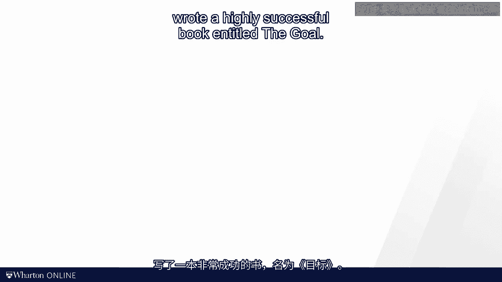
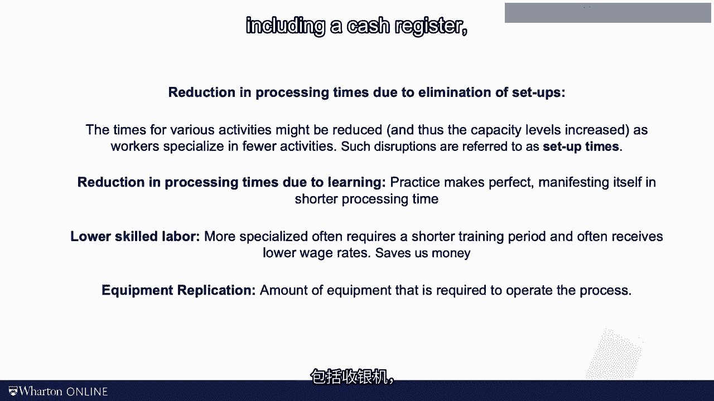

# 沃顿商学院《商务基础》｜Business Foundations Specialization｜（中英字幕） - P124：8_改进流程的工具.zh_en - GPT中英字幕课程资源 - BV1R34y1c74c

The reason why we analyze processes， the reason why we compute things such as idle time and。

labor utilization levels or the cost of direct labor is of course to improve the process。

We want to make things better。 In today's video I will introduce three tools that will help you improve your process。

I will refer to them as offloading the bottleneck， balancing the line using tech time， and we'll。

talk about specialization。 Let's start with the idea of offloading the bottleneck。 In 1984。

Ellie Goldret wrote a highly successful book entitled "The Goal。"。

Hard to believe that the book is about operations management and its operations management textbook。

written as a novel。 Unlike my books， it has sold millions of copies。

The hero of the book is a fictitious plan manager by the name of Alex， who discovers the。

principles of process analysis。 Alex has his epiphany when he takes a group of boy scouts for hiking the forest。

The group takes a single file path and sets us close to each other。 But the longer they march。

the more the group spreads out。 The boys in the front tend to be the fast ones。

so they walk at their own rate leaving， the others behind。

One shall be scoured by the name of Herbie， is holding the group back。

He has hundreds of meters of empty trail in front of him， and a group of impatient boy， scouts that。

due to the narrowness of the trail， cannot overtake him behind him。

Alex realizes that this hike has a lot in common with his production process。

He associates the speed with which the entire group is moving with the flow rate in the plant。

Just as the plant cannot produce faster than the bottleneck， the group of boy scouts cannot。

walk faster than Herbie。 So any process improvement starts by looking at the bottleneck。

In the case of Herbie， Alex soon found out that this ability to walk as fast as the other。

kids was not just constrained by his theological limitations， but also by Herbie carrying a。

rather large and heavy backpack with plenty of snacks inside。

To improve the hiking speed of the group， Alex then takes Herbie's backpack and puts the。

content up among the other faster scouts。 Yes， those scouts are now slowed down a bit。

but Herbie is able to walk faster， and that， is all that counts。 In general。

we refer to the improvement strategy of moving work away from the bottleneck as。

"offloading the bottleneck"。 Offloading the bottleneck can take mind to perform。 First。

we can think about reassigning activities to other resources with more capacity， an improvement。

strategy that we will refer to in a moment as "line balancing"。 Second。

we can think about automating some of the activities， consuming time at the bottleneck。

by using technology。 For example， we might be able to automate the dispensing of a wrapping paper。

which has， the potential of reducing the processing time for employee number two。 As a side note。

McDonald's key innovations on their way to becoming the fast food empire。

was the invention of a condiment dispenser， which would provide an exact supply of ketchup。

or mayonnaise by the pressing of a button。 Third， we can think about outsourcing some of the activities consuming time at the bottleneck。

Imagine it would be possible to put the condiments in the back at the beginning of the shift。

or to even purchase back that are already loaded with condiments。

This would reduce the time for employee number two， which， given that employee number two。

is the bottleneck， would increase the capacity of the process。 Next。

let's turn to line balancing and tack time。 In our prior calculations。

we found the capacity of the three-person line to be about 78 sandwiches， per hour。

What are you doing when demand is higher？ The busy stores at lunchtime have demands all the way up to 160 sandwiches an hour。

And for that， well， we clearly need more labor。 So I want you to wrestle with two questions while you put me on pause。

The first one is about the cycle time。 What cycle time do you need to hit to serve 160 customers per hour？

And the second one is on staffing。 How many workers will you need？ Okay， put me on pause now。

All right， here we go again。 Let's get this done together。

So what cycle time do you need to meet the amount of 160 sandwiches per hour？ Well。

there are 3600 seconds in an hour， and I want to make myself 160 sandwiches during， that hour。

So the hours cancel out， and I'm going to get 22。5 seconds per sandwich。

It is the cycle time I need to achieve to meet demand。 In a moment。

we're going to refer to this number as the tech time。 That's going to be the tech of demand。

Tech really tells us how fast we have to run， and in what cadence we have to operate to。

be in sync with demand。 That's the whole idea of tech。

Tech also helps us find out how many people we need to hire at the very minimum。

That number is not going to be an exact number， but it gives us a lower bound。

The logic behind this is as follows。 We're going to look here at the 120 seconds of labor that I know are in a sandwich。

That is our labor content， 120 seconds per unit。 And we're going to divide it by the tech time。

the 22。5 seconds per unit。 And so we have seconds per unit in the nominator。

and also seconds per unit in the denominator， so that cancels out。

And we're going to go and get a staffing level of a minimum of 5。33。

If we round this up to the next integer， I see that at the minimum， I need six workers。

It's not going to be exact， but it's the target。 We're going to see in the next slide。

that they actually would need a little bit more， labor than that。

But this number really provides a first-grid shot。 So let me formalize this。

We formally now define tech time as a ratio between the available time and the demand rate。

So available time was in our example， 3600 seconds per hour， and we want to have 160 units per。

hour of demand。 So the tech is 22。5 seconds per unit。

The word "tact" comes from the German word "tacht"， which is used in the musical world。

We want to make sure that not every musician is playing a taser or her own pace， but everybody。

stays in sync。 So I think it's very appropriate to use the word "tact" in the case of process analysis。

Let me emphasize that a "tact" time is an ambition。 It is a target。

It does not depend on the capacity or the capability of the process。

It's just turning demand into a target cycle time for the process。

Once we have done the "tact" time， we can compute the target manpower。 The target manpower。

as we saw， is the ratio between the labor content and the tactime。 In our case， it was 5。33 person。

which was 120 seconds of labor content， divided by 22。5， seconds of the tact per unit。 So ideally。

we would like to hire 5。33 persons。 Since you cannot hire a third of a worker。

this is clearly not feasible， and we were rounding， this up to 6。 As we were seeing in a moment。

even 6 might not be enough。 The reason for that is that work cannot easily be divided into smaller chunks。

So for example， the cash register operation here， that takes 20 seconds。

It is a block or a chunk that we cannot move easily， force and pack。

And so you notice when you're allocating the activities across the resources here， the， employees。

even the bottleneck has some slack， has some idle time relative to the tactime。 Again。

line balancing means that you take the tactime 22。5 seconds in our example， and。

then you spread out the activities from greeting the customer all the way to the cash register。

and you take to the constraint that no individual should have more work and their processing。

time than the tactime。 If you notice you're going above the tactime， well。

then you just move the work to the next， resource and continue until you found out that in this case。

we'll actually need 7 employees。 Now let me point out some subtlety that I find somewhat counterintuitive。

It's counterintuitive， at least for me， not sure about you。 So here because of the demand rate。

we said that even the bottleneck would have some idle， time。 Let's ignore that。

Let's make us capacity constraint and assume that we are running at the rate of the bottleneck。

which is producing a unit every 21 seconds。 We can then compute how much idle time each of the workers has。

It's going to be 5 seconds for the first worker， 0 for the second worker， 2 seconds here for。

the next one， 7 seconds， 5 seconds， 7 seconds and 1 second。 Now how much idle time do we now have？

So we have 5 plus 0 plus 2 plus 7 plus 5 plus 7 plus 1。 We have 27 seconds per unit of idle time。

Do you remember how much idle time we had with 3 workers？ It was 18。 Well， less than the 27。

So as we specialize， that idle time is going to go up。 The more workers take on the work。

the harder will it be to find a perfect balance。 As I said， I find this counter-intuitive。

Today we talked about improvement strategies。 We talked about offloading the bottleneck。

We talked about balancing the line using the concept of tech time。

We have not yet talked about specialization。 So here we go。 Adam Smith。

the famous philosopher and economist， wrote about the benefits of specialization already。

in the 18th century。 First looked at a pin factory。

You see a picture of a pin factory here and a quote from Adam Smith that nicely captures。

the concept of specialization。 Now it is a stretch to move from a pin factory to a subway restaurant。

but let me try。 What benefits might we get in our subway restaurant as a result of specialization？

I propose that we would benefit in at least four ways。 First。

think of a reduction in processing times due to elimination of setups。

The times of the various activities might be reduced and thus the capacity levels increased。

as workers specialized in fewer activities。 For example。

an employee who is doing all the activities might have to take off his gloves。

when he switches between touching a sandwich and operating the cash register， which would。

increase his or her processing time。 A person who does nothing but operate the cash register would not face such an inconvenience。

Oftentimes such disruptions are referred to as setup times。 Second。

I can imagine a reduction in processing times due to learning。

If you cut a thousand tomatoes per day， chances are you'll get pretty good at that。 Simply put。

practice makes perfect and this perfection also manifests itself in shorter， processing times。

Third， we can potentially get away with lower skilled labor。

More specialized labor tends to require a shorter training period and oftentimes receives。

lower wages。 It takes less time to teach an employee how to assemble a review mirror compared to teaching。

her how to assemble an entire car。 So even if specialization does not decrease the processing times。

it can still save us， money。 Finally， I think about the need for equipment replication。

Another benefit of the specialized process flow relates to the amount of equipment that。

is needed to operate the process。 Six parallelization in which each employee carries out all the activities would require。

that each employee would get her own equipment， including a cash register， which is rather。

expensive。 Again all of these benefits have to be weighed against the cost of specialization。

As we specialize， the idle time is going up， which at least to me was somewhat counterintuitive。

Moreover the coordination needs and the interdependence among the workers are increasing。

If I have only one person who can slice tomatoes and that person does not show up for the job。

I have a problem。 In contrast， if each employee is capable of making a whole sandwich from beginning to。

end， my process is much more robust。 This might not be a big deal in the production of a sandwich。

but it is a super hot topic， in producing cars and phones in today's global and interdependence supply chains。

Okay， enough about the 18th century。 In the next video we will talk about flying to Mars。

It should be a nice contrast to the regression in history。 See you then。 [BLANK_AUDIO]。
