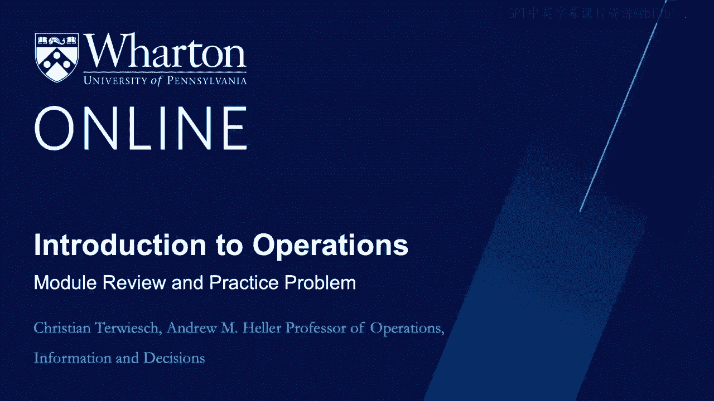
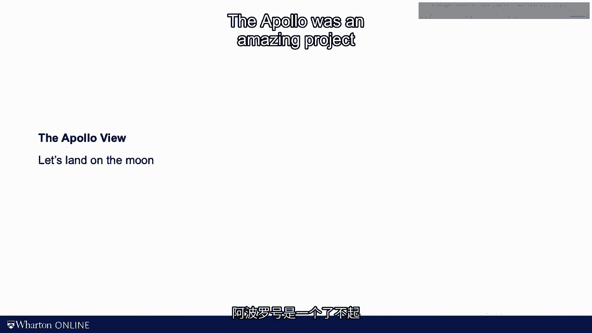
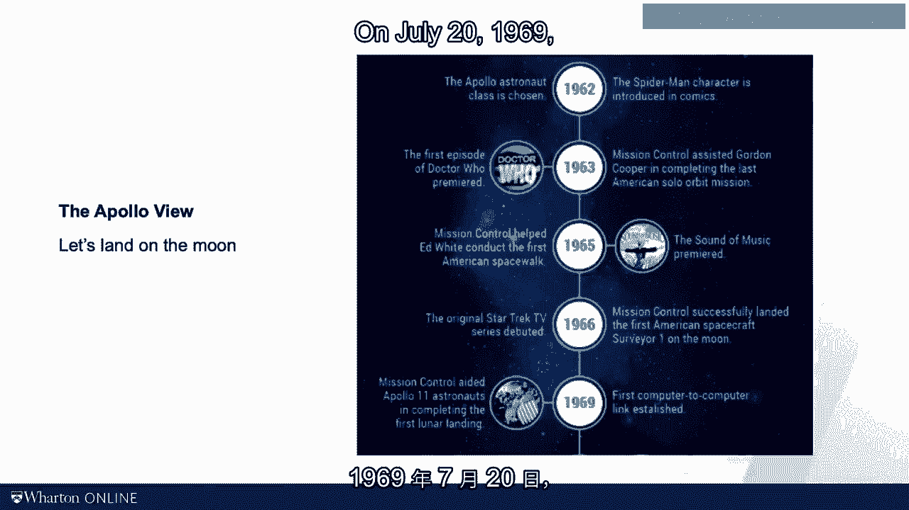
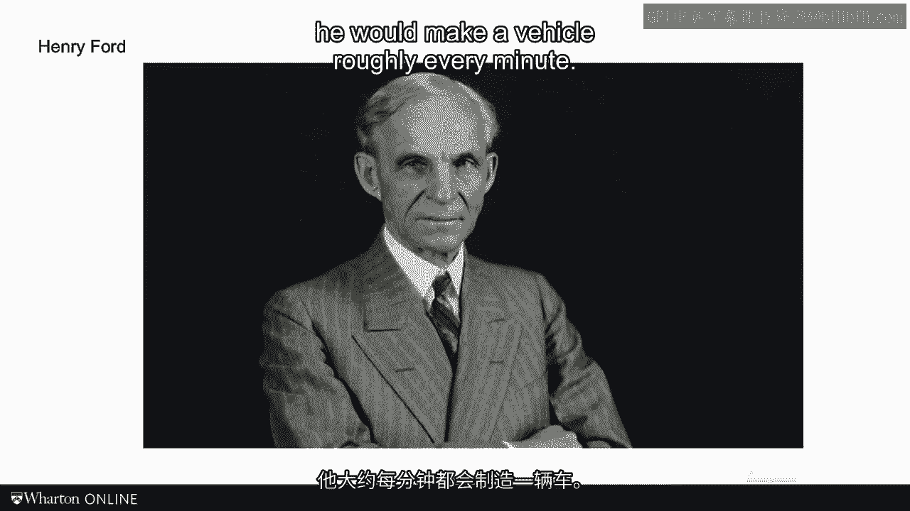

# 沃顿商学院《商务基础》｜Business Foundations Specialization｜（中英字幕） - P125：9_学习回顾和实践问题.zh_en - GPT中英字幕课程资源 - BV1R34y1c74c

In the last video， I promised you will be flying to Mars today。

I will keep my word， but first， I want to annoy you with some rather earthly calculations。

I want to first repeat the definitions that we have covered until now in this module。

In the set of videos we talked about the labor content， the cycle time， the idle time。

the labor utilization， and the cost of direct labor。

We also talked about the idea of line balancing。 Now that we have arrived at the end of this module。

I want you to be comfortable computing the cycle time。

finding the labor content and the labor utilization， and computing the cost of direct labor。

You should also be able to determine how long it takes to produce X units starting with an empty system。

And finally， you should now be able to find tech time and the target manpower。

as well to think about some process improvement strategies。

Down here you see the key formulas that you will need to remember from this module。

The problem I have chosen for this module is Mr。 Kears， here's someone。 Mr。

K is a problem that's somewhat similar to the sub-work case in the sense that there are multiple activities that are done by a set of workers。

Let me emphasize that there are five activities。 There are five activities， not five workers。

There are three workers and five activities， and the five activities are spread out。

as you can see in the question。 As usual， I want you to put me on hold while you're tackling the problem by yourself first。

So pause now。 Alright， here we go again。 We start by looking at the bottleneck。 And for that。

we draw a simple process flow diagram。 So we have a box for the first worker or a triangle。

a box for the second worker， another triangle， and a box for the third worker。

So then it's our process flow diagram。 And then for the bottleneck。

we need to find the capacity level， and that requires computing the processing times first。

The processing times we are at 10 minutes per guess at the first， 20 at the second。

and 30 minutes per guess at the third resource。 And to get to the capacity level。

what we do is we're going to take M divided by the processing time。

And since it's a one worker per station， it's simply one divided by the processing time。

So it is one divided by 10 as a capacity for the first resource， one by 20， one by 30。 Okay。

And this is now expressed in guess per minute。 Alright。

that makes it clear that the third resource is going to be the bottleneck。

and that answers our question。 Next， let's look at average labor utilization。

I mentioned in the module two ways of finding the average labor utilization。

And so let me illustrate how both of them would work。

The labor utilization we said is labor content， which is a sum of the processing time。

divided by three times the cycle time。 Okay， so what does this mean？

The labor content is 10 plus 20 plus 30， the sum of the processing time。

and that's 60 minutes per unit。 And we're going to be on a 30 minute cycle。

so three times 30 is 90 minutes， which gets us a 66% labor utilization。

Now the other way that I mentioned in the video， we could compute the same thing by looking at the labor content。

and then divide it by the labor content plus the idle time。 Now again。

we're on a 30 minute cycle here， and so that means that my first resource has a 20 minutes of an idle time。

processing time is 10 minutes， and the cycle time is 30， so 20 minutes of an idle time。

The second one has 10 minutes of idle time， and the third one is zero。

So that means we have a total idle time of 30 minutes。

So 60 divided by 60 plus 30 is going to be my labor utilization。 Same result。

And then finally at the wage rate of $20 per hour， what is the cost of direct labor per customer？

For that， we have to look at three people， each make 20 bucks per hour， so it's $60 per hour。

and we're going to divide it by the floor rate。 We're serving two guests per hour。

that's our floor rate。 And so the per hour is going to cancel out。

and we're going to get a cost of direct labor that is $30 per guest。

Here's the next batch of questions。 How long would it take the process to serve 10 customers starting out empty？

Well， let's think about that。 How long would it take to serve one customer？ Well。

that's going to be 10 minutes at the first resource， the first employee。

20 minutes at the second employee， 30 minutes at the third employee。

so after 60 minutes we're going to have our first customer out。

From then onwards we need to serve nine more， and those nine are going to come out at the rate of the cycle time。

which is 30。 So 60 plus nine times 30， and that gives us 330 minutes。 All right。

how could this process be improved by offloading the bottling？ Well。

that question kind of gives the way the answer， so we have to move work away from the bottleneck。

And we saw the bottleneck was station number three， right？

And so when you look at the activities here， station number three is doing the hair。

but also spending five minutes here on the checkout。

And if you could move these five minutes to somebody who has less work to do。

and the key suspect I guess here is going to be station number one。

you would offload the bottleneck。 So in short， what you would be doing here is you would move five minutes of work from station number three。

the third employee， which is currently the bottleneck， and this is going to be super busy。

You're going to take these five minutes to station number one who really has nothing to do。

That doesn't always work because it might be precedence relationship。

It's a good move you should consider。 All right， what's the tack time that we need to achieve if we want to have 40 customers per day served？

Remember， when we look at tack time， we look at the available times of 10 hours or 600 minutes per day。

and we're going to divide it by the demand rate， which we said is a target demand。

and we said that this year 40 customers per day。 So the per day cancels out。

and we have 600 by 40 that is 15 minutes between customers。 That's going to be our tack。

We're going to be serving a customer every 15 minutes。

And the tack time intern allows us to compute the target manpower。 For the target manpower。

remember we have to look at the labor content， and the labor content divided by the tactics simply going to give us a target manpower。

So again， labor content， we already computed there was 60 minutes per customer。

and we're going to divide it by the 15 minutes per customer that we just computed as a tack。

So that means at the very minimum， if everything goes super smoothly and there's no idle time。

we're going to need a total of four employees。 My philosophy， the observation of today。

relates to the difference between project management and process management。

Many of you likely have experience with managing a project。 You define activities， set an end goal。

and you look for something known as a critical path。 Recently。

I heard an interesting quote from Elon Musk。 Think of Elon Musk whatever you like。

but Tesla and SpaceX are arguably remarkable businesses。

Elon was talking a bit about his favorite topic， which is flying to Mars。

He said flying to Mars is more of a D-day operation than it is an Apollo mission。

Let me repeat this。 Flying to Mars is more of a D-day operation than it is an Apollo mission。

What did he mean？ The Apollo was an amazing project with a single mission and a historical success。

On July 20， 1969， NASA landed the Apollo 11 and its astronauts on the moon。

Personally， I don't remember it。 I was exactly 100 days old when that happened。

Land a man on the moon。 Though ultimately， multiple people walked on the surface of the moon。

the entire management focus of the Apollo mission was on landing one man on the moon。

The mission of D-day and the invasion of Normandy by the Western Allied forces was different。

It was not about landing one boat in Normandy。 On June 6， 1944， the Americans。

British and the French began sending over 150，000 soldiers to Normandy coastline。

including the famous Utah Beach， Omaha Beach， Juneo Beach， and Swart Beach。

I like this picture here of American airplane production before the invasion。

The focus of management was not to build a boat or build a plane。 It was building many of them。

Process management ultimately only makes sense if you are repeating something。

Elon Musk doesn't want to build one rocket to fly to Mars。

He intends and in fact has even started to build many starships。

His dream is to establish a colony on Mars。 For management problems， so you only do something once。

you should take a course on project management。 If however you want to do something multiple times。

you have to think about process flows。 For most of us， I propose。

planning a wedding is a project you plan for one marriage。

The wedding planner in contrast thinks that weddings is a process。 Other examples。

The more units flow through the process， the easier would it be to use process analysis as a tool。

When in the late 1800s， Gottlieb Diamond built the first car。

he at first did think about bottlenecks， utilization or inventory。

His focus was on managing one project which was building a beautiful car。

When three decades later Henry Ford mass produced cars。

he would make a vehicle roughly every minute。

For Ford， it was all about the process。 Similarly in healthcare。

big emergency rooms see between 100 and 200 patients per day。

Even something medically challenging as a bypass surgery is not thought of as a process。

In contrast when Dr。 Daniel Williams preferred to perform the first heart surgery。

he most likely thought of it as a project。 So you see that when work gets repeated。

when we move from the first units to the end unit。

we need to change our focus on project management to process management。

And that is really what this course is all about。 [BLANK_AUDIO]。
