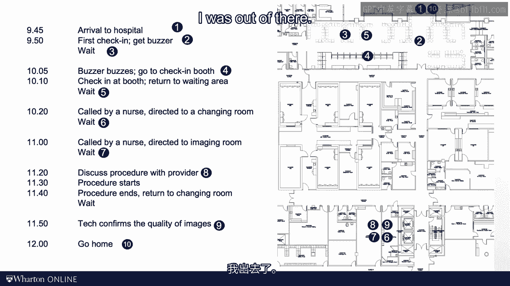

# 沃顿商学院《商务基础》｜Business Foundations Specialization｜（中英字幕） - P126：10_浪费的DNA.zh_en - GPT中英字幕课程资源 - BV1R34y1c74c

Welcome to the module on lean operations。 The goal of this module is to help you spot。

waste in the processes that you analyze。 Though each and every process is somewhat unique。

we will see that there is a common pattern when we look for inefficiencies。 What I want。

you to do in this module is really learn how to figure out the DNA of waste。 The module。

is relatively light on math， but please don't hold this against the idea of lean。 And we。

also emphasize that the idea of lean operation is really present throughout all modules in。

this course rather than being squeezed into this single module。 As often， let me kick。

off this module with a personal story。 Now a little while ago， I needed to get an MRI。

with a contrast agent， which is a relatively simple radiology procedure。 And so I got。

an appointment here at Penn Medicine's radiology department for 10 o'clock， 10 a。m。 She had an MRI。

I arrived at the hospital at 9 45。 I arrived at the radiology， I gave。

them my name and they conferred my appointment time。 And then to my pleasant surprise， similar。

to what you see at some restaurants where you are checking in to wait for a table， the。

hospital gave me a little buzzer。 I said to myself， "That's kind of cool。" They really。

thought about the waiting time experience here。 So I took my buzzer and I sat down。 To。

my even bigger delight， about 15 minutes later， at 10 or 5， the buzzer started buzzing。 That。

was fast， I thought。 Unfortunately， it was not my turn to be examined as scheduled with。

my radiology appointment。 Instead， I was now allowed to really check in。 So I checked。

in at the different check-in booths at 10 10， go back and wait it。 Now at 10 20， also， not too bad。

eventually the nurse called me。 I was directed to the changing room over。

here in this part of the hospital。 I changed and I waited。 I was stuck in a room with a。

television that couldn't be turned off。 Finally， at 11 o'clock， I was called by the。

nurse and she directed me to the imaging room。 I waited in the imaging room for about another。

20 minutes until the radiologist showed up。 For a few minutes， he explained me what he。

was about to do with me。 We had the procedure which took about 10 minutes。 I was directed。

back to the changing room and instructed to wait to make sure that the images turned out， alright。

Then I could ultimately change back into a normal close and about two hours later， at 12 o'clock。

I was out of there。 Let me ask you this。 Where did you see inefficiencies。

during my morning as I journeyed through the hospital？ We'll get back to some inefficiencies。

of this story later on in this module。 For now， I wanted to talk about two grandmasters。

of operations management。 Let me start with Fredrik Wences of Taylor。 Taylor wrote a famous。

book "The Principles of Scientific Management"。 He wrote this book well over 100 years ago。

In his studies of workers， Taylor believed in careful and systematic observation。 Oftentimes。

he was able to obtain dramatic improvements in productivity， typically it's a waste reduction。

picking the right man and tools for the job and setting the right incentives。 For the。

better or for the worse today the word "tailarism" is unfortunately used more as a curse word。

One of the reasons for Taylor's decline in popularity is that Taylor had a rather difficult。

relationship when it came to human beings。 He was interested in their muscles， not in， their brains。

But please allow me to nevertheless share two quotes with you from the principles。

of scientific management。 So first Taylor wrote， "We can see and feel the waste of material。

and things。 Awkward， inefficient or ill-directed movements of man however， give nothing visible。

or tangible behind。" And then the other quote I wanted to share is kind of weird but I really。

like this one。 Employers derive their knowledge of how much of a given class of work can be。

done in a day from either their own experience which has frequently grown hazy with age， from。

casual and unsystematic observation of their man or at best from records。 I really like。

these quotes。 I think they are as important now as they were 100 years ago。 At the heart。

of this modulus the idea that we need to measure the amount of work that is done by。

our resources and that measurement is hard。 It is really hard。 The data is not easily available。

but the fact that it is hard shouldn't keep us from doing it。 The second gentleman I would。

like to quote is Thijeone。 Thijeone was really seen as a father of the Toyota production system。

So two owner quotes。 First owner wrote， "Moving is not working。 The Toyota style is not to。

create results by working hard。" And then the second quote reads， "All we are doing。

is we are looking at the timeline from the moment the customer gives us an order to the。

point we collect the cash。" As I think back to my radiology experience。

then begin with the second owner quote。 Here is my timeline from the moment I entered the。

hospital to the moment I left the hospital。 You can see that only a small fraction of。

that time had really to do anything with medical imaging。 I needed that day about 20 minutes。

of care but I spent two hours and 15 minutes in the hospital。 So that was really a waste。

of my time。 Now maybe the hospital design or process was the objective of maximizing hospital。

efficiency rather than optimizing for the patient experience after all hospitals are under significant。

amount of cost pressure。 So maybe they did a good job on efficiency and not on my willingness。

to pay。 So let's think about the hospital efficiency。 How about the person who gave me， the buzzer？

Was that person adding value？ A massive waiting room in the lobby？ Was that。

needed for improving my patient experience？ How about the person who checked me in and。

confirmed my paperwork？ Was he or she adding value？ So you see where I'm going with this。

As an example of hospital resources， let's look at space。 Space is really expensive for。

hospital operations。 Hospitals are really space constrained and have to pay for expensive。

real estate。 Since I had consulted for this hospital at prior times， I asked the management。

to share a floor plan of the radiology unit with me。 Now let me ask you this， which space。

on this floor plan adds value。 Right。 At the end of the day， the value is generated in the。

imaging room。 Given that I was waiting for 20 minutes in the imaging room， that room and。

that expensive equipment in there were clearly not running at a high level of utilization。

Now given that patients don't spend 20 minutes in the department， but over two hours， we have。

to put these patients somewhere。 And what are patients sitting around？ Exactly。 They're， inventory。

And an inventory of patients requires space。 And what do you need when you have elderly。

man like me sit around waiting for an hour， especially when you think of a water fountain， nearby？

Let's not go there。 As you can see from this example， hospitals， the hospitals。

that are really short in space， but they really primarily consist out of lobbies， waiting， rooms。

restrooms， utility rooms and so on。 All of this space exists for a good reason。 Don't， get me wrong。

But most of this space doesn't add value to the patient。 This gets me back。

to my process analysis module。 Remember how I introduced two perspectives to the process。

in an operation？ We can take the floor units perspective in the case that would be the。

patient and look for where the patient wastes the time。 This was really the idea of owner。

talking about the timeline。 We can also take the perspective of the resource。 It is the。

employee's real estate， the imaging machine。 That is a much more tailor-risk perspective。

The waste of my time or the waste of the time of the resources here， note that none of this。

really has left a record behind。 This is why I like the tailor quotes so much。 Awkward。

inefficient or indirect movements of man leave nothing visible or tangible behind。 So one。

of the key things we need to do in this module is to learn how to carefully observe how work。

is done。 See you in the next video。 [BLANK_AUDIO]。
