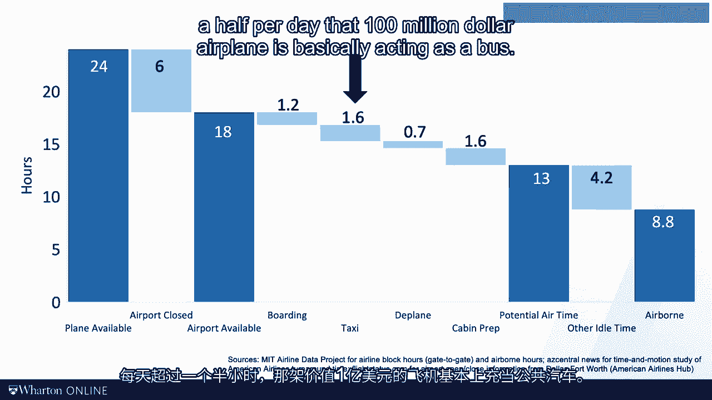

# 沃顿商学院《商务基础》｜Business Foundations Specialization｜（中英字幕） - P127：11_浪费资源的时间.zh_en - GPT中英字幕课程资源 - BV1R34y1c74c

As I mentioned in the opening video， we need to be mindful of the time that is wasted。

at resources， as well as the time it is wasted by our customers， by our flow unit。

Today we will start looking at the time wasted at the resource。 Again。

I would like to start this video with a medical story。

A number of years ago my colleague Evan Feudson and I did a study in the ICU at the Children's。

Hospital of Philadelphia。 My research question was simple。

We wanted to know what fraction of time an ICU bed was used to provide the care it can。

and should provide and how much of the time was wasted。

As we were launching our study I felt reminded of Taylor's words， "waste of time， leave。

nothing tangible behind。"， How true？ Where would we go and find the data of wasted time？

Like in any modern operation there was no shortage of data。 Medical records， billing records。

hospital IT systems， you name it。 But where would we find how much time was wasted？

In our study of the ICU capacity at shop， here's what Evan and I did。

We found a motivated student and that student would go to the ICU and go around the beds。

every hour， over and over again。 It's a really academic approach and I feel somewhat guilty of asking our students to。

spend so much time。 But I still think that this was the only way to get the job done。 Anyway。

this approach allowed us to collect thousands of hours of our observations on。

ICU beds and how they were used。 We then classified these hours as follows。

Here you see the hours that we have data for， the hours the students observed。

We then looked at the hours that from a medical perspective were not really needed。

That included the hours the bed was staffed， meaning it had a nurse assigned to it， but the。

bed was empty。 Hours the kid in the bed was waiting for a transfer and the hours that the bed was waiting。

for cleaning or an incoming kid。 So in this case， we see that an ICU bed at shop at that point was basically used about。

82% of the time for the kid that it was designed to deliver。 That by the way is a really。

really large number。 I show you the state of the two reasons。 First。

to introduce a new tool and then to discuss the limitations of the tool。

Now this chart illustrates a method of really rigorously collecting data and analyzing。

value at time。 You map out the total time that you have available at the resource and then you subtract the time。

that you're comfortable defining as waste。 We talk more about what exactly constitutes waste in the next video。

For now， waste is the time that your feed is not adding value。

It's not helping to get the kid healthy。 We then can define the overall equipment effectiveness or OEE for short。

offer resource as a percentage， of time in which the available time of the resource is used productively。

either resource， is not waste in capacity。 We can do this for any type of a resource。

not just for equipment。 You could do this for a machine， a factory worker， a lawyer or an airplane。

Second， let me also be upfront about the limitations of the tool。 Again。

let's go back to my ICU example。 When we collected the data。

we told the student that a kid in the bed that is on a ventilator， always should be in the ICU。

So any kid was observed in our study that was unevent was coded as value at time。

I think this was a plausible approach， but again， not without limitations。 Imagine， for example。

a kid being on the vent， but the vent really should have been disconnected， a couple of hours ago。

But the care team was busy taking care of another kid and so the vent never got disconnected。

or got disconnected six hours later。 And so you really have to ask yourself。

are these six hours value at time or are they， not？ That gets me to the owner quote。

"moving is not working。"， I think this one is really deep。 Moving is not working。

That means that even the dumbest consultant can look at a worker who is standing around。

idle and realize that that worker is not adding value。 To look at a busy worker， however。

somebody who is working， somebody who is moving and。

determine how much of that work is really adding value， that is a lot harder。

Now according to owner， we can break up the time of workers that the workers are at work。

into two buckets， work and waste。 Owner defines waste as needless waste of time and worker movements that should be eliminated。

immediately。 Again， more on this will come in the next video but for now， it's wasteful。

Worker time minus waste gives us work。 But really not all workers adding value。

Owner defines non-value at work as a work that was needed but it's not directly adding。

value to the customer。 Keep in mind this framework originates from a production setting but I think it's really。

quite universal。 Every process has a custom so we can say that non-value at work in a processes work that。

doesn't directly contribute to the willingness to pay from our customer。

Such work might be needed but not adding value to the customer is oftentimes referred to。

as incidental work。 For example， the person that was checking me in during my radiology visit and confirming。

that I would be indeed the person who was on the prescription， well that was not outright。

wasteful but we might imagine other ways to confirm my identity。

And clearly from my willingness to pay perspective， that check-in didn't improve my health， my。

happiness or my health outcome。 All right， back to OEE。

An OEE of 50% means that you can do twice as much work as you do right now with the same。

amount of resources。 Or you can cut your resources in half and still serve the same number of customers。

Now if your capacity constrained， these productivity improvements will really add to top line。

revenues。 And if your demand constrained， they really guide you to the way to save an operating。

cost。 To give you a non-health care example of this， consider the OEE of an airplane。

Airplanes are really expensive pieces of capital equipment as you want to get as much。

airtime out of an airplane as possible。 Here's an OEE chart for American Airlines Delos Fort Worth。

Every good consulting presentation that I've seen in operation says some version of this。

slide somewhere in the deck。 So if you look at the 24 hours that are in a day。

the plane is about one-third of the， time in the year。 It's pretty impressive by the way。

and it's certainly much higher than what it was 20， years ago in the airline industry。

Not to mention the situation and the summer of 2020 with the collapse of air travel that。

we've seen during COVID。 Now why is it？ What happens during the other time？ So boarding。

de-plaining， maintenance， all of this stuff is clearly important， but it's。

not directly adding value。 It is the idea of incidental activities。

Personally when I ran these numbers I was more surprised by the taxi time， but really。

more than an hour and a half per day that $100 million airplane is basically acting as。

a bus。 All of us are busy， which means we typically call for more resources。 We want more staff。

we want more equipment， we want more office space， more and more and， more。

Now the OEE framework reminds us that our first job in process improvement is to get。

more out of our existing resources。 And OEE of 50% means that we can double our capacity without adding more resources。

The OEE framework is primarily there to help you organize data and the data collection。

from the front line。 It tells you what to look for as you're looking for process improvement opportunities。

Like any framework the framework is not right or wrong， it is up to you and your data collection。

to decide what you make with it。 But it supports the spirit of Genshekin-Buzu。

Go and see for yourself。 In the next video we'll talk about what to look for when you are at the front line looking。

for ways。 See you then。 [BLANK_AUDIO]。
