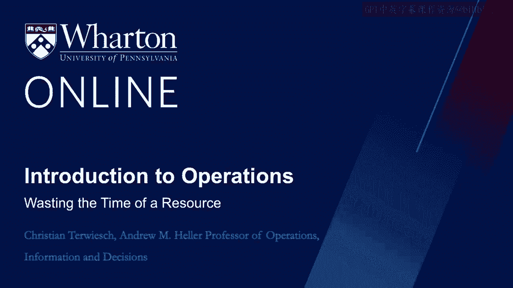

# 沃顿商学院《商务基础》课程｜第127讲：资源的时间浪费 🕒

在本节课中，我们将学习如何识别和分析运营过程中资源的时间浪费。我们将介绍一个名为“整体设备效率”的框架，帮助你量化资源的生产性使用时间与非生产性浪费，并探讨如何通过数据收集来发现改进机会。

---

正如我在开场视频中提到的，我们需要留意资源浪费的时间，以及我们的流程单元（客户）所浪费的时间。

今天，我们将开始审视资源端浪费的时间。

我想用一个医疗领域的故事开始这个视频。

几年前，我和同事埃文·费德森在费城儿童医院的重症监护室进行了一项研究。我的研究问题很简单。

我们想知道，一张ICU病床用于提供其能够且应该提供的护理的时间比例是多少，以及有多少时间被浪费了。

当我们启动研究时，我想起了泰勒的话：“时间的浪费，不会留下任何有形的东西。”多么正确！我们该去哪里寻找浪费时间的证据呢？

和任何现代运营一样，数据从不短缺。医疗记录、账单记录、医院IT系统，应有尽有。但我们在哪里能找到浪费了多少时间呢？

在我们对费城儿童医院ICU容量的研究中，埃文和我做了以下工作。

我们找到了一位积极的学生，这位学生会每小时去ICU，在病床间巡视，一遍又一遍。这是一种非常学术的方法，我对于让学生花费如此多时间感到有些内疚。

但我仍然认为，这是完成这项工作的唯一方法。

无论如何，这种方法使我们收集了数千小时关于ICU病床及其使用情况的观察数据。

然后，我们按以下方式对这些小时进行了分类。

这里你看到的是我们拥有数据的观察小时数。

接着，我们审视了从医学角度看并非真正需要的时间。

这包括病床已配备人员（即分配了护士）但床是空着的时间、病床上的孩子等待转院的时间，以及病床等待清洁或等待新患儿入住的时间。

因此，在这种情况下，我们看到当时费城儿童医院的一张ICU病床，大约有82%的时间用于其设计初衷——救治患儿。顺便说一句，这是一个非常、非常高的数字。

我展示这个数据有两个原因。首先，是为了介绍一个新工具；其次，是为了讨论这个工具的局限性。

现在，这张图表展示了一种严谨收集数据并分析增值时间的方法。你规划出资源可用的总时间，然后减去你能够明确界定为浪费的时间。我们将在下一个视频中更详细地讨论什么构成了浪费。

目前，浪费是指你的资源没有增加价值的时间。它无助于让孩子恢复健康。

然后，我们可以将资源的**整体设备效率**（简称 **OEE**）定义为一个百分比，即资源可用时间中被生产性使用（即非浪费）的比例。

我们可以对任何类型的资源进行这种分析，不仅仅是设备。你可以对一台机器、一名工厂工人、一名律师或一架飞机进行这种分析。

其次，让我也坦率地谈谈这个工具的局限性。

让我们再次回到我的ICU例子。当我们收集数据时，我们告诉学生，任何在病床上使用呼吸机的孩子，都应该在ICU。因此，在我们的研究中观察到的任何使用呼吸机的孩子，都被编码为增值时间。

我认为这是一个合理的方法，但同样，并非没有局限性。例如，想象一个孩子在使用呼吸机，但呼吸机其实应该在几小时前就断开。然而，护理团队正忙于照顾另一个孩子，所以呼吸机一直没有断开，或者六小时后才断开。那么你真的必须问自己，这六个小时是增值时间吗？还是说它们不是？

这让我想起了大野耐一的名言：“移动不等于工作。”我认为这句话含义深刻。移动不等于工作。

这意味着，即使是最笨的顾问也能看出一个闲站着、无所事事的工人没有增加价值。然而，观察一个忙碌的工人，一个正在工作、正在移动的人，并确定其中有多少工作真正增加了价值，这就困难得多。

根据大野耐一的观点，我们可以将工人在工作场所的时间分为两类：工作和浪费。大野耐一将浪费定义为应立即消除的无谓时间浪费和工人动作。

同样，更多内容将在下一个视频中介绍，但目前，这就是浪费。

工人时间减去浪费，就得到工作。但并非所有工作都在增加价值。

大野耐一将**非增值工作**定义为需要完成但并未直接为客户增加价值的工作。请记住，这个框架源于生产环境，但我认为它非常具有普适性。

每个流程都有客户，因此我们可以说，流程中的非增值工作是指不直接有助于提高客户支付意愿的工作。

这类工作可能是必需的，但并未为客户增加价值，通常被称为**附带工作**。例如，在我进行放射科检查时，为我办理登记并确认我确实是处方上指定的人，这项工作并非完全是浪费，但我们可能会想象其他确认身份的方式。

显然，从我的支付意愿角度来看，这次登记并没有改善我的健康、我的幸福感或我的健康结果。

好了，回到OEE。

**OEE为50%意味着，你可以用相同数量的资源完成目前两倍的工作量。或者，你可以将资源减半，仍然服务相同数量的客户。**

如果你的运营受**产能限制**，这些生产力提升将直接增加营业收入。如果你的运营受**需求限制**，它们则为你指明了节约运营成本的道路。

为了给你一个非医疗领域的例子，考虑一架飞机的OEE。

飞机是非常昂贵的资本设备，你希望尽可能多地让飞机处于飞行状态。这是美国航空公司达拉斯-沃斯堡枢纽的一张OEE图表。

我见过的每一份优秀的运营咨询报告，都会在演示文稿的某个地方展示类似这张幻灯片的某个版本。

所以，如果你看一天中的24小时，飞机大约有三分之一的时间在飞行。顺便说一句，这相当令人印象深刻，而且肯定比20年前航空业的情况要高得多。

更不用说2020年夏季COVID期间航空旅行崩溃的情况了。

那么，其他时间发生了什么？登机、下机、维护，所有这些事情显然都很重要，但它们并未直接增加价值。这就是附带活动的概念。

就我个人而言，当我计算这些数字时，我对滑行时间更感到惊讶。实际上，每天超过一个半小时，这架价值一亿美元的飞机基本上是在充当一辆巴士。

我们都很忙，这通常意味着我们会要求更多资源。我们想要更多员工、更多设备、更多办公空间，越来越多。

现在，OEE框架提醒我们，流程改进的首要任务是从现有资源中获取更多产出。OEE为50%意味着我们可以在不增加资源的情况下将产能翻倍。

OEE框架主要是为了帮助你组织数据和来自一线的数据收集。它告诉你在寻找流程改进机会时应该关注什么。

像任何框架一样，框架本身没有对错，由你和你的数据收集来决定如何使用它。但它支持“现场现物”的精神——亲自去现场查看。

在下一个视频中，我们将讨论当你身处一线寻找改进方法时，应该关注什么。下节课见。

---

**本节课总结**

在本节课中，我们一起学习了如何分析资源的时间浪费。我们引入了**整体设备效率**这个核心概念，其公式为：

**OEE = （生产性使用时间 / 总可用时间） × 100%**

我们通过ICU病床和飞机的例子，说明了如何收集数据、区分增值时间、非增值工作（附带工作）和浪费，并计算OEE。OEE值能直观反映资源利用效率，低OEE意味着存在通过流程改进释放巨大产能或降低成本的机会。最后，我们认识到，改进的第一步往往不是增加资源，而是更有效地利用现有资源。下一讲，我们将深入探讨如何在一线识别具体的浪费类型。