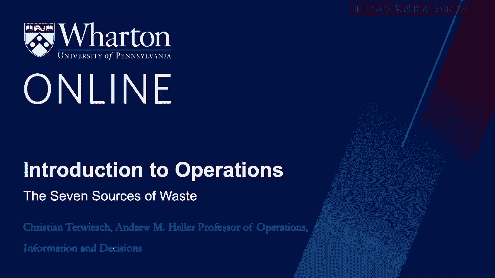
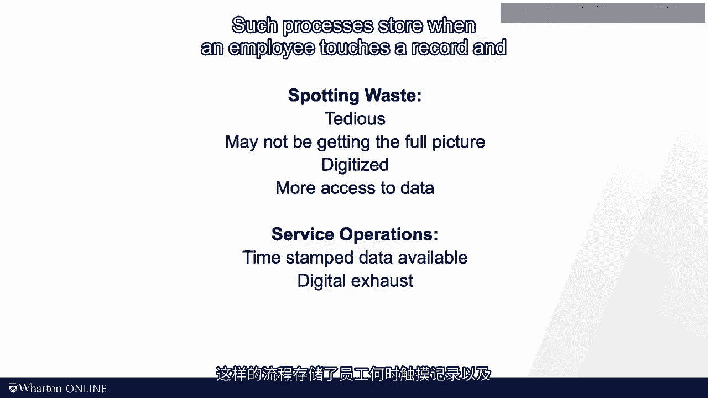
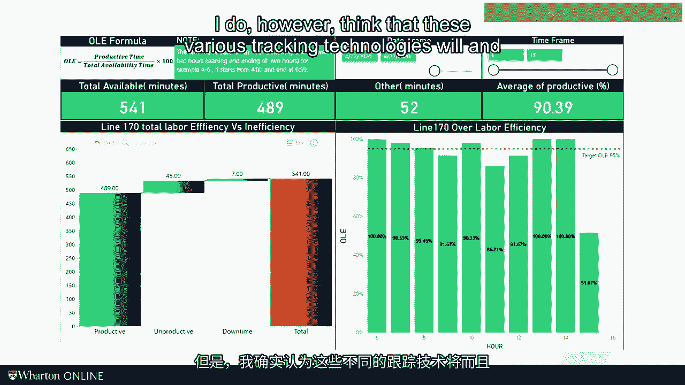

# 沃顿商学院《商务基础》｜Business Foundations Specialization｜（中英字幕） - P128：12_7大浪费.zh_en - GPT中英字幕课程资源 - BV1R34y1c74c

The OE framework has helped us to look at a resource and separate a waste from value at。

time。 In this session， it's talking a bit more about what waste looks like。 According to Atei Giono。

there exists seven sources of waste。 Already introduced the key idea in the last session。

moving is not working。 So as we look for waste， it is not just the idle resource that provides the opportunity。

Beeziness per se is not a virtue。 A piece of equipment might be highly utilized or an employee might always be overworked。

but that is no guarantee that the process or the employee is adding value。

Let's start by going back to the Taylor quote。 Remember we talked about awkward， inefficient or。

indirect movements of man？ While your awkward， inefficient and。

indirect operations professor will not define seven sources of waste。

The first way I want to define is wasted motion。 It's unnecessary movement of people during their work。

I just changed the tire of my bike this morning。 It took me probably twice as long as it takes the skilled bike mechanic down the street from。

here。 And so that is a form of wasted motion。 The same is really true for a chef。

I love watching chefs in the kitchen。 Every motion adds value， there's no fumbling。

there's no pausing。 It's just perfection。 That's just not me。 The second way relates to defects。

Defects are obviously not adding value。 They're really annoying for the customer if they remain undetected。

And if you detect the defect within the boundaries of your process， they require you fixing them。

something that is known as rework。 So defects are a second source of waste。

Over processing is a third source of waste， which relates to producing a higher quality。

than what is needed or demanded by the customer。 It's like serving a fancy meal to your relative who only eats cheeseburgers or maybe with。

my German family only loves part worst。 So now we are up to three。 Motion。

over processing and defense。 All of those three can be found by looking at one resource in isolation。

To see the other four sources of waste， we really have to move beyond one worker performing。

one task and look at the process and many workers in a line。 Just think back to the sub-break case。

the three persons making a sandwich every 46 seconds。 As you switch to looking at the process now。

we typically encounter idle time。 Some resources by definition have more capacity than the bottleneck。

and so they will incur， idle time。 Now， all we refer to idle time is waiting as the workers really waiting for the floor。

unit， the part。 Personally， I like idle time better because I don't want to confuse it with customers waiting。

for a resource。 But again， all we call it waiting and to remind to criticize the God of operations。

Next there's inventory。 If the floor is not well coordinated。

some of the resources will produce faster than the， others。 In particular。

it's going to be the bottleneck， it's going to be the slowest step， and we're。

going to end up with inventory in the process and typically in front of the bottleneck。

That is our fifth source of waste。 Inventory also happens when we produce more than what is demanded by the customer。

We go back to our discussion of tech time and its role of keeping us in sync with demand。

Uno named this overproduction and he made it the sixth source of waste。 And finally。

as we have multiple resources in the process， we have to move the floor。

unit from one resource to the other， which is known as transportation。 So here they are。

seven sources of waste。 Again， more to come in future videos。

but I wanted to introduce a framework first。 Let me make two observations。 First。

how do you remember these seven sources of waste？ They are really multiple memory tricks out there。

but the one I like the best is Tim Wood。 Tim Wood simply combines transport， inventory， motion。

waiting， overprocessing， overproduction， and defects。 I know it's somewhat stupid。

but at least for me， it has always worked。 And then second。

the operations community now increasingly refers to an eight source， of waste。

and that's a waste of intellect， which means not using the ideas of those working， in the process。

That is a wasted opportunity and thus an eight source of waste。

We talk more about involving the workers and future discussions on quality。 At this point。

think back to the comment I made on tailorism at the beginning of this， module。

In the 20 years that I've been doing consulting work and research collaborations with companies。

I've always been amazed how universally applicable the seven sources of waste end up being。 Yes。

waste really might look different in each industry。 Yes。

this framework has its root in manufacturing。 It also works well in other settings。

including healthcare。 I show you some examples here on this slide。

I find it almost shocking how directly the seven sources of waste apply to healthcare。

and similar settings。 Rework in healthcare is called readmissions。

Hospitals have a whole department called patient transports， rooms， equipment and providers。

are at times idle as we discussed at the beginning of the module。

And don't get me started on overproduction， the provision of unnecessary procedures by。

the providers。 Anyway， I'm sure you have seen these things in one form or the other in your own experience。

Now spotting waste really requires careful observation。 In the past。

this has mostly been done by stop watching people。 For example。

I've done some work myself using a method called time and motion studies。

What I did is I video recorded primary care providers and then I would dissect the encounters。

that they had with their patients， second by second with the help of some medical experts。

and other doctors to look for waste。 This would give us a sense on how doctors are spending their time with patients。

It was fascinating to me to see how little time was spent on actual examinations。

Such data collection is obviously very tedious。 However。

when you show up with either a video camera or a stopwatch to collect data， chances。

are that you're not really getting representative data from the operations。

Let me make two observations on how such time and motion studies are changing as we're moving。

along in history。 First， most service operations these days are really digitized。

And so oftentimes you can get timestamp data from the operations， particularly call centers。

claim processing， customer support or reading x-rays。

And all these processes are something that I refer to as digital exhaust。

Such processes store when an employee touches a record and how long they work on it。

That allows you to compute the processing times even years after the work has happened。

Taylor's claim of movement leaving nothing tangible behind is simply no longer true in。

our modern digital world。 Second， we now really have technology to use image processing and AI to do this observation。

for us。 To help illustrate， I've been working with a startup run by two pen grads。

And these guys have developed machine vision technology that helps manufacturing firms。

to measure processing times， spot waste and detect quality problems via video cameras。

that are installed at the assembly line。 What you see here is the assembly line of pride mobility。

Pride is making high-end wheelchair。 A business also run by a warden grad。

And the video footage here on this slide shows you line segment 170， which consists out of。

some manual assembly operation。 And you notice that the image recognition of the software is tracking the flow unit。

which is the wheelchair。 And it's also tracking the resource。

which is the gentleman here in the white t-shirt。 And then the software is smart enough to spot when the worker is idle or the worker is spending。

more time on the flow unit as usual。 All this data is then fed into a reporting system that spits out the report that looked。

like this。 Now， I'm sure you've seen this in your own life。

This is really more and more 1984 George Orwell than is emerging in our society。

But it does matter if you drive a modern car， serve the internet or go for a walk with your， phone。

And it's also said we now do， can be tracked and leaves a data trail behind。

This is certainly worthy of a longer discussion about privacy and individual freedoms。

If you're interested in this topic， I make sure to provide a link to some work I've。

been doing in this space。 I do however think that these various tracking technologies will and should play an increasing。

role in operations management。 In the previous video。

we defined the OEE as a percentage of time that the resource is， doing what it is designed to do。

And now， waste was an abstract enemy that was somehow reducing our OEE。

The seven sources of waste framework helps us to see how exactly we waste capacity。 Tim Wood。

in other words， is the main enemy to a lean operations。 In the next video。

I want to switch the perspective and talk about the view of the flow unit， be。

it a customer service process or widget in a production process。 See you then。 [BLANK_AUDIO]。
