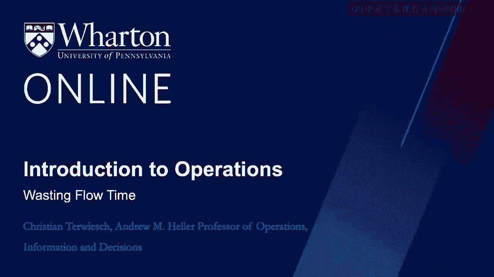
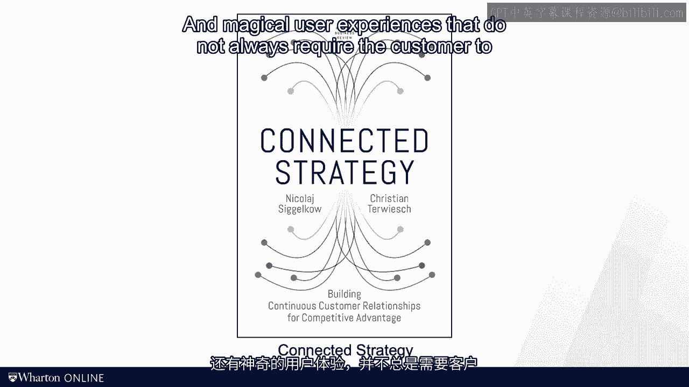

# 沃顿商学院《商务基础》｜Business Foundations Specialization｜（中英字幕） - P129：13_流失的流动时间.zh_en - GPT中英字幕课程资源 - BV1R34y1c74c

Unfortunately， many experts and consultants focus entirely on the OEE metric we discussed。

in the last session。 To them， lean operations is all about making the resources more protective。

And how do you make a resource like a doctor more productive？ Well。

since either time is one of the seven sources of waste， having a waiting room packed。

with enough patients to keep our dark busy for an entire day seems like a good idea。

We talked about customer waiting times in another module of the scores。 For now。

let me just point out this is not lean at all。 Remember that inventory is also a form of waste and wasting customers are inventory。

As I mentioned in the context of my radiology experience at the beginning of the module。

lean is equally about the customer。 Customers waiting and customers running around are also forms of waste。

And so in this session we introduce some tools and measures to capture this。

We're not changing the perspective from the resource to the perspective of the flow unit。

When owner looked at manufacturing flows， he said he postulated products have to flow， like water。

Products have to flow like water。 Well， why wouldn't they？

Water keeps products from smoothly flowing through the production process。

Take a look at the three-step production process here。 Parts here are taken out of inventory。

then they are produced in a casting operation。 Once all the parts are done with casting。

a transporter moves them over to the machining， operations。

They have to wait it again until the machine is completed。 The previous production cycle， again。

it works and then comes and moves the output over to， the assembly station。 Of course。

the other parts are not ready yet in the batch and so they have to wait。

And so the assembly only starts when all the parts are there。

And so our part spends even more time waiting。 Finally。

the parts once they are assembled to get shipped。 Now we can define the flow time efficiency。

also known as the percentage value at time， as the ratio between the value at time and the flow time。

So in the three-step process you'll notice that only a small fraction of the flow time。

is really adding value。 Most of the flow time， the flow unit sits around waiting to move forward in its journey。

In my radiology example， at the beginning of the module， the ratio was 20 minutes of care。

spread out over more than two hours of flow time。 But here's another observation about customer experience。

Personally， I would argue that it's not just about the time investment of the customer。

but it's also about customer friction， customer effort and pain points。 Personally。

I'd much rather spend 10 hours at home waiting for an email that takes my。

doctor five minutes to write rather than spending one hour in the waiting room for a 10 minute。

discussion。 Now you see that the flow time efficiency is superior in the second scenario。

but I prefer， the first。 There's this observation behind a tool that is known as a service blueprint。

But the service blueprint does， it takes all the activities related to one or multiple customer。

episodes。 And then the service blueprint reorganizes them along two dimensions。

From the left to the right we have time。 We start with the early activities on the left and work our way to the later activities。

on the right， just like with the previous production timeline。

But unlike the production timeline I showed with the casting operation， we now also have。

a vertical dimension。 The vertical dimension distinguishes where the customer service is delivered。

On top we have activities that happen at the home of the customer。

Really from a customer perspective， this type of work is preferable。 From my customer's perspective。

it's generally preferable to deal with work from home compared。

to work that happened on what's called on stage。 On stage stands for work that happens at the retail branch in the hospital or inside the。

factory。 But also from the firm's perspective， caring out work on stage tends to be expensive。

You visually incur real estate costs and the firm also has to have the resources ready。

exactly when the customer walks in。 So wherever we can， it's nice to move work away from the stage。

You want to move work off stage。 It's just like checking into your fly from home as opposed to doing this at the gate。

Just think about my radiology example one more time。 Verify my insurance status。

This is work that could have been done before I showed up in the hospital。

More convenient for me and cheaper for the hospital。 Beyond having the work happen at home。

we can also think about another way of moving it， off stage。

Imagine we as a firm could do the work for the customer。 I mean。

you think about buying stuff on Amazon。 You won't enter any billing or shipping information anymore when you buy something on Amazon。

You know that Amazon has stored everything and remembers it over time so that reduces your。

work the next time you're going to buy something。 Why can't my hospital do this？

Why do I have to fill out a four-page survey in the waiting room？

Every dime I see my doctor only then to be asked exactly the same questions on the survey。

when I'm talking to the doctor in the room。 To be fair。

this has gotten a lot better over the last years， but you get my point。

So another way of improving the customer experience is through automation。

We move effort away from the customer by automating some of the activities。 In my latest book。

"Connected Strategy，" they are wrote with my colleague， Nikolai Sigokow。

We discuss how modern technology can create seamless and magical user experiences that。

do not always require the customer to take action。 Flow units are impatient。

and so we should get them through our process as fast as we， can。

That is due for a crankshaft and an autoplant that should not sit in inventory for a week。

but rather should be turned over many times during the week or even multiple times during。

the day in order to reduce the inventory cost。 But it's also true for a service organization。

where the inventory consists of waiting customers。 And clearly， customers want to move as a whole。

so they will be sitting around and waiting。 In either setting。

we can compute the percentage of flowtime that is used for value-adding activities。

as a good diagnostic tool to see where flowtime is wasted in the process。 That's it for today。

I see you soon。 [BLANK_AUDIO]。
