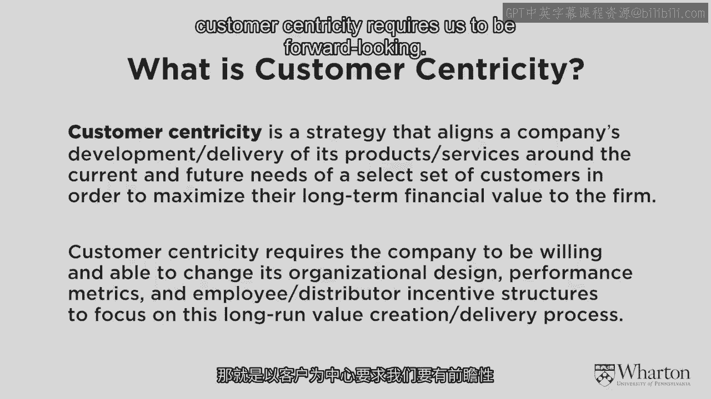
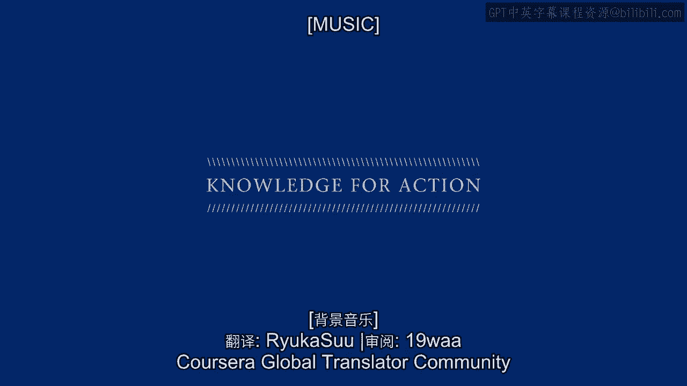

# 沃顿商学院《商务基础》｜Business Foundations Specialization｜（中英字幕） - P13：12_什么是客户本位.zh_en - GPT中英字幕课程资源 - BV1R34y1c74c

[MUSIC]。

Welcome back to Module 2。 Just to review in Module 1。

we looked at traditional ways of doing business， particularly for a strategy associated with performance superiority or。

operational excellence。 And we looked at the different characteristics of businesses that do。

that kind of thing， which of course I called product centricity。

We discussed why product centricity isn't quite as great as it used to be。

and started touching on businesses that turn in a different direction， customer centricity。

But we haven't defined it yet。 We've given a number of examples of companies that we'd say are。

or at least have been highly customer centric， IBM， Harris， Tesco。

as well as a number of companies that are terrific companies， companies like Walmart， Apple。

Starbucks， Nordstrom， but don't qualify as necessarily being over the hurdle。

but are making great strides towards customer centricity。 So what about your business？

What about these businesses around me here on， South Street？

How do we determine whether business really is or isn't， customer centric？ In other words。

what is the definition of customer， centricity？ So what I like to ask my students to do is to write that down。

So how do you define customer centricity based on what we've discussed so far？

Based on the examples that we've looked at。 So in fact， I'd like you to take a minute。

and just jot down whether it's a full sentence or even just a few words。

that you would associate with customer centricity。 Take a minute and do that。

and then I'll give you my perspective， my definition on what customer centricity is。 Okay。

so you gave me your definition of customer centricity。 I'm going to show you mine。

But before I put the words on the screen， because a lot of it's just going to be words on a screen。

I want you to look at these words and think about them a little bit differently。

I want you to think about how this definition of customer centricity and what it implies。

just how radically different it is from conventional product-centric business practices。 In fact。

I want you to look at these words and tell me， if you were to start doing exactly these kinds of tactics。

if your company was to start having these kinds of perspectives， why you'd be fired。 In other words。

there are fireable offenses in this definition over here。 And what are they？ Okay。

if you look at it， there's a lot of things that might make sense。 It all fits together， sounds nice。

Hopefully it's well-lined with your own definition of customer centricity。

But I really do want to emphasize just how different it is。 So for instance。

what are the fireable offenses here？ One of them would be this idea of select set of customers。

In the product-centric world， you can't have a select set of customers。

In the product-centric world， we're so dependent on generating as much volume as possible。

on selling as much stuff as we can， that we can't really afford to be selective。

It's going to be hard to keep our costs down if we're selective。

So the whole idea of having and emphasizing a select set of customers very much runs against the grain of many businesses。

Another would be the bottom line on this definition。

The idea of really focusing on maximizing the long-term financial value of certain kinds of customers。

In most situations， it's hard for a company to do that。

Given the pressures of Wall Street and just the conventional ways we look at business。

we're so short-term oriented。 We've got to hit the quarterly numbers。

Whereas in the customer centric world， and going back to many of the examples that I mentioned before。

we want to invest in the right customers。 We are willing to recommend products and services that we're not going to make any money off of。

For instance， going back to the IBM example， there was a case where a company was willing to recommend other products and services。

So IBM was actually losing opportunities。 But locking in customers for the long run。

being seen as a trusted advisor， in some cases can be worth it。

That the long run profits that we can get from customers can be greater than just trying to get them to buy another thing right now。

So again， that's a radically different way of doing business。 Another part。

higher up in this definition， is the idea of aligning our research and development activities around our customers。

The way it usually works is we go to the R&D people and we say， "Hey R&D guys， gals。

come up with the next blockbuster for us。"， You've been so good at coming up with these terrific products and services。

What's the next big thing that you have for us？ But here we're talking about something different。

Here we're saying， "Hey R&D guys and gals， here are really valuable customers over here。

Let's come up with something for them。 Something that's going to make them even more locked in。

Something that's going to create greater long run value for them。

And something that's going to help us recruit even more customers like them。 R&D folks。

come up with something for them。 It's a totally different way of doing business。 Now。

if you think about that last point， it's not quite as radical as it might sound。 Because after all。

what made our valuable customers so valuable？ The fact is。

they liked the products and services that we develop。 And so if we leave it up to the R&D people。

whatever they come up with next， our customers will probably love it anyway。 But it's the mindset。

It's the idea of going R&D and putting these valuable customers front and center。

It's the way it just changes the conversation and perhaps the design within the organization。

That's what starts making it customer centric。 So that's my definition of customer centricity。

But again， those are just words on a page。 What we really want to think about is what this means。

See， there's a lot of companies that might adopt that definition or something else like it。

And then put a big banner on the lunchroom wall for all the employees saying。

"We are now customer centric。"， Well， it's not that easy。

There's a lot of challenges in actually bringing this definition and this mindset to life。

And so I want to think now about some of those challenges as well as some of those opportunities。

So we can see in the rest of the slide over here about what customer centricity really implies。

And I want to give you a few examples about that。 So again。

thinking about the fact that customer centricity requires us to be forward looking。

We're looking at not which customers have been valuable， but which customers will be valuable。

using the data， the models， the technology that we have available to us。 So what does that mean？

So here's a very specific example。 So so many companies have some kind of sales person of the month incentive。

And they tend to be backwards looking。 They're going to reward salespeople based on how much stuff they sold last month or quarter or year。

I want it to be forward looking。 Think about it this way。

If you have that kind of backwards looking program， you're encouraging。

you're in centering your salespeople， to try to close sales that were going to happen anyway。 Like。

you know， "Hey， I got to get this one done before the month end so I can get my bonus。"。

That's not necessarily helping the company in the long run。 In order to have real long run benefits。

you have to be future looking。 So here's the way a sales person of the month incentive should work。

I want a company to calculate the lifetime value of each and every customer。

And let's do that at the beginning of the month or the quarter or whatever。

and then do it at the end of the month of the quarter。

And let's ask ourselves not just how much stuff we sold to the customer。

but how much did we elevate their lifetime value。 So instead of us going to customers who are going to buy things anyway and just watch them buy things they were going to buy。

let's try to build relationships with customers。 Maybe they weren't inclined to buy。

And you know what？ Maybe they didn't by the end of the month。 But we're closer to making the sale。

We've improved the relationship。 We've lengthened and maybe deepened the relationship。

That we think that in the long run， we will create much more value that wouldn't have been there。

That's how I want to reward the salespeople。 On future value that they're sowing the seeds to create。

Now that's risky。 It requires some faith。 It requires some data。 It requires some models。

But if you can do it， and I'm aware of a number of firms that have in a variety of different businesses。

then you're actually much better off。 Think about it from the sales person's perspective。

Instead of just rewarding them based on what they've done。

you want to encourage them to build relationships。 You don't want to just close sales。

You want to build long lasting relationships。 You want them to invest in the customers。

even if they're not getting anything out of it right away。 And then after all。

that's what salespeople want to do。 They want to build and strengthen relationships。

They don't want to just close sales and move on。 So if you have this kind of forward-looking perspective。

not only might it be better for your shareholders in the long run。

because of the profits you'll create， but it's even better for the salespeople。

because that lets them do what they're really good at。 And again。

I can point to examples of companies， I'm thinking of a particular pharmaceutical company。

that changed its salesperson incentive program to be forward-looking instead of backward-looking。

and wonderful things happened。 The salespeople were happier。 The company made more money。

And the salespeople actually looked to the marketing people， say， "Hey。

can you help me identify other good prospects that I should be going after？"。

So instead of just trying to， you know， shake down customers to just make sales right away。

that kind of relationship building is good for absolutely everybody。

These kinds of forward-looking incentives work in other ways as well。 Think about airlines。

Think about MBA students。 Spend a lot of time thinking about MBA students。

What happens to our warden students when they come to school？

So they were working in industry before， spending a lot of time flying。

Now what happens for the two or so years that they're at warden？

Their status with the airline drops， and then when they start on a new job after graduation。

they have to start all over again。 If the airlines were really forward-looking。

they would recognize that some of these students， are going to take a temporary hit on their travel。

but after they graduate， they're going to be traveling even more。

far more than they ever did before。 So if the airlines were smart。

they would go to our students the day they're admitted， and say， "You know what？

We're going to put you in the President's gold medal。

Chairman's red carpet club for the next five years。"， Because we recognize。

based on what we know about you， that you're going to be a really good customer in the future。

And even if you're not going to be a great customer tomorrow， it's worth the investment for us。

That's what I'm talking about， and that's what we don't see a lot of。

Customer centricity requires us to look ahead， figure out who the valuable customers will be。

and do things for them to help them recognize， that we have their best interests in mind。

That's the kind of investment that I'm looking for。

Those are the kinds of incentive structures that I want。

and some of the organizational designs associated with it。

That's what customer centricity should be all about。 [Music]。

[BLANK_AUDIO]。
