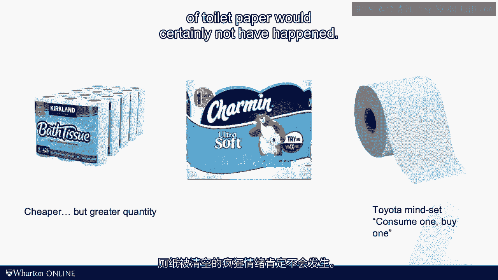

# 沃顿商学院《商务基础》｜Business Foundations Specialization｜（中英字幕） - P130：14_实现流程的顺畅流动.zh_en - GPT中英字幕课程资源 - BV1R34y1c74c

One of the privileges of being a Warren professor is that I get to work with some really smart。

doctoral students。 My students are my collaborators in research and more often than not they're also my teaching。

assistants in my class。 At this point I should confess that it's really my teaching assistants who grade the。

final exam。 The exam consists of a dozen or so questions， each of which has two， three。

four sub questions。 So let's look at how the TAs organize the grading process。

Here's a picture of two of my favorite doctoral students， Leslie Meng， now on the faculty， at Yale。

and Dawson Coward， now on the faculty of Georgetown。

Leslie and Dawson were grading exams on this day， about 120 of them。

Not surprisingly they had to split up the work between the two of them and you see how each。

of them is grading about 60 exams。 What do you notice when looking at this picture？

First we see that Dawson has 60 exams in front of him。 All of them are turned on a particular page。

Leslie in contrast has only one exam in front of her and she has one stack of exams to。

her left and one stack to her right。 Can you imagine what they do differently？

Well let's start with Leslie。 Leslie picks up an exam， goes to the exam from beginning to end。

and then enters the， exam score into a table。 One exam after the other until all of them are fully graded。

Make sense？ Doesn't it？ Look at Dawson。 Dawson starts with question one。

say question one has three sub questions， and then Dawson， grades question one for all the exams。

Then he moves to question two and repeats the whole thing。 Ask yourself for a moment。

What are the pros and cons of the two strategies？ Now since few of you will be entering the exam grading business。

I want to generalize， this example and talk about a flow units journey through a process。

What we've done so far in this course， we've simply assumed that the flow unit makes its。

way through the process whenever there's resources downstream that has capacity。

But how that flow unit is managed and what triggers a flow unit to advance is actually。

pretty important。 In this video I want to talk about three ways we can manage flow。

We first talk about push versus pull， including just in time deliveries。

We then talk about mix model production。 And finally we will talk about single unit flows as opposed to transport batches。

Imagine you have a three step process with the capacity levels that you see here。

You have enough input for that process and you have hard working and motivated employees。

What's going to happen？ Well it's clear that station two here is the bottleneck。

Since station one is motivated and works really hard， he or she is going to push units into。

the process。 All of them are going to pile up in front of station two。

This really doesn't help the flow rate because the capacity constraint is at station two。

but it will increase the inventory。 In a setting like this。

what we really want is station one to slow down。 We prefer station one to be idle for half of the time as opposed to just flooding the。

process by pushing in more inventory。 You might say that we could send the work out station home after we completed a pile of。

inventory at station one in the first half of the day。 There's certainly some truth to that。

but the problem is it's certainly not lean。 Because now we have a pile of inventory between station one and two。

Instead what we should do is we should pay the process based on the speed of the bottleneck。

Even better， we should think about how we can pace this process based on the speed of demand。

Remember the concept of tag time。 We should operate at the tag of demand。 Now ideally。

we would also balance the line so that big differences in capacity levels。

would not occur in the first place， but you will just never get a perfect line balance。

So what can we do to avoid undesirable inventory buildup？

You have to really pull the work through the process from the downstream as opposed to pushing。

the work in from the upstream。 Now one way of achieving such a pull system is known as a conmances。

Imagine you're sending these lovely black boxes here to the market。 For sake of argument。

say the downstream here is the last resource in the process。

Once you've depleted a certain amount of inventory of the boxes at the last resource， typically。

one container， you need to inform the upstream that you need more。

Connected to that container is a conman cart。 Once a container is empty。

that conman cart is going to be handed over to the station。

the resource upstream that is feeding you， your internal supplier。

Now that person or that resource feeding you should sit there idle and do nothing until。

they have received the conman cart。 That's why a conman cart is oftentimes referred to as a work authorization form。

Now again， it sounds really stupid because you're forcing people to be idle。 But in the lean world。

it's better to be idle rather than having to run ahead and push， inventory into the system。

So through the conman carts， you really control how much inventory is in the system。

You authorize the amount of inventory。 Now the extreme version of that approach to pulling work is you have a conman cart for。

every single flow unit。 That means a container size is really equal to one。

And every unit is now replenished one by one。 Consider for example the replenishment of complex modules such as seeds or dashboards or。

exhaust systems in an automotive plant。 It's fascinating to see how when the vehicle enters a certain point in the production。

say the painter， there's an electronic signal that is sent to the supplier requesting the。

modules for the final assembly。 And then the supplier has something like three or four hours to basically go through their。

operation of making the module， putting it on a truck and delivering it to the final assembly， line。

And then magically just when your vehicle that is in need of the seat is at station 255 seat。

assembly that pops up just in time。 So this is real just in time often referred to as synchronised production。

Next let's talk about the idea of mixed motor production。 Remember Dawson the TA。

Why did he like to grade all the exams on question one before grading all the exam on， question two？

The reason for that is what in operations we call a setup time or a switching time。

If you've watched my module on product variety in multiple flow units you might remember。

the idea of setups and that they require capacity。

Imagine an automotive plant that is producing two types of cars， a wagon and a sedan。

Since the body panels of a wagon are different from the body panels of a sedan， some of the。

stamping machines need to be retooled as you switch over。

The operator is having to do something that is called a changeover。

Think about making cookies for exams， you're baking cookies and you're switching over between。

making cookies in the shape of a star and sometimes you make cookies in the shape of， a heart。

The problem of course is that changing over a stamping machine that is as big as my house。

and a stamping dies which weigh multiple tones of steel。

Well that is much harder than switching over from a star cookie cutter to a heart cookie， cutter。

So setups and changeovers create a form of scale economies which is really a form of specialization。

This is by no means unique to an auto plant as we saw again with my TA example。

You might also think about a surgeon who might find it easier to do six miniscule surgeries。

in a row as opposed to doing a knee surgery， then a hip surgery and then doing an anchor， surgery。

People like specialization， people like scale economies。 Anyway， back to my auto example。

Even that retooling is hard and will really eat up my production capacity。

The plant manager doesn't want to switch forth and back between sedan and wagons all too， often。

So he or she does what Dawson did。 He or she runs a long production run of sedans。

Now suppose the amount for sedans and the amount for wagons is about split evenly 50-50。

What happens？ While we're producing sedans， we're not producing wagons。

So any sedans from wagons has to come from inventory。

So wagon inventory is coming down and in contents since we're allocating all our capacity to。

sedans， the sedan inventory is going up。 Then eventually we'll switch from producing sedans to producing wagons and the opposite。

occurs。 Now the sedan inventory is coming down， the wagon inventory is going up。

You see the resulting oscillation here， the up and down of the inventory cycles。 And on average。

the inventory is exactly going to be in the middle。

Now contrast that with the plant that is able to change over production with less effort。

or even without any effort at all。 With smaller ultimately no change over time， what would you do？

Exactly。 We will produce at the rate of demand。 And since we assume that demand for wagon's incidents would be evenly split。

we produce， in much smaller batches and ultimately if there are no change over time。

we will produce， in batch sizes of one。 The technical term for this is a mixed model production。

also known as Hejungka。 Hejungka helps us keep inventory low。 It also has another nice property。

Imagine that you're rolling the processes to install the trunk opening mechanism which。

is specific and unique only for the wagon。 That means that when the plant is producing wagons。

you're running all out。 But then once the plant switches over to sedans。

you really have plenty of idle time。 You alternate between all outsprens and leisurely walks。

In contrast with mixed model production， you'll work on this level， right？

That employee putting in the trunk opener simply works on every other car。

So the moment you do Hejungka， work starts to be much more level。

I know that by now you're probably sick and tired of my Hejungka quotes， but here's one， last one。

Run like the turtles， not the hair。 This advice is really based on the ancient fable describing the race between the hair。

and the turtles。 The hair really cools the slow moving turtles which challenges the hair to a race。

And in the race， the hair quickly gains a significant lead and hence the hair is comfortable taking。

a little nap even in the middle of the race。 The turtles though， tired as it is。

keeps on growing at a steady and even pace。 When the hair eventually wakes up。

the hair is so far behind that all the hair does is， see how the turtles springs into victory。

Unless you control your processes， processes have the tendency to operate like the hair。

Your resources are motivated and so whatever they do， everything is pushed into the process。

as quickly as possible。 This is especially true in service processes where it's the customers who push themselves。

forward。 But you have to run an operation at an even and steady pace。 Unlike the turtles。

not the hair。 That gets me to my third concept I wanted to talk about in this video here and that is。

the idea of single unit flows。 Because of these change over times。

we have a reason to create a production batch or production。

run consisting out of multiple flow units。 Now similarly。

if we have a significant transportation time between stations， we have an incentive。

to wait for units to pile up before we do the next transportation trip。

Just think about how you're buying stuff like toilet paper。

Even short of the COVID-19 toilet paper craziness， chances are that you don't buy toilet paper。

every day。 Despite the fact that you're probably using toilet paper every day。

You might purchase 10 rolls at your local supermarket。 You might purchase 100 rolls at Costco。

Now buying 100 rolls of Costco toilet paper is likely to be cheaper and more convenient。

But if you do this， on average， you now have 50 rolls of toilet paper in the house。

The Toyota mindset is that if I consume one roll of toilet paper in my house every day。

I should be purchasing one roll of toilet paper every day。

If everybody would have followed this strategy， the March 2020 craziness around supermarket。

shares being emptied of toilet paper would certainly not have happened。

The idea of changing over from one model to the other every minute or two and the idea。

of replenishing your toilet paper run roll at a time sounds appealing from an inventory。

perspective but one that translated into lots of wasted production capacity and many。

trips to the supermarket。 Yes， that's a problem。 This gets me to my last insight in this video。

The key to implement a lean operation is not just to change your production plans or your。

planations and cycles。 Instead， you have to build processes that are flexible enough to support this。

You have to invest in flexible production equipment， you need to train your workforce。

and you need to involve your suppliers potentially asking them to build a plan next to yours。

This is why in the introduction module， I made inflexibility one of my three system inhibitors。

All this requires a much bigger transformation than you alone deciding that you， from tomorrow。

onwards， are going to run a lean operation。 In the next video。

we'll talk about how such a bigger transformation looks like。 I see you then。 [BLANK_AUDIO]。
