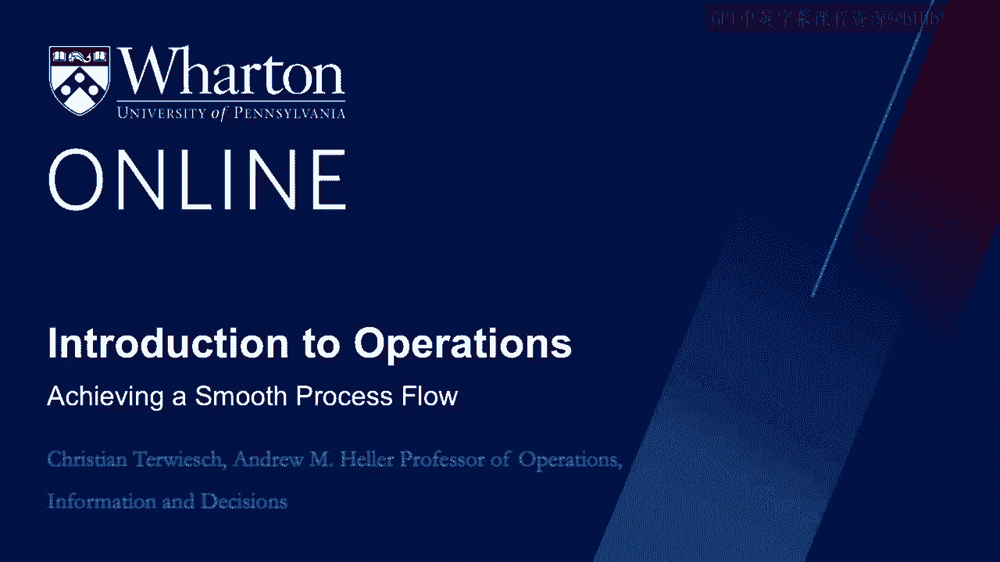
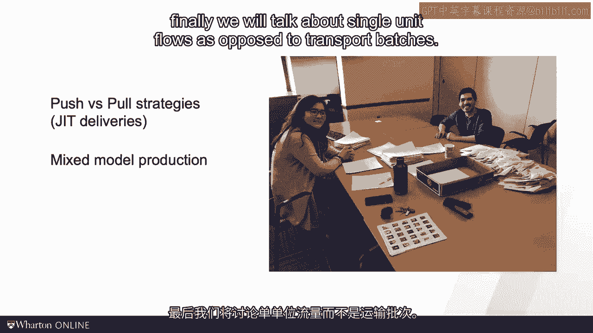
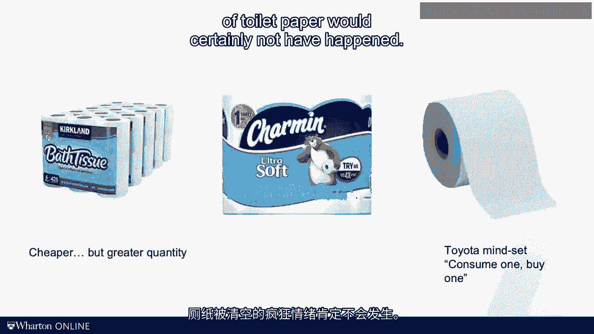

# 沃顿商学院《商务基础》课程 P130：实现流程的顺畅流动 🚀

在本节课中，我们将探讨如何管理流程中的工作流动，以实现更高的效率和更低的库存。我们将学习三种核心方法：推式与拉式系统、混合模式生产以及单件流。理解这些概念对于优化任何业务流程都至关重要。

---

## 推式与拉式系统

上一节我们介绍了流程中的瓶颈概念。本节中我们来看看如何通过管理工作的触发方式来优化流程。

在传统的“推式”系统中，上游工序会尽可能快地将工作单元推入流程，而不考虑下游的处理能力。这通常会导致瓶颈工序前堆积大量库存，增加流程时间，却无法提高产出率。



**公式示例：**
如果工序1的产能是每小时10件，工序2（瓶颈）的产能是每小时5件，那么推式系统会导致工序2前的库存以每小时 `10 - 5 = 5` 件的速度累积。

相反，“拉式”系统根据下游的需求来触发上游的生产。下游工序只有在需要时，才会“拉取”上游的工作。这能有效控制库存水平。

以下是实现拉式系统的一种方法：

*   **看板系统**：这是一种可视化的工作授权系统。当下游工序消耗完一个容量的物料后，会向上游发送一个“看板”信号（如卡片或电子指令），授权其生产一个容量的补充物料。上游工序在没有收到看板前保持空闲，这避免了过量生产。

拉式系统的极致应用是“准时化生产”。例如，在汽车工厂，当一辆车进入喷漆车间时，系统会自动向座椅供应商发送信号。供应商有数小时的时间生产、运输，并让座椅在车辆到达总装线时“准时”出现。

---

## 混合模式生产

现在，让我们回到课程开始时助教批改试卷的例子。Dawson选择一次性批改所有试卷的第一题，然后再批改所有试卷的第二题。这背后是“切换时间”或“准备时间”在起作用。

在许多生产环境中，从生产一种产品切换到另一种产品需要时间进行调整（如更换模具、清洁设备），这会消耗产能并造成效率损失。因此，管理者倾向于长时间连续生产同一种产品，形成“大批量生产”。

然而，大批量生产会导致库存剧烈波动。假设一个工厂生产轿车和旅行车，需求各占50%。如果先大批量生产轿车，旅行车库存会耗尽，而轿车库存会飙升；切换生产后，情况则相反。

**代码示例（模拟库存变化）：**
```python
# 简化的大批量生产库存模拟
demand_rate = 1 # 单位时间总需求
batch_size = 100 # 批量大小
inventory_sedan = 50
inventory_wagon = 50

# 生产轿车批次时
inventory_sedan += batch_size
# 期间旅行车库存持续被消耗
inventory_wagon -= demand_rate * (batch_size / 2) # 简化计算
```

如果能够减少甚至消除切换时间，工厂就可以采用“混合模式生产”。这意味着按照实际需求的比例，小批量甚至单件地交替生产不同产品。

**混合模式生产（Heijunka）** 有两个主要好处：
1.  **降低平均库存**：生产与需求同步，库存水平平稳且较低。
2.  **均衡工作负荷**：员工的工作节奏变得平稳可预测，避免了在特定产品生产期间过度忙碌，而在其他时间过度空闲的情况。

这引出了一个重要的管理哲学：**要像乌龟一样平稳前进，而非像兔子一样冲刺后休息。** 稳定的节奏比忽快忽慢的爆发更可靠、更高效。

---

## 单件流

由于切换时间和运输时间的存在，我们有了创建“生产批次”和“运输批次”的动机。就像我们不会每天只买一卷卫生纸，而是会一次性购买多卷以节省购物时间和成本一样。

然而，从精益的角度看，理想状态是“单件流”：每个工作单元完成后立即移动到下一个工序，并且生产批次为1。这能最大限度地减少在制品库存，并快速暴露流程中的问题。


**公式思考：**
运输批量 = 1 时，流程中的在制品库存理论上可以达到最低，即各工序正在加工的单位总和。

但实现单件流面临挑战：
*   **产能损失**：频繁切换可能占用大量有效生产时间。
*   **物流成本**：小批量运输可能增加运输次数和成本。

因此，关键洞察在于：实施精益运营不仅仅是改变生产计划，更需要**投资于构建足够灵活的过程**。这包括：
*   投资柔性生产设备以缩短切换时间。
*   培训多技能员工。
*   与供应商紧密合作，甚至邀请他们在附近设厂。

这正是我在课程导论中将“缺乏灵活性”列为三大系统障碍之一的原因。向精益转型是一个需要全方位努力的系统性工程。

---



## 总结

本节课中我们一起学习了优化流程流动的三种核心方法：
1.  **从推式系统转向拉式系统**（如看板和准时化生产），根据下游需求触发生产，以控制库存。
2.  **采用混合模式生产**，通过减少切换时间来实现小批量、多品种的均衡生产，以降低库存并平衡工作负荷。
3.  **追求单件流**的理想状态，以最小化在制品库存，但这需要整个系统（设备、人员、供应链）具备高度的灵活性作为支撑。

记住，实现流程的顺畅流动是一个持续改进的旅程，需要深入理解这些原则并坚定地投入必要的变革。在接下来的视频中，我们将探讨如何进行这种更大范围的转型。