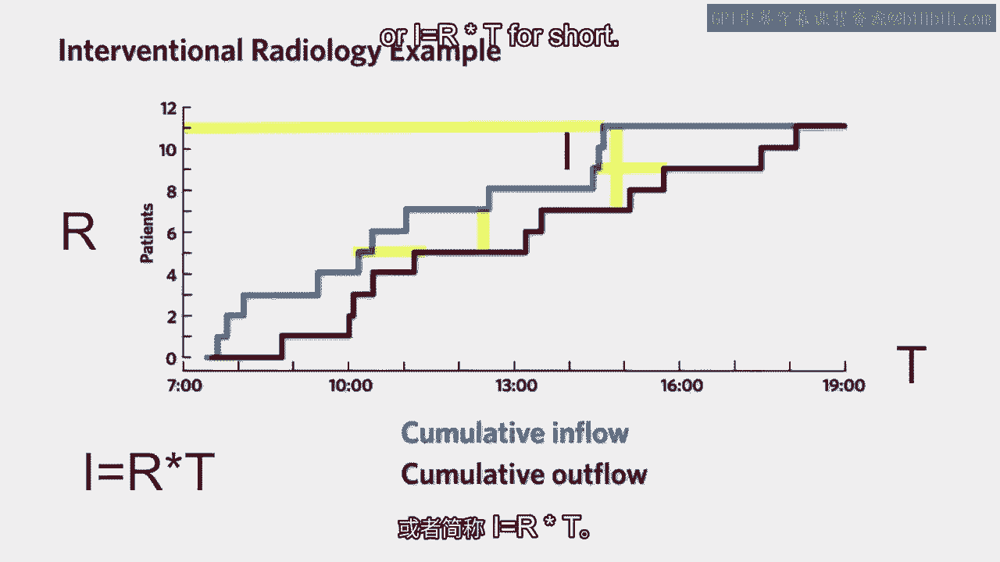

# 沃顿商学院《商务基础》课程｜第16课：利特尔法则 📊

在本节课中，我们将学习运营管理中的一个核心概念——利特尔法则。这个简单的公式揭示了流程中库存、流速和流程时间之间的基本关系。我们将通过一个医院的实际例子来理解它，并探讨其在商业实践中的重要意义。

## 概述：流程的三个核心度量

在深入公式之前，我们首先需要理解描述任何流程的三个核心绩效度量。上一节我们介绍了流程分析的基本框架，本节中我们来看看如何量化一个流程的表现。

以下是定义流程表现的三个关键指标：

*   **库存**：在流程中正在被处理的“流动单元”的数量。在医院例子中，这指的是部门内的病人数量。我们用字母 **I** 表示。
*   **流速**：单位时间内完成处理的流动单元数量。在医院例子中，这指的是每天（或每小时）诊治的病人数量。我们用字母 **R** 表示。
*   **流程时间**：一个流动单元从进入流程到离开流程所花费的总时间。在医院例子中，这指的是病人从进入部门到离开所花费的时间。我们用字母 **T** 表示。

## 医院观察实例 🏥

为了直观理解这些概念，我们进行了一个简单的观察实验。我们坐在宾夕法尼亚大学介入放射科的门口，记录病人的进出情况。

我们绘制了两条累积曲线：蓝色的**累积流入曲线**和红色的**累积流出曲线**。通过这两条曲线，我们可以直接读出或计算出三个核心度量：
*   一天结束时，两条曲线交汇，流入的病人总数就是当天的**流速 R**。
*   在任何时刻，两条曲线之间的垂直距离，就代表了该时刻部门内的**库存 I**（病人数量）。
*   对于每个病人，其流入和流出时间点的水平距离，就是该病人的**流程时间 T**。

观察一整天的数据图表，我们会发现一个清晰的规律。

## 利特尔法则：核心关系

基于上述观察，我们得出了一个至关重要的数学关系。这个关系就是**利特尔法则**。

**平均库存等于平均流速乘以平均流程时间。**

用公式表示为：
**I = R × T**

其中：
*   **I** = 平均库存（例如：病人数）
*   **R** = 平均流速（例如：病人/小时）
*   **T** = 平均流程时间（例如：小时）

这个公式以约翰·利特尔博士的名字命名，它指出在任何稳定的流程中，这三个度量之间存在着恒定的比例关系。

## 法则的启示与应用 💡

利特尔法则不仅是一个公式，更是一个强大的管理思维工具。它告诉我们，这三个绩效指标是相互锁定的。

*   **相互制约**：一旦你设定了其中两个指标的目标，第三个指标就由法则决定了。例如，如果你想减少库存（I），在保持流速（R）不变的情况下，唯一的办法就是缩短流程时间（T）。
*   **实践中的测量**：在实际分析中，我们往往很难直接测量所有三个指标。利特尔法则提供了计算的桥梁。通常，流速（R）和库存（I）相对容易统计（如产量、在制品数量），而流程时间（T）则常常被忽略或难以追踪。此时，我们可以利用公式 **T = I / R** 来计算出平均流程时间。

正如本杰明·富兰克林所说：“失去的时间永不再回。”利特尔法则帮助我们量化和管理这个宝贵的时间维度。

## 总结

本节课中我们一起学习了运营管理的基石——利特尔法则。我们首先定义了流程分析的三个核心度量：库存（I）、流速（R）和流程时间（T）。接着，通过一个医院病人流动的实例，我们观察并验证了这三者之间的关系。最后，我们得出了利特尔法则的公式 **I = R × T**，并讨论了它在管理库存、优化流程效率以及弥补数据测量缺口方面的重要实践意义。记住这个简单的等式，它将为你在分析和改进任何业务流程时提供清晰的指引。