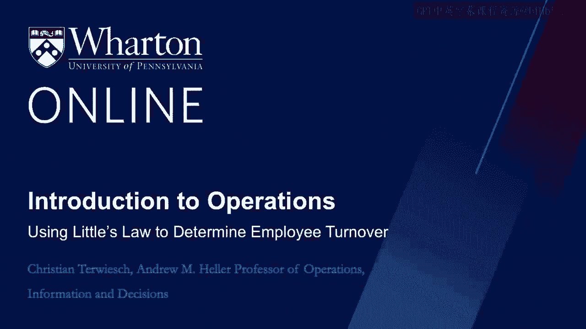

# 沃顿商学院《商务基础》｜Business Foundations Specialization｜（中英字幕） - P134：18_使用小法则确定员工周转率.zh_en - GPT中英字幕课程资源 - BV1R34y1c74c

In the last video， we talked about inventory turns。 We use little slaw with the Flow Unit。

being a dollar bill that will flow through our organization。 Today， we will pick a different。

Flow Unit。 We will think of the flow of employees through the organization， starting when they。

first get hired， to the point that they will leave the job。 Just like with inventory， we。

can ask ourselves how long does the typical employees stay in our organization。 This will。

get us to the ten year of the employee， and it will also help us determine how many new。

employees we have to hire each year。 So let's take a look。 Here on the left of the slide。

I repeat the calculations we did in the last video。 So the， Flow Units are dollar bills。

and the inventory is the number of dollar bills in the organization。

In little slaw connects all three， we can do the same thing for employees flowing through。

the organization where new hires are the inflows， departures are the outflows， and you can see。

here how long the organization holds an employee。 What is the average ten year of the employee。

when he or she leaves the company？ So the logic is really exactly the same。 So we can。

find the employee turnover as lost employees per year， the departures， divided by the average。

number of employees， that is employee turnover。 And then we can think about the average ten。

year of an employee on the day of their departure。 So that's really their flow time。 Of birth。

that on the day of departure， i。e。 when they leave， that is one over the employee turnover。

And notice the distinction here， the average ten year of an employee is just half the average。

ten year of the day of their departure， right？ At any time some people are new to the organization。

they might be on the first day of the job， and some people will be on the last day of， the job。

holding everything else equal， the average employee is exactly in the middle。

Let's look at a specific example。 The average employee has a ten year at cost score of nine， years。

Again， that is the average ten year。 And I'm asking you what is the average ten。

year when they leave cost score？ They're ten year on the departure， right？ And remember。

we said this is basically double the average employee ten year。 And so two times nine years。

is the ten year when they leave the organization。 This is going to be equal to 18 years。 That's。

a long time that they stay at cost score， a really long time。 So when we look at the employee。

turnover， then that is just one over 18。 So when we then want to look at how many employees。

that's cost score have to hire， and for the sake of argument， assume that the workforce。

stays constant here。 So that's little slow， i equals r times t。 And so what do we know？ Well。

we want to have 160，000 employees in the organization。 So that's our inventory。

So i equals r times the flow time， right？ And we set the flow time， that time is the ten。

year when they have， when they leave the firm after 18 years， right？ And so we're solving。

for r this time。 And so r is equal to 160，000 people divided by 18 years， which gives us。

a little less than 9，000 people that we have to hire each year。 Employee turnover is an。

important concept。 Some of the big consulting firms have an average ten year on the day。

of departure of a consultant of around four years。 That means their average ten year on。

the job is about two years。 It also means that for every hundred consultants on their， payroll。

they have to hire 25 new consultants every year， not to grow， but just to say put。

As i mentioned before， little slow always holds。 It includes the case in which a firm。

is rapidly growing and thus adding employees。 In this case， however， you might have to be。

more careful in determining the average number of employees as this number is likely to vary。

over time。 Similarly， not many employees might already have left the company。 And so。

the average ten year on the day of departure is something that you have to measure very， carefully。

Either way， the basic logic of little slow still applies even now over 50 years。

after it was first proven。 You can use it to compute flow time given inventory and flow， rate。

You can compute inventory turns and inventory costs or you can look at the turnover， of employees。

In the next video， we will practice these calculations。 See you then。 [BLANK_AUDIO]。
