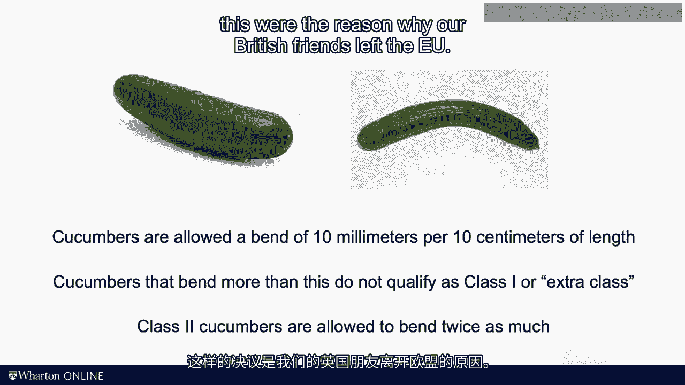
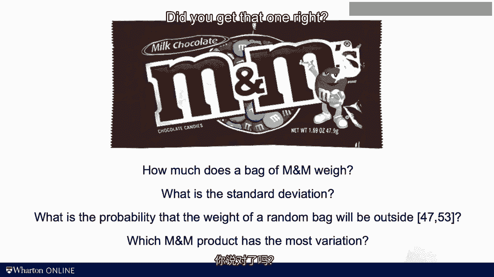
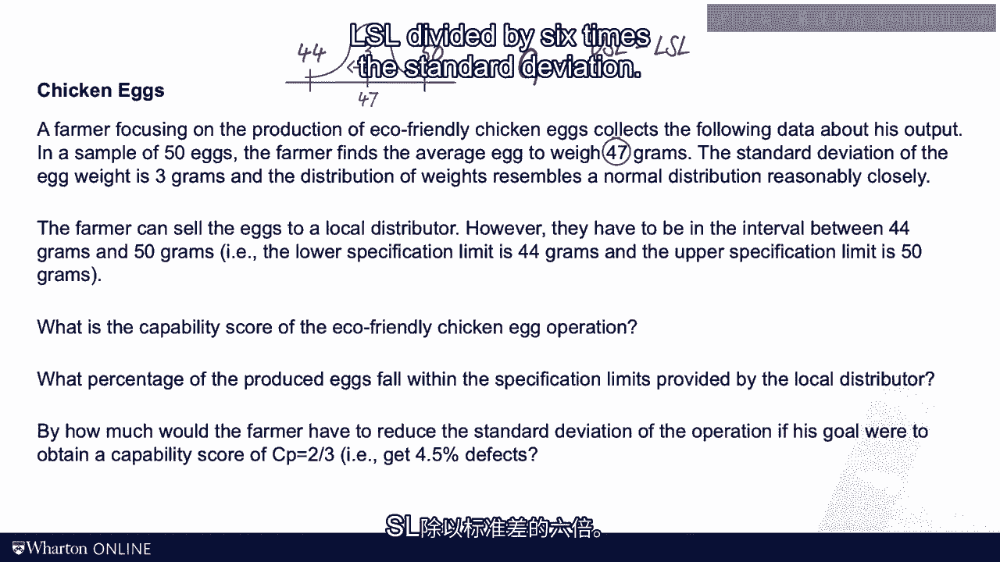

# 沃顿商学院《商务基础》｜Business Foundations Specialization｜（中英字幕） - P137：21_过程能力和6西格玛.zh_en - GPT中英字幕课程资源 - BV1R34y1c74c

I don't like to talk about politics in my class， but today I will make an exception。

European Union Commission Regulation， No。 1677-88， state that Q-commerce allowed a bent of 10。

millimeters per 10 centimeters of length。 Q-commerce has been more than this， do not。

qualify as class 1 or extra class Q-commerce。 Class 2 Q-commerce allowed to bend twice， as much。

If you were a cynic， you might say that resolutions like this were the。

reason why our British friends left the EU。 But allow me to backpedal just a little。

bit。 First， to my knowledge， the EU has since changed this resolution。 Second and。

maybe more importantly， the resolution speaks to a fundamental problem in， quality management。

If you want to sort floor units into good units and de facto， units。

you have to define what is good and what is bad。 The decision is based on。

what we call a specification。 The Commission acknowledges that Q-commerce come in。

different shapes and sizes reflecting the variation inherent in any process。

certainly one involving mother nature。 Now according to the EU bureaucrats， they。

exist in ideal Q-commerce shape in the form of a straight line。 And in their， view。

the more Q-commerce bends， the less desirable it is。 But how much bend is， tolerable？

Where is the cutoff？ As you wrestle with these types of quality， management questions。

you realize that as observed this rule might be， it's， actually pretty smart。

You have a specification and you measure the output， against the specification。

Now after measuring the coverage of Q-commerce for， a couple of years。

I needed a somewhat sweeter research topic so I got interested， in the production process for M&Ms。

On the labels of M&MX it says that there are， 47。9 grams of chocolate in there。

I have a couple of questions for you。 Ask， yourself how much do you think a bag of M&M actually weighs？

Moreover， what is a， standard deviation of that weight？ If I would take a thousand bags。

how many of， them would be below 47 grams and about 53 grams？ And then the last question I。

have for you， can you think of a product from M&M that has a relatively high。

degree of variation in weight？ Now arguably these are critical questions that。

deserve careful academic analysis。 Put me on pause and think about the questions。 Alright。

let's look at the last question first。 Which M&M product has the most， variation？

Did you get that one right？ Is the M&Ms was peanuts？ Why is that？ Well。

peanuts are grown maybe not organically but they are biologically produced so。

there's more environmental variation in the production process compared to， regular M&Ms。

To find the answers to the other three questions， here's what I did。

I went to the store bought all the M&Ms I could get a hold of。 Then I got my hands。

on at a high precision scale and here's what I found。 So I created myself a sample， of 125 bags。

In the sample I found an average weight of 50。0 grams。 The， standard deviation of the sample was 1。

03。 I would say from all the things that， you can eat or drink。

there's a very low standard deviation。 Making M&Ms， especially， those without peanuts。

is highly industrialized and it's probably one of， the lowest amount of variation that you can see。

Now you see a histogram over， here and you see the raw data from the sample in an Excel spreadsheet。

Ask yourself， would you bet your life on the fact that no bag of M&Ms is below 47 or about 53。

grams？ I looked at the data in my sample and I don't see a single instance of。

such outliers in the process but I would like the art such outliers。 Are they。

absolutely impossible？ As you can see the outcomes， the weights of the bags of， M&Ms。

they really follow some sort of a normal distribution。 If we agree that。

everything below 47 grams is a defect because it doesn't have enough chocolate。

in it and the customer might get upset and everything above 53 is a defect。

because customers might sue us because they get obese or if we agree to those。

specifications then we can draw a picture like this。 You see the normal。

distribution and then at the tails are the defects。 Now of course if there's。

something we could do to reduce the standard deviation to have less variation。

in the outcomes that would be good in the sense that we would have lower。

probabilities at the tails。 So you see here in this picture that in the upper。

distribution I can go three standard deviations from the mean before I'm gonna。

hit a specification limit i。e。 before my bag becomes a defect and now in the lower。

distribution I can go six standard deviations before things go wrong。 To。

capture that idea we'll introduce a new concept and that is a concept of， process capability。

We define the CP score where a C stands for capability of。

the process as a ratio between the difference of the upper specification， limit， the USL。

minus a lower specification limit， the LSL and we're going to divide。

that by six times the standard deviation and the process。 So in our M&M example。

that gets me 53 minus 47 divided by six times 1。03。 So that is a number that is。

just about one that capability tells you how likely you're gonna incur a defect。

If you have many standard deviations between the mean and the specification。

limit defects are unlikely。 In the case of a six sigma process CP is gonna be， equal to two。

In that case defects are highly highly highly unlikely。 We're， talking about two in a billion units。

If you have a three sigma process you're， gonna have three standard deviations from the mean to the defect level and so。

defects are probable but very unlikely。 And if you only have a CP score of 0。333。

you're gonna have defects 31% of the time。 So the CP scores are really good way to。

capture the amount of variation in the process relative to the width of the， specification interval。

Now beyond analyzing chocolate the capability analysis。

comes in handy when dealing with manufacturing tolerances。 This is a。

context for which most of this quality machinery has been developed。 For example。

my friend and colleague Carl Oryk has a kick scooter company。 You see his product。

the Zooter in many urban centers around the world。 Here's a picture。 A college。

challenge for Carl has been the steers support column。 If the unit is too small， below 79。

9 millimeter the scooter starts to rattle especially if you go over a， bumpy road。

If the unit is bigger than 80 millimeters it becomes hard to， manufacture it。

You really have to squeeze it in。 So what we did is we。

collected some data from his production process and we calculated the capability， score。

Again it's a USL minus the LSL。 In this case it would be 80 millimeters minus， 79。

9 millimeters and we divide this by 6 times the empirical standard deviation。

that we found in this plant。 To my great surprise statistics worked。 Those。

measurements were normally distributed and it turned out that this CP score。

for his factory the capability of his process was almost exactly the same as the。

one for M&M's crazy world。 All right time for practice problem。 So you see this。

very creative question about the chicken egg production process here with， three sub questions。

As usual put me on hold and see how far you can get on your， own。 All right here we go again。

So the weight of the chicken eggs follows， something that looks like a normal distribution and the weight is on。

average 47 grams and there's a standard deviation which we said is 3 grams and。

then there's a specification limits。 A lower specification limit LSL which is。

44 and an upper specification limit USL which is 50 and then the CP score as we。

defined is really the USL minus the LSL divided by 6 times the standard。

deviation。 So in our problem here that is simply 50 minus 44 divided by 6 times 3。

So that is 1/3 or 60 divided by 18。 So 0。33 is the CP score and with that we can。

look into the table that we have on the previous slide。 The CP score of 1/3 means。

that you have a defect probability so that you're outside the specification， limits of 0。317。

But the question I asked was for inside the specification limit。

Within the specification limit it is just 1 minus its stupid probability right。 So。

that is 1 minus 0。317 and that gets us just around 68 69 percent。 Next this farmer。

or the chicken of this farmer want to become more consistent right。 To find。

the required standard deviation we have to set we have to equate that CP score， to 2/3。

Well this is now an equation with one unknown。 The unknown is really the。

required standard deviation and so that is 6 divided by the 6 times sigma that we。

had before and that ratio is to be equal to 2/3。 So we're gonna solve now for。

sigma this is a linear equation and sigma so it's really not that hard to。

solve and we get a sigma of 1。5 grams。 Quality problems result from variability。

If you always get it wrong you would not be in business for long。 If you always。

get it right we would need a module on quality。 This is a little like my serve， in tennis。

My first serve is too short and goes into the net and the second serve。

is too long and it's called out but on average my serve is just fine。 So once。

again we're stuck talking about variability。 In the next video I want to。

introduce some definitions of variability that help us monitor process over time。

so that we rapidly detect when there exists some change in outcome。 I see you， then。 >> Okay。
