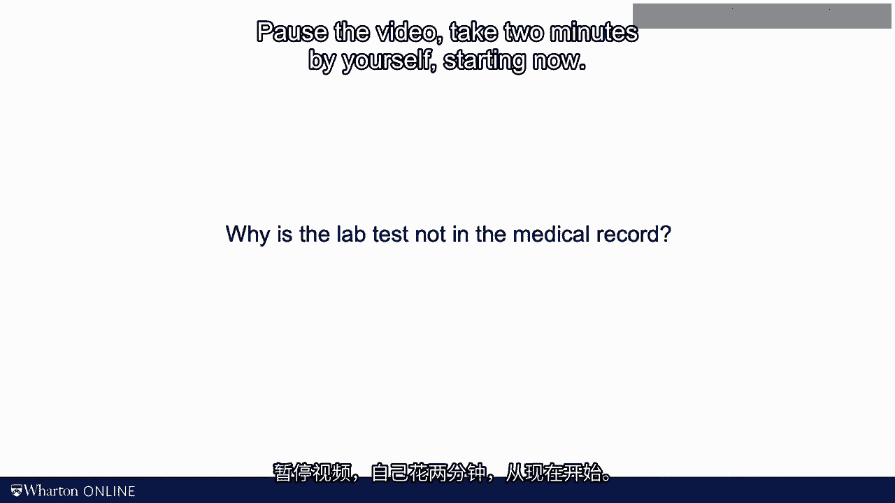

# 沃顿商学院《商务基础》｜Business Foundations Specialization｜（中英字幕） - P139：23_5次为什么框架-找到问题的根本原因.zh_en - GPT中英字幕课程资源 - BV1R34y1c74c

Once you have detected your process has a problem， once you have stopped it and you've。

alerted the operator， you need to find the root cause of the problem。 Again。

an example from healthcare might help。 So you get alerted to the following problem。

A doctor has ordered a lab， but that lab report is not in the medical record of the patient。

I want you to spend two minutes thinking about why your doctor was requested a particular。

lab test to be done by not see the results of the lab test in the patient's medical record。

Pause the video， take two minutes by yourself， starting now。

So what possible reasons did you come up with？ Well， let me ask you a slightly different question。

How did you go about the task？ Here's what I did。 I thought about the process from the doctor requesting the lab to the doctor seeing the。

labs in the chart。 In my imagination， that process looks something like that。

The doctor puts in the lab order。 The patient has to go to the lab。

The lab has to do the test and upload the test results。

And then the office has to update the chart with the lab results。 So clearly。

lots of things can go wrong along the way。 I try to visualize this on this chart。

All of these are reasons why the doctor cannot find the lab results in the chart。

Some of these reasons are specific to the office， some to the doctor， some to the lab。

and some to the patient。 Lots of things that could go wrong。 Let's visualize this。

This graph is known as a fishbone diagram。 The reason for that， I hope。

is pretty self-explanatory when you look at the picture。 For less obvious reason。

it's also known as an Ishikawa diagram。 Kawoo Ishikawa was a Japanese quality guru。

And I guess it's what happens when you get famous。 They start naming a graph after you。

Once you have this fishbone or Ishikawa diagram on the table， you get a team of people together。

and the team can now brain some of why the lab reports are often missing from the charts。 Really。

the fishbone diagram gives this brain-storming some structure。

It's better than just a long laundry list。 Some experts propose to use the following labels as the main bones of your fish。

Machines， methods， materials， manpower， and measurement。 That gives you five M's。 Personally。

I couldn't care less on how you label the bones of your fish。

Just label them in whatever way that works for you， but you get the sense here。

There are multiple potential root causes。 Now， rather than talking about the five M's。

I won't talk with you about the five Y's。 Sorry， I know that today I'm not sounding academically all that vigorous。

but this is pretty helpful stuff。 The five Y's are really a famous quality tool that once again go back to Taichiyono。

Rather than just accepting the defect that you just got alerted to， you should ask。

"Why did this defect happen？"， For example， we can ask， "Why did the lab not receive the request？"。

Well， maybe because it was still faxed to them and now 90% of the requests come in electronically。

Next we ask， "Well， why are they still faxing the request？"， Well。

maybe that is because at one practice doesn't have the resources to migrate everything to electronic data transfer。

But why？ So again， you grow the chart and step-by-step you identify additional potential root causes。

Now， it is important to know that the fishbone diagram is entirely a mental picture of what could have caused the problem。

It is really not based on data。 So here's where our second tool for today comes in and that is the per-rato chart。

The fishbone diagram lists the potential root causes of the problem。

The per-rato chart lists each of these potential causes and then counts the frequency of their occurrence。

How many times did that root cause contribute to the failure in the outcome variable？

In other words， here's what you do。 So you look at the last 100 or so charts with missing labs and you investigate why the labs were missing。

You simply count the frequencies of the root causes and then the per-rato chart sorts the root causes。

starting with the most relevant， the most common root cause。

And then what you do next is you can capture a line that counts cumulative percentages across all those root causes。

And the common empirical pattern then is that the vast majority of the problems can be explained by a very small set of root causes。

This pattern is oftentimes known as the per-rato principle or the 80/20 rule。

That means that really 20% of the root causes explain 80% of the failures。 Now。

that insight is going to be super helpful when you're going eventually going to improve the process。

In that sense， it somewhat resembles the value driver and the KPI trees。

What I like about the per-rato analysis is that it turns problems solving into an empirical exercise。

I'm sure we all have spent counting our sitting and meeting rooms and talked about problems and how to fix them。

The Fishborne diagram gives such a discussion and helpful structure。

but it's really the per-rato chart that forces us to collect data。

I also like the philosophy of the 5-Y framework。 More often than not。

the root cause is not at the level of the operator or even at the level of the process。

You notice that our idea of the root cause of the problem is shifting as we continue to ask why。

Initially， we want to blame the nurse。 Now we're blaming the hospital management for not updating the IT system。

As much as I like this framework and the next video， I want to talk about some of its limitations。

[BLANK_AUDIO]。
