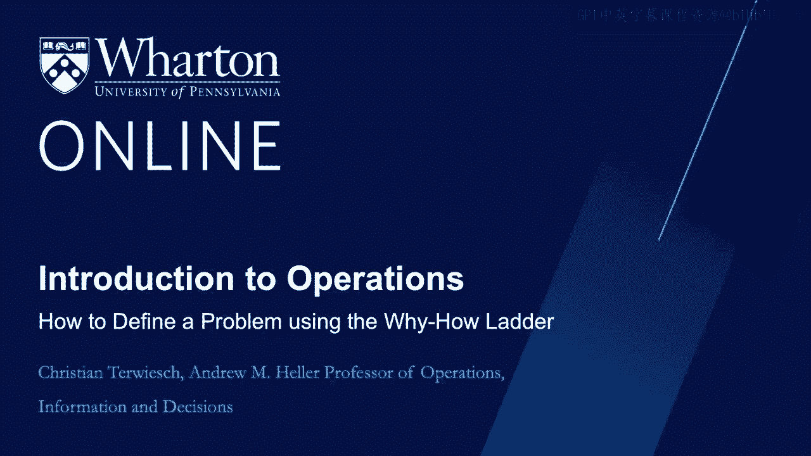
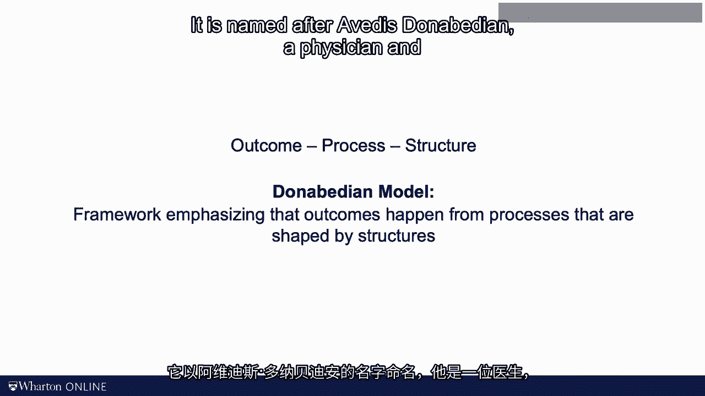
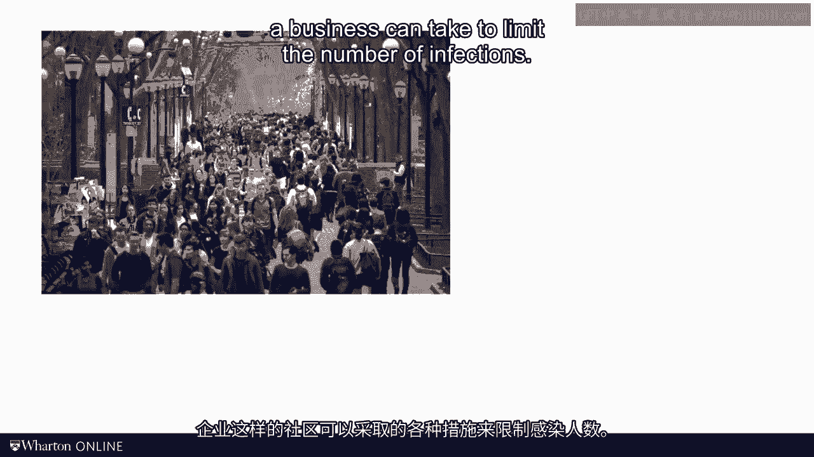
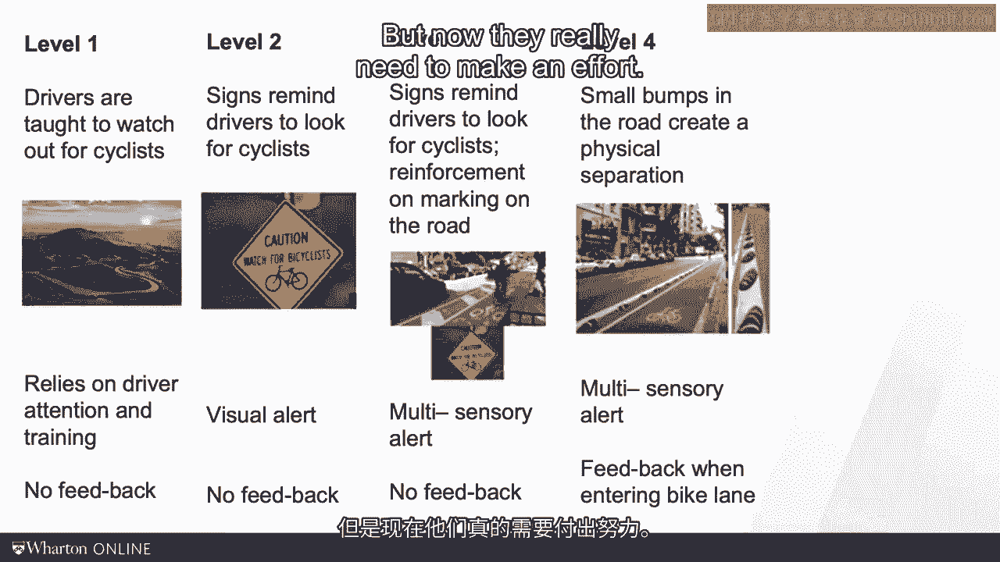

# 沃顿商学院《商务基础》课程｜第24讲：如何使用“为什么-如何”梯度来定义问题 🎯

在本节课中，我们将学习如何正确定义问题，特别是通过“五个为什么”框架及其扩展工具——“为什么-如何”梯度。我们将探讨这些工具的优势与局限，并学习如何在不同抽象层级上精准地描述问题，从而为寻找有效解决方案奠定基础。

---

## 回顾：五个为什么框架

在上一节视频中，我们介绍了“五个为什么”框架。

我们通过不断追问“为什么”，直到深入问题的根源。一旦找到根本原因，我们的目标就是消除它，以防止未来问题再次发生。您可能也注意到，通过追问“为什么”，我们的视角从将问题视为**不良结果**，转变为视其为**糟糕的流程**，最终看到更宏观的**结构**。

结果由流程决定，而流程又在更大的结构中被设计。这种结构、流程和结果的嵌套关系在各行各业中都非常普遍。在医疗保健领域，这被称为**多纳贝迪安质量模型**，以密歇根大学前教授、医生埃瓦迪斯·多纳贝迪安的名字命名。

从结果追溯到流程，再从流程追溯到结构，这正是“五个为什么”框架的亮点。

---

## 工具的局限性与新工具的引入

然而，在今天的视频中，我想谈谈这个工具的一些局限性。同时，我也想向您介绍一个我发现在这类工作中非常有效的相关工具。

让我们开始吧。以COVID-19大流行的传播为例，思考像我们大学或企业这样的社区可以采取哪些措施来限制感染数量。

根据流行病学知识，通过遵守卫生标准和社交距离，可以减缓甚至完全阻止病毒的传播。在运营管理领域，我们将新的感染视为不良结果，即缺陷。

每天，社区成员之间有成千上万次互动，其中一些人可能已知或未知地被感染。我们有无数的感染机会，也就有无数的缺陷机会。绝大多数互动不会导致感染，但总有一些会。这再次体现了结果的变异。

如果这种变异仅由随机性导致，我们称之为**普通原因变异**。然而，正如许多研究所记载的，如果一些传播或感染是由于未能良好遵守卫生标准和社交距离造成的，我们则称之为**可指明原因变异**。

---

## “五个为什么”框架的适用性分析

接下来，让我们看看“五个为什么”框架的实用性。设想沃顿商学院一名学生在疫情早期（比如2020年春季）被感染。

*   **为什么**学生被感染？因为他/她与其他未戴口罩的学生进行了互动。
*   **为什么**学生不戴口罩？因为在2020年4月，费城很难买到好的口罩。
*   **为什么**2020年4月费城很难买到口罩？因为美国面临个人防护装备的大规模短缺。
*   **为什么**美国面临个人防护装备的大规模短缺？

您明白我的思路了。我们从一个非常具体的校园感染控制问题开始，不知不觉中，我们面对的是一个深深卷入政治世界的问题。如果您对个人防护装备供应链话题感兴趣，我可以分享一篇我与宾夕法尼亚大学医学院CEO同事凯文·马奥尼合写的社论，其中讨论了准时制供应链的局限性。

但为了强调我的观点，这不是一个下周就能解决的问题。因此，让我阐述一个不同的定义问题的过程。

---

## 问题定义的新方法：“为什么-如何”梯度

据说，如果给我一小时来拯救地球，我会花59分钟定义问题，用1分钟解决它。无论这是否真实，但清晰的问题定义至关重要。

定义问题的过程始于陈述问题。我喜欢以“**我们如何才能**”或“**我们可以通过哪些方式**”开头来陈述问题。因为这种语言是开放式的，真正聚焦于问题本身，而不是预先设定了解决方案。

例如，我们可以将一个预防COVID的质量项目表述为：“**我们如何才能提高校园内佩戴口罩的遵守率？**”

将陈述写下来，并以“我们如何才能”或“我们可以通过哪些方式”开头。接下来，应用“五个为什么”的逻辑。问自己：**为什么**？我们为什么想这样做？这样做有什么好处？

在我们的案例中，答案可能是：因为这能提高对良好卫生标准的遵守率。
*   **为什么**？这有什么好处？因为这能减少COVID感染的传播。
*   再次问自己：**为什么**？这有什么好处？我们可能会说，这将带来一个更健康、更安全的校园环境。

这本身没错，但您真的想让您的团队去解决“我们如何才能创造一个健康安全的校园环境”这个问题吗？我想您明白我的意思了。随着我们不断追问“为什么”，我们面临将问题定义得过于宽泛的风险。

那么，反过来做怎么样？与其追问“为什么”，不如简单地追问“**如何**”？

---

## 运用“如何”来细化问题

我们或许可以通过提醒人们戴口罩来解决“如何提高校园内佩戴口罩遵守率”的问题。另一种方法是让口罩更广泛地可用。因此，我们现在可能会思考问题：“**我们如何才能提高校园内口罩的可用性？**”

但我们还可以进一步聚焦问题。例如，我们可以问：“**我们如何才能方便地设置口罩领取点？**”

然而，在某个时刻，您确实面临将问题定义得过于具体、过于狭窄的风险。这会排除许多可能以更少努力和更低成本防止病毒传播的有效解决方案。

我的观点是：质量问题可以在不同的具体程度上进行陈述。将它们从具体到一般写下来。“**为什么-如何**”梯度是一个非常有用的工具，能帮助您完成这个练习。

最终，我希望您选择一个您觉得合适的问题表述。如果有疑问，我建议您倾向于将问题定义得比最初设想的**更宽泛一些**。

---

## 案例研究：赫兹租车公司

让我通过租车公司赫兹的例子来说明“为什么-如何”梯度作为定义问题方法的威力。

几年前，赫兹经常面临机场租车站排长队、等待时间过长的问题，这无疑是一个糟糕的质量结果。定义这个问题的一个自然方式是：“**我们如何才能缩短排队时间？**”

当您这样做时，您实际上将当前流程视为既定事实，最终很可能得到诸如增加人手或使用更快电脑等改进方案。请不要误解，这些正是我们在本课程前面大部分内容中讨论过的解决方案类型，我很欣赏这一点。

但这样如何呢？让我们问“**为什么**”。我们为什么想缩短排队时间？或者，缩短排队时间有什么好处？通过这样做，我们拓宽了问题。

那么，**为什么**要缩短排队时间？因为我们真的希望客户能更快地前往目的地。这很有趣，不是吗？现在，我们可以着手解决“**我们如何才能让客户更快地前往目的地？**”这个问题。这是一个相关但不同的问题。我们刚刚拓宽了问题。

这让我们能够真正跳出框框思考。也许我们根本不需要排队。让客户直接去取车怎么样？让车在登机口等他们怎么样？最终，赫兹“金卡会员”服务的理念就是让频繁租车的客户无需排队，直接前往他们的车辆。然而，如果您只专注于最初的“如何缩短排队时间”问题，您是不会想到这个解决方案的。

---

## 回到质量：防错与防呆

好了，我想我有点跑题了。我们正在学习质量模块，而您的教授却在谈论排队。让我们回到质量。

“为什么-如何”梯度背后的理念是，您现在拥有一个可以帮助您定义任何类型问题的框架，当然也包括质量问题。但质量问题确实有些特殊，因为它们涉及与标准和规格的偏差。

那么，在处理质量问题时，是否有任何特定的工具或标准技巧呢？感谢您的提问。

如果您想避免不良结果，就必须减少流程中的变异，并且必须避免这些变异导致不良结果。这正是**石川馨模型**背后的核心理念。

那么，我们如何避免此类偏差？以及如何避免那些仍然存在的偏差导致不良结果？为此，我们必须构建**防故障**的流程。专家们经常谈论“防呆”。

“防呆”这个术语可能被认为有些不尊重和冒犯，所以再次借鉴日语可能会有所帮助。

让我定义 **Poka-yoke** 为防止错误发生。严格来说，在Poka-yoke下，错误不应无意中发生。但操作员的严重疏忽或恶意意图仍可能引发不良结果。

相比之下，**Baka-yoke** 字面意思是“防呆”操作。因此，Baka-yoke可以被认为是Poka-yoke的一种极端形式。在Baka-yoke下，犯错的难度会急剧增加，您真的需要很努力才能制造出一个缺陷。

这两个术语捕捉了我在本模块第一个视频中提到的**稳健流程**的理念。当输入和环境变量（包括意外错误）的随机变异被避免时，流程就是稳健的。而当即使是一个“傻瓜”也无法触发不良结果时，流程才是真正稳健的。

正如Baka-yoke和Poka-yoke定义之间的差异所表明的，错误预防确实有多个层次。以自行车安全为例，您知道这是我很关心的话题。

*   **最基本的保护**来自交通法规。宾夕法尼亚州的交通法规定，司机必须与骑自行车的人保持四英尺的距离。大多数司机不知道这条法律，但当我被卡车撞到时，知道法律站在我这边是件好事。
*   **下一个更高级的层次**是在路边设置标志。我讨厌那些写着“共享道路”或“注意骑行者”的标志。我讨厌它们是因为它们对司机影响甚微。“共享道路”对他们来说与对我意义不同。但至少比什么都不做强。
*   **再下一个更高级的层次**不仅仅是设置标志，而是在道路上进行清晰的标记。幸运的是，费城有许多自行车道。它们效果不错，只不过最近它们真的变成了外卖取餐的临时停车道。
*   **使流程更稳健的第四层次**通常被称为**多感官反馈**。请看这些小护栏。如果那辆SUV司机想撞我，他/她仍然可以做到，但现在他们真的需要付出努力。

那些无意中漂移到自行车道的司机会得到非常强烈的反馈——他们的车开始发出嘎嘎声。
*   **保护骑行者安全的终极防呆方法**是给我们自己的道路网络。这在荷兰和整个欧洲很常见。公平地说，费城确实有很多这样的自行车道。现在，即使是最愚蠢或最恶意的司机也无法撞到骑行者了。

---

## 总结

在本节课中，我们一起学习了如何利用“五个为什么”和“为什么-如何”梯度来定义问题。

“五个为什么”和“为什么-如何”梯度是强大的工具，可以帮助您在不同分析层次上思考问题。它们本身不提供答案，但能引导您提出正确的问题。

对于质量问题，大部分行动在于使员工遵守某些标准和规格。错误预防和防呆的五个层次并没有给您一个简单的答案，但它们迫使您思考寻找解决方案的替代方法。

希望您也能发现这些工具非常有用。这就是我今天要分享的全部内容。下次再见。

[ 静音 ]