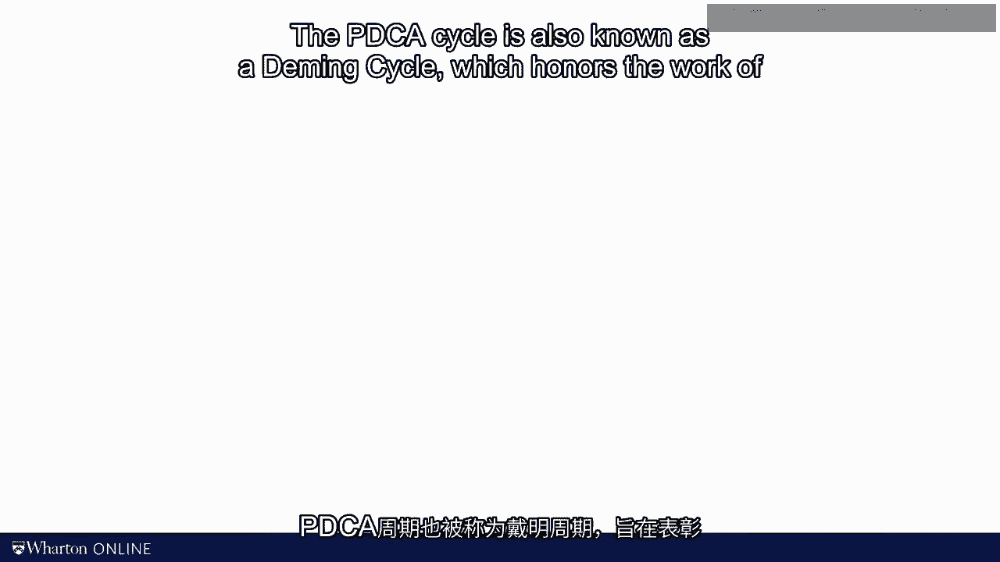

# 沃顿商学院《商务基础》｜Business Foundations Specialization｜（中英字幕） - P141：25_PDCA循环.zh_en - GPT中英字幕课程资源 - BV1R34y1c74c

There is one last piece of content that I wanted to share with you as part of this module。

on quality。 Just like the Y-How letter， it is really a broader tool and it doesn't。

squarely fit into any of the boxes that I had outlined at the beginning of the module。

But I should not teach a module on quality without talking about this concept which。

is known as the PDCA cycle。 Today， it gave me a few minutes to talk about the PDCA cycle。

and then I will wrap up the module。 So here we go。 PDCA stands for Plan， Do， Check and Act。

With really everything that we discussed in this module， we are now well equipped to plan。

some process changes。 Plan n consists in a large part of analyzing past performance， data。

It should include things such as the Fishbone diagram， the Pareto charts， but it。

might also include other elements that we have discussed in this course such as process flow。

diagrams or OE charts。 The do piece is then about trying out a change。 For example， you。

just thought about a way of preventing a major root cause from happening again。 Maybe you。

found a way to offload the bottleneck。 Sounds like a good idea， but will it work？ You really。

cannot plan your way to success。 At some point， you have to just try stuff out。 Taking action。

is at the do part in the D of PDCA。 Check then stands for the evaluation of your action。

Whether or not that change works， that's really an empirical question。 Just like hypothesis。

in other sciences that either supported or rejected by data， our process improvement idea。

is a speculative hypothesis as long as it hasn't been evaluated in practice。 And then， finally， act。

Act stands for Acting on what you have learned in the experiment。 If the。

experiment confirmed that the process change was a good one， you want to make it part of。

the standard of your work going forward。 The famous or somewhat cheesy thing in the process。

improvement community is that the road to quality has no end。 I know again， somewhat， cheesy。

but there's really， there's something in here。 There's always something that you。

can do to improve the process further。 That's what I like about the PDCA cycle。 The cycle。

has no beginning and no end。 You keep it on cycling through PDCA and hopefully along the， way。

your operations are going to improve。 The PDCA cycle is also known as a Deming cycle。

which honors the work of William Edward's Deming was a pioneer in the quality management。

and community。 Deming was instrumental in importing statistically rigorous approaches to learning。

and experimentation into the fields of operation management。 That gets me to my last point in。

this module and maybe throughout the scores and that is a combination of theory and empirical， data。

Good operations in my view， just like in any science， requires an interration between。

the real world， which tends to be messy and dirty and complex and the academic tools that。

I taught you in the scores。 All right， let me summarize。 This module was really light on， math。

only one equation here on the capability score， but very heavy on definition。 I have。

a longness of vocabulary here for you to learn， but maybe more importantly， allow me to switch。

over and review the big picture of the narrative of quality management。 We started this module。

with measuring variation。 It was the idea behind capability analysis， whether we managed cucumbers。

steering support parts or M&M bags。 There are capabilities scores which capture the likelihood。

that the real-life observation is outside the specifications。 Once we understood the variables。

in the process， we could conduct a conformance analysis to see whether or not our process。

is behaving in line with past behavior。 There's something abnormal going on， either statistically。

detected or detected by an operator， we want to do detect， stop alert。 Once we are stopping。

we want to understand the root cause of why we're stopping。 Why did we have the problem。

in the first place？ That got us to the five Y-framer， the fishbone diagram and the parator， chart。

And then finally， we talked about process improvement， in particular the concept of the。

Y-howl letter。 How might we go about improving the process？ And how can we make the process。

more robust so that future variations in input or environmental variables will not again。

lead to a bad outcome。 That together creates a damning cycle。 It is really a loop of problem。

solving， a loop of quality improvement that never ends。 Alright， are you ready for the。

one practice problem of the module？ Here it comes。 I'm not sure it's all that creative。

but for one last time， put me on hold and try it by yourself。 Alright， so let's look。

at this together。 So we have these weights of the beef pads and in the following， I didn't。

say this explicitly， but let's just assume they follow some sort of a normal distribution。

The main we said is 250。 The standard deviation is 4 grams。 And the specification limits are。

240 and 260。 So that's the interval。 And so then when we compute a CP score， we look at。

CP as 260 minus 240， upper specification limit minus lower specification limit。 And we're。

going to divide this by 6 times standard deviation。 And that is， in this case here， 20 divided。

by 24。 So if you want to make sure that this is a 6-sigma process， CP score has to be equal。

to 2 now。 We're not going to use a generic， not 4， but a generic standard deviation。 And。

so we said 2 is equal to 20 divided by 6 times sigma， where the 20 is really the 260 minus， the 240。

We solve this equation for sigma。 We do so we cross multiply。 And then we want。

to get that sigma is equal to 20 divided by 12。 With that standard deviation， it's a 6-sigma。

process。 That concludes the module on quality。 As I said before。

this module was length mathematical。

and maybe even at times somewhat philosophical。 But for the better or for the worse， the complexity。

of real operations cannot always be squeezed into a set of elegant formulas。 We're better。

off simply admitting that。 And then we can iterate， we can prototype， we can experiment。

Our models are still useful。 We're not just randomly trying process improvement ideas， out。

Good theory in the form of good models will guide us where to look next。 These models。

will help us formulate hypotheses and they will guide us in their testing。 With that， approach。

operations is as much as a science or physics or psychology。 Thank you for your， time。

[BLANK_AUDIO]。
