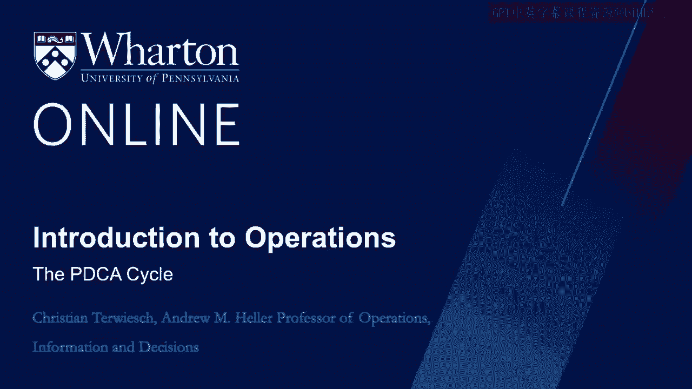
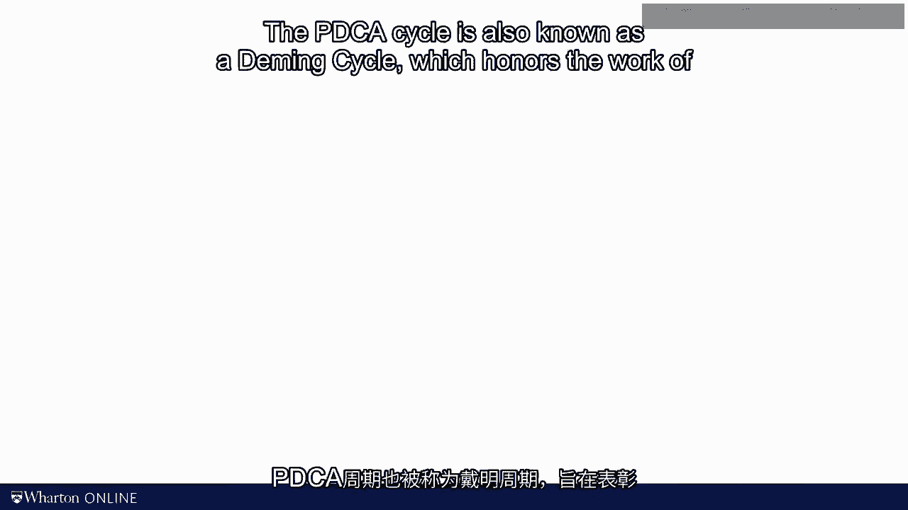
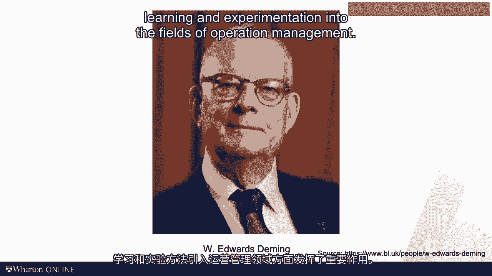
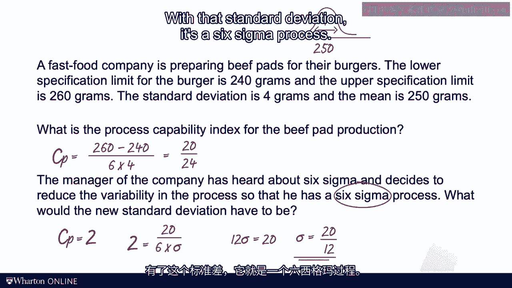

# 沃顿商学院《商务基础》课程笔记｜第141讲：PDCA循环 🔄

在本节课中，我们将学习质量管理中的一个核心且通用的工具——PDCA循环。这个循环提供了一套系统化的问题解决与持续改进框架。

## 概述

作为本质量模块的最后一部分内容，我想与大家分享PDCA循环。它与之前提到的“Y-How”信函一样，是一个更广泛的工具，并不完全契合本模块开始时划分的类别。但在讲解质量管理的模块中，不能不提及这个概念。

## 什么是PDCA循环？

PDCA代表**计划（Plan）**、**执行（Do）**、**检查（Check）** 和**处理（Act）**。它是一个持续改进的循环模型。

上一节我们介绍了“Y-How”信函等改进工具，本节中我们来看看如何将它们系统性地应用于实践中。

### PDCA四阶段详解

以下是PDCA循环的四个阶段及其核心任务：

1.  **计划（Plan）**
    此阶段主要是分析过去的绩效数据。它应包括鱼骨图、帕累托图等工具，也可能包含我们在课程中讨论过的其他元素，如流程图或OE图。

2.  **执行（Do）**
    此阶段是关于尝试做出改变。例如，你可能想到了一个防止主要根本原因再次发生的方法，或者找到了缓解瓶颈的方法。想法虽好，但能否奏效？你无法仅靠计划就获得成功，必须在某个时点付诸实践。采取行动就是PDCA中“D”的部分。

3.  **检查（Check）**
    此阶段代表对你所采取行动的效果进行评估。改变是否有效，这是一个实证问题。就像其他科学中的假设需要数据支持或反驳一样，我们的流程改进想法在未经实践检验前，都只是一个推测性的假设。

4.  **处理（Act）**
    此阶段意味着根据实验中学到的东西采取行动。如果实验证实流程改进是有效的，你就应将其纳入未来的工作标准中。

## PDCA循环的特点与意义

流程改进领域有一句著名（或许有些老套）的话：“质量之路永无止境。”这句话虽显老套，但其中确有道理。你总是可以找到进一步改进流程的方法。这正是我喜欢PDCA循环的地方——它没有起点，也没有终点。你持续在这个循环中运转，并希望在此过程中，你的运营能不断得到改善。

PDCA循环也被称为**戴明循环（Deming Cycle）**，以纪念威廉·爱德华兹·戴明在质量管理领域的先驱工作。戴明在将统计上严谨的学习和实验方法引入运营管理领域方面发挥了重要作用。

## 模块总结与核心理念

这让我想到了本模块，也可能是整个课程的最后一个要点：**理论与实证数据的结合**。

在我看来，优秀的运营，就像任何科学一样，需要在混乱、复杂且不完美的现实世界，与我在课程中教授的理论工具之间，建立起迭代联系。

让我们来总结一下。本模块数学内容很少（只有一个关于能力得分的公式），但定义非常密集。我提供了大量需要学习的词汇。但更重要的是，请允许我切换视角，回顾一下质量管理叙事的大局：

*   我们以**测量变异**开始了本模块。这是能力分析背后的核心理念，无论我们管理的是黄瓜、转向支撑部件还是M&M豆包装袋。能力得分（Cp）捕捉了实际观测值超出规格限的可能性。
    *   **公式**：`Cp = (USL - LSL) / (6 * σ)`
*   一旦理解了流程中的变量，我们就可以进行**一致性分析**，以查看流程行为是否符合历史模式。
*   如果出现异常情况（无论是通过统计方法检测到还是由操作员发现），我们希望执行**检测、停止、警报**。
*   一旦停止，我们希望理解停止的**根本原因**。这引出了五个“为什么”框架、鱼骨图和帕累托图。
*   最后，我们讨论了**流程改进**，特别是“Y-How”信函的概念。我们如何改进流程？如何使流程更稳健，以便未来的输入或环境变量变化不会再次导致不良结果？

所有这些共同构成了一个**戴明循环**。它实际上是一个永无止境的问题解决和质量改进循环。

## 课程结语

正如之前所说，本模块在数学上很轻量，有时甚至有些哲学意味。但无论好坏，现实运营的复杂性无法总是被压缩进一套优雅的公式中。我们最好坦然承认这一点。然后，我们可以进行迭代、原型设计和实验。

我们的模型仍然有用。我们并非只是随机尝试流程改进的想法。好的理论（以好的模型形式）将指导我们下一步该关注哪里。这些模型将帮助我们提出假设，并指导我们进行检验。

采用这种方法，运营学就像物理学或心理学一样，是一门科学。

感谢你的时间。