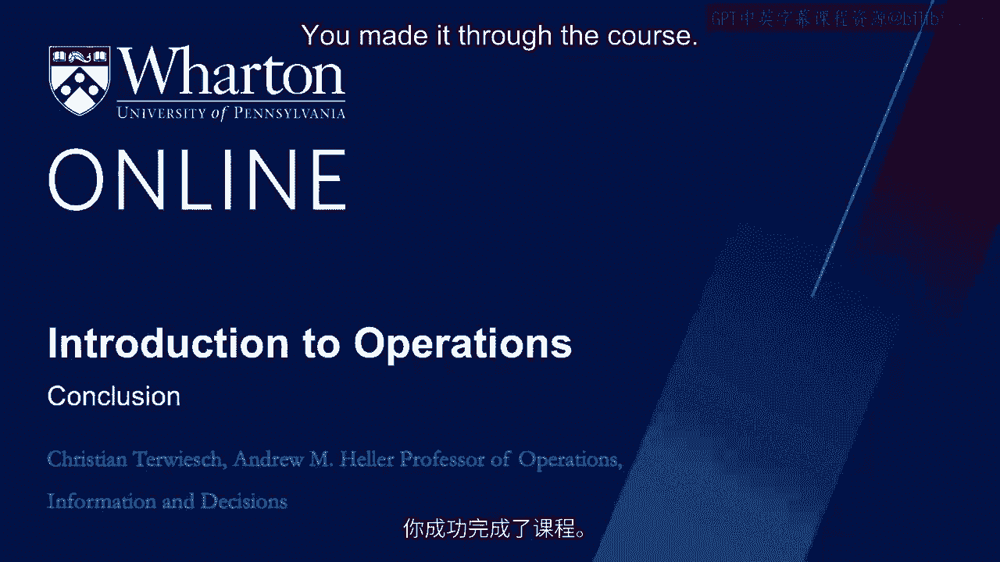
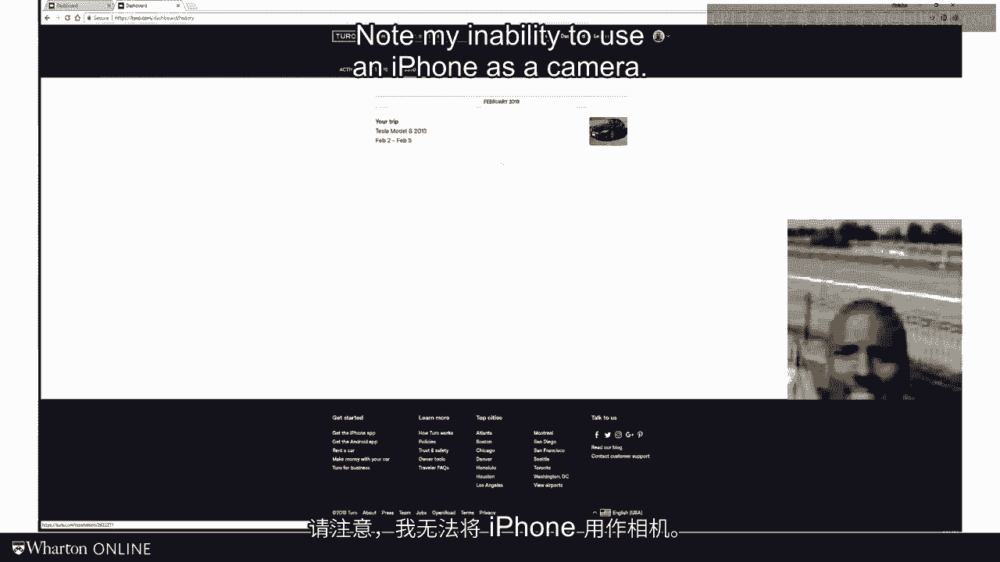
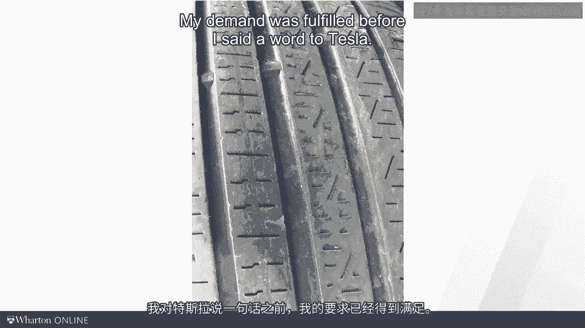

# 沃顿商学院《商务基础》｜Business Foundations Specialization｜（中英字幕） - P142：26_总结.zh_en - GPT中英字幕课程资源 - BV1R34y1c74c

All right， you made it through the course。

Congratulations。 Thank you for your time。 I thought that rather than me just saying goodbye in this last module。

after all these， hours we spend together， I owe you a little more of a personal goodbye。 By now。

you already might be sick and tired of my personal examples， but here's one last， one。

I promise it's the last story of this course。 And it starts in the winter in Philadelphia。

What happened？ Well， here's the story。 This is a picture of my son Jan and myself。

The thing behind us， however， is not our car。 At that time。

my wife and I had two teenage drivers in the house。

And in all of you having a car that accelerates from zero to sixty miles per hour in four。

seconds was not the right vehicle for our young drivers。 But Jan and I really liked electric cars。

So we wanted to try one out。 And we agreed on the plan to rent a Tesla。 Now， at that time。

this was a couple of years ago， renting a Tesla was really hard。

So we went on this platform called Tool。 If you have not seen Tool， it basically works like Airbnb。

It's just for cars。 On Tool， I met this gentleman by the name of Marlon。 Great guy， super friendly。

super fun。 But just for the record， this is his profile picture on Tool。

Not my inability to use an iPhone as a camera。

Marlon was willing to rent his artist more or less for a weekend。

Now driving around in the car was fun， especially for someone who has mostly been driving a。

Toyota Prius before。 Now， I don't know if this has ever happened to you。

but it was winter in Philly and it， was cold。 And what can happen when it gets cold is that the air in the tire compresses。

So the tire alarm went on over and over again。 So we had to do the most embarrassing thing you can do with a Tesla。

which is what？ Right， pull into a gas station。 That fixed the problem。 But after one hour。

the tire alarm went on again。 We had enough and just called it a day。 Sunday morning comes along。

I leave you alone with my religious beliefs， but most Sundays we go to church。

So we took the Tesla and parked it behind the church。

Some 90 minutes later we come out of the church and what do we see behind our Tesla？ A tow truck。

This is when I got really mad。 I said， get away from my car。 This is fully legal parking here。

Now the tow truck driver was a little puzzled。 He said， well。

I got the service request that this guy is in need for new tires。

And so I took the liberty to replace all your tires， you sir， I got to go。 Wow。

What a magic customer experience。 I didn't ask for this service。 I didn't call the tow truck。

My demand was fulfilled before I said a word to Tesla。

I share this story as I think it offers us a glimpse into the future of operations。 First。

to really delight customers， to really maximize willingness to pay， future operations。

will not just wait for the customer demanding something。 They will know what the customer needs。

maybe even before the customer knows herself。 That gets us to the power of big data and predictive analytics。

Second， even in the future， great operations will still have to keep fulfillment costs low。

There still will be an efficiency frontier。 Note that this request was not handled by a Tesla mechanic。

the diagnostic cabinet automatically， via the onboard electronics。

And the mechanic was sourced via subcontracting， capacity on demand。

Tesla does not have to pay when the mechanic is idle。 In my example。

willingness to pay went up and the fulfillment costs were kept low。

That is the key to good operations。 Any industry you can think of is going through massive changes caused by digitization。

Moreover， the rapidly changing geopolitics in our world will dramatically impact future， operations。

But in all this turmoil， one thing is clear to me。

Despite what you hear from some self-declared technology gurus talking about artificial intelligence。

and robots， we will not be running out of work。 There will be students who need to be educated。

patients that need medical care， and new technologies， that have to be developed。

It also looks like the Western world has to relearn how to manufacture products。

So in my arguably biased view， operations management， the science of analyzing and improving work。

has never been more interesting。 Whatever work you might be doing。

I hope you found this course helpful。 Thank you for all the work you put in。

Stay in touch with your Twitter or LinkedIn。 For now， goodbye or all of you does it。 Thank you。

for watching。 [BLANK_AUDIO]。
