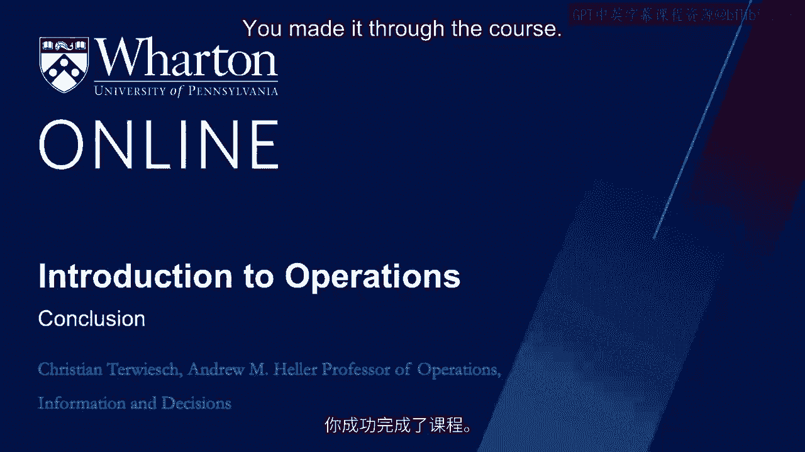

# 沃顿商学院《商务基础》课程总结 🎓

在本节课中，我们将回顾整个课程的核心内容，并通过一个生动的个人故事，展望运营管理的未来趋势。

---

## 课程回顾与个人故事

恭喜你完成了这门课程。感谢你投入的时间。在最后一个模块中，我认为比起简单的告别，我欠你一个更个人化的道别。

现在，你可能已经厌倦了我的个人例子，但这是最后一个故事。故事始于费城的冬天。

这是我的儿子扬和我的一张照片。然而，我们身后的东西不是我们的车。那时，我和妻子家里有两个青少年司机。对于年轻司机来说，拥有一辆能在四秒内从零加速到六十英里每小时的汽车并不合适。但扬和我很喜欢电动汽车，所以我们计划租一辆特斯拉。

几年前，租一辆特斯拉非常困难。我们使用了一个名为Turo的平台。如果你没见过Turo，它基本上像爱彼迎一样运作，只是针对汽车。在Turo上，我遇到了这位名叫马龙的先生。他人很好，非常友好，也很有趣。但需要说明的是，这是他在Turo上的个人资料图片，并非我使用iPhone拍照的技术问题。

马龙愿意将他的车租给我们大约一个周末。开车兜风很有趣，尤其是对于一个之前主要开丰田普锐斯的人来说。我不知道你是否遇到过这种情况，但费城的冬天很冷。天气变冷时，轮胎里的空气会压缩。因此，轮胎警报反复响起。我们不得不做了开特斯拉时最尴尬的事——把车开进加油站。这解决了问题。但一小时后，轮胎警报又响了。我们受够了，决定当天不再开车。

周日早上到了。我尊重你的宗教信仰，但大多数周日我们会去教堂。我们开着特斯拉，把它停在教堂后面。大约90分钟后，我们从教堂出来，看到特斯拉后面有什么？一辆拖车。这时我非常生气。我说，离我的车远点。这里停车是完全合法的。拖车司机有点困惑。他说，我接到服务请求，说这辆车需要新轮胎。所以我擅自更换了你所有的轮胎，先生，我得走了。

多么神奇的客户体验。我没有要求这项服务。我没有叫拖车。在我对特斯拉说一个字之前，我的需求就被满足了。

---

## 从故事看运营管理的未来

我分享这个故事，是因为我认为它让我们得以一窥运营管理的未来。

首先，为了真正取悦客户，最大化支付意愿，未来的运营不会仅仅等待客户提出需求。它们将知道客户需要什么，甚至可能在客户自己意识到之前就知道。这让我们看到了大数据和预测分析的力量。

其次，即使在未来，出色的运营仍然必须保持较低的履行成本。效率边界依然存在。请注意，这个请求不是由特斯拉机械师处理的，而是通过车载电子设备自动诊断，并通过分包、按需调配产能的方式由机械师完成。当机械师空闲时，特斯拉无需支付费用。

在我的例子中，支付意愿上升了，而履行成本保持在低位。这是良好运营的关键。

---

## 运营管理的未来趋势与重要性

你能想到的任何行业都在经历数字化带来的巨大变革。此外，世界地缘政治的快速变化也将极大地影响未来的运营。

但在所有这些动荡中，有一件事对我来说是清楚的。尽管你听到一些自诩的技术专家谈论人工智能和机器人，但我们不会没有工作可做。总会有需要教育的学生、需要医疗护理的病人以及需要开发的新技术。西方世界似乎也必须重新学习如何制造产品。

因此，在我看来，运营管理——这门分析和改进工作的科学——从未像现在这样有趣。无论你从事什么工作，我希望你觉得这门课程有所帮助。感谢你付出的所有努力。

---

## 总结

在本节课中，我们一起回顾了整个课程，并通过一个关于特斯拉的个人故事，探讨了运营管理的核心原则与未来方向。我们了解到，未来的成功运营将依赖于**预测客户需求**和**高效控制成本**。无论技术如何发展，运营管理作为一门科学，其重要性将持续增长。感谢你的观看。