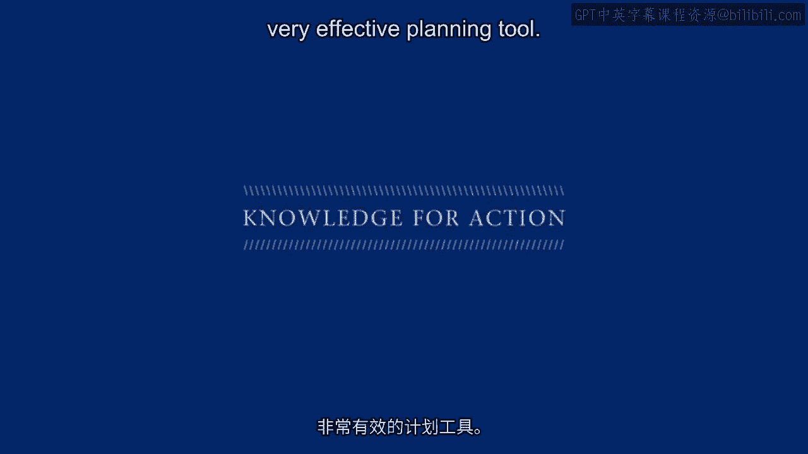

# 沃顿商学院《商务基础》课程 P145：战略营销框架应用教程 🎯

在本节课中，我们将学习如何使用一个三维战略营销框架来规划营销策略，并促进公司内部关于不同市场假设的讨论。这个框架通过三个维度——运营卓越、性能优势和客户亲密度——帮助企业明确自身定位、理解客户期望，并制定有效的短期与长期战略。

---

## 确定框架的三个维度 📊

上一节我们介绍了战略营销框架的三个核心维度。本节中，我们来看看如何为你的行业和产品定义这些维度。

首先，你需要明确在你的行业中，“运营卓越”具体指什么。这通常包括客户服务、可靠性、成本控制、交付和库存管理等方面。关键在于，你必须根据客户、竞争对手以及你自身的理解来定义这个维度。

其次，“性能优势”维度指的是在你的行业中，什么构成了卓越的产品性能。在金融服务领域，这可能指股票或金融工具的表现；在其他行业，可能是产品设计、风格或技术。你需要确定在性能优势轴上应该衡量什么。

最后，“客户亲密度”维度意味着提供客户真正想要的东西，涉及定制化和满足客户的独特需求。你需要思考在你的行业中，实现客户亲密度具体意味着什么。

---

## 确定公平价值 📈

在明确了三个维度后，下一步是确定每个维度上的“公平价值”。公平价值是客户在每个维度上的期望值，你的产品必须至少达到这个水平，否则客户会拒绝你。

公平价值并非一成不变，它会随着客户期望的提升而变化。例如，在一个全新市场中，初始客户期望可能为零。当像苹果iPad这样的新产品进入市场时，它凭借新功能设定了新的性能标准，这些新功能随后成为新的公平价值。随着产品成熟，客户期望会不断提高。

在成熟市场中，客户对产品功能和运营效率的期望通常都很高，这使得差异化变得困难。此时，竞争往往转向运营效率，例如以更低的价格提供相同的利益。

以下是确定公平价值时需要考虑的几点：
*   公平价值是动态的，会随时间推移而上升。
*   在成熟市场，性能和运营维度的期望通常很高。
*   在某些市场（如个人服务），客户亲密度的期望可能最高。
*   确定公平价值是应用此框架最具挑战性的部分，可以通过市场调研、行业经验或竞争对手分析来完成。

---

## 绘制公司与竞争对手的位置 🗺️

确定了维度和公平价值后，接下来需要绘制你的公司、竞争对手与公平价值线的相对位置。

假设在本示例行业中，公平价值线位于各维度的特定位置。通过市场调研或管理层的洞察，你可以评估你的公司在这些维度上相对于公平价值的表现。例如，你的公司可能在性能优势上低于公平价值，在运营卓越上高于公平价值，而在客户亲密度上刚好达到较低的期望值。

同样，你需要绘制主要竞争对手的位置。他们可能在运营卓越上远低于你，但在性能优势上超过你，并且在客户亲密度上也达到了标准。

---

## 规划短期与长期战略 🚀

绘制完位置图后，就可以开始规划战略了。框架的核心原则是：必须在两个维度上达到公平价值，并在一个维度上做到最好。

以图中红色公司为例，其短期战略可能是提升性能优势，因为目前它低于公平价值线。如果不尽快改善产品性能，公司可能面临被市场淘汰的风险。

长期来看，该公司可能希望成为运营卓越领域的市场领导者，就像沃尔玛或先锋集团那样。因此，它需要制定策略来保持并巩固其在运营卓越方面的领导地位。

这个框架的强大之处在于，它迫使团队明确假设，将复杂的市场环境、客户期望、竞争对手表现以及公司自身的优劣势直观地呈现在一个图中。

---

## 框架的动态应用与考量 ⚙️

这个框架可以系统性地使用，例如通过市场调研来精确绘制各方位置。但必须记住，公平价值是动态的，你需要持续跟踪其变化。

战略规划本身也是动态的。当你采取行动时，竞争对手会做出反应。因此，你需要思考：如果我向某个方向移动，竞争对手可能会如何应对？这为你规划长期的战略行动提供了思路。

此外，还需要考虑在不同维度上提升表现所需的成本。例如，在性能优势轴上大幅提升可能需要巨额投资，这可能会影响你的短期战略选择，或许更适合作为长期目标。

最后，必须注意这三个维度并非完全独立。例如，当你着力提升产品性能时，可能会增加成本，从而影响运营效率；同样，专注于技术和设计时，可能会降低客户定制化的灵活性。因此，在制定战略时必须综合考虑这些相互作用。

---

## 总结 ✨

本节课中，我们一起学习了如何应用三维战略营销框架。我们首先定义了运营卓越、性能优势和客户亲密度在特定行业中的含义，然后确定了动态变化的客户公平价值期望。接着，我们绘制了公司自身与竞争对手在市场中的位置图。基于此，我们规划了旨在满足两个维度公平价值并在一个维度成为最佳的短期与长期战略。最后，我们探讨了框架的动态性、竞争反应、成本考量以及维度间的相互关联。这个框架以其清晰、直观的方式，映射了市场、公司和竞争的复杂性，是一个非常有效的战略规划工具。