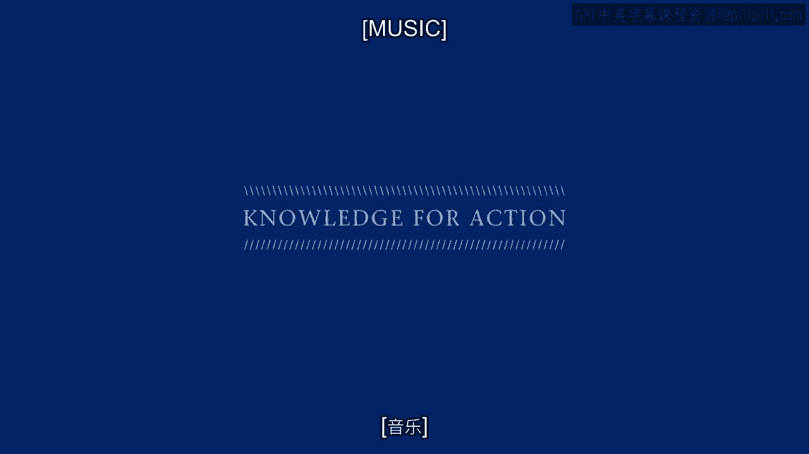

# 沃顿商学院《商务基础》｜Business Foundations Specialization｜（中英字幕） - P148：5_客户发展3 07.zh_en - GPT中英字幕课程资源 - BV1R34y1c74c

[MUSIC]。

Now we're going to talk about customer development。 And before I ask you the same question。

I first want to be real clear what we mean by customer development。

The general idea is we want to make our customers as valuable as possible。

Our existing customers as valuable as possible。 And so what are the tactics associated with customer development？

What are the kinds of things that companies do in order to create and。

extract more value from their existing customers？ And we usually think about four different tactics。

You can think about for yourself as a manager or as a customer how you increase value。

And let's just review them real quickly and then we'll go on and talk about managing。

customer development。 So number one， there's cross selling。

The idea of getting customers to buy more than just the particular product that。

they're interested in。 So here in the US millions of time a day， we hear people asking。

do you want fries with that？ That's an example of cross selling。

Getting people to buy other products。 They could either be from the same product category。

like at an amazon。com recommending other books to you or other product categories。 Cross selling。

Next to cross selling would be up selling。 And of course the classic fast food example there would be。

do you want to supersize it？ So try to get people to buy a higher margin version of the same item。

Up selling。 Again， very common not just in fast food， but in financial services and， many。

many industries。 You want to get people， once they're going to buy something。

let's get them to buy the good something。 Those are the big two。 The third one would be frequency。

Let's just try to get people to buy our stuff more often。

Very often that's why companies use loyalty programs。

So let's give people just a little bit of motivation。 Not just to buy this product。

but to buy it on a more frequent basis。 So again， a very common source of customer development there。

And the fourth one， which companies don't like to talk about， but they like to do。

or at least they wish they could do， would be through margins。 Maybe not just upselling people。

but maybe we can get people to pay more money， for the same product or service。

A lot of companies are very hesitant to do that。 They don't want to mess around charging different prices for。

the same product or service to different people。 But as we discussed way back earlier when we were laying out the case for。

customer centricity， sometimes it makes a lot of sense to do so。 So whether it's cross selling。

up selling， frequency or margin。 And I'm not going to get into the nitty gritty details of exactly how we do those things。

But I just want to understand customer development as a whole。

How we measure it and where it fits in with acquisition and retention。

[MUSIC]。

